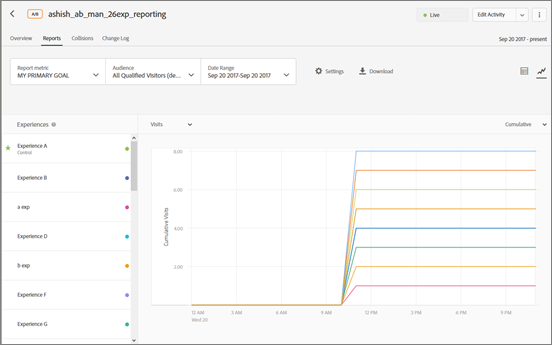

# レポート設定

レポートに表示する要素を設定する際に役立つ情報を紹介します。 [!DNL Adobe Target]. レポート設定は保存して後で使用できます。

レポートを表示するには、次の手順を実行します。

1. 「**[!UICONTROL アクティビティ]**」をクリックし、リストから目的のアクティビティをクリックします。
1. 「**[!UICONTROL レポート]**」タブをクリックします。

   

## Target プリセット {#section_51F67341465045BEB4F1A2FB638A8EB1}

指標、日付範囲、オーディエンス、詳細設定などを必要に応じて設定した、個々のアクティビティのレポートのプリセットを最大 10 個保存できます。すべて [!DNL Target] ユーザーは、誰が作成したかに関係なく、様々なプリセットを表示、編集および削除できます。

また、個々のアクティビティのレポートを必要に応じて設定したあと、その設定をデフォルトまたはお気に入りのプリセットとして保存することもできます。これは、そのアクティビティの進行中のレポートを確認するたびに表示されるビューです。

### プリセットまたはデフォルトプリセットの作成

1. 必要に応じて、アクティビティのレポートを設定します。

   指標、日付範囲、オーディエンス、詳細設定など、使用可能な設定については、以下で説明します。

1. 「**[!UICONTROL Target プリセット]**」の横の縦並びの省略記号／「**[!UICONTROL 新規として保存]**」をクリックします。

   

   新規プリセットダイアログボックスが表示されます。

   

1. 情報を **[!UICONTROL フィルター]** および **[!UICONTROL 設定]** セクションで必要に応じてレポートが設定されていることを確認し、 **[!UICONTROL プリセット名]** （最大 50 文字）。
1. （条件付き）これをデフォルトまたはお気に入りのレポートビューにする場合は、 **[!UICONTROL デフォルトのプリセットとして設定]** オンの位置に切り替えます。
1. 「**[!UICONTROL 保存]**」をクリックします。

### 別のプリセットを選択

目的のプリセットを **[!UICONTROL Target プリセット]**&#x200B;ドロップダウンリストから選択します。

### プリセットの編集

1. 編集するプリセットを選択します。
1. レポートの設定を必要に応じて編集します（指標、日付範囲、オーディエンス、詳細設定など）。

   レポートの設定を編集した後に「[!UICONTROL 保存]」をクリックすると、プリセット名の後にアスタリスク（*）が表示され、プリセットが変更されたことを示します（下図を参照）。

   

1. 縦並びの省略記号アイコン／**[!UICONTROL 新規保存]**&#x200B;をクリックして新しいプリセットを作成します。

   または

   縦並びの省略記号アイコン／**[!UICONTROL 更新]**&#x200B;をクリックして現在のプリセットを更新します。

   

### プリセットの削除

1. 削除するプリセットを選択します。
1. 縦並びの省略記号／**[!UICONTROL 削除]**&#x200B;をクリックします。

   

1. クリック **[!UICONTROL 削除]** を再度クリックして、削除を確定します（削除したプリセットは復元できません）。

### プリセットエラー処理

プリセットが無効になった場合は、レポート内のアラートやメッセージでそれが通知されます。アラートまたはメッセージでは、別のオーディエンス、指標、ホストグループ、またはエクスペリエンスを選択して有効なプリセットを作成するようにユーザーに指示します。

プリセットが無効になる可能性がある状況をいくつか以下に示します。

* レポート用オーディエンスがアクティビティから削除されましたが、プリセット定義で参照されています。
* 1 つ（または複数）の指標が削除されましたが、プリセット定義で参照されています。例えば、1 つ以上の指標をアクティビティから削除した後、新しい指標を追加するような場合です。
* 1 つ（または複数）のホストグループ（環境）が存在しませんが、プリセット定義で参照されています。
* 1 つ（または複数）のエクスペリエンスがプリセットの作成後に削除されましたが、プリセット定義で参照されています。
* 参照先のエンティティがまだ存在しているにもかかわらず更新され、プリセット定義が意味的に変わったので、プリセットが意味的に無効になります。例えば、最初「Revenue on Chrome」という名前のプリセットを作成したとしましょう。その後、売上高ではなくコンバージョン指標を測定するようにアクティビティを更新します。アクティビティ定義を更新すると、プリセット定義が意味的に無効化されます。

## レポート指標 {#section_894ABD7148244806B7CE556EBBA2AD62}

異なる&#x200B;**[!UICONTROL 成功指標]**&#x200B;または複数の指標を選択してグラフやチャートに表示するには、「[レポート指標](/help/main/c-activities/r-success-metrics/success-metrics.md#reference_D011575C85DA48E989A244593D9B9924)」ドロップダウンリストをクリックします。

デフォルトでは、アクティビティの作成時に、成功指標の設定で主要指標が決定されています。その設定を変更し、アクティビティを再保存すると、レポートの主要指標が更新されます。

レポートに表示する指標を複数選択する方法について詳しくは、「[レポートでの複数の指標の表示](/help/main/c-reports/c-report-settings/view-multiple-metrics.md#concept_9E3C3F6F3EC1412FAF252975AC0720B7)」を参照してください。

## オーディエンス {#section_70926EB4618945D9AFF2B0564FF3717B}

「[!UICONTROL オーディエンス]」ドロップダウンリストをクリックして、レポートのオーディエンスを変更します。

詳しくは、[オーディエンス](/help/main/c-target/target.md#concept_A782F8481A5041EBA75103CB26376522)を参照してください。

## 日付範囲 {#section_A410A768403C4E01891F95CB357E63ED}

「日付範囲」ボックスに、レポートの現在の日付範囲が表示されます。 ドロップダウンアイコンをクリックすると、レポートの日付範囲を変更できるカレンダーが表示されます。

レポートの新しい&#x200B;**[!UICONTROL 開始]**&#x200B;と&#x200B;**[!UICONTROL 停止]**&#x200B;の日付を選択します。また、 **[!UICONTROL アクティビティの開始から]** および **[!UICONTROL アクティビティが終了するまで]** チェックボックス

「**[!UICONTROL カスタム日付]**」をクリックすると、過去 7 日間、過去 15 日間、過去 30 日間のいずれかの事前定義済み日付範囲を選択できます。この事前定義された日付範囲は、繰り出し範囲です。開始の日付が、選択された日数よりも近い場合、カレンダーは開始日付からの範囲となりますが、アクティビティ期間が長くなり、選択された日数よりも開始日付が過去のものとなると、範囲は繰り出されて延びていきます。 

レポートの日付には以下の制限事項があります。

* レポートの開始日は、直近の 2 年以内でなければなりません。
* オファーグループレポートは、現在の日から 99 日に制限されています。
* 毎時間のレポートは 15 日までに制限されています。

## 設定 {#section_D99CE462107D45CABE0960F820E1E972}

レポート設定を構成するには：

1. 歯車アイコンをクリックし、必要な変更を行います（以下の説明を参照）。
1. 終了したら「**[!UICONTROL 保存]**」をクリックします。

次の図に、A/B アクティビティの設定ダイアログボックスを示します。

選択したアクティビティのタイプによって、オプションは変わります。

### カウント手法

目的の方法を選択します。

* 訪問者数
* 訪問
* アクティビティのインプレッション

### コントロール

上昇率の計算と比較に使用するコントロールエクスペリエンスを選択します。

### 環境

レポートに使用する環境（ホストグループ）を選択します。詳しくは、[ホスト](/help/main/administrating-target/hosts.md#concept_516BB01EBFBD4449AB03940D31AEB66E)を参照してください。

### レポートデータをリセット

レポートデータをリセットして古いデータを削除します。 現在の訪問者は、アクティビティに残されます。このオプションは、 [!UICONTROL 承認者] 権限。

>[!IMPORTANT]
>
>これは恒久的なアクションであり、取り消すことができません。

### 極端な値の除外

この [!UICONTROL 極端な値の除外] 切り替えは、売上高およびエンゲージメント指標タイプのみを含むアクティビティに適用されます。 詳しくは、「[極端な注文の除外](/help/main/c-reports/c-report-settings/excluding-extreme-orders.md#task_2AE7743FFCDD466DAEEB720BE5F33DAA)」を参照してください。

## ダウンロード {#section_77E65C50BAAF4AB79242DB3A8778ADEF}

次をクリック： **[!UICONTROL ダウンロード]** アイコン [!DNL .csv] 形式を使用して、Excel、Access、またはその他のデータ分析プログラムにすばやくインポートできます。

詳しくは、「[CSV ファイルでのデータのダウンロード](/help/main/c-reports/downloading-data-in-csv-file.md#concept_3F276FF2BBB2499388F97451D6DE2E75)」を参照してください。

## 更新 {#section_E203729F2F314DF3856D2EE67C60B370}

次をクリック： **[!UICONTROL 更新]** アイコンを使用して、ページ全体、設定または日付範囲を更新せずに、レポートのテーブルとグラフの表示を更新します。

## その他のオプション {#section_AB1B5C695D7045A0A0AC0E2698D2E7DE}

その他のオプションアイコン（縦並びの省略記号）をクリックして、「[!UICONTROL アクティビティを編集]」および「[!UICONTROL エクスペリエンスの URL を表示]」オプションにアクセスします。

## 表示オプション

アクティビティタイプに応じて、様々な形式でレポートを表示できます。 目的のオプションを選択します。

* **テーブル表示**:次をクリック： **[!UICONTROL テーブル表示]** アイコンをクリックして、レポートを表形式で表示します。
* **グラフ表示**:次をクリック： **[!UICONTROL グラフ表示]** アイコンをクリックして、レポートをグラフとして表示します。
* **自動セグメント**:(Automated Personalization(AP) および自動ターゲット (AT) アクティビティでのみ使用できます ) **[!UICONTROL 自動セグメント] アイコン [自動セグメントレポート](/help/main/c-reports/c-personalization-insights-reports/automated-segments-report.md).
* **重要な属性**:(Automated Personalization(AP) および自動ターゲット (AT) アクティビティでのみ使用できます )。 **[!UICONTROL 重要な属性] アイコン [重要な属性レポート](/help/main/c-reports/c-personalization-insights-reports/important-attributes-report.md).

## 平均上昇率、上昇率範囲および信頼区間 {#section_0D87615B1D3344B3858BA494EEBC16FB}

レポートには様々なデータポイントと視覚表現があり、アクティビティの上昇率範囲や信頼区間を把握する一助になります。こうした情報を参考にすれば、より的確に勝者を見極めることができます。

詳しくは、[平均上昇率、上昇率範囲および信頼区間](/help/main/c-reports/c-report-settings/average-lift-bounds-and-confidence-interval.md#topic_AFFDC672A8A34D028B100EF6BE5D8129)を参照してください。

次の点に留意してください。

* テーブル表示でレポートを表示している場合にのみ使用可能です。
* この機能は、Analytics をレポートソースに使用する（A4T）[アクティビティでは利用できません。](/help/main/c-integrating-target-with-mac/a4t/a4t.md)。

## 場所の貢献度 {#section_5832F126AC114AE1ABFFF4D9B904393B}

**[!UICONTROL 場所の貢献度]**&#x200B;アイコンをクリックすると、場所による貢献度を表示するレポートに切り替わります。

## エクスペリエンス {#section_3A450DE1FA7E43F0AAB73165EC3D1C34}

（グラフ表示でレポートを表示している場合にのみ使用可能）

チャートの左側でエクスペリエンスを選択（または非選択に）することで、対応するエクスペリエンスをチャートに表示（または非表示に）します。

以下の図の場合、デフォルト、中東および合計のエクスペリエンスのみがレポートに表示されます。アジアエクスペリエンスは、グラフで非表示です。

## 現在の平均 {#section_59066693158C4433B87D07402C2BC6CD}

（グラフ表示でレポートを表示している場合にのみ使用可能）

「実行平均」は、（レポートウィンドウの開始から、グラフに表示される日付まで）累積コンバージョン数を累積訪問者数で割った値を反映します。

目的のグラフ表示を選択します。

* 現在の平均
* 現在の平均上昇率
* 毎日
* 日別上昇率（Daily Lift）

このドロップダウンリストの名前は、選択したビューによって異なりますが、上記のビューの 1 つになります。

## カウント手法 {#section_01B0ED5665C74AE1AE97259800190C3E}

（グラフ表示でレポートを表示している場合にのみ使用可能）

レポート内のグラフのカウント手法を選択できます。これは、 [!UICONTROL Automated Personalization] (AP) アクティビティ

次の手順で [!UICONTROL カウント手法] 」オプションを選択し、レポートをグラフモードで表示しているときに、 **[!UICONTROL マイプライマリ目標]** 」ドロップダウンから、カウント手法を選択します。

カウント手法は、前述の[!UICONTROL 設定]ダイアログで設定したものと同じになります。

デフォルトでは、グラフは「[!UICONTROL 日別]」モードでプロットされます。

モードを変更するには、 [!UICONTROL 毎日] 」ドロップダウンリストから、累積オプションを選択します。

>[!NOTE]
>
>このドロップダウンリストの名前は、選択したモードによって異なります。

自動ターゲットアクティビティには、日別コントロール、日別ターゲット、累積コントロール、累積ターゲットの 4 つのモードがあります。

グラフがプロットされる順番は、デフォルトでは次のようになります。

* **A/B テスト ( 自動配分とAutomated Personalizationを含む )**:エクスペリエンスの作成順（降順）。
* **エクスペリエンスのターゲット設定 (XT)**:アクティビティ内のエクスペリエンスの順序。
* **多変量分析テスト (MVT)**:エクスペリエンス名のアルファベット順。
* **Recommendations**:エクスペリエンスの作成順（降順）。

カウント手法オプションを設定する際は、次の点に注意してください。

* の場合 [自動ターゲットアクティビティ](/help/main/c-activities/auto-target/auto-target-to-optimize.md)の場合、カウント手法として「訪問者」を選択するオプションはありません。 自動ターゲットアクティビティのみ、訪問者基準でプロットすることができません。
* を使用するアクティビティの場合 [レポートソースとしての Analytics(A4T)](/help/main/c-integrating-target-with-mac/a4t/a4t.md)を使用して、訪問者、訪問またはインプレッションを累積的にプロットすることはできません。

## アクティビティに 16 個を超えるエクスペリエンスを含むグラフの操作

エクスペリエンスが 16 個以下のアクティビティの場合は、それぞれのエクスペリエンスが違う色でグラフにプロットされます。

エクスペリエンスが 17 個以上の場合は、最初の 16 個のエクスペリエンスが色分けされた線でグラフに表示されます。残りのエクスペリエンスは、左側のエクスペリエンスパネルに灰色で表示され、対応するプロット線はグラフに表示されません。一度に表示できるエクスペリエンスの線は 16 個までです。

灰色表示のエクスペリエンスにマウスポインターを置くと、そのエクスペリエンスに対応する新しい灰色のプロット線が一時的にグラフに表示されます。灰色表示になっているエクスペリエンスのプロット線を色付きで表示するには、色付きで表示されているエクスペリエンスの名前をクリックして選択を解除してから、灰色表示のエクスペリエンスの名前を選択します。

例えば、次の図は、26 個のエクスペリエンスを含むアクティビティのグラフです。

グラフには、最初の 16 個のエクスペリエンスの線が表示されています（いくつかは重複しているので、16 個よりも少なく見えます）。左側にあるエクスペリエンスパネルに表示されている各エクスペリエンス名の横にある色付きの点は、対応するエクスペリエンスのプロット線が、その色で表示されていることを示しています。

エクスペリエンスパネルを下にスクロールすると、次の図のように、17 個目から 26 個目までのエクスペリエンスの名前が灰色表示になっていることがわかります。

灰色表示のエクスペリエンスにマウスポインターを置くと、そのエクスペリエンスに対応する新しい灰色のプロット線が一時的にグラフに表示されます。

例えば、エクスペリエンス R のプロット線を表示し、エクスペリエンス P の線を非表示にしたい場合は、次の図のようにエクスペリエンス P の名前をクリックして選択を解除し、エクスペリエンス R の名前をクリックして選択します。

