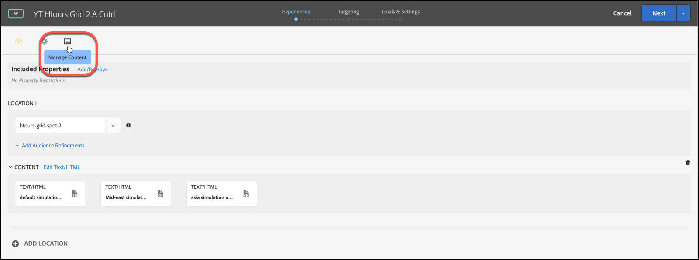
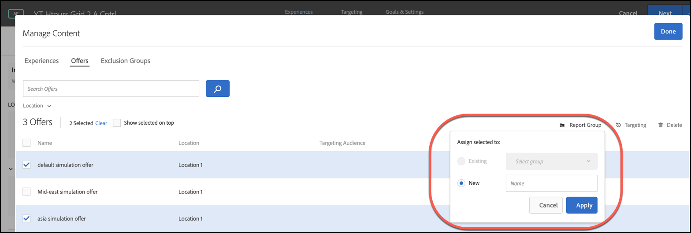

#  オファーレポートグループ

でのレポートグループの使用に関する情報 [Automated Personalization](/help/main/c-activities/t-automated-personalization/automated-personalization.md) (AP) アクティビティ

レポートグループは、次の 2 つの主要機能を実行します。

* AP アクティビティレポートでグループ化されたオファーを表示できます。
* 彼らは、 [!DNL Target] パーソナライゼーションモデル機能を使用します。

レポートグループを使用する場合、 [!DNL Target] は、AP アクティビティの各オファーではなく、そのグループのすべてのオファーのデータを使用して、各レポートグループに対して 1 つのパーソナライゼーションモデルのみを作成します。

アクティビティ設定で、オファーごとに作成する必要のあるパーソナライゼーションモデルに十分なデータがない場合、レポートグループは Automated Personalization を使用するためのデータ要件を軽減するのに役立ちます。また、レポートグループは、類似するオファーをグループ化して新しいオファーの「コールドスタート」の問題を解決することもできるので、各モデルはより多くのデータを得ることができます。モデルグループは、新しいオファーが定期的に AP アクティビティに導入されるアクティビティにも使用できます。

この方法は、訪問者がグループ内のすべてのオファーに同じ方法で応答する場合に便利です。ベストプラクティスは、類似する訪問者グループが同様の方法で応答するオファーをグループ化することです。つまり、同様のコンバージョン率を持つオファーをグループ化します。すべてのオファーを 1 つのレポートグループに入れるのは避けてください。すべてのオファーをグループ化するか、コンバージョン率が非常に異なるオファーをグループ化すると、 [!DNL Target] パーソナライゼーションモデル。

>[!NOTE]
>
>オファーが特定のモデリンググループから削除または置換されると、その特定のオファーをモデリンググループからも削除した履歴トラフィックが表示されます。つまり、削除されたオファーは、 [!DNL Target] パーソナライゼーションモデルを参照してください。

**レポートグループを設定するには：**

1. の [!UICONTROL エクスペリエンス] AP アクティビティのページで、 **[!UICONTROL コンテンツを管理]** アイコン

   

1. 「**[!UICONTROL Manage Content]**」ダイアログボックス上部の「[!UICONTROL Offers]」タブをクリックします。
1. （条件付き）特定のオファーにマウスポインターを置いてから **[!UICONTROL Reporting Group]** のフォルダーアイコンをクリックして、特定のエクスペリエンスをレポートグループに追加します。

   

1. （条件付き）複数のエクスペリエンスのチェックボックスをオンにしてからダイアログボックスの右上隅にある **[!UICONTROL Reporting Group]** のフォルダーアイコンをクリックして、エクスペリエンスを一括でレポートグループに追加します。

   

1. （条件付き）選択したオファーを既存のレポートグループに割り当てるには、 **[!UICONTROL 既存]**&#x200B;を選択し、ドロップダウンリストから目的のレポートグループを選択して、 **[!UICONTROL 適用]**.

   または

   選択したオファーをアサインする新しいレポートグループを作成するには、 「**[!UICONTROL 新規]**」を選択し、新しいレポートグループに名前を付けて、「**[!UICONTROL 適用]**」をクリックします。

   
