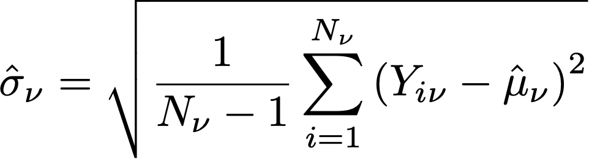
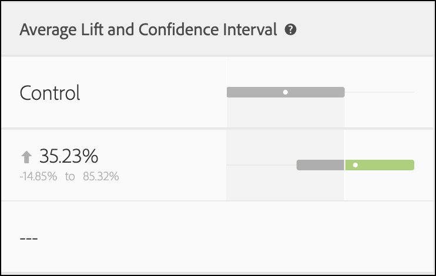
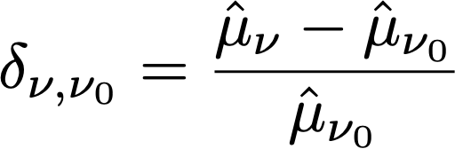
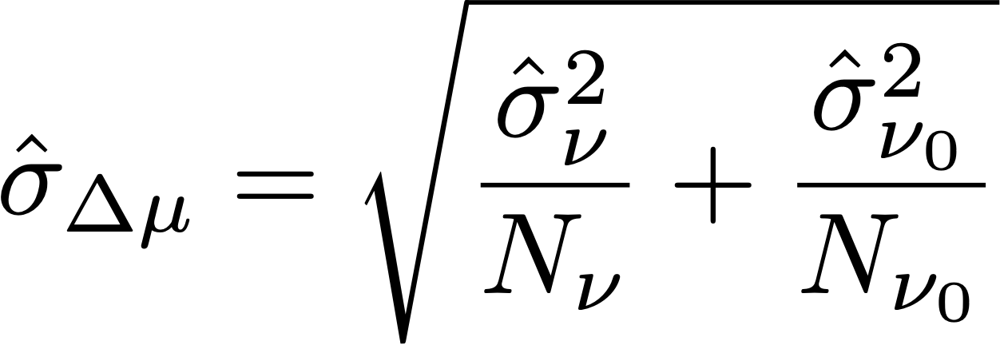

# A/Bn テストによる統計計算

この記事では、[!DNL Adobe Target]の手動A/Bn テストで使用される詳細な統計計算について説明します。 定義は、[!UICONTROL Conversion Rate]、[!UICONTROL Confidence Interval of Conversion Rate]、[!UICONTROL Lift]、[!UICONTROL Confidence Interval for Lift]および[!UICONTROL Confidence]に対して提供されます。

>[!NOTE]
>
>この記事の情報は、以前このサイトでダウンロード可能だった&#x200B;*Adobe Target A/B テスト用の計算* pdf ファイルに置き換わるものです。

A/B テスト アクティビティの[!UICONTROL Conversion Rate]、[!UICONTROL Average Lift and Confidence Interval]および[!UICONTROL Confidence]を示す

## 平均性能

次の節では、前の図で使用した計算について説明します。

### 訪問者あたりのコンバージョン率と収益（RPV）キャンペーン

次の図は、[!DNL Target] レポートの[!UICONTROL Conversion Rate]、[!UICONTROL Confidence Interval of Conversion Rate]、および[!UICONTROL Conversions]の数を示しています。 例えば、最初の行は、エクスペリエンス Aの場合、[!UICONTROL Conversion Rate]は25.81%で、[!UICONTROL Confidence Interval]は±7.7%で、32のコンバージョンが記録されていることを示しています。 124人の訪問者がこのエクスペリエンスを視聴したことを考えると、これは32/124 = 25.81%に相当します。

<p style="text-align:center;"></p>

実験の各エクスペリエンス *ν*&#x200B;に対するコンバージョン率（**平均**、*μ<sub>ν</sub>*）は、指標の合計と、その指標に割り当てられた単位数（*N<sub>ν</sub>*）の比率として定義されます。

<p style="text-align:center;"></p>

ここで、

* *Y<sub>iν</sub>*&#x200B;は、特定のエクスペリエンス *ν*&#x200B;に割り当てられている各ユニット *i*&#x200B;の指標の値です。

* 単位&#x200B;*i*&#x200B;の合計は、カウント方法の選択によって異なります。

   * *[!UICONTROL Visitors]*&#x200B;がカウント方法として使用されている場合、各ユニットは、アクティビティの期間中、アクティビティの一意の参加者として定義された一意の訪問者です。
   * *[!UICONTROL Visits]*&#x200B;がカウント方法として使用される場合、各単位は、[!DNL Target] セッション中にエクスペリエンスの一意の参加者として定義された一意の訪問です（一意の`sessionId`）。 `sessionId`が変更されたとき、または訪問者がコンバージョンステップに達したとき、新しい訪問がカウントされます。
   * *[!UICONTROL Activity Impressions]*&#x200B;がカウント方法として使用される場合、各単位は、訪問者がアクティビティの任意のページを読み込むたびに定義される一意のインプレッションです。

## [!UICONTROL Confidence Interval of Mean]／[!UICONTROL Conversion Rate]

コンバージョン率の信頼区間は、基礎データと一貫性のある可能なコンバージョン率の範囲として直感的に定義されます。

実験を実行する場合、特定のエクスペリエンスのコンバージョン率は、「真」のコンバージョン率の&#x200B;*推定*&#x200B;です。 この見積もりの不確実性を定量化するために、[!DNL Target]は信頼区間を使用します。 [!DNL Target]は常に95%の信頼区間を報告します。つまり、最終的に計算された信頼区間の95%には、エクスペリエンスの真のコンバージョン率が含まれます。

現在リードしているエクスペリエンス、もしくは勝者のエクスペリエンスの横には「信頼性」の数値もレポートされます。 この数値は、先行体験の[!UICONTROL Confidence]が少なくとも60%に達するまで報告されません。 アクティビティに2つのエクスペリエンスが存在する場合、この数値は、エクスペリエンスが他のエクスペリエンスよりもパフォーマンスが高い信頼性レベルを表します。 アクティビティに2つ以上のエクスペリエンスが存在する場合、この数値は、エクスペリエンスが定義された「コントロール」エクスペリエンスよりも優れたパフォーマンスを示す信頼性レベルを表します。 「コントロール」エクスペリエンスが勝者である場合、「信頼性」の数値はレポートされません。

コンバージョン率&#x200B;*μ<sub>ν</sub>*&#x200B;の95%信頼区間は、次の値の範囲として定義されます。

<p style="text-align:center;"></p>

平均の標準誤差は、次のように定義されます

<p style="text-align:center;"></p>

サンプル標準偏差の偏りのない推定値を使用する場合：

<p style="text-align:center;"></p>

キャンペーンがコンバージョン率キャンペーンの場合（つまり、コンバージョン指標がバイナリの場合）、標準エラーは次のように減少します。

<p style="text-align:center;"></p>

## 上昇率

次の図は、[!DNL Target] レポートの[!UICONTROL Lift]と[!UICONTROL Confidence Interval of Lift]を示しています。 数値は、リフト境界の範囲の平均を表し、矢印はリフトが正または負の場合を反映します。 信頼度が95%に達するまで、矢印はグレーで表示されます。 信頼度がしきい値を通過すると、正または負の上昇率に基づいて矢印が緑色または赤になります。

<p style="text-align:center;"></p>

エクスペリエンス *ν*&#x200B;とコントロール エクスペリエンス *ν<sub>0</sub>*&#x200B;との間の上昇率は、コンバージョン率の相対的な「差分」です。次のように定義されます

<p style="text-align:center;"></p>

各コンバージョン率は上記で定義したとおりです。 よりシンプルに，

```
Lift(Experience N) = (Performance_Experience_N - Performance_Control)/ Performance_Control
```

コントロールエクスペリエンス *ν<sub>0</sub>*&#x200B;のコンバージョン率が0の場合、上昇率はありません。

## [!DNL Confidence Interval of Lift]

[!UICONTROL Average Lift and Confidence Interval]列のboxplot グラフは、平均値と95% [!UICONTROL Confidence Interval of Lift]を表します。 ある非制御エクスペリエンスの信頼区間と制御エクスペリエンスの信頼区間に重複がある場合、ボックスプロットはグレーになります。 与えられたエクスペリエンスの信頼区間の範囲がコントロールエクスペリエンスの信頼区間の上下にある場合、ボクスプロットは緑または赤になります。

エクスペリエンス *ν*&#x200B;と制御エクスペリエンス *ν<sub>0</sub>*&#x200B;との間のリフトの標準エラーは、次のように定義されます。

<p style="text-align:center;"></p>

そして、リフトの95%信頼区間は次のようになります。

<p style="text-align:center;"></p>

この計算は、「Delta」メソッドを使用します。詳しくは、[このドキュメントで説明しています](/help/main/assets/confidence_interval_lift.pdf)

## [!UICONTROL Confidence]

最後の列は、[!DNL Target] レポートの信頼性を示しています。 経験の信頼性は、帰無仮説が真であるとして、観察された結果として極端な結果を得る確率（パーセンテージとして表される）です。 p値に関しては、表示される信頼性は&#x200B;*1 - p値*&#x200B;です。 直感的には、信頼性が高いほど、コントロールされたエクスペリエンスとコントロールされていないエクスペリエンスのコンバージョン率が等しい可能性が低いことを意味します。

[!DNL Target]では、テスト エクスペリエンスと制御エクスペリエンスの間に2つのテール **Welchのt-test**&#x200B;が実行され、テスト エクスペリエンスと制御エクスペリエンスの手段が同じかどうかをテストします。 通常、実験を実行する前に、2つのグループのサンプルサイズと分散が同じかどうか分からず、また[!DNL Target]では、各エクスペリエンスに送信されるトラフィックの割合が同じになることも可能なので、各エクスペリエンスの分散が同じであるとは仮定しません。 したがって、ウェルチのt検定は、学生のt検定の代わりに選択されます。

ウェルチのt検定を実行するには、まずt統計量と自由度の計算を開始し、次に2 テールのt検定を実行してp値を生成します。 最後に、p値に基づいて信頼性を計算します。

*t* – 統計量は、*ν*&#x200B;と&#x200B;*ν<sub>0</sub>*&#x200B;の2つの独立確率変数の平均の差を、その差の標準誤差で割ったものと定義されています。

<p style="text-align:center;"></p>

ここで、*μ<sub>v</sub>*&#x200B;および&#x200B;*μ<sub>v0</sub>*&#x200B;はそれぞれ&#x200B;*ν*&#x200B;および&#x200B;*ν<sub>0</sub>*&#x200B;の手段であり、*μ<sub>v</sub>*&#x200B;および&#x200B;*μ<sub>v0</sub>*&#x200B;の差の標準誤差は次のように与えられる：

<p style="text-align:center;"></p>

*σ<sup>2</sup><sub>v</sub>*&#x200B;および&#x200B;*σ<sup>2</sup><sub>v<sub>0</sub></sub>*&#x200B;は、それぞれ2つのエクスペリエンス *ν*&#x200B;および&#x200B;*ν<sub>0</sub>*&#x200B;の分散であり、*N<sub>v</sub>*&#x200B;および&#x200B;*N<sub>v<sub>0</sub></sub>*&#x200B;はそれぞれ&#x200B;*ν<sub>のサンプルサイズです。**</sub>*

ウェルチのt検定では、自由度は次のように計算される：

<p style="text-align:center;"></p>

*ν*&#x200B;および&#x200B;*ν<sub>0</sub>*&#x200B;の自由度は、次のように定義されます。

<p style="text-align:center;"></p>

<p style="text-align:center;"></p>

次に、p値は、*t*&#x200B;分布の末尾の領域から計算できます。

<p style="text-align:center;"></p>

最後に、[!DNL Target]で報告された信頼性は、次のように定義されます。

<p style="text-align:center;"></p>

## オフラインでの計算の実行

[ダウンロードした CSV レポート](/help/main/c-reports/c-report-settings/downloading-data-in-csv-file.md) には生データのみが含まれ、A/B テストで使用される訪問者あたりの売上高、上昇率、信頼性などの計算指標は含まれません。

これらの統計量を計算するには、[!DNL Target] [信頼計算を完了](/help/main/assets/complete_confidence_calculator.xlsx) Excel ファイルをダウンロードして、アクティビティの値を入力します。
