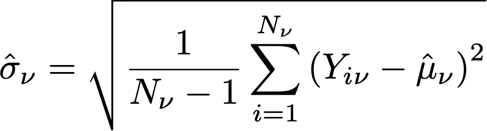

# A/Bn テストでの統計計算

この記事では、 [!DNL Adobe Target]. 次の定義が提供されています： [!UICONTROL コンバージョン率], [!UICONTROL コンバージョン率の信頼区間], [!UICONTROL 上昇率], [!UICONTROL 上昇率の信頼区間]、および [!UICONTROL 信頼性].

>[!NOTE]
>
>この記事の情報は、以前このサイトでダウンロード可能だった *Adobe Target A/B テストの計算*&#x200B;の PDF ファイルに代わるものです。

![次を示すターゲットレポート [!UICONTROL コンバージョン率], [!UICONTROL 平均上昇率と信頼区間]、および [!UICONTROL 信頼性] A/B テストアクティビティの](/help/main/c-reports/statistical-methodology/img/target_report.png)

## 平均性能

次の節では、前の図で使用した計算方法を説明します。

### 訪問者 (RPV) キャンペーンあたりのコンバージョン率と売上高

次の図にを示します。 [!UICONTROL コンバージョン率], [!UICONTROL コンバージョン率の信頼区間]、および [!UICONTROL コンバージョン] 内 [!DNL Target] レポート。 例えば、最初の行には、エクスペリエンス A の場合は次のように表示されます。の [!UICONTROL コンバージョン率] は 25.81%で、 [!UICONTROL 信頼区間] が±7.7%および 32 コンバージョンと記録されました。 124 人の訪問者がエクスペリエンスを閲覧したと仮定すると、これは32/124 = 25.81%と同じです。

<p style="text-align:center;"></p>

コンバージョン率、または **mean**, *μ<sub>ν</sub>*（各エクスペリエンスに対して） *ν* 実験では、指標の合計と、その指標に割り当てられた単位数との比率を定義します。 *N<sub>ν</sub>*:

<p style="text-align:center;"></p>

ここで、

* *Y<sub>iν</sub>* は、各単位の指標の値です *i*（特定のエクスペリエンスに割り当てられている） *ν*.

* 単位の合計 *i* カウント手法の選択に応じて異なります。

   * If *[!UICONTROL 訪問者]* はカウント手法として使用され、各ユニットは、アクティビティの全期間にわたるアクティビティの個別参加者として定義される個別訪問者です。
   * If *[!UICONTROL 訪問回数]* はカウント手法として使用され、各ユニットは、 [!DNL Target] セッション ( 一意の `sessionId`) をクリックします。 次の場合に `sessionId` を変更した場合、または訪問者がコンバージョンステップに到達した場合、新しい訪問がカウントされます。
   * If *[!UICONTROL アクティビティのインプレッション]* はカウント手法として使用され、各ユニットは、訪問者がアクティビティのページを読み込むたびに定義される一意のインプレッションです。

## [!UICONTROL 平均の信頼区間]/[!UICONTROL コンバージョン率]

コンバージョン率の信頼区間は、基礎となるデータと一致する可能なコンバージョン率の範囲として直感的に定義されます。

実験を実行する場合、特定のエクスペリエンスのコンバージョン率は *見積もり* 」の値が含まれます。 この見積もりで不確実性を定量化するには、 [!DNL Target] は信頼区間を使用します。 [!DNL Target] は常に 95%の信頼区間をレポートします。つまり、最終的に計算される信頼区間の 95%に、エクスペリエンスの真のコンバージョン率が含まれます。

コンバージョン率の 95%信頼区間 *μ<sub>ν</sub>* は値の範囲として定義されます。

<p style="text-align:center;"></p>

平均値の標準誤差は

<p style="text-align:center;"></p>

サンプルの標準偏差の偏りのない推定値が使用される場合：

<p style="text-align:center;"></p>

キャンペーンがコンバージョン率キャンペーン（コンバージョン指標がバイナリ）の場合、標準エラーは次のようになります。

<p style="text-align:center;"></p>

## 上昇率

次の図にを示します。 [!UICONTROL 上昇率] および [!UICONTROL 上昇率の信頼区間] 内 [!DNL Target] レポート。 数値は、上昇率範囲の平均を表し、上昇率が正または負の場合に矢印が反映されます。 信頼性が 95%を超えるまで、矢印は灰色で表示されます。 信頼性がしきい値を超えると、矢印は、正または負の上昇率に基づいて緑または赤になります。

<p style="text-align:center;"></p>

エクスペリエンス間の上昇率  *ν*、およびコントロールエクスペリエンス *ν<sub>0</sub>* は、コンバージョン率の相対的な「デルタ」で、

<p style="text-align:center;"></p>

個々のコンバージョン率が上で定義されている場合。 もっと簡単に言えば

```
Lift(Experience N) = (Performance_Experience_N - Performance_Control)/ Performance_Control
```

コントロールエクスペリエンスのコンバージョン率 *ν<sub>0</sub>* が 0 の場合、上昇率はありません。

## [!DNL Confidence Interval of Lift]

の箱ひげグラフ [!UICONTROL 平均上昇率と信頼区間] 列は平均値 95%を表します [!UICONTROL 上昇率の信頼区間]. 特定の非コントロールエクスペリエンスの信頼区間とコントロールエクスペリエンスの信頼区間に重複がある場合、ボックスプロットはグレーになります。 特定のエクスペリエンスの信頼区間の範囲がコントロールエクスペリエンスの信頼区間の上または下にある場合、箱ひげは緑または赤で表示されます。

エクスペリエンス間の上昇率の標準誤差  *ν*、およびコントロールエクスペリエンス  *ν<sub>0</sub>* は次のように定義されます。

<p style="text-align:center;"></p>

上昇率の 95%信頼区間は次のようになります。

<p style="text-align:center;"></p>

この計算では「差分」方式を使用し、次の手順で説明します [このドキュメントの詳細](/help/main/assets/confidence_interval_lift.pdf)

## [!UICONTROL 信頼性]

最後の列には、 [!DNL Target] レポート。 エクスペリエンスの信頼性とは、null の仮説が真の場合に、観測されたものよりも低い極端な結果が得られる確率（パーセントで示されます）です。 p 値の観点から、表示される信頼性は次のようになります。 *1 - p 値*. 直感的に、信頼性が高いと、コントロールエクスペリエンスと非コントロールエクスペリエンスのコンバージョン率が等しくなる可能性が低くなります。

In [!DNL Target]，両側 **ウェルチ t 検定** は、テストエクスペリエンスとコントロールエクスペリエンスの間で実行され、テストエクスペリエンスとコントロールエクスペリエンスの手段が同じかどうかをテストします。 2 つのグループのサンプルサイズと相違が同じかどうかは、実験を実行する前に通常はわからないので、 [!DNL Target] また、各エクスペリエンスに同等のトラフィックの割合を送信することもできます。各エクスペリエンスの分散が等しいとはみなされません。 したがって、ウェルチの t 検定は、学生の t 検定の代わりに選択されます。

ウェルチの t 検定を行うには、まず t 統計と自由度の計算を開始し、次に t 検定を実行して p 値を生成します。 最後に、p 値に基づいて信頼性を計算します。

この *t*-statistic は、2 つの独立したランダム変数の手段の違いと定義されます。 *ν* および *ν<sub>0</sub>*&#x200B;を、差の標準誤差で割った値になります。

<p style="text-align:center;"></p>

ここで、 *μ<sub>v</sub>* および *μ<sub>v0</sub>* は *ν*  および *ν<sub>0</sub>* それぞれ、および *μ<sub>v</sub>* および *μ<sub>v0</sub>* は次の方法で指定します。

<p style="text-align:center;"></p>

ここで、 *σ<sup>2</sup><sub>v</sub>* および *σ<sup>2</sup><sub>v<sub>0</sub></sub>* は、2 つのエクスペリエンスの相違です *ν*  および *ν<sub>0</sub>* それぞれおよび *N<sub>v</sub>* および *N<sub>v<sub>0</sub></sub>* はサンプルサイズです。 *ν* および *ν<sub>0</sub>* それぞれ

ウェルチの t 検定では、自由度は次のように計算されます。

<p style="text-align:center;"></p>

自由度 *ν*  および *ν<sub>0</sub>* は次のように定義されます。

<p style="text-align:center;"></p>

<p style="text-align:center;"></p>

次に、p 値を *t*-distribution:

<p style="text-align:center;"></p>

最後に、 [!DNL Target] は次のように定義されます。

<p style="text-align:center;"></p>

## オフラインでの計算の実行

[ダウンロードした CSV レポート](/help/main/c-reports/c-report-settings/downloading-data-in-csv-file.md) には生データのみが含まれ、A/B テストで使用される訪問者あたりの売上高、上昇率、信頼性などの計算指標は含まれません。

これらの統計量を計算するには、 [!DNL Target] [Complete Confidence Calculator](/help/main/assets/complete_confidence_calculator.xlsx) アクティビティの値を入力する Excel ファイル。
