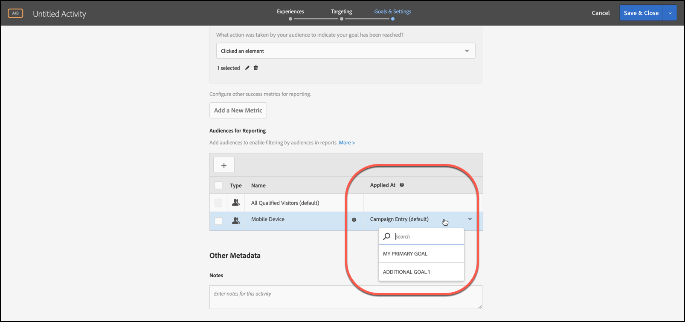

# 成功指標へのレポート用オーディエンスの適用

[!DNL Adobe Target]のレポートオーディエンスのユーザーを選定する成功指標を選択します。

すべてのアクティビティについて、「[!UICONTROL 適用先]」ドロップダウンリストを使用して、オーディエンスを成功指標に適用できます。これにより、指標に達した後および後続のアクションについてのレポート値を表示できます。

例えば、ホームページから入ってコンバージョンページに到達するすべての訪問者に対するアクティビティを作成したとします。さらに、コンバージョンの前に $50 を超える商品をカートに追加した訪問者をドリルダウンするとします。

「[!UICONTROL 適用日時]」ドロップダウンリストには、次の3つのカテゴリが表示される場合があります。

* アクティビティへの訪問者
* アクティビティの特定のステップに到達した訪問者のみ
* コンバージョンに到達した訪問者のみ

別の言い方をすると、アクティビティのエントリページの mbox、アクティビティの途中にあるポイントを定義する mbox、アクティビティの最後のコンバージョン mbox のどれに訪問者が到達している必要があるかを指定できます。

>[!NOTE]
>
>[成功指標](/help/main/c-activities/r-success-metrics/success-metrics.md#reference_D011575C85DA48E989A244593D9B9924)は、アクティビティに設定した場合にのみ使用できます。 成功指標を定義していない場合、ドロップダウンリストに[!UICONTROL  キャンペーンエントリ ]と[!UICONTROL  コンバージョン ]の2つのオプションのみが表示されます。

## 注意点

レポート用オーディエンスを成功指標に適用するときは、次の情報を考慮します。

* オーディエンスが適用された指標から始まる成功指標のみが、オーディエンスによってセグメント化されたレポートデータを表示します
* オーディエンスが適用される前の成功指標は、オーディエンスによってセグメント化されず、すべての訪問者データが表示されます
* 指標は、アクティビティ定義の順序に基づいて考慮され、[!UICONTROL プライマリ目標]が最後になります。

## レポートでのセグメント化の表示

レポートでセグメント化を表示するには、アクティビティのレポートの[!UICONTROL  オーディエンス ] ドロップダウンリストから目的のオーディエンスを選択します。

## 例

成功指標1、成功指標2、成功指標3およびプライマリ目標を持つアクティビティを検討します。

「エントリ」に設定されたレポートオーディエンス 1と、成功指標2に設定されたレポートオーディエンス 2があるとします。 オーディエンスは、次のようにレポートデータをフィルタリングします。

|  | 訪問者数 | 成功指標1 | 成功指標2 | 成功指標3 | プライマリ目標 |
| --- | --- | --- | --- | --- | --- |
| Audience1 | 適用済み | 適用済み | 適用済み | 適用済み | 適用済み |
| Audience2 | 未適用 | 未適用 | 適用済み | 適用済み | 適用済み |
