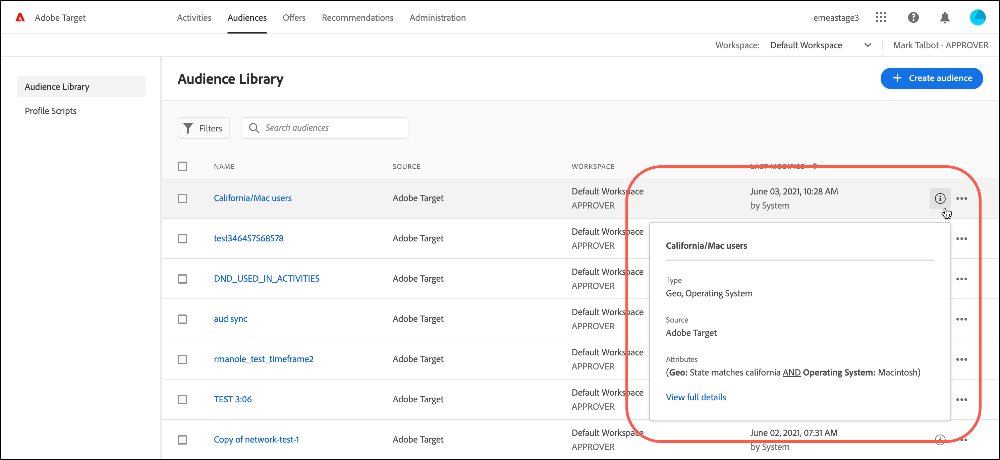
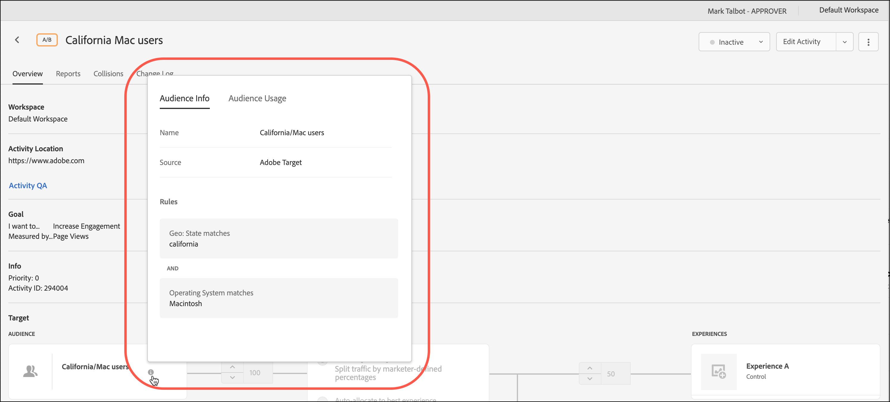

# オーディエンスの作成

ターゲットを絞ったアクティビティでコンテンツとエクスペリエンスを見るユーザーは、[!DNL Adobe Target]のオーディエンスによって決まります。

オーディエンスは、ターゲット設定を利用できるあらゆる場所で使用されます。 アクティビティをターゲティングする場合は、次のオプションがあります。

* [!UICONTROL  オーディエンス ] リストから再利用可能なオーディエンスを選択します
* [ アクティビティ固有のオーディエンス ](/help/main/c-target/creating-activity-only-audience.md)を作成してターゲティングします
* [複数のオーディエンスを組み合わせて](/help/main/c-target/combining-multiple-audiences.md#concept_A7386F1EA4394BD2AB72399C225981E5)し、高度なオーディエンスを作成します

[!DNL Adobe Analytics]が収集したオーディエンスデータを、[!DNL Target]およびその他[!DNL Adobe Experience Cloud] アプリケーションでのリアルタイムのターゲティングとパーソナライゼーションに使用することもできます。 *Experience Cloud中央インターフェイスコンポーネント* ガイドの[Experience Cloud オーディエンス ](https://experienceleague.adobe.com/docs/core-services/interface/audiences/audience-library.html?lang=ja)を参照してください。

[!DNL Target]には2種類のオーディエンスがあります。

* **ターゲティングオーディエンス：**&#x200B;異なるタイプの訪問者に異なるコンテンツを配信するために使用されます。
* **レポートオーディエンス：**&#x200B;異なるタイプの訪問者が同じコンテンツにどのように反応するかを決定して、テスト結果を分析するために使用します。

  [!DNL Target] では、レポートソースとして [!DNL Target] を使用する場合にのみ、レポート用オーディエンスを設定できます。 [Adobe Analyticsをレポートソース ](/help/main/c-integrating-target-with-mac/a4t/a4t.md) （A4T）として使用する場合は、[!DNL Analytics]内でレポートオーディエンスを設定する必要があります。

## [!UICONTROL  オーディエンス ] リストの使用 {#use-list}

[!UICONTROL オーディエンス]リストにアクセスするには、上部のメニューバーで「**[!UICONTROL オーディエンス]**」をクリックします。

![[!UICONTROL  オーディエンス ] リスト ](assets/audiences_list.png)

[!UICONTROL  オーディエンス ]のリストには、アクティビティで使用できるオーディエンスが含まれています。 [!UICONTROL  オーディエンス ] リストを使用して、オーディエンスを作成、編集、複製、コピー、または結合します。 このリストには、オーディエンスが作成されたソースも表示されます。

* [!DNL Adobe Target]
* [!DNL Adobe Target Classic]
* [!DNL Experience Cloud]
* [!DNL Adobe Experience Platform]

  >[!NOTE]
  >
  >[!DNL Adobe Experience Platform] ソースは、[Adobe Experience Platform Web SDK](https://experienceleague.adobe.com/docs/target-dev/developer/client-side/aep-web-sdk.html?lang=ja){target=_blank}を使用しているすべての[!DNL Target]のお客様が利用できます。 [!DNL Adobe Experience Platform]から利用可能なオーディエンスは、そのまま使用することも、既存のオーディエンスと[組み合わせることもできます](/help/main/c-target/combining-multiple-audiences.md)。
  >
  >AEP/RTCDP （[!DNL Real-time Customer Data Platform]）で[!DNL Target] [!UICONTROL 宛先] カードを設定するには、ユーザーが[!DNL Target]で[!UICONTROL 承認者]以上のステータスを持っている必要があります。
  >
  >詳しくは、[Adobe Experience Platformのオーディエンスの使用](#aep)を参照してください。

「[!UICONTROL 新規訪問者]」や「[!UICONTROL 再訪問訪問者]」などの定義済みオーディエンスの名前は変更できません。

[!DNL Experience Cloud]または[!DNL Adobe Experience Platform]で最初に作成されたオーディエンスを操作する場合、[!DNL Experience Cloud]または[!DNL Adobe Experience Platform]で後で削除された[!DNL Target] アクティビティのオーディエンスを参照すると、[!DNL Target]から警告が表示されます。

* [!DNL Experience Cloud]または[!DNL Adobe Experience Platform]でオーディエンスが削除された場合、[!UICONTROL  オーディエンス ] リストとオーディエンスピッカーの両方に警告アイコンが表示されます。 [!DNL Target] UIのツールヒントは、[!DNL Experience Cloud]または[!DNL Adobe Experience Platform]でオーディエンスが削除されたことを示しています。
* 複数のオーディエンスを削除済みのオーディエンスに結合しようとした場合、または削除済みのオーディエンスを参照しているアクティビティを保存しようとした場合、警告メッセージが表示されます。

カスタムプロファイルパラメーターおよび `user.` パラメーターをターゲット設定することもできます。 オーディエンスを作成する際に、アクティビティのターゲティングに使用する属性をオーディエンスビルダーウィンドウにドラッグします。 目的の属性が表示されない場合、その属性はmboxによって実行されていません。 他のカスタム mbox パラメーターは、[!UICONTROL カスタムパラメーター]ドロップダウンリストに表示されます。

「[!UICONTROL  フィルター]」ボタンを使用して、[!UICONTROL  オーディエンス ] リストをソース別にフィルタリングします：[!DNL Adobe Target]、[!DNL Adobe Target Classic]、[!DNL Experience Cloud]、および[!DNL Adobe Experience Platform]。

[!UICONTROL  オーディエンス ] リスト ](assets/filters.png)の![ フィルターオプション

「[!UICONTROL  オーディエンスを検索]」ボックスを使用して、[!UICONTROL  オーディエンス ] リストを検索します。 オーディエンス名の一部で検索したり、特定の文字列を引用符で囲んだりすることも可能です。

[!UICONTROL オーディエンス]リストは、オーディエンス名または最終更新日付で並べ替えることができます。 名前や日付で並べ替える場合は、列見出しをクリックし、昇順または降順でオーディエンスを表示するよう選択します。

## オーディエンス定義の表示 {#section_11B9C4A777E14D36BA1E925021945780}

オーディエンス定義の詳細は、[!DNL Target] UIの様々な場所のポップアップカードで、オーディエンスを開かずに表示できます。 この機能は、[!DNL Target Standard/Premium]で作成されたオーディエンスと、[!DNL Target Classic]からインポートされたオーディエンスまたはAPIを介して作成されたオーディエンスに適用されます。

例えば、次のオーディエンス定義カードにアクセスするには、目的のオーディエンスの[!UICONTROL 詳細を表示] アイコンをクリックします。

次のオーディエンス定義カードにアクセスするには、アクティビティの[!UICONTROL 概要] ページの[!UICONTROL 詳細を表示] アイコンをクリックします。

オーディエンス定義カードには、オーディエンスのタイプ、ソース、属性が表示されます。 「**[!UICONTROL 詳細を表示]**」をクリックして、そのオーディエンスを参照する他のアクティビティ（該当する場合）を表示します。 アクティビティの[!UICONTROL 概要] ページからオーディエンス定義カードを表示している場合は、**[!UICONTROL オーディエンス使用状況]**&#x200B;をクリックします。

オーディエンスの使用状況に関する情報は、オーディエンスの編集中に他のアクティビティに誤って影響を与えないようにするのに役立ちます。 情報には、[!UICONTROL  ライブアクティビティ ]、[!UICONTROL 非アクティブアクティビティ ]、[!UICONTROL  アーカイブ済みアクティビティ ]および[!UICONTROL  アクティビティの同期]が含まれます。 この機能は、すべてのオーディエンス（ライブラリオーディエンスおよび[ アクティビティ専用オーディエンス ](/help/main/c-target/creating-activity-only-audience.md#concept_A6BADCF530ED4AE1852E677FEBE68483)）で使用できます。

オーディエンスが[別のオーディエンス ](/help/main/c-target/combining-multiple-audiences.md)と結合され、結合されたオーディエンスを使用してアクティビティを作成する場合、両方のオーディエンスの使用情報には、新しく作成されたアクティビティが一覧表示されます。

<!--
The following audience definition card is for an audience imported from the Adobe Experience Cloud. In this instance, the audience was imported from Adobe Audience Manager (AAM).

The following details are available for these imported audience types:

| Audience Type | Details |
|--- |--- |
|Mobile audience|Marketing Name, Vendor, and Model. The `matches | does not match` operator displays instead of `equals | does not equal` .|
|Visitor-behavior audience|**user.categoryAffinity:** `categoryAffinity` with `FAVORITE` parameter.  **Monitoring:** Monitoring service equals true. **No Monitoring Service:** Monitoring service equals false. |
|Audiences using the NOT operator|**Single Rule:** Target displays the audience in the format `[All Visitor AND [NOT [rule]`. Single NOT rule displays with AND with `AllVisitor` audience. |

Keep the following points in mind as you work with imported audiences:

* Expression target audiences are no longer supported in Target Standard/Premium. 
* Target Standard/Premium does not support some deprecated audiences or has improved operators for ease of use. Because of this, the definition of an imported audience, although working as per definition, does not mean that same is now available for creation in the Standard/Premium interface. For example, Social Audiences are visible with their rules but Target Standard/Premium does not allow social audiences to be created.
-->

## [!DNL Adobe Experience Platform] のオーディエンスの使用 {#aep}

[!DNL Adobe Experience Platform]で作成されたオーディエンスを使用すると、よりインパクトのあるパーソナライゼーションにつながる豊富な顧客データが得られます。

詳しくは、[からオーディエンスを使用 [!DNL Adobe Experience Platform]](/help/main/c-integrating-target-with-mac/integrating-with-rtcdp.md#aep)を参照してください。

## トレーニングビデオ：オーディエンスの使用

このビデオでは、オーディエンスの使用に関する情報が説明されています。

* 用語「オーディエンス」の説明
* 最適化のためにオーディエンスを使用する 2 つの方法の説明
* オーディエンスリストでのオーディエンスの検索
* アクティビティのオーディエンスへのターゲット設定
* アクティビティの受動的なレポート用でのオーディエンスの使用

>[!VIDEO](https://video.tv.adobe.com/v/17398)
