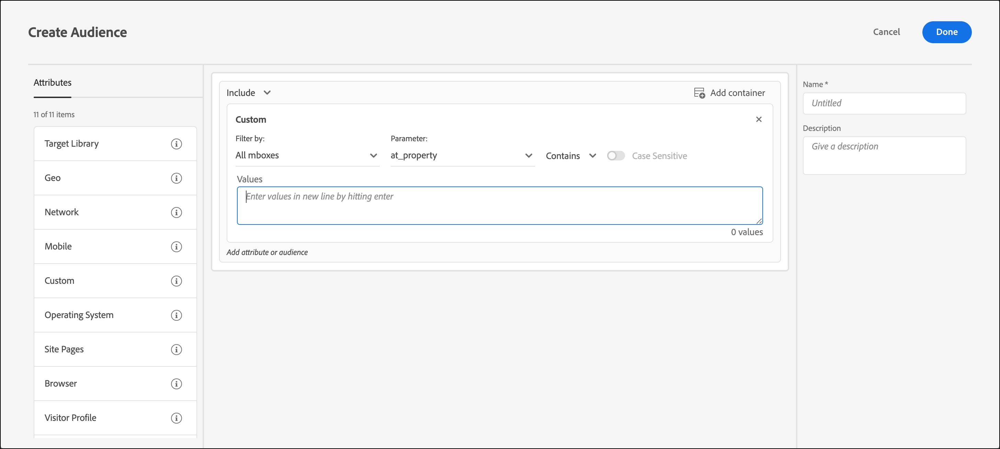

# カスタムパラメーター

カスタムパラメーターは、[!DNL Adobe Target]のmbox パラメーターです。 mbox パラメーターをmboxに渡すか、`targetPageParams`関数を使用すると、これらのパラメーターがオーディエンスで使用するためにここに表示されます。

詳しくは、[ パラメーターをグローバル mboxに渡す](https://experienceleague.adobe.com/docs/target-dev/developer/client-side/global-mbox/pass-parameters-to-global-mbox.html?lang=ja){target=_blank}を参照してください。

mbox パラメーターに基づいてカスタムオーディエンスを作成しているときに、`mboxParameter` で `mboxName` の入力が求められなくなりました。 mbox 名はオプションになりました。 この変更により、複数の mbox のパラメーターを使用することや、まだエッジで記録されていないパラメーターを参照することができます。

1. [!DNL Target] インターフェイスで、「**[!UICONTROL オーディエンス]**」 > 「**[!UICONTROL オーディエンスを作成]**」をクリックします。
1. オーディエンスに名前を付け、オプションの説明を追加します。
1. **[!UICONTROL カスタム]**&#x200B;をオーディエンスビルダーにドラッグ&amp;ドロップします。

   目的のパラメーターを選択するには：

   * オーディエンスの作成時に、リストからパラメーター名を選択するか、目的のパラメーター名の最初の文字を入力するか、目的のパラメーター名のフルネームを入力します。
   * mbox名を覚えていても、パラメーター名を覚えていない場合は、[!UICONTROL Filter by] ドロップダウンリストを使用して、目的のパラメーターを渡す既知のmboxでフィルタリングします。

   いずれの方法でも、mbox とパラメーターの間にリンクはありません。 オーディエンスは、そのパラメーターを渡すすべてのmboxのパラメーターに基づいて機能します。

   >[!NOTE]
   >
   >[!UICONTROL  フィルター条件] ドロップダウンリストから選択したmboxは、アクティビティの作成時に保存されません。 このオプションを使用すると、選択した mbox に基づいてパラメーターをフィルター処理できます。

   既存のオーディエンスを編集すると、作成時に指定された mbox 名と共にフィルタリング条件が表示されます。

1. 評価基準を選択します。

   * 次を含む（大文字と小文字を区別しない）
   * 次を含まない（大文字と小文字を区別しない）
   * 次と等しい
   * 次と等しくない
   * 次より大きい
   * 次よりも大きいか等しい
   * 次より小さい
   * 次よりも小さいか等しい
   * パラメーターが存在します
   * パラメーターが存在しません
   * パラメーター値が存在します
   * パラメーター値がありません
   * パラメーターまたは値が存在しません
   * 最初に、
   * 次の語句で終わる

   

1. 新しい行に各値を入力します。
1. （オプション）オーディエンスの追加ルールを設定します。
1. 「**[!UICONTROL Done]**」をクリックします。

オーディエンスの[定義の詳細ポップアップカード ](/help/main/c-target/c-audiences/audiences.md#section_11B9C4A777E14D36BA1E925021945780)には、**[!UICONTROL ルール]** セクションにパラメーター名が表示されます。 フィルタリングに使用する mbox への参照はありません。

>[!NOTE]
>
>[!DNL Target] 18.5.1 リリース（2018年5月22日（PT））より前に作成されたカスタムオーディエンスの場合、mbox名はオーディエンスの定義ポップアップカードに表示されません。 カスタムオーディエンスをもう一度保存して、カードに表示されるmbox名を取得します。

## 注意点 {#considerations}

* オーディエンスおよびアクティビティは、特定の mbox 用に評価されます。 例えば、グローバル mboxが特定のパラメーターを渡したが、リージョン mboxが渡さない場合、そのパラメーターのアクティビティ/オーディエンスのターゲットはリージョン mboxで適格ではありません。
* ターゲティングは、mboxPC、mboxSession、mbox3rdPartyId、mboxMCSDID、mboxMCAVID、mboxMCGVID、mboxCount、mboxId、mboxVersionなどの内部mbox パラメーターでは評価されません。

## トレーニングビデオ：オーディエンスの作成

このビデオでは、オーディエンスのカテゴリの使用について説明しています。

* オーディエンスの作成
* オーディエンスカテゴリの定義

>[!VIDEO](https://video.tv.adobe.com/v/17392)
