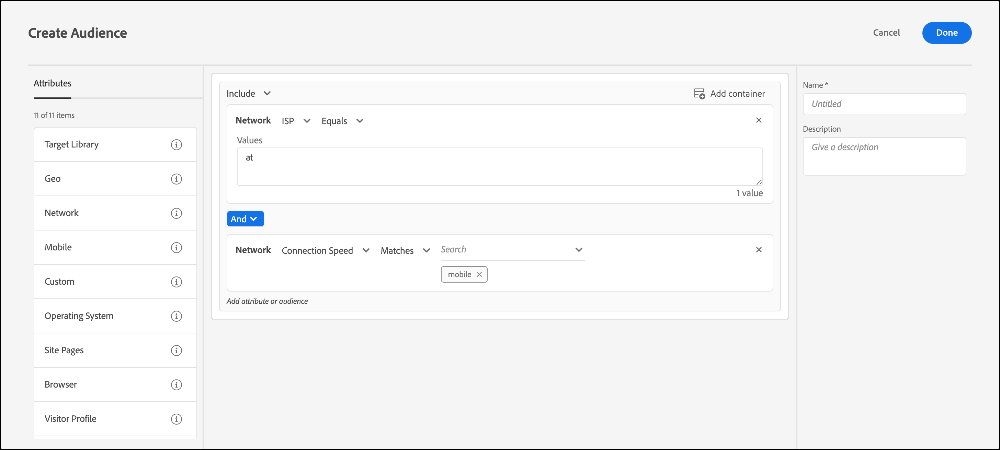

# ネットワーク

ISP、ドメイン名、接続速度などのネットワークの詳細に基づいて、[!DNL Adobe Target]でオーディエンスを作成できます。

1. [!DNL Target] インターフェイスで、「**[!UICONTROL オーディエンス]**」 > 「**[!UICONTROL オーディエンスを作成]**」をクリックします。
1. オーディエンスに名前を付け、オプションの説明を追加します。
1. **[!UICONTROL Network]**&#x200B;をオーディエンスビルダーペインにドラッグ&amp;ドロップします。
1. 「**[!UICONTROL 選択]**」をクリックして、次のいずれかのオプションを選択します。

   * **ISP：** ISP は、加入者に対して、通常月額または年額の料金でインターネットアクセスを提供する企業です。 多くの ISP は、Web ホスティングや電子メールなどの追加のサービスを提供しています。 ISP フィールドには、商用 ISP（Comcast や TimeWarner など）または企業や教育機関などの法人を指定します。

     次に、米国で一般的な ISP の例を示します。

     | 一般名 | ISP 名 | ドメイン名 | サンプルの IP アドレス |
     |---|---|---|---|
     | Cablevision | Cablevision Systems Corp. | &#42;.optonline.net | 68.196.130.239 |
     | CenturyLink | Qwest Communications Company, LLC | &#42;.centurylink.net | 64.40.65.0 |
     | Charter Communications | Charter Communications | &#42;.charter.com | 71.85.225.124 |
     | Comcast | Comcast Cable Communications, Inc. | &#42;.comcast.net | 76.27.24.28 |
     | Cox | Cox Communications Inc. | &#42;cox.net | 68.224.174.22 |
     | Speakeasy | MegaPath Corporation | &#42;.speakeasy.net | 66.93.240.0 |
     | Time Warner | Time Warner Cable Internet LLC | &#42;.res.rr.com | 72.229.28.185 |
     | Verizon FiOS | MCI Communications Services, Inc.（商号：Verizon Business） | &#42;.fios.verizon.net | 173.68.112.34 |
     | Vivint | Smartrove Inc. | &#42;.vivintwireless.net | 170.72.26.105 |
     | AT&amp;T Wireless | AT | &#42;.mycingular.net |  |
     | Sprint mobile | Sprint Personal Communications Systems | IP アドレス |  |
     | T-Mobile | T-Mobile USA, Inc. | IP アドレス | 208.54.86.0 |
     | Verizon Wireless | Cellco Partnership DBA Verizon Wireless | &#42;.myvzw.com | 70.195.74.199 |

     >[!NOTE]
     >
     >ISPに基づいてターゲティングする場合は、一般名ではなくISP名を使用してください。 大文字と小文字を区別するか、すべて小文字の形式を常に使用するようにルールを作成してください。

     ISP およびドメイン名の値をテストできます。 [https://www.whoismyisp.org](https://www.whoismyisp.org)は、ターゲティングに適したリソースです。 上記の表のサンプルの IP アドレスを使用することも、独自の IP アドレスを入力することもできます。 その後、`mboxOverride.browserIp= URL` パラメーターを使用して、その IP アドレスを模倣できます。

   * **ドメイン名：**&#x200B;この名前は、訪問者のIP アドレスのドメイン名です。 この名前は、[!DNL Target]で使用しているWeb サイトのドメイン名ではありません。 このドメイン名は、訪問者の IP アドレスに関連しており、ホスト名とも呼ばれます。 これはISP名に似ています。 場合によっては、ホスト名がISP名をリブランドしたが、ドメイン名ではない企業の古い名前を参照している場合があります。
   * **接続速度：**&#x200B;この速度は、訪問者がインターネットに接続する速度です。 ブロードバンド、ケーブル、ダイアルアップ、モバイル、oc3、oc12、サテライト、t1、t2、ワイヤレス、xdsl などがあります。

     このフィールドは、実際の速度自体ではなく、接続の種類に基づいています。 [!DNL Target] では、接続の正確な速度は判断できません。 ブロードバンド接続タイプは、他の接続タイプであると判定できず、特定のタイプを選択できない場合に使用されます。

1. （オプション）オーディエンスの追加ルールを設定します。
1. 「**[!UICONTROL Done]**」をクリックします。

次の図は、接続速度[!UICONTROL Mobile]のAT&amp;Tを使用している訪問者をターゲットとするオーディエンスを示しています。

## トレーニングビデオ: オーディエンスの作成

このビデオでは、オーディエンスのカテゴリの使用について説明しています。

* オーディエンスの作成
* オーディエンスカテゴリの定義

>[!VIDEO](https://video.tv.adobe.com/v/17392)
