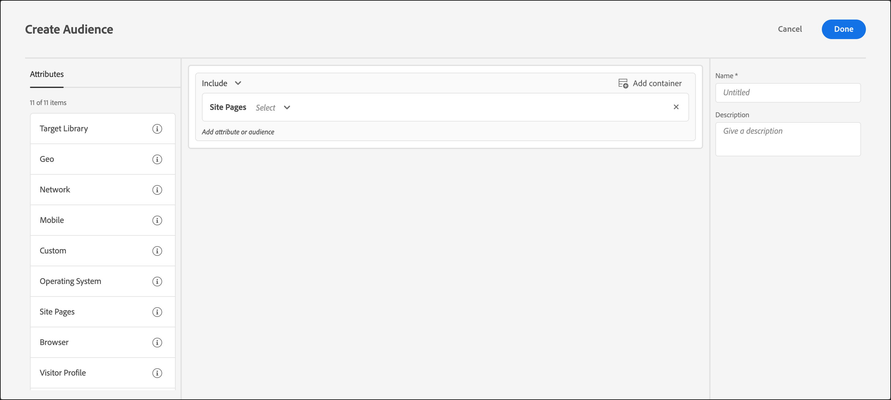
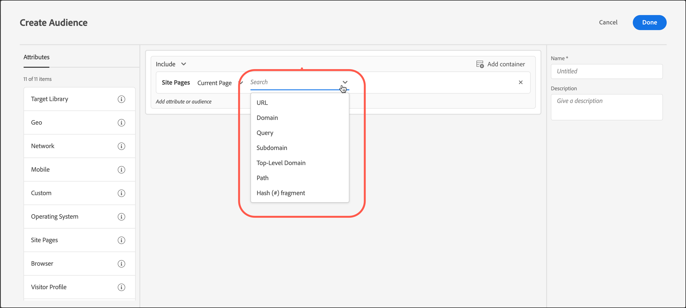

# サイトのページ

サイト上の特定のページにアクセスする[!DNL Adobe Target]を使用して、訪問者をターゲットにすることができます。

1. [!DNL Target] インターフェイスで、**[!UICONTROL Audiences]** > **[!UICONTROL Create Audience]**&#x200B;をクリックします。
1. オーディエンスに名前を付け、オプションの説明を追加します。
1. **[!UICONTROL Site Pages]**&#x200B;をオーディエンスビルダーペインにドラッグ&amp;ドロップします。

   

1. 「**[!UICONTROL Select]**」ドロップダウンリストをクリックし、次のいずれかのオプションを選択してから、必要に応じてルールを設定します。

   ルール内のその後のドロップダウンリストで使用できるオプションと評価者は、選択するオプションによって異なります。 次の図は、[!UICONTROL Current Page]を選択した場合に使用できるオプションを示しています。

   

   [!UICONTROL Select]を選択すると、初期ドロップダウンリストで次のオプションを使用できます。

   * **[!UICONTROL Current Page]:** ユーザーが表示しているページ。

     次のオプションは、このオプションを選択した場合に、2番目のドロップダウンリストで使用できます。

      * [!UICONTROL URL] （[!DNL Target]がURLを評価する方法について詳しくは、[&#x200B; ターゲットとオーディエンスに関するFAQ](/help/main/c-target/c-troubleshooting-targets-and-audiences/troubleshooting-targets-and-audiences.md)を参照してください）。
      * [!UICONTROL Domain]
      * [!UICONTROL Query]
      * [!UICONTROL Subdomain]
      * [!UICONTROL Top-Level Domain]
      * [!UICONTROL Path]
      * [!UICONTROL Hash (#) fragment]

   * **[!UICONTROL Previous Page]:** ユーザーが現在のページをクリックする前に表示されたページ。 ユーザーがトラッキングするページを表示するには、前のページから現在のページまでクリックする必要があります。 ユーザーがブラウザーで新しいURLを入力した場合、前のページは追跡されません。 このページの実際のコンテンツはサイトのデザインによって異なります。 例えば、現在のページに特定の製品に関する情報が表示されている場合、前のページは、訪問者が特定の製品を選択するカテゴリーページです。 例えば、特定のタイプのカメラを複数表示しているページ、または最終的なページに至るホームページを選択できます。

     次のオプションは、このオプションを選択した場合に、2番目のドロップダウンリストで使用できます。

      * [!UICONTROL URL] （TargetによるURLの評価方法について詳しくは、[&#x200B; ターゲットとオーディエンスに関するFAQ](/help/main/c-target/c-troubleshooting-targets-and-audiences/troubleshooting-targets-and-audiences.md)を参照してください）。
      * [!UICONTROL Domain]
      * [!UICONTROL Query]
      * [!UICONTROL Subdomain]
      * [!UICONTROL Top-Level Domain]
      * [!UICONTROL Path]

   * **[!UICONTROL Landing Page]:** ランディングページは、訪問者がサイトにアクセスしたときに最初に表示されるページです。 例えば、訪問者が Google 上のリンクをクリックしてカテゴリページが開いた場合は、そのカテゴリページがランディングページになります。 リンクからホームページが表示された場合は、そのホームページがランディングページになります。 ランディングページは訪問者のセッション中記憶されます。 このセッションで訪問者のランディングページが何であったのかを基に、サイトをより掘り下げてターゲットを定めることができます。

     次のオプションは、このオプションを選択した場合に、2番目のドロップダウンリストで使用できます。

      * [!UICONTROL URL] （TargetによるURLの評価方法について詳しくは、[&#x200B; ターゲットとオーディエンスに関するFAQ](/help/main/c-target/c-troubleshooting-targets-and-audiences/troubleshooting-targets-and-audiences.md)を参照してください）。
      * [!UICONTROL Domain]
      * [!UICONTROL Query]
      * [!UICONTROL Subdomain]
      * [!UICONTROL Top-Level Domain]
      * [!UICONTROL Path]
      * [!UICONTROL Hash (#) fragment]

     >[!NOTE]
     >
     >`landing.url` サブドメインの変更またはダイレクトURLの置換時にオブジェクトがリセットされます。

   * **[!UICONTROL HTTP Header]:**&#x200B;このオプションは、[!DNL Target] リクエストのHTTP ヘッダーの情報を評価します。 例えば、HTTP ヘッダーに言語情報が含まれている場合、スペイン語でページにアクセスする訪問者をターゲットとする`Accept-Language: es`条件を含むルールを作成できます。

     次のオプションは、このオプションを選択した場合に、2番目のドロップダウンリストで使用できます。

      * [!UICONTROL Accept]
      * [!UICONTROL Accept-Charset]
      * [!UICONTROL Accept-Encoding]
      * [!UICONTROL Accept-Language]
      * [!UICONTROL Authorization]
      * [!UICONTROL Cache-Control]
      * [!UICONTROL Connection]
      * [!UICONTROL Content-Length]
      * [!UICONTROL Content-MDS]
      * [!UICONTROL Content-Type]
      * [!UICONTROL Date]
      * [!UICONTROL Expect]
      * [!UICONTROL From]
      * [!UICONTROL Host]
      * [!UICONTROL If-Match]
      * [!UICONTROL If-Modified-Since]
      * [!UICONTROL If-None-Match]
      * [!UICONTROL If-Range]
      * [!UICONTROL If-Unmodified-Since]
      * [!UICONTROL Max-Forwards]
      * [!UICONTROL Pragma]
      * [!UICONTROL Proxy-Authorization]
      * [!UICONTROL Range]
      * [!UICONTROL Referrer]
      * [!UICONTROL TE]
      * [!UICONTROL Upgrade]
      * [!UICONTROL User-Agent]
      * [!UICONTROL Via]
      * [!UICONTROL Warning]

   [!UICONTROL Current Page]、[!UICONTROL Previous Page]または[!UICONTROL Landing Page]を選択した場合、[!UICONTROL Domain]および[!UICONTROL Query]のオプションを使用できます。 これらのオプションを選択する際には、次の点を考慮してください。

   * **ドメイン：**&#x200B;ページの完全ドメイン。 ドメインを指定する際には、ベストプラクティスとして、「次を含む」を使用することが推奨されます。 例えば、「Domain equals facebook.com」は`m.facebook.com`または`www.facebook.com`を受け付けません。 「ドメインにはfacebook.comが含まれています」は、facebook.comの任意のバリアントを受け入れます。
   * **クエリ：**&#x200B;最初の疑問符（?）の後のURLの内容。

     `foo.html?e0a72cb2a2c7`

1. （オプション）オーディエンスの追加ルールを設定します。
1. **[!UICONTROL Done]** をクリックします。

独自の「ユーザー定義のクエリパラメーター」または「ユーザー定義のヘッダー」を使用して、サイトページのオーディエンスを作成することもできます。

それぞれの使い分けは次のとおりです。

* ユーザーが選択したルールが[!UICONTROL Current Page]、[!UICONTROL Landing Page]または[!UICONTROL Previous Page]の場合のクエリパラメーター
* ユーザーが選択したルールがHTTP ヘッダーである場合のヘッダー

## トラブルシューティング {#ts}

* ランディングページオーディエンスを正しく機能させるには、at.js JavaScript ライブラリが`document.referrer`属性を使用してページから取得する`mboxReferrer` パラメーター（配信APIの`context.address.referringUrl` パラメーター）をリクエストに設定する必要があります。 この`HTMLDocument`属性は、ユーザーがナビゲートしたページのURIを返します。 この属性の値は、ユーザーが直接ページに移動する際に空の文字列です（リンクではなく、ブックマークを介して）。

  この動作が要件と一致しない場合は、次のいずれかの操作を実行することを検討してください。

   * ターゲティング目的で使用する[mbox パラメーター](https://experienceleague.adobe.com/docs/target-dev/developer/client-side/global-mbox/pass-parameters-to-global-mbox.html?lang=ja){target=_blank}を[!DNL Target]に渡します。
   * ランディングページアクティビティの代わりに[A/B テスト アクティビティ &#x200B;](/help/main/c-activities/t-test-ab/test-ab.md)を使用します。 A/B テスト アクティビティは、同じ訪問者のエクスペリエンスを切り替えません。
   * 代わりに[訪問者プロファイル &#x200B;](/help/main/c-target/c-audiences/c-target-rules/visitor-profile.md)を使用してください。

* コンマを含む文字列に「starts/ends with」評価子を使用する場合、これらの文字列は値の配列として評価され、コンマで区切られた各値が評価されます。 例えば、ヘッダーの値が`Accept-Language: en,zh;q=0.9,en-IN;q=0.8,zh-CN;q=0.7`の場合、次のような条件に適合します。
   * zhで始まり，
   * enから始まり，
   * 0.7で終わる
   * 0.8で終わります。

## トレーニングビデオ: オーディエンスの作成

このビデオでは、オーディエンスのカテゴリの使用について説明しています。

* オーディエンスの作成
* オーディエンスカテゴリの定義

>[!VIDEO](https://video.tv.adobe.com/v/17392)
