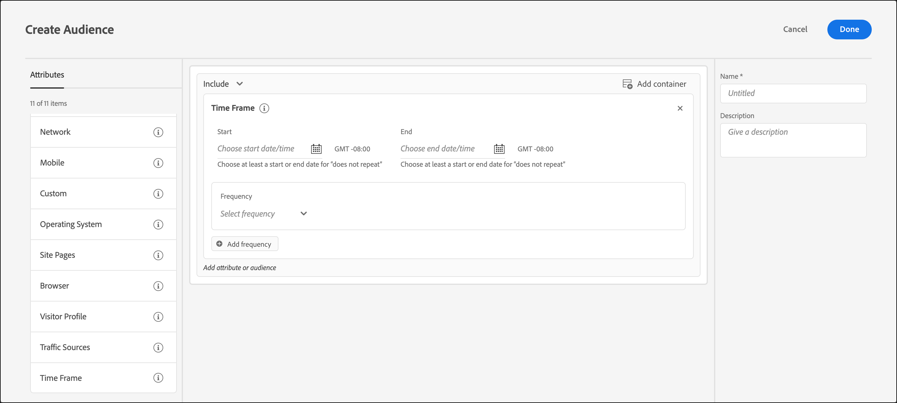
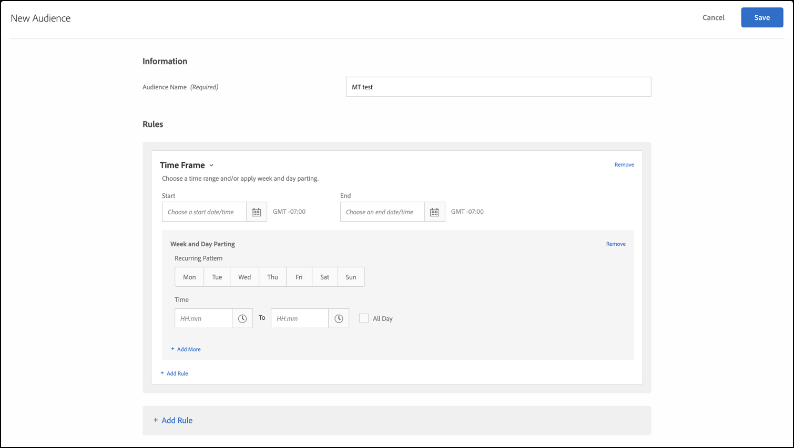

# [!UICONTROL Time Frame]

特定の期間内にサイトを訪問したユーザーをターゲットに設定するた [!DNL Adobe Target] に、開始日時と終了日時を追加できます。 また、「週と日付の分割」オプションを設定して、オーディエンスのターゲット設定の繰り返しパターンを作成できます。

例えば、[ 組み合わせアドホックオーディエンス機能 ](/help/main/c-target/combining-multiple-audiences.md#concept_A7386F1EA4394BD2AB72399C225981E5) を使用すると、ブラックフライデーおよびその後の他のコンテンツまでの 3 日間で、特定のコンテンツを使用して低支出者をターゲットにすることができます。

1. [!DNL Target] インターフェイスで、**[!UICONTROL Audiences]**/**[!UICONTROL Create Audience]** をクリックします。
1. オーディエンスに名前を付け、オプションで説明を追加します。
1. **[!UICONTROL Time Frame]** をオーディエンスビルダーペインにドラッグ&amp;ドロップします。

   

1. オーディエンスの [!UICONTROL Start] と [!UICONTROL End] の日時を指定します。

   アクティビティのスケジュールによってターゲティングを開始するには、開始日を空欄にしておきます。アクティビティの停止日時までターゲティングを続けるには停止日を空欄にしておきます。

   開始日と終了日を両方とも空欄にしておくこともできます。この機能を使用すると、アクティビティレベルで開始日と終了日を制御しながら、複数のアクティビティで（オーディエンスのコピーを作成せずに）同じオーディエンスを使用できます。

   >[!NOTE]
   >
   >次の点に留意してください。
   >
   >* 開始日/終了日のタイムゾーンは、GMT +/- NN:NN と表示されます。NN:NN は GMT からのオフセットで、訪問者のタイムゾーンではなく、アカウントレベルのタイムゾーンを反映しています。 例えば、カリフォルニアのタイムゾーンは GMT -08:00 と表示されます。
   >
   >* [!DNL Target] 時間オーディエンスでは、夏時間（DST）の変更が考慮されません。 DST の変更を考慮するには、オーディエンスを手動で再保存する必要があります。

1. （条件付き） **[!UICONTROL Set frequency]** をクリックして、曜日や時刻を含む定期的なパターンを設定します。

   

   例えば、[!UICONTROL Frequency] のオプションを使用して、コールセンターにスタッフが配置されている日時にのみ「今すぐチャット」オプションを訪問者に表示できます。

   1 つ以上の曜日を選択して、開始および終了時間を設定します。必要に応じて、「**[!UICONTROL Add frequency]**」をクリックして追加のパターンを指定します。

   >[!NOTE]
   >
   >[!UICONTROL Week and Day Parting] のタイムゾーンは、GMT +/- NN:NN と表示されます。NN:NN は GMT からのオフセットで、訪問者のタイムゾーンではなくアカウントレベルのタイムゾーンを反映しています。 例えば、カリフォルニアの太平洋夏時間のタイムゾーンは、GMT -07:00 と表示されます。

1. （任意）オーディエンスの追加ルールを設定します。

   必要に応じて、各ルールに対して手順 5 を繰り返すことができます。

1. **[!UICONTROL Done]** をクリックします。

## トレーニングビデオ：オーディエンスの作成 

このビデオでは、オーディエンスのカテゴリの使用について説明しています。

* オーディエンスの作成
* オーディエンスカテゴリの定義

>[!VIDEO](https://video.tv.adobe.com/v/17392)
