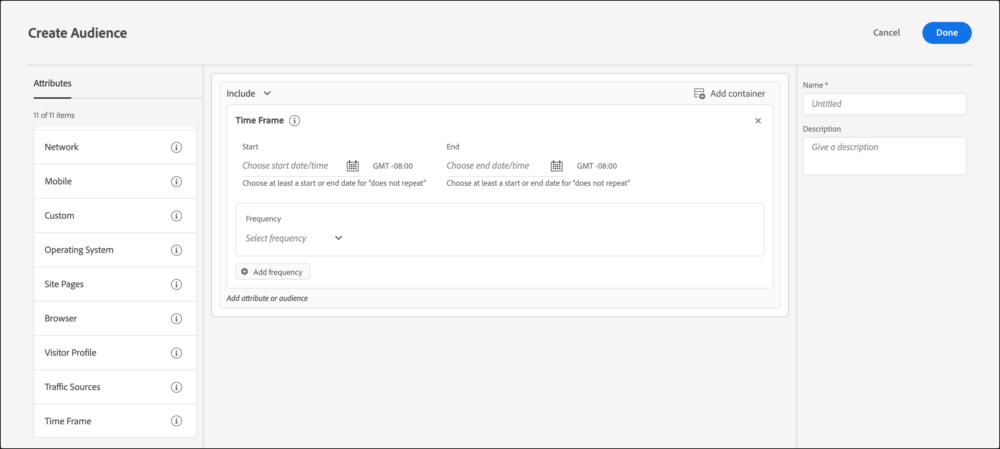

# [!UICONTROL 時間枠]

開始日と終了日を[!DNL Adobe Target]に追加して、特定の時間枠でサイトにアクセスしたターゲットユーザーをターゲットにすることができます。 また、「週と日付の分割」オプションを設定して、オーディエンスのターゲット設定の繰り返しパターンを作成できます。

例えば、[組み合わせ、アドホックオーディエンス機能](/help/main/c-target/combining-multiple-audiences.md#concept_A7386F1EA4394BD2AB72399C225981E5)を使用すると、ブラックフライデーまでの3日間の特定のコンテンツや、ブラックフライデー後の他のコンテンツを含む低消費者をターゲットにすることができます。

1. [!DNL Target] インターフェイスで、「**[!UICONTROL オーディエンス]**」 > 「**[!UICONTROL オーディエンスを作成]**」をクリックします。
1. オーディエンスに名前を付け、オプションの説明を追加します。
1. **[!UICONTROL 時間枠]**&#x200B;をオーディエンスビルダーペインにドラッグ&amp;ドロップします。

   

1. オーディエンスの[!UICONTROL 開始]と[!UICONTROL 終了]の日時を指定します。

   アクティビティのスケジュールによってターゲティングを開始するには、開始日を空欄にしておきます。 アクティビティの停止日時までターゲティングを続けるには停止日を空欄にしておきます。

   開始日と終了日を両方とも空欄にしておくこともできます。 この機能を使用すると、アクティビティレベルで開始日と終了日を制御しながら、複数のアクティビティで同じオーディエンスを（オーディエンスのコピーを作成せずに）使用できます。

   >[!NOTE]
   >
   >次の点に留意してください。
   >
   >* 開始日/終了日のタイムゾーンはGMT +/- NN:NNとして表示されます。ここで、NN:NNはGMTからのオフセットであり、訪問者のタイムゾーンではなくアカウントレベルのタイムゾーンを反映します。 例えば、カリフォルニア州のタイムゾーンはGMT -08:00と表示されます。
   >
   >* [!DNL Target]時間のオーディエンスは、夏時間（DST）の変更を考慮しません。 DSTの変更を考慮して、オーディエンスを手動で再保存する必要があります。

1. （条件付き）「**[!UICONTROL 頻度を設定]**」をクリックして、曜日や時間などの繰り返しパターンを設定します。

   

   例えば、[!UICONTROL 頻度] オプションを使用して、コールセンターにスタッフが配置されている日と時間帯にのみ訪問者に「今すぐチャット」オプションを表示できます。

   1 つ以上の曜日を選択して、開始および終了時間を設定します。 必要に応じて、追加のパターンを指定するには、**[!UICONTROL 頻度を追加]**&#x200B;をクリックします。

   >[!NOTE]
   >
   >[!UICONTROL 週と日分割]のタイムゾーンはGMT +/- NN:NNとして表示されます。ここで、NN:NNはGMTからのオフセットであり、訪問者のタイムゾーンではなくアカウントレベルのタイムゾーンを反映します。 例えば、カリフォルニア州の太平洋夏時間のタイムゾーンは、GMT -07:00と表示されます。

1. （オプション）オーディエンスの追加ルールを設定します。

   必要に応じて、各ルールについて手順5を繰り返すことができます。

1. 「**[!UICONTROL Done]**」をクリックします。

## トレーニングビデオ：オーディエンスの作成

このビデオでは、オーディエンスのカテゴリの使用について説明しています。

* オーディエンスの作成
* オーディエンスカテゴリの定義

>[!VIDEO](https://video.tv.adobe.com/v/17392)
