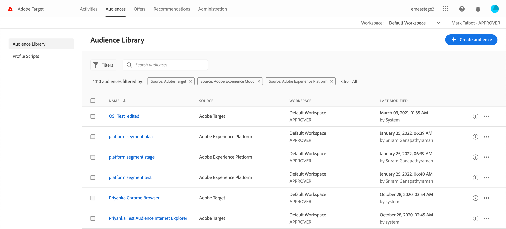

# [!DNL Target]でオーディエンスを作成

カスタマイズしたオーディエンスを作成し、アクティビティで使用するために[!DNL Adobe Target] [!UICONTROL &#x200B; オーディエンス &#x200B;] ライブラリに保存します。 既存のオーディエンスをコピーして編集し、類似のオーディエンスを作成したり、複数のオーディエンスを組み合わせたりすることもできます。

## オーディエンスの概要

オーディエンスは、誰が [!DNL Target] アクティビティに含まれるか、または除外されるかを決定するルールによって定義されます。 オーディエンス定義には複数のルールを含めることができ、各ルールには複数のパラメーターを含めることができます。 複雑なオーディエンス定義は、ブール演算子 AND および OR を使用してルールおよびパラメーターを組み合わせて、どのサイト訪問者がアクティビティ参加者としてカウントされるかを詳細に制御します。

ルールまたはパラメーターをANDと組み合わせると、潜在的なオーディエンスメンバーが参加者として含めるには、定義された条件&#x200B;*all*&#x200B;を満たす必要があります。 例えば、AND を使用して OS ルールとブラウザールールを定義すると、定義された OS と定義されたブラウザーの&#x200B;*両方*&#x200B;を使用している訪問者のみ、アクティビティに含められます。

ルールまたはパラメーターを OR で組み合わせる場合、任意の潜在的なオーディエンスメンバーが参加者として含められるためには、定義された条件のいずれか 1 つを満たす必要があります。 例えば、OR で接続される複数のモバイルルールを定義する場合、定義された条件の&#x200B;*いずれか*&#x200B;を満たす訪問者がアクティビティに含められます。

両方のブール演算子を混在させて複雑なルールを作成できますが、同じルールレベルの演算子は一致している必要があります。 ユーザーインターフェイスは自動的に適切な演算子を適用します。

例えば、次のルールは、[!DNL Windows] コンピューターで[!DNL Chrome] *または* [!DNL Firefox]のいずれかを使用する訪問者をターゲットにします。

>[!NOTE]
>
>すべての潜在的なオーディエンスメンバーを除外するルールを作成しないように注意してください。 例えば、[!DNL Chrome] *と* [!DNL Firefox]を同時に使用してページにアクセスすることはできません。

## オーディエンスの作成

1. 上部のメニューバーで「**[!UICONTROL オーディエンス]**」をクリックします。

   

1. [!UICONTROL &#x200B; オーディエンス &#x200B;]のリストから、「**[!UICONTROL オーディエンスを作成]**」をクリックします。

   または

   既存のオーディエンスをコピーするには、[!UICONTROL &#x200B; オーディエンス &#x200B;] リストから、コピーするオーディエンスの&#x200B;**[!UICONTROL その他のアクション]** アイコン（）をクリックし、**[!UICONTROL 複製]**&#x200B;をクリックします。 これにより、そのオーディエンスを編集して類似のオーディエンスを作成することができます。

1. 一意でわかりやすいオーディエンス名と、オプションの説明を入力します。

   オーディエンス名は、次の文字で始めることはできません。

   `=  +  -  !  @`

   オーディエンス名に次の文字シーケンスを含めることはできません。

   `;=  ;+  ;-  ;@  ,=  ,+  ,-  ,@  ["  "]  ['  ]'`

1. 左側の&#x200B;**[!UICONTROL 属性]** リストから目的の属性をオーディエンスビルダーペインにドラッグ&amp;ドロップします。

   

   各ルールタイプには、独自のパラメーターがあります。 各タイプのオーディエンスルールの設定について詳しくは、[&#x200B; オーディエンスのカテゴリ &#x200B;](/help/main/c-target/c-audiences/c-target-rules/target-rules.md#concept_E3A77E42F1644503A829B5107B20880D)を参照してください。

1. ルールパラメーターを定義します。

   例えば、次のオーディエンスは、[!DNL Macintosh] オペレーティングシステムを使用してユタ州からの訪問者をターゲットにしています。

   

1. （条件付き）目的の属性の追加と定義を続行します。

   別のコンテナを作成するには、**[!UICONTROL コンテナを追加]**&#x200B;をクリックするか、別の属性をオーディエンスビルダーペインにドラッグします。 その後、ドロップダウンリストを使用して演算子（ANDまたはOR）を調整できます。

1. 「**[!UICONTROL Done]**」をクリックします。

   処理遅延の数秒後に、新しく作成したオーディエンスがリストに表示されます。 オーディエンスがすぐにリストに表示されない場合は、オーディエンスを検索するか、リストを更新してください。

## トレーニングビデオ：オーディエンスの作成

このビデオでは、オーディエンスの作成について説明します。

* オーディエンスの作成
* オーディエンスカテゴリの定義

>[!VIDEO](https://video.tv.adobe.com/v/17392)
