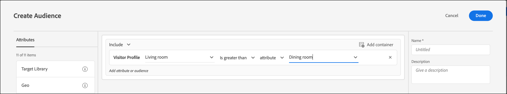

# プロファイル属性比較オーディエンスの作成

でオーディエンスを定義 [!DNL Adobe Target] を使用して、 [オーディエンスライブラリ](/help/main/c-target/c-audiences/audiences.md) または [アクティビティのみのオーディエンス](/help/main/c-target/creating-activity-only-audience.md). より大きい、より小さい、または等しい演算子を使用して、2 つの異なるプロファイル属性の値を動的に比較するオーディエンスを定義します。

>[!NOTE]
>
>この機能は [[!UICONTROL 、訪問者プロファイル]](/help/main/c-target/c-audiences/c-target-rules/visitor-profile.md#concept_E972690B9A4C4372A34229FA37EDA38E) カテゴリでのみ使用できます。

## 概要 {#section_303CBC78194D49A2A004945D425441E1}

オーディエンスは、誰が [!DNL Target] アクティビティに含まれるか、または除外されるかを決定するルールによって定義されます。オーディエンス定義には複数のルールを含めることができ、各ルールには複数のパラメーターを含めることができます。含めるルールの 1 つで [!UICONTROL 訪問者プロファイル] カテゴリ別に分類する場合は、訪問者プロファイル属性の特定の値に基づくルールを定義できます。また、その属性の値を別の訪問者プロファイル属性と比較することもできます。

例えば、家具会社で働いていて、2 つの顧客傾向スコアを [!DNL Target]:

* 次の 90 日間にダイニングルーム用の家具を購入する可能性
* 次の 90 日間にリビング用の家具を購入する可能性

ダイニングルーム用の家具を購入する傾向が、リビング用の家具を購入する傾向よりも高くなるように定義されたオーディエンスを作成できます。[!DNL Target] は、特定の訪問者のダイニングルームとリビングの傾向スコアを動的に比較して、その訪問者が前述のオーディエンスに該当するかどうかを判断します。

詳しくは、 [データを Target に送信する方法](https://developer.adobe.com/target/before-implement/methods-to-get-data-into-target/methods-to-get-data-into-target/){target=_blank}。

## プロファイル属性比較オーディエンスの作成 {#section_7A62FD47D5C74C3EBC3417ACDBB85013}

1. クリック **[!UICONTROL オーディエンス]** > **[!UICONTROL オーディエンスを作成]**.
1. オーディエンスに名前を付け、オプションで説明を追加します。
1. ドラッグ&amp;ドロップ **[!UICONTROL 訪問者プロファイル]** を audience builder パネルにドラッグします。
1. **[!UICONTROL 訪問者プロファイル]**&#x200B;ドロップダウンリストから、属性を選択します。

   

1. 評価基準を選択します。

   

1. **[!UICONTROL 比較書式を選択]**&#x200B;ドロップダウンリストから、「**[!UICONTROL 属性]**」を選択します。

   「static value」の比較タイプを使用すると、訪問者プロファイル属性を特定の値と比較できます。

   

   >[!NOTE]
   >
   >デフォルトの訪問者プロファイルカテゴリ（例えば、新規訪問者や再訪問者）の 1 つを使用している場合は、静的値オプションのみを選択できます。 動的比較オプションは、デフォルトカテゴリーでは使用できません。動的比較オプションを使用できない他の例としては、「セッションの最初のページ」、「他のテストに存在しない」、「セッションの最初のページ以外」、「カテゴリー親和性」があります。

1. 最初の属性と比較する追加属性を選択します。

   

1. 「 **[!UICONTROL 完了]**」をクリックします。

## トレーニングビデオ  {#section_3BB8DBF3418F4520B3E274B6F40AF8F3}

この機能を使用できるシナリオと詳細情報については、次のビデオを視聴してください。

>[!VIDEO](https://video.tv.adobe.com/v/23218/)
