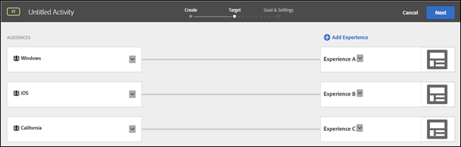

# ターゲットとオーディエンスに関する FAQ

エクスペリエンスのターゲット設定とオーディエンスに関するよくある質問（FAQ）のリストです。

## 方法 [!DNL Target] ターゲティングで URL を評価しますか？ {#url}

Target では、アクティビティの作成時にオーディエンス URL のターゲティングを使用するか、オーディエンスの作成時に URL のターゲティングを使用するかによって、URL の評価方法が異なります。

次の URL について考えてみます。

`http://www.example.com/path1/path2/path3?queryStringParam1=test123&queryStringParam2=test7`

### オーディエンス URL のターゲティング

オーディエンス URL のターゲット設定を適用するには、アクティビティの作成時に、エクスペリエンスページ（3 ステップのガイドによるワークフローの手順 1）の歯車アイコンをクリックし、「ページ配信」をクリックして URL を指定します。

オーディエンス URL のターゲティングでは、完全に一致する URL を探します。 URL が一致する場合、Target ではそれ以上のロジックは考慮されません。 上記の URL で、アクティビティが `www.example.com`オーディエンス URL のターゲティングはクエリに依存しないので、では、次の URL に対して URL が一致します。

* `www.example.com?query=something`
* `www.example.com?query=anything`
* `www.example.com?query=nothing&qa=true&stuff=random&product=shoes&height=superTall`

URL に対するオーディエンスのターゲティングの他に、クエリで指定できる特定の値を指定することもできます。

オーディエンス URL のターゲティングと、を介した URL のターゲティングが追加されました。 [!UICONTROL テンプレートルール] を URL ターゲティングとして評価する（以下の URL ターゲティングを参照）。

### URL のターゲティング

オーディエンスの作成時に URL ターゲティングを適用するには、 [!UICONTROL ルールを追加]をクリックし、 [!UICONTROL サイトのページ]」で、最初のドロップダウンリストからオプションを選択します ([!UICONTROL 現在のページ], [!UICONTROL 前のページ]または [!UICONTROL ランディングページ]) を選択します。 [!UICONTROL URL] 2 番目のドロップダウンリストから、評価基準を指定してから、目的の URL を指定します。

URL ターゲティングは、URL を評価する一連のルールに変換します。

* URL = `example.com/path1?query=something`
* URL domain = `example.com`
* パス= path1/path2/path3
* queryStringParam1 = test123
* queryStringParam2 = test7

## 複雑な URL 文字列を作成する場合、はを実行します。 [!DNL Target] URL 全体を評価しますか？

URL 文字列で同じパラメーター名を複数回使用する場合、HTTP は最初のパラメーター名を考慮し、同じ名前を持つ後続のパラメーターを無視します。

例えば、次の URL 文字列の場合、

`https://www.adobe.com/SearchResults.aspx?sc=BM&fi=1&fr=1&ps=0&av=0&Category=C0010438&Category=C000047`

の最初のインスタンス `Category` パラメーターが評価され、2 番目の `Category` パラメーターは無視されます。

次に示すように、複数の値を 1 つのカテゴリに関連付けることをお勧めします。

`https://www.adobe.com/SearchResults.aspx?sc=BM&fi=1&fr=1&ps=0&av=0&Category=C0010438,C000047`

## オーディエンスを構築する際、事前設計されたオーディエンスがなぜ [!DNL Target] ライブラリが他のカテゴリで見つかりましたか？ {#section_9EBF5B0F9DF94168A15B92B905CCF7E0}

ターゲットライブラリカテゴリの事前設計されたオーディエンスは、従来のオーディエンスで、他のカテゴリに存在します。例として、従来のターゲットライブラリ／新しい訪問者のオーディエンスは、同等の訪問者プロファイル／新しい訪問者に更新されています。

パフォーマンスが向上しているので、より新しいオーディエンスを使用することをお勧めします。一部のお客様は、従来の事前構築されたオーディエンスを使用している可能性があるので、Target インターフェイスからは削除されていません。

## トラフィックはオーディエンス間でどのように分割されますか。 {#section_067EEFB956E7465CBF77EC86834470AB}

デフォルトでは、トラフィックはエクスペリエンス間で等しく分割されます。しかし、対象の比率を各エクスペリエンスに設定できます。この場合、乱数が生成され、その乱数を使用して、表示するエクスペリエンスが選択されます。結果の割合が指定したターゲットと完全に一致しないこともありますが、トラフィックが多いほど、エクスペリエンスがターゲットに近い割合で分割されます。

## ユーザーが、複数のオーディエンスを対象とする複数のエクスペリエンスを含んだアクティビティの資格を満たす場合、どのエクスペリエンスが表示されますか。 {#section_94A60B11212D48FD8AB0803C6C7E7253}

そのユーザーは、アクティビティの[!UICONTROL ターゲット]ページに表示される最初のエクスペリエンス／オーディエンスの対象になります。

例えば、次の図では、Windows デバイスを使用するカリフォルニアのユーザーはエクスペリエンス A（Windows オーディエンス）とエクスペリエンス C（カリフォルニアオーディエンス）の両方の対象になります。ターゲットページではエクスペリエンス A の方がエクスペリエンス C より上に表示されるため、このユーザーにはエクスペリエンス A が表示されます。

## [!DNL Target]、Adobe Audience Manager（AAM）およびコアサービスのオーディエンスライブラリの同じオーディエンスライブラリに異なる名前を付けるのはなぜですか。 {#section_F67E61A607B6444C8DAA4F99C3E95AED}

[!DNL Target] で名前を付けられたオーディエンスは一意ですが、[!DNL AAM] および [!DNL Audience Library] では、複数のオーディエンスに同じ名前を付けることができます（異なるフォルダーにある場合）。[!DNL AAM] または [!DNL Audience Library] のオーディエンスに対応するオーディエンス名が [!DNL Target] で検出された場合、[!DNL Target] はその名前に「#&lt;number>」を追加します。

例えば、「PC Users」（[!DNL AAM]）および「PC Users #1」（[!DNL Target]）というオーディエンスが表示されることがあります。

## オーディエンスの名前を変更できないのはなぜですか。 {#section_54E420556F534D20836E261E253D8B97}

「新しい訪問者」および「再訪問者」など、一部の Target オーディエンスは事前定義されています。これらの事前定義されたオーディエンスは、ユーザーが名前を変更することはできません。

## すべてのプロファイルパラメーターが [!DNL Target] ユーザーインターフェイス？ {#section_3CD947D15C984EE9AD19550220E0E8BD}

[!DNL Target] には、mbox 呼び出しごとに 50 個の独自のプロファイル属性という制限があります。50 個を超えるプロファイル属性を [!DNL Target] に渡す必要がある場合、[!UICONTROL Profile Update] API メソッドを使用して渡すことができます。詳しくは、Adobe Target API ドキュメントの [Profile Update](https://developers.adobetarget.com/api/#authentication-tokens) を参照してください。

## 訪問者に、提供されないはずの AP アクティビティのエクスペリエンスが表示されるのはなぜですか。 {#section_41CECEAE0881446A8D9F3B016857914B}

Automated Personalizationアクティビティは、セッションごとに評価されます。特定のエクスペリエンスに対する条件を満たしたアクティブなセッションがあり、そこに新しいオファーが追加されると、ユーザーには、以前まで表示されていたオファーとともに新しいコンテンツが表示されます。こうしたユーザーは、それまでに対象のエクスペリエンスの条件を満たしていたので、セッションの有効期間中は引き続きそのエクスペリエンスが表示されます。ページ訪問のたびにアクティビティを評価したい場合は、エクスペリエンスのターゲット設定（XT）のアクティビティタイプを使用してください。

## API を介してオーディエンスに加えられた変更が [!DNL Target] UI? {#section_6BEB237CAC004A06A290F9644E5BF0FB}

オファーやプロファイルスクリプトとは異なり、Target Standard で作成されたオーディエンスに API で加えられた変更は、現時点では、Target UI には反映されません。

## 数値（浮動小数点数もサポートされます）を表す文字列は、数値と比較されます。{#strings-that-represent-numbers}

等号式の左と右の部分を数値に解析できる場合、2つの部分は文字列ではなく数値として比較されます。

次に例を示します。

| 値 | ターゲット設定条件 | 結果 |
| --- | --- | --- |
| 1.0 | equals1 | true |
| 1 | equalSignoreCase1.0 | true |
| 1.230 | equals1 | true |
| 1.500 | equals1.5 | true |
| 1.200 | が2より小さい | true |
| 2 | が3.0より大きい | false |
| 045 | equals45 | true |

科学的表記法で記述された数値は、常に文字列として比較されます。

例：

&quot;4e-2&quot;は&quot;4e-2&quot;にのみ等しくなります。&quot;0.04&quot; と等しく&#x200B;*なりません*。
