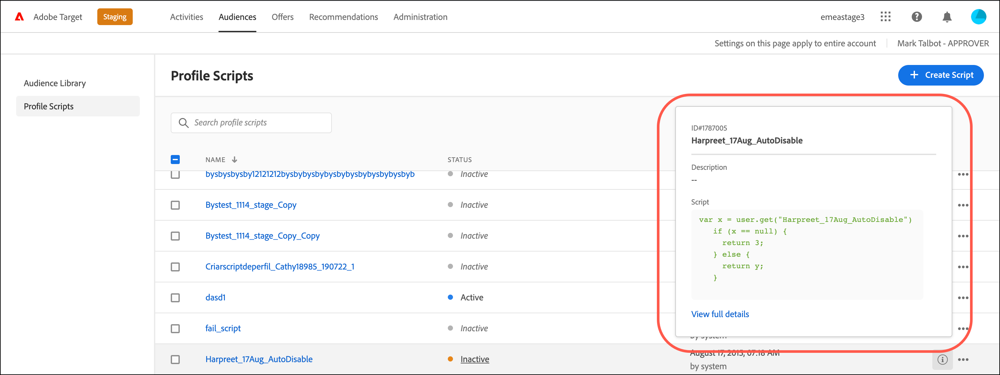
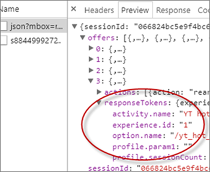
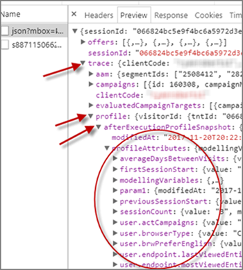

# プロファイル属性

[!DNL Adobe Target] のプロファイル属性は、訪問者に固有のパラメーターです。プロファイル属性は訪問者のプロファイルに保存され、アクティビティで使用可能な訪問者に関する情報を提供します。

ユーザープロファイルには、web ページ訪問者の人口統計情報と行動情報が含まれます。この情報には、年齢、性別、購入した製品、最終訪問時間などが含まれます。[!DNL Target] は、これらの情報を使用して訪問者に提供するコンテンツをパーソナライズします。

訪問者が web サイトを閲覧したり、別のセッションに戻ったりすると、プロファイルの保存済みプロファイル属性を使用してコンテンツをターゲット設定したり、セグメントフィルターの情報を記録したりできます。

プロファイル属性を設定するには：

1. **[!UICONTROL オーディエンス]**／**[!UICONTROL プロファイルスクリプト]**&#x200B;をクリックします。

   

1. 「**[!UICONTROL スクリプトを作成]**」をクリックします。

   

   以下のタイプのプロファイル属性を利用できます。

   | パラメータータイプ | 説明 |
   |--- |--- |
   | mbox | mbox を作成するときに、ページコードを介して直接渡されます。詳しくは、 [グローバル mbox にパラメーターを渡す](https://experienceleague.corp.adobe.com/docs/target-dev/developer/client-side/global-mbox/pass-parameters-to-global-mbox.html){target=_blank}.<br>**メモ**：[!DNL Target] には、mbox 呼び出しごとに 50 個の独自のプロファイル属性という制限があります。50 個を超えるプロファイル属性を [!DNL Target] に渡す必要がある場合、Profile Update API メソッドを使用して渡すことができます。詳しくは、[ [!DNL Adobe Target]  API ドキュメントのプロファイルの更新](https://developers.adobetarget.com/api/#updating-profiles)を参照してください。 |
   | プロファイル | JavaScript コードスニペットにより直接定義されます。これらのスニペットは、現在の合計数（顧客が支払った合計金額など）を保存することができ、mbox リクエストごとに実行されます。以下の「プロファイルスクリプト属性」を参照してください。 |

## プロファイルスクリプト属性 {#concept_8C07AEAB0A144FECA8B4FEB091AED4D2}

プロファイルスクリプトの属性は、関連する JavaScript コードスニペットを使用して定義します。

プロファイルスクリプトを使用して、複数の訪問にわたり、訪問者の属性を取得できます。プロファイルスクリプトは、サーバーサイドの JavaScript の形式を使用して、[!DNL Target] 内で定義するコードスニペットです。例えば、プロファイルスクリプトを使用して、訪問者がサイトを訪問する頻度や前回の訪問日時を取得できます。

プロファイルスクリプトは、プロファイルパラメーターとは異なります。プロファイルパラメーターでは、[!DNL Target] の mbox コード実装を使用して、訪問者に関する情報を取得します。

## プロファイルスクリプトの作成 {#section_CB02F8B97CAF407DA84F7591A7504810}

プロファイルスクリプトは、 [!DNL Target]インターフェイスの「[!UICONTROL オーディエンス]」タブで使用できます。

新しいプロファイルスクリプトを追加するには、「**[!UICONTROL プロファイルスクリプト]**」タブ、「**[!UICONTROL スクリプトを作成]**」の順にクリックしてスクリプトを作成します。

または

既存のプロファイルスクリプトをコピーするには、「[!UICONTROL プロファイルスクリプト]」リストで、目的のスクリプトの省略記号アイコンをクリックし、「**[!UICONTROL 複製]**」をクリックします。

これにより、そのオーディエンスを編集して類似のオーディエンスを作成することができます。

プロファイルスクリプトは、各場所リクエストでプロファイル属性「catchers」を実行します。場所のリクエストを受信した場合、[!DNL Target] は実行するアクティビティを決定し、そのアクティビティおよびエクスペリエンスに適したコンテンツを表示します。また、[!DNL Target] は、アクティビティの成功を追跡し、関連するプロファイルスクリプトを実行します。これによって、訪問者の場所、時間帯、訪問者がサイトを訪問した回数、購入歴があるかなど、訪問に関する情報を追跡できます。この情報は次に、訪問者のプロファイルに追加され、サイトでの訪問者のアクティビティをより詳細に追跡できます。

プロファイルスクリプト属性では、属性名の前に `user.` タグが挿入されます。次に例を示します。

```
if (mbox.name == 'Track_Interest') { 
    if (profile.get('model') == "A5" &&; profile.get('subcat') == "KS6") { 
        return (user.get('A5KS6') || 0) + 1; 
    } 
}
```

次の事項に注意してください。

* `user.get('parameterName')` を含むコード内で、プロファイルスクリプト属性（それ自体を含む）を参照します。
* `user.setLocal('variable_name', 'value')` を使用すると、スクリプトを次回実行するとき（次の mbox リクエストの発生時）にアクセスされる可能性がある変数を保存できます。`user.getLocal('variable_name')` の変数を参照します。このプロセスは、最後のリクエストの日時を参照する場合に便利です。

   これらの値は、プロファイルスクリプトと同様に保持されますが、設定されたスクリプト内でのみアクセスできます。

* パラメーターと値は、大文字と小文字を区別します。アクティビティやテストの実行中に受け取るパラメーターおよび値の大文字と小文字を一致させてください。
* その他の JavaScript 構文については、後述の「スクリプトプロファイルパラメーターに関する JavaScript リファレンス」を参照してください。
* スクリプトを無効にした後も、パラメーターはプロファイルに残ります。ユーザーのプロファイルに、アクティビティのオーディエンスで使用されているパラメーターが含まれている場合、そのユーザーはそのアクティビティに適格となります。
* アクティビティで使用されている間はプロファイルスクリプトを削除できません。
* あるプロファイルスクリプトの結果を別のプロファイルスクリプトで使用する、依存プロファイルスクリプトを作成することは推奨しません。プロファイルスクリプトの実行順序は保証されません。

## プロファイルスクリプト情報カードの表示 {#section_18EA3B919A8E49BBB09AA9215E1E3F17}

プロファイルスクリプトの情報については、オファー情報カードと同様のポップアップカードを表示できます。これらのプロファイルスクリプト情報カードでは、選択したプロファイルスクリプトを参照しているアクティビティのリストやその他の有用なメタデータが表示されます。

例えば、次のプロファイルスクリプト情報カードは、[!UICONTROL 情報]リストから目的のプロファイルスクリプトのアイコン（[!UICONTROL オーディエンス]／[!UICONTROL プロファイルスクリプト]）をクリックします。

「[!UICONTROL スクリプト情報]」タブには、名前、説明、およびスクリプトコードの情報が含まれます。



「**[!UICONTROL 詳細を表示]**」をクリックして、選択したプロファイルスクリプトを参照するオーディエンスとアクティビティを確認します。


>[!NOTE]
>
>次の状況では、選択したプロファイルスクリプトを参照するアクティビティは「[!UICONTROL スクリプトの使用状況]」タブに表示されません。
>
> * アクティビティのステータスが[!UICONTROL ドラフト]の場合。
> * アクティビティで使用されるコンテンツまたはオファーが、スクリプト変数（アクティビティ内のインラインオファーまたはオファーライブラリ内のオファー）を使用する場合。


## 特定の状況での Target によるプロファイルスクリプトの無効化 {#section_C0FCB702E60D4576AD1174D39FBBE1A7}

[!DNL Target] は、実行に時間がかかりすぎる場合や多くの命令がある場合など、特定の状況で、プロファイルスクリプトを自動的に無効化します。

プロファイルスクリプトが無効化されると、次に示すように、Target UI のプロファイルスクリプトの横に黄色の警告アイコンが表示されます。


マウスポインターを重ねると、次のように、エラーの詳細が表示されます。


システムがプロファイルスクリプトを無効にする一般的な理由は次のとおりです。

* 未定義の変数が参照されている。
* 無効な値が参照されている。このエラーは、多くの場合、URL 値およびその他のユーザー入力データを適切な検証なしに参照することが原因です。
* 使用される JavaScript 命令が多すぎる。[!DNL Target] には、スクリプトあたり 2,000 の JavaScript 命令という制限がありますが、これを手作業で JavaScript を読んで単純に計算することはできません。例えば、Rhino は、すべての関数呼び出しと「新規」呼び出しを 100 個の命令として処理します。任意の関数を呼び出すと、100 個の命令を消費します。また、すべてのエントリデータのサイズ（URL 値など）は、命令数に影響を与える可能性があります。
* 後述の[ベストプラクティス](/help/main/c-target/c-visitor-profile/profile-parameters.md#section_64AFE5D2B0C8408A912FC2A832B3AAE0)の節で取り上げられている項目に従っていない。

## ベストプラクティス {#best}

次のガイドラインは、エラーや失敗をできるだけなくした簡潔なプロファイルスクリプトを記述するためのもので、正常に失敗するコードを記述することで、プロファイルスクリプトの処理時にシステムスクリプトの停止が起こらないようにするものです。これらのガイドラインは、効果的に実行されることが証明されたベストプラクティスによるものです。このガイドラインは、Rhino 開発者コミュニティによる原則および推奨事項に従い適用されるものです。

* ユーザースクリプトでは現在のスクリプト値をローカル変数に設定し、フェイルオーバーには空白の文字列を設定します。
* ローカル変数を検証します。ローカル変数値が空白の文字列でないことを確認します。
* 正規表現ではなく、文字列ベースの操作関数を使用します。
* 実行回数を制限しないで for ループや while ループを使用することはせず、有限回数の for ループを使用します。
* 文字列の長さは 1,300 文字、ループ回数は 50 回を超えないようにします。
* JavaScript 命令は 2,000 個を超えないようにします。[!DNL Target] には、スクリプトあたり 2,000 の JavaScript 命令という制限がありますが、これを手作業で JavaScript を読んで単純に計算することはできません。例えば、Rhino は、すべての関数呼び出しと「新規」呼び出しを 100 個の命令として処理します。また、すべてのエントリデータのサイズ（URL 値など）は、命令数に影響を与える可能性があります。
* スクリプトのパフォーマンスだけでなく、すべてのスクリプトを組み合わせた総合的なパフォーマンスにも注意してください。ベストプラクティスとして、[!DNL Adobe] では、命令数の合計が 5,000 未満となるようにすることをお勧めします。命令数がカウントされているかどうかは不明ですが、注意すべき重要な点は、手順が 2,000 を超えるスクリプトは自動的に無効になることです。アクティブなプロファイルスクリプトの数は 300 を超えないようにしてください。各スクリプトは、mbox が 1 回呼び出されるたびに実行されます。必要なスクリプトだけを実行します。
* 正規表現では、先頭にドットとアスタリスクを置く（例：`/.*match/`、`/a|.*b/`）のはほとんど必要ありません。正規表現検索は、文字列のすべての位置から開始（`^` でバインドされている場合を除く）されるので、ドットとアスタリスクは既に想定されています。そうした正規表現が十分な長さ（数百文字以下）の入力データに一致すると、スクリプトの実行は中断されます。
* すべてを実行してもうまくいかない場合は、スクリプトを try ～ catch 文で囲みます。
* 次の推奨事項を参考にして、プロファイルスクリプトの複雑さを制限できます。プロファイルスクリプトで実行できる命令の数は制限されています。

   ベストプラクティスは次のとおりです。

   * プロファイルスクリプトをできるだけ小さく、簡単にします。
   * 正規表現を使用しないか、単純な正規表現のみを使用します。単純な式でも、評価には多くの命令を受けることができます。
   * 再帰を避けます。
   * プロファイルスクリプトを [!DNL Target] に追加する前に、パフォーマンステストを行う必要があります。すべてのプロファイルスクリプトは、すべての mbox リクエストで実行されます。プロファイルスクリプトが正しく実行されない場合、mbox リクエストの実行に時間がかかり、トラフィックとコンバージョンに影響が及ぶ可能性があります。
   * プロファイルスクリプトが複雑になりすぎた場合は、代わりに、[レスポンストークン](/help/main/administrating-target/response-tokens.md)の使用を検討します。

* 詳細は、JS Rhino エンジンのドキュメントを参照してください。

## プロファイルスクリプトのデバッグ {#section_E9F933DE47EC4B4E9AF2463B181CE2DA}

プロファイルスクリプトのデバッグには、次のメソッドを使用できます。

>[!NOTE]
>
>プロファイルスクリプト [!DNL console.log] はサーバーサイドで実行するので、プロファイルスクリプト内でプロファイル値を出力しません。

* **プロファイルスクリプトをレスポンストークンとして追加し、プロファイルスクリプトをデバッグする**

   [!DNL Target] で&#x200B;**[!UICONTROL 管理]**／**[!UICONTROL レスポンストークン]**&#x200B;をクリックし、デバッグするプロファイルスクリプトを有効にします。

   次に示すように、[!DNL Target] を使用してページをサイトに読み込むたびに [!DNL Target] からのレスポンスの一部として、指定したプロファイルスクリプトの値が含まれます。

   

* **mboxTrace デバッグツールを使用して、プロファイルスクリプトをデバッグする**

   このメソッドでは、[!UICONTROL デバッガーツール]セクションの&#x200B;**[!UICONTROL Target]**／**[!UICONTROL 管理]**／**[!UICONTROL 実装]**／**[!UICONTROL 認証トークンを生成]**&#x200B;をクリックして生成できる認証トークンが必要です。

   その後、2 つのパラメーター `mboxTrace=window&authorization=YOURTOKEN` をページ URL の「?」の後に追加します。

   これらのパラメーターを追加することで、プロファイルの実行前後のスナップショットを取得できるため、レスポンストークンよりもやや詳細な情報を提供します。また、使用可能なすべてのプロファイルも表示されます。

   

## プロファイルスクリプトの FAQ {#section_1389497BB6D84FC38958AE43AAA6E712}

**プロファイルスクリプトを使用してデータレイヤーにあるページから情報を取得できますか？**

プロファイルスクリプトはサーバー側で実行されるので、プロファイルスクリプトを使用してページを直接読み取ることはできません。データを渡すには、mbox リクエストまたは他の [データを Target に送信する方法](https://experienceleague.corp.adobe.com/docs/target-dev/developer/implementation/methods/methods-to-get-data-into-target.html){target=_blank}. データを [!DNL Target] に送信した後は、プロファイルスクリプトを使用して、データを mbox パラメーターまたはプロファイルパラメーターとして読み取ることができます。

## スクリプトプロファイルパラメーターに関する JavaScript リファレンス

スクリプトプロファイルパラメーターを効率的に使用するには、JavaScript に関する基本的な知識が必要です。このセクションは、この機能を使用してわずか数分で生産性を高めるためのクイックリファレンスの役割を担います。

スクリプトプロファイルパラメーターは、「mbox/プロファイル」タブに表示されます。JavaScript の種類（文字列、整数、配列など）を返す JavaScript プログラムを記述できます。

### スクリプトプロファイルパラメーターの例 {#examples}

**名前：***user.recency*

```
var dayInMillis = 3600 * 24 * 1000;
if (mbox.name == 'orderThankyouPage') {
    user.setLocal('lastPurchaseTime', new Date().getTime());
}
var lastPurchaseTime = user.getLocal('lastPurchaseTime');
if (lastPurchaseTime) {
    return ((new Date()).getTime() - lastPurchaseTime) / dayInMillis;
}
```

日の変数をミリ秒単位で作成します。mbox 名が `orderThankyouPage` の場合は、現在の日付と時間の値を取得するために、`lastPurchaseTime` と名前を付けたローカル（非表示）のユーザープロファイル属性を設定します。前回購入時間の値が読み取られており、その値が定義されている場合、[!DNL Target] は 1 日のミリ秒数で割り算された、前回購入時間以降に経過した時間を返します（前回購入からの日数になります）。

**名前：***user.frequency*

```
var frequency = user.get('frequency') || 0;
if (mbox.name == 'orderThankyouPage') {
    return frequency + 1;
}
```

`frequency` と呼ばれる変数を作成し、以前の値、または以前の値がない場合は 0 に初期化します。mbox 名が `orderThankyouPage` の場合、増分された値が返されます。

**名前：***user.monetaryValue*

```
var monetaryValue = user.get('monetaryValue') || 0;
if (mbox.name == 'orderThankyouPage') {
    return monetaryValue + parseInt(mbox.param('orderTotal'));
}
```

`monetaryValue` と呼ばれる変数を作成し、特定の訪問者の現在の値を検索します（または以前の値がない場合は 0 に設定します）。mbox 名が `orderThankyouPage` の場合、以前の値と mbox に渡される `orderTotal` パラメーターの値を追加することによって、新しい金額が返されます。

**名前：** adobeQA

```
if (page.param("adobeQA"))
     return page.param("adobeQA");
else if (page.param("adobeqa"))
     return page.param("adobeqa");
else if (mbox.param("adobeQA"))
     return mbox.param("adobeQA");
```

ユーザーが[アクティビティ QA](/help/main/c-activities/c-activity-qa/activity-qa.md) を追跡する、`adobeQA` という名前の変数を作成します。

### オブジェクトとメソッド {#objects}

次のオブジェクトとメソッドは、スクリプトプロファイルパラメーターで参照できます。

| オブジェクトまたはメソッド | 詳細 |
| --- | --- |
| `page.url` | 現在の URL。 |
| `page.protocol` | このページに使用するプロトコル（http または https）。 |
| `page.domain` | 現在の URL ドメイン（最初のスラッシュより前のすべて）。例えば、`http://www.acme.com/categories/men_jeans?color=blue&size=small` の `www.acme.com`。 |
| `page.query` | 現在のページのクエリ文字列。？の後のすべて。 例えば、`http://www.acme.com/categories/mens_jeans?color=blue&size=small` の `blue&size=small`。 |
| `page.param('<par_name>')` | `<par_name>` に示すパラメーターの値。現在の URL がGoogleの検索ページであり、 `page.param('hl')`を使用する場合、URL の「en」が取得されます。 `http://www.google.com/search?hl=en& q=what+is+asdf&btnG=Google+Search`. |
| `page.referrer` | 上記と同じ一連の処理がリファラーとランディングに適用されます（referrer.url はリファラーの URL アドレスになります）。 |
| `landing.url`、`landing.protocol`、`landing.query`、および `landing.param` | ページのものと同様ですが、ランディングページ用です。 |
| `mbox.name` | アクティブな mbox の名前。 |
| `mbox.param('<par_name>')` | アクティブな mbox 内で指定した名前の mbox パラメーター。 |
| `profile.get('<par_name>')` | `<par_name>` の名前のクライアントが作成したユーザープロファイルパラメーター。例えば、ユーザーが「gender」という名前のプロファイルパラメーターを設定した場合、値は「profile.gender」を使用して抽出できます。 「`profile.<par_name>`&quot;現在の訪問者に設定。値が設定されていない場合は null を返します。 `profile.get(<par_name>)` は関数呼び出しとして認定されます。 |
| `user.get('<par_name>')` | 「`user.<par_name>`&quot;現在の訪問者に設定。値が設定されていない場合は null を返します。 |
| `user.categoryAffinity` | 最適なカテゴリーの名前が返されます。 |
| `user.categoryAffinities` | 最適なカテゴリーを持つ配列が返されます。 |
| `user.isFirstSession` | 訪問者の最初のセッションの場合は true が返されます。 |
| `user.browser` | HTTP ヘッダーにユーザーエージェントが返されます。例えば、Safari ユーザーのみを対象とするターゲット式を作成できます（`if (user.browser != null && user.browser.indexOf('Safari') != -1) { return true; }`）。 |

### 共通演算子


すべての標準 JavaScript 演算子が存在し、使用可能です。JavaScript 演算子は、文字列および数字（他のデータタイプも同様）に使用できます。以下はその簡単な説明です。

| 演算子 | 説明 |
| --- | --- |
| `==` | 等価を示します。いずれかの辺の演算値が等しい場合に true を保持します。 |
| `!=` | 不等価を示します。いずれかの辺の演算値が等しくない場合に true を保持します。 |
| `<` | 左辺の変数が右辺の変数より小さいことを示します。変数が等しい場合は false に評価されます。 |
| `>` | 左辺の変数が右辺の変数より大きいことを示します。変数が等しい場合は false に評価されます。 |
| `<=` | `<` と同様に、変数が等しい場合を除いて true に評価されます。 |
| `>=` | `>` と同様に、変数が等しい場合を除いて true に評価されます。 |
| `&&` | 論理積 (ANDs) を使用して、左右の式を論理積 (AND) します。両辺の式が true の場合にのみ true になります（そうでない場合は false になります）。 |
| `||` | 論理演算子「OR」の左右に式を書いた場合は、いずれかの辺の式が true の場合にのみ true になります（そうでない場合は false になります）。 |
| `//` | ターゲットのブール演算子（配列ソース、配列ターゲット）のすべての要素がソースに含まれているかどうかをチェックします。<br>`//`は、ターゲット（regexp に対応）からサブ文字列を抽出し、`Array/*String*/ decode(String encoding, String regexp, String target)`にデコードします。<br>この機能では、定数の文字列値、グループ化（`condition1 || condition2) && condition3`）および正規表現（`/[^a-z]$/.test(landing.referring.url)`）の使用もサポートされています。 |

## トレーニングビデオ：プロファイルスクリプト 

このビデオでは、プロファイルスクリプトの使用と作成に関する情報を説明します。

* プロファイルスクリプトの概要説明
* プロファイルスクリプトとプロファイルパラメーターの違いの説明
* シンプルなプロファイルスクリプトの作成
* 利用可能なオプションにアクセスするための利用可能なトークンメニューの使用
* プロファイルスクリプトの有効化と無効化

>[!VIDEO](https://video.tv.adobe.com/v/17394)
