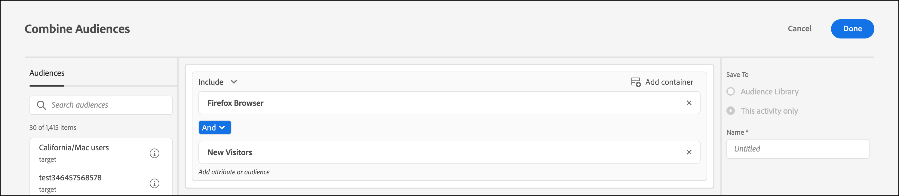
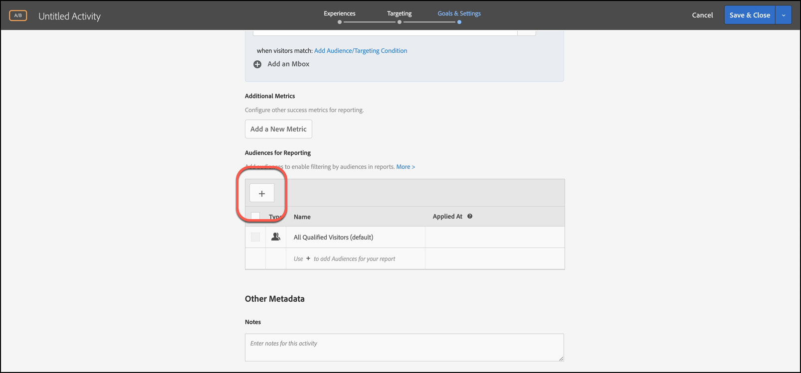

# 複数のオーディエンスの結合

複数のオーディエンス（[!DNL Adobe Experience Cloud]、[!DNL Adobe Experience Platform]、[!DNL Target]のオーディエンスを含む）を即座に組み合わせて、高度なオーディエンスを作成します。 また、除外ルールを作成して、ルールからオーディエンスを除外できます。

>[!NOTE]
>
>[!DNL Adobe Experience Platform] ソースは、[Adobe Experience Platform Web SDK](https://experienceleague.adobe.com/docs/target-dev/developer/client-side/aep-web-sdk.html?lang=en){target=_blank}を使用しているすべての[!DNL Target]のお客様が利用できます。 [!DNL Adobe Experience Platform]から利用可能なオーディエンスは、そのまま使用することも、このトピックで説明しているように、既存のオーディエンスと組み合わせることもできます。
>
>詳しくは、[Adobe Experience Platformのオーディエンスの使用](/help/main/c-target/c-audiences/audiences.md#aep)を参照してください。

「新規訪問者」オーディエンスと「Chrome ユーザー」オーディエンスがあるとします。 特定のアクティビティについて、これらの既存のオーディエンスを結合して、Chrome ブラウザーを使用する新規訪問者をターゲティングします。 3番目のオーディエンスを作成して[!UICONTROL Audiences] ライブラリに保存する代わりに、アクティビティの作成中または既存のアクティビティの編集中に、これらの2つのオーディエンスを組み合わせることができます。

別の例として、あらゆるロイヤルティ顧客をターゲットにすることができます。 例えば、特定の[!DNL Audience Manager] オーディエンスをロイヤルティステータスに含め、現在のセッション中にロイヤルティプログラムにサインアップしたユーザーで構成される[!DNL Target] オーディエンスと組み合わせることができます。 これら2つのオーディエンスを組み合わせることは、3つ目の永続的なオーディエンスを作成するよりも簡単です。

AND演算子およびOR演算子を使用して、最大20個のオーディエンスを組み合わせることができます。

[!DNL Target] UI 全体の様々な場所で、結合オーディエンスの作成や利用が可能です。

## アクティビティの作成中に組み合わせたオーディエンスの作成 {#section_2F1CE9434CC04174B4BA2BFC89B85D77}

3段階のガイド付きワークフローで、アクティビティの[!UICONTROL Target] ページにアドホック結合オーディエンスを作成できます。

1. [ アクティビティ ](/help/main/c-activities/activities.md#concept_D317A95A1AB54674BA7AB65C7985BA03)を作成する際、**[!UICONTROL Targeting]** ページで、3つの垂直省略記号をクリックし、**[!UICONTROL Replace Audience]**&#x200B;をクリックします。

   

1. **[!UICONTROL Choose Audience]** ページで、結合オーディエンスの構成要素として使用する目的のオーディエンスの横にあるチェックボックスをオンにします。

   [!UICONTROL Search Audiences] ボックスを使用して、目的のオーディエンスを絞り込みます。

   

1. 右上隅の&#x200B;**[!UICONTROL Combine Multiple Audiences]**&#x200B;をクリックします。

   

1. （条件付き）必要に応じて新しい結合オーディエンスを編集します。

   [!UICONTROL Edit Audience] ダイアログボックスを使用すると、左側から新しい結合されたオーディエンスに、追加のオーディエンス構築ブロックをドラッグ&amp;ドロップできます。 除外ルールを追加したり、オーディエンスを除外したりすることもできます。

   1. ドラッグ&amp;ドロップ操作を使用して、既存のセクション内のオーディエンスをレベル 2のビルディングブロックとして追加できます。

      例えば、前の例で、Safari ユーザーを結合オーディエンスに含める場合を考えてみます。 以下の例のように、「Safari ブラウザー」オーディエンスを検索して、右側の「Firefox ブラウザー」ボックスにドラッグします。

      

      2 つのブラウザータイプオーディエンスの間の演算子は「AND」になっています。 [!UICONTROL And] ドロップダウンリストを選択して「OR」に変更し、FirefoxまたはSafariを使用して、新規訪問者の新しい結合オーディエンスを作成します。 すべての潜在的なオーディエンスメンバーを除外するルールを作成しないように注意してください。 例えば、Firefox と Safari を同時に使用してページに訪問することはできません。

      >[!NOTE]
      >
      >演算子（ANDまたはOR）は、オーディエンスの結合と同じでなければなりません。 演算子を組み合わせることはできません。

   1. 除外をルールに追加するには、**[!UICONTROL Exclude]**&#x200B;をクリックします。

      

      オーディエンスをドラッグ&amp;ドロップします。

      例えば、新規訪問者から米国の訪問者を除外するには、「市場：米国」オーディエンスをボックスにドラッグします。

      この結合オーディエンスには、Safari または Firefox を使用するすべてのサイト訪問者が含まれます（San Francisco からの訪問者を除く）。

   1. ルールからオーディエンスを除外するには、**[!UICONTROL Exclusion]** > **[!UICONTROL Exclude this Audience.]**&#x200B;をクリックします。

      例えば、Firefox を使用する訪問者を除く、すべての新規サイト訪問者を含む結合オーディエンスを作成できます。 Firefox を使用する訪問者の除外は、複数のブラウザー（Safari、Chrome、Internet Explorer）を明示的に含み、Firefox を含まない結合オーディエンスを作成するよりも簡単で、すばやくおこなえます。

1. 結合されたオーディエンスにわかりやすい名前を指定し、**[!UICONTROL Done]**&#x200B;をクリックします。

## 指標のターゲティングで使用する組み合わせオーディエンスの作成 {#section_A42E795AFCBD4575809C5942039910F0}

アクティビティの[!UICONTROL Goals & Settings] ページでアドホック結合オーディエンスを作成して、指標のターゲティングで使用できます。 例えば、結合オーディエンスによるコンバージョンに基づいてターゲティングを作成するには、以下の手順に従います。

1. [ アクティビティ ](/help/main/c-activities/activities.md#concept_D317A95A1AB54674BA7AB65C7985BA03)の編集または作成中に、**[!UICONTROL Goals & Settings]** ページで、成功指標として&#x200B;**[!UICONTROL Conversion]**&#x200B;を選択し、アクションとして&#x200B;**[!UICONTROL Viewed an Mbox]**&#x200B;を選択します。
1. **[!UICONTROL Search mbox]** フィールドで目的のmboxを選択します。

   

1. 歯車アイコンをクリックし、**[!UICONTROL Add Audience Targeting]**&#x200B;をクリックします。
1. **[!UICONTROL Add Audience/Targeting Condition]** リンクをクリックして、[!UICONTROL Choose Audience] ダイアログボックスを表示します。

   

1. 「アクティビティの作成時に結合オーディエンスを作成」の[手順 2](/help/main/c-target/combining-multiple-audiences.md#section_2F1CE9434CC04174B4BA2BFC89B85D77) を実行して結合オーディエンスを作成します。

## レポートで使用する統合オーディエンスの作成 {#section_4682D342EFBB43C38E54B99B3A1E14CD}

アクティビティの[!UICONTROL Goals & Settings] ページでアドホック結合オーディエンスを作成して、レポートで使用できます。

1. [ アクティビティ ](/help/main/c-activities/activities.md#concept_D317A95A1AB54674BA7AB65C7985BA03)の編集または作成中に、**[!UICONTROL Goals & Settings]** ページで、[!UICONTROL Audiences for Reporting]の下にある&#x200B;**[!UICONTROL Add Audience]** アイコンをクリックして、[!UICONTROL Choose Audience] ページを表示します。

   

1. 「アクティビティの作成時に結合オーディエンスを作成」の[手順 2](/help/main/c-target/combining-multiple-audiences.md#section_2F1CE9434CC04174B4BA2BFC89B85D77) を実行して結合オーディエンスを作成します。

## アクティビティの編集中に組み合わせたオーディエンスを作成する {#section_364A12CE96E04B61B7C18113AA586C2C}

既存のアクティビティの編集時に結合オーディエンスをアドホックに作成することができます。

1. [!UICONTROL Activities] ページから、目的のアクティビティにカーソルを合わせ、**[!UICONTROL Edit]** アイコンをクリックします。

   または

   目的のアクティビティをクリックして開き、**[!UICONTROL Edit Activity]**&#x200B;をクリックします。

1. **[!UICONTROL Configure]** > **[!UICONTROL Audiences]** > **[!UICONTROL Multiple Audiences]**&#x200B;をクリックします。

   

1. アクティビティの現在のオーディエンスの横にあるその他のオプションアイコン（3つの垂直省略記号）をクリックし、**[!UICONTROL Change Audience]**&#x200B;をクリックします。

   

1. 「アクティビティの作成時に結合オーディエンスを作成」の[手順 2](/help/main/c-target/combining-multiple-audiences.md#section_2F1CE9434CC04174B4BA2BFC89B85D77) を実行して結合オーディエンスを作成します。
