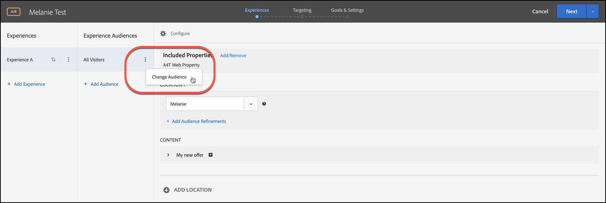

# 複数のオーディエンスの結合

複数のオーディエンス（[!DNL Adobe Experience Cloud]、[!DNL Adobe Experience Platform]、[!DNL Target] のオーディエンスを含む）をその場で組み合わせて、アドホックオーディエンスを作成します。 また、除外ルールを作成して、ルールからオーディエンスを除外できます。

>[!NOTE]
>
>[!DNL Adobe Experience Platform] ソースは、[!DNL Target]Adobe Experience Platform web SDK[&#x200B; を使用するすべての &#x200B;](https://experienceleague.adobe.com/docs/target-dev/developer/client-side/aep-web-sdk.html?lang=en){target=_blank} ユーザーが利用できます。 [!DNL Adobe Experience Platform] から使用可能なオーディエンスは、そのまま使用することも、このトピックで説明するように既存のオーディエンスと組み合わせて使用することもできます。
>
>詳しくは、[Adobe Experience Platformのオーディエンスの使用 &#x200B;](/help/main/c-target/c-audiences/audiences.md#aep) を参照してください。

「新規訪問者」オーディエンスと「Chrome ユーザー」オーディエンスがあるとします。特定のアクティビティについて、これらの既存のオーディエンスを結合して、Chrome ブラウザーを使用する新規訪問者をターゲティングします。3 つ目のオーディエンスを作成して [!UICONTROL Audiences] ライブラリに保存する代わりに、アクティビティの作成時または既存のアクティビティの編集時に、これら 2 つのオーディエンスを組み合わせることができます。

別の例として、すべてのロイヤルティ顧客をターゲットに設定できます。 例えば、ロイヤルティステータスの特定の [!DNL Audience Manager] オーディエンスを含め、それを、現在のセッション中にロイヤルティプログラムに新規登録したユーザーで構成される [!DNL Target] オーディエンスと組み合わせることができます。 これら 2 つのオーディエンスを組み合わせると、3 つ目の永続的なオーディエンスを作成するよりも簡単です。

AND および OR 演算子を使用して最大 20 個のオーディエンスを組み合わせることができます。

[!DNL Target] UI 全体の様々な場所で、結合オーディエンスの作成や利用が可能です。

## アクティビティの作成時に結合オーディエンスを作成 {#section_2F1CE9434CC04174B4BA2BFC89B85D77}

3 ステップのガイド付きワークフローで、アクティビティの [!UICONTROL Target] ページにアドホックな組み合わせオーディエンスを作成できます。

1. [&#x200B; アクティビティ &#x200B;](/help/main/c-activities/activities.md#concept_D317A95A1AB54674BA7AB65C7985BA03) を作成する際、**[!UICONTROL Targeting]** のページで 3 つの縦並びの省略記号をクリックしてから「**[!UICONTROL Replace Audience]**」をクリックします。

   

1. **[!UICONTROL Choose Audience]** ページで、組み合わせたオーディエンスの構成要素として使用するオーディエンスの横にあるチェックボックスをオンにします。

   [!UICONTROL Search Audiences] ボックスを使用して、目的のオーディエンスの検索を絞り込みます。

   

1. 右上隅の「**[!UICONTROL Combine Multiple Audiences]**」をクリックします。

   

1. （条件付き）必要に応じて新しい結合オーディエンスを編集します。

   [!UICONTROL Edit Audience] ダイアログボックスを使用して、追加のオーディエンス構築ブロックを左側から新しく組み合わせたオーディエンスにドラッグ&amp;ドロップできます。 また、除外ルールを追加し、オーディエンスを除外することもできます。

   1. ドラッグ&amp;ドロップ機能を使用して、既存のセクション内にオーディエンスをレベル 2 の構築ブロックとして追加します。

      例えば、前の例で、Safari ユーザーを結合オーディエンスに含める場合を考えてみます。以下の例のように、「Safari ブラウザー」オーディエンスを検索して、右側の「Firefox ブラウザー」ボックスにドラッグします。

      

      2 つのブラウザータイプオーディエンスの間の演算子は「AND」になっています。[!UICONTROL And] ドロップダウンリストを選択して「OR」に変更し、Firefox または Safari を使用する新規訪問者向けに新しく結合したオーディエンスを作成します。 すべての潜在的なオーディエンスメンバーを除外するルールを作成しないように注意してください。例えば、Firefox と Safari を同時に使用してページに訪問することはできません。

      >[!NOTE]
      >
      >演算子（ANDまたはOR）は、オーディエンスの結合と同じでなければなりません。演算子を組み合わせることはできません。

   1. ルールに除外を追加するには、「**[!UICONTROL Exclude]**」をクリックします。

      

      オーディエンスをドラッグ&amp;ドロップします。

      例えば、新規訪問者から米国の訪問者を除外するには、「マーケット：米国のオーディエンス」をボックスにドラッグします。

      この結合オーディエンスには、Safari または Firefox を使用するすべてのサイト訪問者が含まれます（San Francisco からの訪問者を除く）。

   1. ルールからオーディエンスを除外するには、**[!UICONTROL Exclusion]**/**[!UICONTROL Exclude this Audience.]** をクリックします。

      例えば、Firefox を使用する訪問者を除く、すべての新規サイト訪問者を含む結合オーディエンスを作成できます。Firefox を使用する訪問者の除外は、複数のブラウザー（Safari、Chrome、Internet Explorer）を明示的に含み、Firefox を含まない結合オーディエンスを作成するよりも簡単で、すばやくおこなえます。

1. 結合オーディエンスのわかりやすい名前を指定し、「**[!UICONTROL Done]**」をクリックします。

## 指標ターゲティングで使用する結合オーディエンスの作成 {#section_A42E795AFCBD4575809C5942039910F0}

アクティビティの [!UICONTROL Goals & Settings] ページでアドホックな組み合わせオーディエンスを作成し、指標のターゲティングで使用できます。 例えば、結合オーディエンスによるコンバージョンに基づいてターゲティングを作成するには、以下の手順に従います。

1. [&#x200B; アクティビティ &#x200B;](/help/main/c-activities/activities.md#concept_D317A95A1AB54674BA7AB65C7985BA03) の編集または作成時に、**[!UICONTROL Goals & Settings]** ページで成功指標として **[!UICONTROL Conversion]** を選択したあと、アクションとして **[!UICONTROL Viewed an Mbox]** を選択します。
1. **[!UICONTROL Search mbox]** フィールドで目的の mbox を選択します。

   

1. 歯車アイコン、「**[!UICONTROL Add Audience Targeting]**」の順にクリックします。
1. **[!UICONTROL Add Audience/Targeting Condition]** のリンクをクリックして、[!UICONTROL Choose Audience] のダイアログボックスを表示します。

   

1. 「アクティビティの作成時に結合オーディエンスを作成」の[手順 2](/help/main/c-target/combining-multiple-audiences.md#section_2F1CE9434CC04174B4BA2BFC89B85D77) を実行して結合オーディエンスを作成します。

## レポートで使用する組み合わせオーディエンスの作成 {#section_4682D342EFBB43C38E54B99B3A1E14CD}

アクティビティの [!UICONTROL Goals & Settings] ページでアドホックな組み合わせオーディエンスを作成し、レポートで使用できます。

1. [&#x200B; アクティビティ &#x200B;](/help/main/c-activities/activities.md#concept_D317A95A1AB54674BA7AB65C7985BA03) の編集または作成時に、**[!UICONTROL Goals & Settings]** ページで **[!UICONTROL Add Audience]** の下にある [!UICONTROL Audiences for Reporting] アイコンをクリックして [!UICONTROL Choose Audience] ページを表示します。

   

1. 「アクティビティの作成時に結合オーディエンスを作成」の[手順 2](/help/main/c-target/combining-multiple-audiences.md#section_2F1CE9434CC04174B4BA2BFC89B85D77) を実行して結合オーディエンスを作成します。

## アクティビティの編集時に結合オーディエンスを作成 {#section_364A12CE96E04B61B7C18113AA586C2C}

既存のアクティビティの編集時に結合オーディエンスをアドホックに作成することができます。

1. [!UICONTROL Activities] ページで、目的のアクティビティの上にマウスポインターを置き、「**[!UICONTROL Edit]**」アイコンをクリックします。

   または

   目的のアクティビティをクリックして開き、「**[!UICONTROL Edit Activity]**」をクリックします。

1. **[!UICONTROL Configure]**/**[!UICONTROL Audiences]**/**[!UICONTROL Multiple Audiences]** をクリックします。

   

1. アクティビティの現在のオーディエンスの横にある「その他のオプション」アイコン（3 つの縦並びの省略記号）をクリックし、「**[!UICONTROL Change Audience]**」をクリックします。

   

1. 「アクティビティの作成時に結合オーディエンスを作成」の[手順 2](/help/main/c-target/combining-multiple-audiences.md#section_2F1CE9434CC04174B4BA2BFC89B85D77) を実行して結合オーディエンスを作成します。
