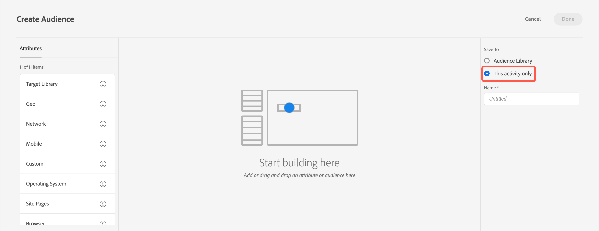

# アクティビティのみのオーディエンスの作成

アクティビティの作成時に、[!DNL Adobe Target] の 3 ステップのガイド付きワークフロー内からアクティビティのみのオーディエンスを作成します。 これらのアドホックオーディエンスは、同じアクティビティ内の他の場所で使用できますが、他のアクティビティで使用するために [!UICONTROL Audiences Library] に保存されることはありません。

アクティビティのみのオーディエンスには次のようなメリットがあります。

* アクティビティのみのオーディエンスを使用して、1 回だけ使用し、[!UICONTROL Audiences Library] ースに保存したくないオーディエンスを作成できます。 アクティビティのみのオーディエンスは、二度と使用したくないオーディエンスで [!UICONTROL Audiences Library] ーディエンスが雑然とされるのを防ぐのに役立ちます。
* アクティビティのみのオーディエンスは、[!UICONTROL Audiences Library] には表示されません。 これらのオーディエンスはライブラリに表示されないので、組織内の他のユーザーによって不必要に変更されるのを防ぐことができます。

1. [&#x200B; アクティビティ &#x200B;](/help/main/c-activities/activities.md#concept_D317A95A1AB54674BA7AB65C7985BA03) を作成する際、**[!UICONTROL Targeting]** のページで 3 つの縦並びの省略記号をクリックしてから「**[!UICONTROL Replace Audience]**」をクリックします。

   

1. **[!UICONTROL Create Audience]** をクリックします。

1. **[!UICONTROL This activity only]** をクリックします。

   

1. わかりやすいオーディエンスの名前を入力します。
1. 目的の属性をオーディエンスビルダーにドラッグ&amp;ドロップします。

   ルールを使用すると、オーディエンスをサイト訪問者のサブセットに制限できます。 各ルールタイプには、独自のパラメーターがあります。各タイプのオーディエンスルールの設定について詳しくは、[&#x200B; オーディエンスのカテゴリ &#x200B;](/help/main/c-target/c-audiences/c-target-rules/target-rules.md#concept_E3A77E42F1644503A829B5107B20880D) を参照してください。

1. **[!UICONTROL Done]** をクリックします。

## 注意点

アクティビティのみのオーディエンスを操作する際は、次の情報に注意してください。

* アクティビティのみのオーディエンスは、[!UICONTROL Visual Experience Composer] （VEC）または [!UICONTROL Form-Based Experience Composer] で作成できます。 この機能は、以前のバージョンの [!DNL Target] の絞り込みルールに代わるものです。
* 他のアクティビティで再利用するために [!UICONTROL Audience Library] に保存するアクティビティを作成したり、アクティビティ専用のオーディエンスを作成したりできます。 オーディエンスを保存した後にオーディエンスタイプを変更することはできません。
* 既存のアクティビティの絞り込みは、アクティビティのみのオーディエンスに移行されます。
* アクティビティのみのオーディエンスのステータスは、[!UICONTROL Used] または [!UICONTROL Unused] です。 未使用のアクティビティのみのオーディエンスは、アクティビティが保存されるまで表示されます。アクティビティのみのオーディエンスを使用しないままアクティビティを保存しようとすると、未使用のアクティビティのみのオーディエンスが削除されることを示す警告メッセージが表示されます。
* オーディエンス定義の詳細は、オーディエンスを開かなくても、オーディエンスピッカーからアクセスできるポップアップカードで確認できます。
* [&#x200B; 複数のオーディエンスを組み合わせる &#x200B;](/help/main/c-target/combining-multiple-audiences.md#concept_A7386F1EA4394BD2AB72399C225981E5) ことで、アクティビティのみのオーディエンスを作成できます。
* アクティビティのみのオーディエンスでは、除外ルールはサポートされていません。

  除外ルールを使用する際には、次の代替方法を使用できます。

   * [&#x200B; アクティビティのみのオーディエンスではなく &#x200B;](/help/main/c-target/c-audiences/create-audience.md) ライブラリオーディエンスを作成および使用します。
   * [&#x200B; 複数 &#x200B;](/help/main/c-target/combining-multiple-audiences.md#concept_A7386F1EA4394BD2AB72399C225981E5) （最大 20）のライブラリオーディエンスをアクティビティのみのオーディエンスに結合します。 オーディエンスを組み合わせる場合、組み合わせたオーディエンスがアクティビティのみのオーディエンスとして保存されている場合でも、個々のライブラリオーディエンスに含める、または除外するルールを使用できます。
