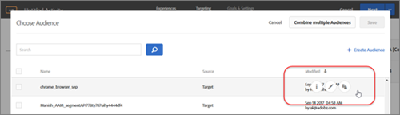
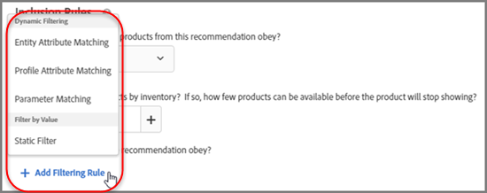

# 以前のリリースのリリースノート

[!DNL Target Standard/Premium]、[!DNL Target] プラットフォームおよび [!DNL Target] JavaScript ライブラリ（at.js）のリリースノートなど、以前の [!DNL Adobe Target] リリースのリリースノートです。

リリースノートは、リリースの年月に従って新しい順に整理されています。

>[!NOTE]
>
>今月の Target リリース（プラットフォームおよび Target Standard／Premium）について詳しくは、[Target のリリースノート（現行）](/help/main/r-release-notes/release-notes.md#reference_8FE40B43A5A34DDF8F26A53D55EE036A)を参照してください。

## リリースノート - 2022年

### [!DNL Target Standard/Premium] 22.4.1（2022年4月28日（PT））

このリリースには、次の修正が含まれています：

* 3 つの買い物かごベースのアルゴリズムによって [!DNL Target] バックエンドで同じ購入／購入条件が使用されていた問題を修正しました。（TGT-43456）
* [Business ID アカウント](https://helpx.adobe.com/enterprise/using/identity.html?lang=ja){target=_blank} およびポリシーベースの認証（PBA）で有効化された組織に対して [!DNL Target] UI トークンを有効にしました。（TGT-42590）

### [!DNL Target] プラットフォームリリース（2022年4月27日（PT））

このリリースには、次の修正が含まれています。

* このリリースでは、[!UICONTROL Automated Personalization]（AP）および[!UICONTROL 自動ターゲット]（AT）アクティビティ（以前は [!DNL Target] から返されていませんでした）用にコンテンツをプリフェッチできます。AP/AT アクティビティが配信パス上にあり、コンテンツ配信に同じ場所を使用する他の AB/XT アクティビティよりも優先度が高い場合、プリフェッチ呼び出し（「実行」フローに対する変更なし）ではエンドユーザーに表示されるエクスペリエンスが変更されます。

### [!DNL Target] プラットフォームリリース（3 月 31 日）

このリリースで強化された機能は次のとおりです。

* クリック追跡指標では、Analytics をレポートソースに使用し (A4T)、クライアント側でイベントを処理するアクティビティの Delivery API リクエストに Analytics ペイロードが含まれます。 （TNT-43073）

### [!DNL Target Standard] オーディエンスの更新（3 月 28 日）

このリリースには、次の更新が含まれています。

* 新しい [!UICONTROL オーディエンス] UI はすべての [!DNL Target Standard] 顧客。

### Target Standard/Premium の顧客エンジニアリングの修正（2022 年 3 月 23 日）

このメンテナンスリリースで強化された機能は次のとおりです。

* が返す機能を追加しました。 [!DNL Analytics] ペイロードデータ `prefetch` ビューと `pageLoad` 使用時のクリック指標 [!UICONTROL 配信 API] を使用するアクティビティで [!UICONTROL レポートソースとしての Analytics] (A4T)。 （TNT-43198）
* ボットフィルタリングのユーザーエージェントリストが更新され、日本で一般的に使用されるブラウザータイプを許可するようになりました。 （TNT-43867）

### Target Standard／Premium 22.2.1（2022年2月1日（PT）） 

このメンテナンスリリースには、今後 6 週間以内にすべての地域のお客様に公開される Target Standard／Premium 22.1.2 リリースでの提供が発表された新しい[!UICONTROL オーディエンス] UI に対する以下の修正および機能強化が含まれています。これらの修正により、 [!DNL Adobe Target Standard/Premium] で作成されたオーディエンスの機能が調整されます。

* [!DNL Adobe Experience Platform]、[!DNL Adobe Experience Cloud] および [!DNL Adobe Target Classic] からインポートしたオーディエンスをレポートオーディエンスとして割り当てることができない問題を修正しました。（TGT-43140）
* [!DNL Adobe Experience Platform]、[!DNL Adobe Experience Cloud] および [!DNL Adobe Target Classic] からインポートしたオーディエンスの[!UICONTROL オーディエンス]リストに「[!UICONTROL 削除]」オプションを追加しました。また、一括削除機能も追加しました。（TGT-42914）

### at.js バージョン 2.8.1（2022年1月28日（PT））

* [!UICONTROL オンデバイス判定]（ODD）ハイブリッド実行モードで `pageLoad` が target-global-mbox にマッピングされない問題を修正しました。
* mbox リクエストの分析の詳細に関する問題を修正しました。
* 開発用の依存コンポーネントをアップグレードして、セキュリティの脆弱性を修正しました。

### [!DNL Target Standard/Premium] 22.1.2（2022年1月26日（PT））

| 機能 | 詳細 |
| --- | --- |
| [!DNL Target] での [!DNL Adobe Experience Platform] オーディエンス | [!DNL Target] で [!DNL Adobe Experience Platform] オーディエンスを消費し使用できるようになりました。[!DNL Target] チーム、[!DNL Experience Platform] [!DNL Destinations] チームおよび [!DNL Unified Profile Service] チームから、「同一ページ ／次ページのパーソナライゼーション」ユースケースの一般公開についてお知らせします。<br>[!DNL Adobe Experience Platform] で作成されたオーディエンスを使用すると、よりインパクトのあるパーソナライゼーションにつながる豊富な顧客データが提供されます。[!DNL Adobe Experience Platform] 上に構築された [Real-time Customer Data Platform](https://experienceleague.adobe.com/docs/experience-platform/rtcdp/overview.html?lang=ja){target=_blank} (RTCP) は、企業が複数の企業ソースから既知および匿名のデータを集めて顧客プロファイルを作成するのに役立ちます。顧客プロファイルを使用すれば、パーソナライズされた顧客エクスペリエンスをすべてのチャネルとデバイスにわたってリアルタイムに提供できます。<br>詳しくは、*オーディエンスの作成*&#x200B;の [Adobe Experience Platform で作成されたオーディエンスの使用](/help/main/c-target/c-audiences/audiences.md#aep)を参照してください。<br>必ずアドビのブログを読み、ビデオをご覧ください（[[!DNL Adobe] announces Same Page Enhanced Personalization with [!DNL Adobe Target] and [!DNL Real-time Customer Data Platform]](https://blog.adobe.com/en/publish/2021/10/05/adobe-announces-same-page-enhanced-personalization-with-adobe-target-real-time-customer-data-platform){target=_blank}）。 |
| [!UICONTROL オーディエンス] UI の更新 | [!DNL Target] ユーザーのユーザーエクスペリエンスを向上させるための [!DNL Adobe Target] チームの継続的な取り組みの一環として、このリリースでは [!DNL Target] UI の[!UICONTROL オーディエンス]ページと[!UICONTROL プロファイルスクリプト]ページが更新されました。この更新では、以前は一貫性がなかったデザインパターンが統合および標準化されたほか、次のような新しい機能強化が追加されています。<ul><li>複数のオーディエンスを同時に選択および削除する機能</li><li>[オーディエンスビルダーのデザイン](/help/main/c-target/c-audiences/create-audience.md)の更新</li><li>[!UICONTROL オーディエンス]ライブラリルールビルダーでの除外ルールのサポート</li><li>新しい「オーディエンスソース」フィルターによるオーディエンス検出の迅速化</li><li>セッションの永続的な検索とフィルターオプション</li><li>[!DNL Target Premium] 顧客のワークスペース間でオーディエンスを移動する機能。</li></ul>詳しくは、[オーディエンス](/help/main/c-target/target.md)を参照してください。<br>**注意**：この機能は、今後 8 週間以内に様々な地域のお客様に公開される予定です。 |
| [!UICONTROL プロファイルスクリプト] UI の更新 | また、[!UICONTROL プロファイルスクリプト]ライブラリも更新され、更新されたインターフェイスのほか、生産性向上のための更新が含まれています。<ul><li>複数のプロファイルスクリプトを同時に選択および削除する機能</li><li>プロファイルスクリプトの新しいコードエディター</li><li>コードエディター内での構文のハイライト表示とエラーチェック</li><li>キーボードショートカットを使用したトークン（mbox またはプロファイル）パラメーターのオートコンプリート</li></ul>詳しくは、[訪問者プロファイル](/help/main/c-target/c-visitor-profile/visitor-profile.md)を参照してください。<br>**注意**：この機能は、今後 8 週間以内に様々な地域のお客様に公開される予定です。 |

### [!DNL Target Standard/Premium] 22.1.1（2022年1月12日（PT））

このリリースには、バグ修正と、将来の統合の前提条件となる機能が含まれています。

### Target プラットフォームリリース（2022 年 4 月 14 日）

このリリースには、次の更新が含まれています。

* プロファイルスクリプトを使用して取り込む際に、IP アドレスの最後のオクテットが適切に不明化される問題を修正しました。 （TNT-44076）

### [!DNL Target Standard/Premium] 22.3.1（2022 年 4 月 6 日）

このリリースには、次の変更および機能強化が含まれています。

* 次の問題を修正しました： [!UICONTROL 次を含む] および [!UICONTROL 除外] アクティビティの編集時に結合オーディエンスで無効にするオプション。 （TGT-43422）
* アクティビティの編集中に、一部のお客様が利用可能なオーディエンスのリストを表示できなかった問題を修正しました。 （TGT-43404）
* 一部のお客様が「[!UICONTROL 除外する IP [!DNL Target] レポートデータ]&quot;リスト [!UICONTROL 管理] > [!UICONTROL レポート]. （TGT-43384）
* オーディエンス条件で、任意の変数が「より大きい」、「より大きいか等しい」、「より小さい」または「より小さいか等しい」であることを確認できない負の数を使用する問題を修正しました。 （TGT-43367）
* 顧客が [!UICONTROL オーディエンスの詳細] カードを使用して結合オーディエンスを作成できます。 （TGT-43303）

### at.js バージョン 2.8.0（2022年1月7日（PT））

[!DNL Target] at.js JavaScript ライブラリは、機能の使用状況とパフォーマンスのテレメトリデータを収集するようになりました。個人データは収集されません。 この機能をオプトアウトするには、`targetGlobalSettings` で `telemetryEnabled` を false に設定します。詳しくは、[targetGlobalSettings の telemetryEnabled](/help/main/c-implementing-target/c-implementing-target-for-client-side-web/targetgobalsettings.md#telemetry) を参照してください。

## リリースノート - 2021年

### at.js バージョン 2.7.0（2021年10月28日（PT））

このリリースで強化された機能は次のとおりです。

* [Web コンポーネント](https://developer.mozilla.org/ja/docs/Web/Web_Components)のサポートを追加しました。このバージョンの at.js は、カスタム要素およびカスタム要素内の要素に対して、パーソナライズされたエクスペリエンスとオファーを作成し、テストするために必要です。この機能は、[!DNL Target Standard/Premium] 21.10.5 リリースに含まれています。

### [!DNL Target Standard/Premium] 21.10.5（2021年10月28日（PT））

このメンテナンスリリースで強化された機能は次のとおりです。

| 機能 | 詳細 |
| --- | --- |
| [!UICONTROL Visual Experience Composer]（VEC） | [Web コンポーネント](https://developer.mozilla.org/en-US/docs/Web/Web_Components)のサポートを追加しました。パーソナライズされたエクスペリエンスとオファーを、カスタム要素およびカスタム要素内の要素に対して作成し、テストできます。<br>詳しくは、「[Visual Experience Composer オプション](/help/main/c-experiences/c-visual-experience-composer/viztarget-options.md#custom)」を参照してください。 |

### [!DNL Target Standard/Premium] 21.10.4（2021年10月21日（PT））

このメンテナンスリリースで強化された機能は次のとおりです。

| 機能 | 詳細 |
| --- | --- |
| 買い物かごベースの推奨事項 | 訪問者の買い物かごの内容に基づいて推奨事項を提供する、新しいアルゴリズムファミリーが追加されました。<br>詳しくは、[条件の作成](/help/main/c-recommendations/c-algorithms/create-new-algorithm.md)の「買い物かごベース」、[計画とレコメンデーションの実装](/help/main/c-recommendations/plan-implement.md)の「買い物かごの追加／買い物かごの表示／チェックアウトページ」および「訪問者の買い物かごに既に存在する項目の除外」、[レコメンデーションキーに基づくレコメンデーションベース](/help/main/c-recommendations/c-algorithms/base-the-recommendation-on-a-recommendation-key.md)の「買い物かごベース」を参照してください。 |

### [!DNL Target Standard/Premium] 21.10.3（2021年10月19日（PT））

このメンテナンスリリースには、以下の機能強化、修正および変更が含まれています。

* [!DNL Target] アクティビティレポートで「[!UICONTROL Analytics で表示]」ボタンをクリックしても [!DNL Analysis Workspace] の [!UICONTROL A4T] パネルが開かない問題を修正しました。（TGT-42099、TGT-42100）
* [!UICONTROL フォームベースのエクスペリエンスコンポーザー]を使用して「[!UICONTROL A/B テスト]」および「[!UICONTROL エクスペリエンスのターゲット設定]（XT）」アクティビティを編集しているときに「[!UICONTROL デザインを編集]」ボタンが表示されない問題を修正しました。（TGT-41980）
* 新しい [!UICONTROL Recommendations] アクティビティの作成時に「[!UICONTROL 互換性]」チェックボックスが条件の選択に表示されない問題を修正しました。（TGT-42053）
* [!DNL Analytics] の権限がないので [!DNL Analytics] をレポートソース（A4T）として選択できない場合に表示される誤ったエラーメッセージを修正しました。（TGT-41954）
* アクセシビリティに関する複数の修正を実装して、[!DNL Target] UI 全体のキーボードナビゲーションを改善しました。

### [!DNL Target Standard/Premium] 21.10.2（2021年10月13日（PT））

[!DNL Target] [!UICONTROL オーディエンス]を [!DNL Adobe Experience Platform Web SDK] で使用する場合の次の機能拡張が追加されました。

* オーディエンスがソースで削除され [!DNL Target] アクティビティで使用できなくなったことを示す警告アイコン、ポップオーバーおよびメッセージが、[!DNL Target] UI の様々な場所に追加されました。

   次の図は、アイコン、ポップオーバーおよびメッセージの表示場所をいくつか示しています。

   * [!UICONTROL アクティビティ]リストページ

      

   * アクティビティ[!UICONTROL 概要]ページ：

      

   * アクティビティ作成ワークフローの[!UICONTROL エクスペリエンス]ステップ：

      ![ソースメッセージで削除されたオーディエンスに関する警告の表示（[!UICONTROL エクスペリエンス]ページ）](assets/deleted-at-source-experiences.png)

   * アクティビティ作成ワークフローの[!UICONTROL ターゲティング]ステップ：

      ![ソースメッセージで削除されたオーディエンスに関する警告の表示（[!UICONTROL ターゲティング]ページ）](assets/deleted-at-source-targeting.png)

   * アクティビティ作成ワークフローの[!UICONTROL 目標と設定]ステップ：

      ![ソースメッセージで削除されたオーディエンスに関する警告の表示（[!UICONTROL 目標と設定]ページ）](assets/deleted-at-source-goals-settings.png)

   * オーディエンスの絞り込み（アクティビティ作成ワークフローの[!UICONTROL ターゲティング]ステップの「[!UICONTROL オーディエンスを置換]」）：

* オーディエンスの結合機能を使用しようとしたときに、一方のオーディエンスがソースで削除されていた場合は、「[!UICONTROL 保存]」が無効になります。

### [!DNL Target Standard/Premium] 21.10.1（2021年10月6日（PT））

このリリースには、次の新機能が含まれています。

| 機能 | 詳細 |
| --- | --- |
| [!UICONTROL オーディエンス] UI の更新 | [!DNL Target] ユーザーのユーザーエクスペリエンスを向上させるための [!DNL Adobe Target] チームの継続的な取り組みの一環として、このリリースでは [!DNL Target] UI の[!UICONTROL オーディエンス]ページと[!UICONTROL プロファイルスクリプト]ページが更新されました。この更新では、以前は一貫性がなかったデザインパターンが統合および標準化されたほか、次のような新しい機能強化が追加されています。<ul><li>複数のオーディエンスを同時に選択および削除する機能</li><li>[オーディエンスビルダーのデザイン](/help/main/c-target/c-audiences/create-audience.md)の更新</li><li>[!UICONTROL オーディエンス]ライブラリルールビルダーでの除外ルールのサポート</li><li>新しい「オーディエンスソース」フィルターによるオーディエンス検出の迅速化</li><li>セッションの永続的な検索とフィルターオプション</li></ul>詳しくは、[オーディエンス](/help/main/c-target/target.md)を参照してください。 |
| [!UICONTROL プロファイルスクリプト] UI の更新 | また、[!UICONTROL プロファイルスクリプト]ライブラリも更新され、更新されたインターフェイスのほか、生産性向上のための更新が含まれています。<ul><li>複数のプロファイルスクリプトを同時に選択および削除する機能</li><li>プロファイルスクリプトの新しいコードエディター</li><li>コードエディター内での構文のハイライト表示とエラーチェック</li><li>キーボードショートカットを使用したトークン（mbox またはプロファイル）パラメーターのオートコンプリート</li></ul>詳しくは、[訪問者プロファイル](/help/main/c-target/c-visitor-profile/visitor-profile.md)を参照してください。 |
|  Recommendations 条件の作成と編集 | [!UICONTROL Recommendations 条件]の作成と編集のワークフローが効率化され、目標を達成するための適切なレコメンデーションアルゴリズムと設定の選択が容易になりました。<br>詳しくは、[条件の作成](/help/main/c-recommendations/c-algorithms/create-new-algorithm.md)を参照してください。 |
|  Recommendations のルックバックウィンドウとアルゴリズム更新頻度の改善 | 6 時間のルックバックウィンドウで「最も多く閲覧」アルゴリズムや「トップセラー」アルゴリズムを実行することで、直近のトレンドとなっているコンテンツをキャプチャできるようになりました。6 時間のルックバックウィンドウを選択すると、レコメンデーション結果は 1 日で 3〜6 時間ごとに更新されます。<br>詳しくは、*条件の作成*&#x200B;の[データソース](/help/main/c-recommendations/c-algorithms/create-new-algorithm.md#data-source)を参照してください。 |

### [!DNL Target Standard/Premium] 21.9.1（2021年9月14日（PT））

このメンテナンスリリースには、以下の機能強化、修正および変更が含まれています。

* 一部の web ブラウザーで、サードパーティ Cookie のセキュリティポリシーが新しくなったため、ユーザーが [!UICONTROL Visual Experience Composer]（VEC）にログインできなかった問題を修正しました。この問題は、[Visual Experience Composer と拡張 Experience Composer に関連する問題のトラブルシューティング](/help/main/c-experiences/c-visual-experience-composer/r-troubleshoot-composer/issues-related-to-the-visual-experience-composer-vec-and-enhanced-experience-composer-eec.md)の「Google Chrome バージョン 80 以降を使用している場合に、Visual Experience Composer（VEC）または拡張 Experience Composer（EEC）でページが読み込まれない」で説明されました。
* VEC のオファー名に、オファーのわかりやすい名前ではなくオファーのパスが表示される問題を修正しました。 （TGT-41300）
* エクスペリエンス名が A4T アクティビティの [!DNL Analysis Workspace] に反映されるようになりました (TGT-38674)
* [!DNL Recommendations] で、複製されたアクティビティのプロモーションで変更されたエンティティ ID が元のアクティビティに誤って適用される問題を修正しました。 （TGT-41482）
* VEC の [!DNL Recommendations] アクティビティの[!UICONTROL エクスペリエンス]ページに「条件を編集」ボタンが正しく表示されない問題を修正しました。（TGT-39512）
* 複製してテストワークスペースにコピーした場合に、アクティビティを同期できない問題を修正しました。（TGT-40686）
* VEC で「[!UICONTROL 後ろに挿入]」を使用する際に、[エクスペリエンスフラグメント](/help/main/c-experiences/c-manage-content/aem-experience-fragments.md)でセレクターを変更できない問題を修正しました。（TGT-41802）
* オファー内の空の JSON コンテンツがバックエンドに送信されない問題を修正しました。[!DNL Target] は、空の場合でも JSON オブジェクトを送信するようになりました。（TGT-41555）
* レポートの表示中に「[!UICONTROL Analytics で表示 ]」をクリックすると、[!DNL Analysis Workspace] ではなく、従来の [!DNL Analytics] レポートが開く問題を修正しました。（TGT-41867）
* 顧客が [!UICONTROL Automated Personalization] アクティビティのレポートソース（A4T）として [!DNL Analytics] を選択しようとした場合に表示される UI メッセージに明確な説明を追加しました。 メッセージには、「[!DNL Target] は [!UICONTROL Automated Personalization] アクティビティでサポートされている唯一のソースです」と記載されています。（TGT-41954）
* ユーザーがホストをコンマではなく「改行」で区切ろうとした場合のエラーメッセージに明確な説明を追加しました。（TGT-40671）
* 一部のアクティビティの「[!UICONTROL 最終更新日]」の日付が、スペイン語および日本語のユーザーの場合（UI をスペイン語および日本語で表示する場合）に英語の UI と異なる問題を修正しました。（TGT-38980）

### at.js 2.6.1（2021 年 8 月 16 日）

* オンデバイス判定を使用する際の「ハイブリッドモードでキャッシュされたアーティファクトがない」バグを修正しました。

### [!DNL Target] node.js SDK 2.2.0（2021 年 8 月 11 日）

* SDK テレメトリデータ収集を追加
* 配信 API クライアント openapi codegen を自動化

このリリースおよび以前のリリースについて詳しくは、Github の [Target node.js SDK ドキュメント](https://github.com/adobe/target-nodejs-sdk)の[変更ログ](https://github.com/adobe/target-nodejs-sdk/blob/main/CHANGELOG.md)を参照してください。

### [!DNL Target Standard/Premium] 21.8.1（2021年8月10日（PT））

このメンテナンスリリースには、次の顧客向けの変更を含む、多くのバックエンドの機能強化が含まれています。

* [!UICONTROL フォームベースの Experience Composer ]で作成された[!UICONTROL 自動パーソナライズ機能]アクティビティのレポートで、削除されたオファーが参照される問題を修正しました。この問題により、次のエラーメッセージが表示されました。「このレポートのデータの取得に問題があります。問題が解決しない場合は、アドビのカスタマーケアにお問い合わせください。」 （TGT-41028）

### ターゲット配信 API（2021 年 8 月 3 日）

このリリースには、次の機能拡張が含まれています。

* mbox パラメーターの上限が 100 パラメーターに増えました。以前の上限は 50 パラメーターでした。（TNT-41717）
* `categoryId` の制限が 256 文字に増えました。 以前の上限は 128 文字でした。
* 配信 API に次の [!DNL Adobe Audience Manager]（AAM）の詳細が追加されました。

   * AAM UUID：ユーザーを一意に識別するために使用される内部 AAM ID。
   * dataPartnerId：データパートナーの ID。
   * dataPartnerUserId：データパートナーから提供されたユーザー ID。

   以前は、配信 API には `dcsLocationHint` と `blob` のみが含まれていました。 （TNT-41644）

### [!DNL Target Standard/Premium] 21.6.1（2021 年 6 月 30 日）

このリリースには、次の新機能および機能強化が含まれています。 括弧内の問題番号は [!DNL Adobe] 内部で使用されます。

| 機能 | 詳細 |
| --- | --- |
| [!UICONTROL Analytics for Target]（A4T） | [!DNL Analytics] をレポートソースとして使用するアクティビティ（A4T）から、[!UICONTROL レポート]ページの「[!UICONTROL Analytics で表示]」リンクをクリックすると、[!DNL Analysis Workspace] が開くようになりました。以前は、このリンクをクリックすると、[!DNL Analytics] レポートが開きました。 （TGT-36959） |

### Python SDK 1.0.0（2021年6月16日）

デバイス上の判定機能を備えた新しい [!DNL Adobe Target] Python SDK が利用可能になりました。今回の最新の追加により、サーバー側 SDK の [!DNL Target] スイートが強化されます。これらの SDK は、選択した言語で [!DNL Target] と統合し、価値を生み出すまでの時間を短縮するのに役立ちます。サーバー側の統合は、市場がファーストパーティのデータが価値のある cookie のない世界に移行していることから、人気のある選択肢になりつつあります。Target SDK は、市場で最も人気のあるプログラミング言語（Python、Java、JavaScript、C#/.Net）で利用できます。

詳しくは、[Adobe Target SDK ガイド](https://adobetarget-sdks.gitbook.io/docs/)の [Python SDK ドキュメント](https://adobetarget-sdks.gitbook.io/docs/sdk-reference-guides/python-sdk)を参照してください。

### Target Standard／Premium 21.5.1（2021 年 6 月 7 日）

このリリースで強化された機能は次のとおりです。

| 機能 | 詳細 |
| --- | --- |
|  [!DNL Recommendations] [!UICONTROL カタログ検索] API | API を使用して [!DNL Recommendations] 製品およびコンテンツカタログをプログラムで検索し、検索条件に一致する項目を特定して、カタログの管理を簡略化します。<br>**制限事項と注意事項**：<ul><li>API を使用したカタログ検索は、項目が 200 万を超える環境ではサポートされていません。</li><li>API を使用したカタログ検索結果は、[!DNL Target] UI を使用したカタログ検索結果よりも迅速に更新されます。[!DNL Target] UI でのカタログ検索は、最新の結果が反映されるまでさらに時間がかかる場合があります。</li></ul>詳しくは、*[!DNL Adobe Target][!DNL Recommendations] API* ガイドの[エンティティ検索](https://developers.adobetarget.com/api/recommendations/#tag/Searching-Entities)を参照してください。 |

このリリースのメンテナンスリリースには、次の修正が含まれています。

* [!UICONTROL Audiences] ページを更新すると、デフォルトのワークスペースが別のワークスペースに変更される問題を修正しました。（TGT-38871）
* [!UICONTROL 管理]／[!UICONTROL 実装]で、「グローバル mbox が同期していない可能性があります。再保存してみてください。」というエラーメッセージが表示されることがある問題を修正しました。

###  [!DNL Adobe Experience Platform Web SDK]バージョン 2.5.0（2021 年 6 月 1 日）

このリリースの [!DNL Platform Web SDK] には、次のサポートが含まれています。

| 機能 | 詳細 |
| --- | --- |
| [!UICONTROL Analytics for Target]（A4T）でのリダイレクトのサポート | [A4T](/help/main/c-integrating-target-with-mac/a4t/a4t.md) を使用する場合、Platform Web SDK で [!DNL Target] リダイレクトがサポートされるようになりました。<br>詳しくは、[Analytics for  [!DNL Target] の実装](/help/main/c-integrating-target-with-mac/a4t/a4timplementation.md)を参照してください。 |

### at.js バージョン 2.5.0（2021 年 5 月 13 日）

at.js のこのリリースには、次の機能強化および変更が含まれています。

* at.js の[オンデバイス判定](/help/main/c-implementing-target/c-implementing-target-for-client-side-web/on-device-decisioning/on-device-decisioning.md)のサポート。
* Automated Personalization アクティビティでの[プレビューリンク](/help/main/c-activities/c-activity-qa/activity-qa.md)のサポート

このリリースでは、Microsoft Internet Explorer 10、Internet Explorer 11、およびすべての旧バージョンのサポートが終了します。Microsoft Edge は、at.js 2.5.0 以降で引き続きサポートされます。

### Target Standard／Premium 21.4.1（2021 年 4 月 19 日）

このリリースには、次の新機能および機能強化が含まれています。 括弧内の問題番号は [!DNL Adobe] 内部で使用されます。

| 機能 | 詳細 |
| --- | --- |
| at.js のオンデバイス判定のサポート<br>（日付は後日発表） | オンデバイス判定機能を使用すると、マーケターと開発者は、ほぼゼロの待ち時間でユーザーのブラウザー上で実験とパーソナライズを行うことができます。<br>詳しくは、[at.js のオンデバイス判定](/help/main/c-implementing-target/c-implementing-target-for-client-side-web/on-device-decisioning/on-device-decisioning.md)を参照してください。 |
|  エンティティフィルタリングルール用のリストベースの演算子 | [!DNL Target Recommendations] では、エンティティフィルタリングルールでリストベースの新しい演算子をサポートしています。 （TGT-39234）<br>新たに追加された演算子は次のとおりです。<br><ul><li>リストに含まれる</li><li>リストに含まれない</li><li>リストに項目が含まれる</li><li>リストに項目が含まれない</li><li>リストにすべての項目が含まれる</li><li>リストにすべての項目が含まれているわけではない</li></ul>詳しくは、[動的および静的包含ルールの使用](/help/main/c-recommendations/c-algorithms/use-dynamic-and-static-inclusion-rules.md#operators)の「使用可能な演算子」を参照してください。 |

このリリースには、次の修正が含まれています。

* オーディエンスを[!UICONTROL すべての訪問者]に変更した後でアクティビティを同期できない問題を修正しました。 （TGT-40259）
* 「[!UICONTROL 重複を許可しない]」オプションが有効になっている場合でも、[!UICONTROL Automated Personalization] アクティビティの異なる場所で使用するとオファーを複製できない問題を修正しました。 （TGT-39567）
* [!UICONTROL 管理]／[!UICONTROL Scene7 設定]ページが正しく読み込まれない問題を修正しました。 （TGT-39918）
* プロパティが誤ったワークスペースにマッピングされる問題を修正しました。 （TGT-39869）
* レコメンデーションの除外を作成中に環境を変更した後にリクエストが失敗した場合、無限の読み込みが発生する問題を修正しました。 （TGT-39948）

### at.js 2.4.1（2021 年 3 月 23 日）

at.js のこのリリースはメンテナンスリリースで、次の機能強化および修正が含まれています。

* mbox リクエストに `targetPageParams` が含まれる問題を修正しました。 `targetPageParams` は `pageLoad` リクエストにのみ含まれる必要があります。 （TNT-40247）
* Platform Launch グローバルオブジェクトの依存関係を直接参照に置き換えることにより、[!DNL Adobe Experience Platform Launch] 拡張機能のドキュメントとウィンドウグローバルオブジェクトに関する問題を修正しました。 （TNT-37124）

### Recommendations フィード処理サーバーの IP アドレスの変更（2021 年 3 月 16 日）

[!DNL Target Recommendations] フィード処理サーバーの IP アドレスが 2021 年 3 月 16 日に更新されました。 詳しくは、[Recommendations フィード処理サーバーで使用される IP アドレス](/help/main/c-recommendations/c-recommendations-faq/ip-addresses-marketing-cloud.md)を参照してください。

### Target Standard／Premium 21.2.1（2021 年 3 月 9 日）

このメンテナンスリリースには、以下の機能強化、修正および変更が含まれています。

括弧内の問題番号は [!DNL Adobe] 内部で使用されます。

* 許可されるオファーサイズが増加しました。(TGT-38304)

   | タイプ | 以前の制限 | 新しい制限 |
   | --- | --- | --- |
   | HTML | 256 KB | 1024 KB |
   | Target UI からの視覚的なオファー | 64 KB | 各エクスペリエンスに1024 KB |
   | API 経由 | 512 KB | 1024 KB |

* [!UICONTROL 自動ターゲット]（AT）および [!UICONTROL Automated Personalization]（AP）アクティビティ用の[!UICONTROL パーソナライゼーションインサイト]レポートが毎日作成されるようになりました。過去 15、30 および 60 日間の[!UICONTROL 自動セグメント]または[!UICONTROL 重要な属性]を提供するレポートを選択できます。45 日と 90 日のオプションが削除され、その他のルックバックウィンドウ設定を毎日実行できるようになりました。（TGT-39472）
* アクティビティの[!UICONTROL 目標と設定]ページで顧客が「[!UICONTROL 依存関係を編集]」をクリックしても、現在の依存関係が表示されない問題を修正しました。（TGT-39340）
* ワークスペースの[!UICONTROL オーディエンスライブラリ]を更新する際の問題を修正しました。更新の前は、現在選択されているワークスペースのオーディエンスが表示されていました。更新後、[!UICONTROL デフォルトワークスペース]とそのオーディエンスが表示されます。現在のワークスペースとそのオーディエンスは、更新後も保持されるようになりました。（TGT-38871）
* [!UICONTROL Recommendations] アクティビティをコピーしてから、後で条件シーケンスを変更して元のアクティビティを編集すると発生していた問題を修正しました。元のアクティビティで条件シーケンスを変更すると、コピーされたアクティビティに誤って適用されていました。（TGT-39155）
* [!UICONTROL Recommendations] の除外で間違った製品数が表示される問題を修正しました。（TGT-39599）

### Target Standard／Premium 21.1.1（2021 年 1 月 19 日）

このメンテナンスリリースには、以下の機能強化、修正および変更が含まれています。

括弧内の問題番号は [!DNL Adobe] 内部で使用されます。

* [!UICONTROL 自動ターゲット]アクティビティーで [!UICONTROL Analytics をレポートソースとして使用]（A4T）使用する場合、[!DNL Adobe Analytics] 指標の選択時に表示される警告を追加しました。[!UICONTROL 自動ターゲット]モデルは、バイナリ（コンバージョンベース）の指標を扱うように最適化されています。売上高などの連続した指標を選択すると、最適でない結果が生じる可能性があり、[!UICONTROL パーソナライゼーションインサイト]レポートが不正確になる場合があります。（TGT-38926）
* A4T を使用する[!UICONTROL 自動ターゲット]アクティビティの[!UICONTROL 自動ターゲットの概要]レポートにステータスアイコンを追加しました。レポートの各エクスペリエンスの横にある緑のチェックアイコンは、対象のエクスペリエンス用にパーソナライズされた機械学習モデルが作成されたことを意味します。時計アイコンは、トラフィックの量が不十分でモデルがまだ作成されていないことを意味します。（TGT-38925）
* [!UICONTROL 自動セグメント]および[!UICONTROL 重要な属性]レポートは、A4T および[!DNL Analytics]コンバージョン指標を使用する[!UICONTROL 自動ターゲット]アクティビティ用に生成され、レポートソースとして[!DNL Target]を使用した場合と同じように見えます。（TGT-38931）
* [!UICONTROL Recommendations] [!UICONTROL コレクション]リストに環境フィルターオプションを追加しました。（TGT-38353）
* [!UICONTROL Recommendations] コレクションに間違った製品数が表示される問題を修正しました。（TGT-39162）
* [!UICONTROL 最終更新日]フィルターを [!UICONTROL Recommendations] [!UICONTROL カタログ検索]に追加しました。（TGT-38340）
* [!UICONTROL Recommendations]で、業種を変更すると[!UICONTROL シーケンスを作成]ページがハングする問題を修正しました。（TGT-38160）
* [!UICONTROL Automated Personalization]（AP）アクティビティーのオファーからオーディエンスを削除できない問題を修正しました。（TGT-39058）
* 一部の顧客の[!UICONTROL オーディエンス情報]カードに間違った時間枠（開始日と終了日）が表示される問題を修正しました。（TGT-39150）
* 一部の顧客が、[!UICONTROL デフォルトワークスペース]でアクティビティのリストを表示できない問題を修正しました。（TGT-38526）

### at.js 2.4.0（2021 年 1 月 14 日）

at.js のこのリリースはメンテナンスリリースで、次の修正が含まれています。

* 統合プロファイル／プラットフォーム ID のサポートを配信 API の customerId に追加しました。
* 無効なスタイルタグ挿入を修正します。

## リリースノート - 2020 年

### Target Standard／Premium 20.10.1（2020 年 10 月 27 日）

このリリースには、次の新機能が含まれています。

| 機能 | 詳細 |
| --- | --- |
| [オンデバイス判定](https://adobetarget-sdks.gitbook.io/docs/on-device-decisioning/introduction-to-on-device-decisioning) | オンデバイス判定機能を使用すると、マーケターと製品開発者は、実験と機械学習に基づくパーソナライゼーションを、ユーザーのデバイス内から、チャネルをまたいで、ほぼゼロ遅延で提供することができます。<br>顧客インサイトとユーザーの満足度においては、スピードとパフォーマンスが重要です。<br>オンデバイス判定を使用すると、A/B テストやエクスペリエンスのターゲット設定（XT）アクティビティタイプで主要なパーソナライゼーションおよび実験の手順をコンパイルし、CDN 経由で顧客のデバイスに読み込まれる「optimization artifacts:」 JSON オブジェクトを生成できます。また、オンデバイス判定は [!DNL Adobe Experience Cloud] 製品とネイティブに接続されているので、[!DNL Target] ユーザーは迅速に分析を入手でき、エクスペリエンスの繰り返しを短期間でおこなうことができます。<br>詳しくは、*[オンデバイス判定](/help/main/c-implementing-target/c-api-and-sdk-overview/on-device-decisioning.md)を参照してください。 |

このリリースには、以下の機能強化、修正および変更が含まれています。

* [!UICONTROL 平均上昇率の信頼区間]と[!UICONTROL 信頼性]が[!DNL Auto-Target]レポートの[!UICONTROL 合計]行に表示されない問題を修正しました。測定値は、すべてのエクスペリエンスで正しく表示されていました。（TGT-37301）
* 9 月 15 日午後 2 時 30 分から 10 月 6 日午前 9:25（太平洋標準時）の間、[!DNL Adobe Target Premium] ユーザーの[!UICONTROL 自動ターゲット]レポートに影響していた問題を修正しました。影響を受けたコンバージョン指標のレポート（「[!UICONTROL ページを閲覧]」または「[!UICONTROL mbox をクリック]」オプションを使用して設定）を表示すると、コンバージョン率が誤ってレポートされます。現時点では、配信に関する既知の問題はありません。レポートの再同期および修正方法について詳しくは、*既知の問題と解決された問題*&#x200B;の&#x200B;*解決された問題*&#x200B;の[自動ターゲットレポート](/help/main/r-release-notes/known-issues-resolved-issues.md#at-metrics)を参照してください。
* [!UICONTROL カタログ検索]テーブルの選択可能な「[!UICONTROL 最終更新日]」列と「[!UICONTROL 最終更新日]」フィルターが追加されました。この機能強化により、個々の項目を開いて最終更新日を確認する必要がなくなり、項目が最後に更新された日時でフィルタリングできるため、時間と労力を節約できます。

   

* Target UI が [Web コンテンツアクセシビリティガイドライン](https://www.w3.org/WAI/standards-guidelines/wcag/) 2.0 レベル A および AA 成功基準（WCAG 2.0 AA）に準拠するように更新されました。（TGT-34384 および TGT-24679）
* コンテンツセキュリティポリシー（CSP）の機能が強化されました。（TGT-37035）
* CNAME を使用する顧客向けにパラメーターとしてクライアントコードを指定する方法が導入されました。（TNT-38571）
* [!DNL Adobe Experience Cloud] ドキュメントは [!DNL Experience League] に移動しました。10 月中に、すべてのリリースノート、記事、ビデオおよびチュートリアルが現在の場所（`docs.adobe.com`）から [!DNL Experience League] に移動します。この移行により、すべての学習、セルフヘルプ、イネーブルメント、コミュニティのコンテンツが 1 か所で提供されるようになります。この変更が発生した場合は、すべてのリンクが [!DNL Experience League] にリダイレクトされるので、必要な作業はありません。カットオーバーが始まったら、リリースノートを更新します。

### Target Standard/Premium 20.9.1（2020 年 9 月 30 日）

このメンテナンスリリースには、以下の機能強化、修正および変更が含まれています。

* キーボードのみのユーザーのナビゲーションと機能を改善しました。（TGT-34487、TGT-34516、TGT-34517、TGT-34514）
* 支援テクノロジーを使用するユーザーをサポートするため、UI にラベルを追加しました。（TGT-34500、TGT-34501、TGT-34502、TGT-24504）
* UI の画像とテキストのテキストとカラーコントラストを向上しました。（TGT-34513）

### Target Standard/Premium 20.8.3（2020 年 9 月 15 日）

| 機能 | 詳細 |
| --- | --- |
| 自動ターゲットアクティビティに対する Analytics for Target（A4T）のサポート | [!UICONTROL 自動ターゲット]アクティビティで、[Analytics for Target](/help/main/c-integrating-target-with-mac/a4t/a4t.md)がサポートされるようになりました。<br>この統合により、 [!UICONTROL 自動ターゲット]の機械学習アルゴリズムを使用して、プロファイル、動作、およびコンテキストに基づいて、各訪問者に最高のエクスペリエンスを選択できます。<br>A/B テストおよびエクスペリエンスのターゲティングアクティビティで使用するよう、既に [A4T を実装](/help/main/c-integrating-target-with-mac/a4t/a4timplementation.md)している場合は、これで完了です。<br>詳しくは、[自動配分と自動ターゲットアクティビティに対する A4T のサポート](/help/main/c-integrating-target-with-mac/a4t/a4t-at-aa.md)を参照してください。 |

### Target Standard/Premium 20.8.2（2020 年 9 月 10 日）

| 機能 | 詳細 |
| --- | --- |
| 条件のシーケンス内のコントロール Recommendations スロット | 条件シーケンスを使用して、各 Recommendations 条件で使用されるスロット数を制御できるようになりました。異なるタイプの項目や異なるアルゴリズムロジックを組み合わせて一致させることができます。<br>詳しくは、[条件シーケンスを作成する](/help/main/c-recommendations/c-algorithms/create-criteria-sequence.md#sequence)を参照してください。 |

### Target Standard/Premium 20.8.1（2020 年 9 月 2 日）

このリリースには、以下の機能強化、修正および変更が含まれています。

* 組織を切り替えた後に新しい[!UICONTROL 管理]ページを読み込むとエラーが表示される問題を修正しました。（TGT-37730）
* [!UICONTROL 管理／実装]ページに間違ったクライアントコードが表示される問題を修正しました。（TGT-37849）
* VEC の読み込みが成功した後、[!UICONTROL Visual Experience Composer]（VEC）の編集機能が使用できないことがある問題を修正しました。（TGT-37162）
* VEC Helper 拡張機能がインストールされている場合でも、VEC および拡張 Experience Composer（EEC）でページを読み込めない問題を修正しました。これは、Google Chrome 80 以降での変更が原因でした。[更新された VEC Helper 拡張機能](/help/main/c-experiences/c-visual-experience-composer/r-troubleshoot-composer/issues-related-to-the-visual-experience-composer-vec-and-enhanced-experience-composer-eec.md)をダウンロードします。（TGT-37893）
* 組織を切り替えた後、ユーザーが[!UICONTROL 管理／実装]ページから at.js をダウンロードできない場合がある問題を修正しました。（TGT-37668）
* ユーザーがダウンロードボタンを複数回クリックした場合でも [!DNL Target] が複数のリクエストを送信しないように、読み込み中は at.js のダウンロードボタンが無効化されるようになりました。（TGT-37633）
* [!UICONTROL エクスペリエンスのターゲット設定]（XT）アクティビティで、長期間エクスペリエンスに「結果を取得中」と表示される問題を修正しました。（TGT-37684）
* キーボードのみのユーザーのナビゲーションと機能を改善しました。（TGT-34479 および TGT-34473）
* 支援テクノロジーを使用するユーザーをサポートするため、UI にラベルを追加しました。（TGT-34480）
* アクティビティで現在使用されているモバイルビューポートを削除する際のエラーメッセージを改善しました。次のようなエラーメッセージが表示されます。「このビューポートは現在、1 つまたは複数のアクティビティに関連付けられています。ビューポートを削除する前に、これらのアクティビティからビューポートを削除する必要があります。」（TGT-37030）
* VEC でのサポートが追加され、ページ内の複数の要素に一致する css セレクターのクリック追跡が可能になりました。（TGT-37323）
* 特定のユーザーが[!UICONTROL アクティビティ]リストを表示できない問題を修正しました。次のエラーメッセージが表示されていました：「URL の提案を取得できません。」Adobe バックエンドシステムの FirstName（FirstName/r/n）でキャリッジリターンを使用しているユーザーにエラーが発生していました。（TGT-37330）
* ワークスペース名（[!UICONTROL エンタープライズ版 Adobe Admin Console] で指定）にアポストロフィが含まれる場合に、[!UICONTROL アクティビティ]ページが表示されない問題を修正しました。（TGT-37709）
* 最適化指標とコンバージョン指標の選択中に[!UICONTROL 自動配分]アクティビティで、レポートスイートが既に指定されている場合であっても、エラーメッセージが誤ってレポートスイートを選択するようにユーザーに通知していた問題を修正しました。（TGT-37689）
* [!UICONTROL ターゲティング]ページに移動してから戻った後、[!UICONTROL 目標]ページの指標が空白になることがある問題を修正しました。（TGT-37691）
* [!DNL Recommendations] 条件で最終変更値が間違って表示される問題を修正しました。（TGT-37666）
* mbox ドロップダウンリストに mbox 名ではなく mbox ID が表示される問題を修正しました。（TGT-37739）

### at.js 2.3.2（2020 年 7 月 24 日）

at.js のこのリリースはメンテナンスリリースで、次の修正が含まれています。

* スクリプトやコードが、ウィンドウまたはドキュメントにデフォルトのプロパティを追加した場合に発生するバグを修正しました。

### Target Standard／Premium 20.7.1（2020 年 7 月 27 日）

このリリースには、次のような変更が含まれています。

#### [!UICONTROL 管理] セクションの UI の更新

パフォーマンスの向上、新機能のリリース時に必要なメンテナンス時間を短縮、製品全体でのユーザーエクスペリエンスを改善できるよう、新しいテクニカルスタックを使用して [!DNL Target] UI 全体を徐々に書き換えました。最初に更新されたセクションは[!UICONTROL セットアップ]セクションで、[!UICONTROL 管理]という名前に変更されました。

この更新の一環として、[!UICONTROL 管理]セクションのページを使用して、次のように多くの操作を簡単に実行できるようになります。

* 「[!UICONTROL 実装]」タブ（**[!UICONTROL 管理]**／**[!UICONTROL 実装]**）から最新の at.js ファイルをダウンロードします。
* at.js の設定をカスタマイズし、変更を簡単に確認できるようにします（**[!UICONTROL 管理]**／**[!UICONTROL 実装]**）。
* デフォルトの通貨やタイムゾーン、iP などの拡張機能設定を変更し、レポートなどを除外できるようにしました。（**[!UICONTROL 管理]**／**[!UICONTROL レポート]**）
* プライバシー上の理由で訪問者の IP アドレスを難読化（**[!UICONTROL 管理]**／**[!UICONTROL 実装]**）
* Adobe Admin Console（**[!UICONTROL 管理]**／**[!UICONTROL ユーザー]**）で管理する前に、ワークスペースごとのユーザーとその役割の既存のリストを表示します。
* [!UICONTROL 「管理」]セクションのすべてのテーブルを検索およびフィルタリングします。

詳しくは、[Target の管理の概要](/help/main/administrating-target/administrating-target.md)を参照してください。

#### 機能強化、修正および変更

このリリースには、以下の機能強化、修正および変更が含まれています。

* 更新後にサイトの環境設定が保持されない問題を修正しました。（TGT-37239）
* Scalable Vector Graphics（SVG）画像で[!UICONTROL 次の後に挿入]／ [!UICONTROL 画像]が正しく動作しない問題を修正しました。（TGT-37242）
* [!UICONTROL 発行者]の役割を持つユーザーがドラフトアクティビティを削除できない問題を修正しました。（TGT-37358）
* 「[!UICONTROL すべてのマイワークスペース]」が選択されている場合にアクティビティを編集できない問題を修正しました。（TGT-37276）

### Target Standard／Premium 20.5.1（2020 年 6 月 17 日）

| 機能／拡張機能 | 説明 |
| --- | --- |
| Analytics for Target（A4T）[!UICONTROL 自動配分]アクティビティのサポート | [!UICONTROL 自動割り当て]アクティビティで、[Analytics for Target](/help/main/c-integrating-target-with-mac/a4t/a4t.md) がサポートされるようになりました。<br>この統合により、 [!UICONTROL 自動割り当て]マルチアームバンディット機能を使用して勝者エクスペリエンスへとトラフィックを促しながら、 [!UICONTROL Adobe Analytics] の目標指標や [!UICONTROL Adobe Analytics] のレポートおよび分析機能を使用できるようになります。<br>A/B テストおよびエクスペリエンスのターゲティングアクティビティで使用するよう、既に [A4T を実装](/help/main/c-integrating-target-with-mac/a4t/a4timplementation.md)している場合は、これで完了です。<br>詳しくは、[自動配分と自動ターゲットアクティビティに対する A4T のサポート](/help/main/c-integrating-target-with-mac/a4t/a4t-at-aa.md)を参照してください。 |
| 自動ターゲットおよび Automated Personalization アクティビティのトラフィック配分方法の応答トークン | [!UICONTROL 自動ターゲット]と[!UICONTROL Automated Personalization] のアクティビティに 2 つの[応答トークン](/help/main/administrating-target/response-tokens.md)が追加され、訪問者が特定のエクスペリエンスを「コントロール」トラフィックと「ターゲット」トラフィックのどちらに割り当てられたか結果によって受け取ったかを判断できるようになりました。<ul><li>`experience.trafficAllocationId` は、訪問者が「コントロール」トラフィックからエクスペリエンスを受け取った場合は 0 を、訪問者が「ターゲット」トラフィック分配からエクスペリエンスを受け取った場合は 1 を返します。</li><li>`experience.trafficAllocationType` は、「control」または「targeted」を返します。</li></ul>コントロールトラフィックとターゲットトラフィックの比較について詳しくは、[Automated Personalization または自動ターゲットアクティビティのコントロールを選択](/help/main/c-activities/t-automated-personalization/experience-as-control.md)を参照してください。 |
| [!UICONTROL 発行者]の役割 | この新しい役割は、現在の[!UICONTROL オブザーバー]の役割に似ています（アクティビティを閲覧できますが、作成または編集はできません）。ただし、[!UICONTROL 発行者]の役割には、アクティビティをアクティブ化する追加の権限があります。<br>詳しくは、次を参照してください。 <ul><li>**Target Standard ユーザー**：*ユーザー*&#x200B;の[役割と権限を指定](/help/main/administrating-target/c-user-management/c-user-management/user-management.md#roles-permissions)します。 </li><li>**Target Premium ユーザー**：[手順 6：役割と権限の指定](/help/main/administrating-target/c-user-management/property-channel/properties-overview.md#section_8C425E43E5DD4111BBFC734A2B7ABC80)は、*エンタープライズ権限の設定*&#x200B;でおこないます。</li></ul> |
| [!DNL Analysis Workspace]<br> における A4T のサポート（2020 年 6 月 25 日） | [!UICONTROL Anaytics for Target]（A4T）が [!DNL Analysis Workspace] でサポートされるようになりました。[!UICONTROL Analytics for Target（A4T）パネル]では、[!DNL Analysis Workspace] での [!DNL Adobe Target] のアクティビティとエクスペリエンスを分析できます。<br>詳しくは、*Analytics ツールガイド*&#x200B;の&#x200B;*A4T レポート*&#x200B;および[Analytics for Target（A4T）パネル](https://experienceleague.adobe.com/docs/analytics/analyze/analysis-workspace/panels/a4t-panel.html?lang=ja)の [Analytics のレポート](/help/main/c-integrating-target-with-mac/a4t/reporting.md) を参照してください。 |

**機能強化、修正および変更**

* 「ユニーク訪問者（UniqueVisitors）」ではなく、「訪問者（visitors）」指標がアクティビティの定義に保存される問題を修正しました。（TGT-37098）
* [!DNL Target] UIで、[!UICONTROL Audiences] ページの垂直スクロールバーが正しく機能しない問題を修正しました。（TGT-36968）

### at.js 1.8.2 および at.js 2.3.1 リリース（2020 年 6 月 15 日）

[!DNL Target] at.js ライブラリでおこなわれた改善と修正：

| 機能／拡張機能 | 説明 |
| --- | --- |
| at.js 1.8.2 | at.js のこのリリースはメンテナンスリリースで、次の修正が含まれています。<ul><li>at.js 1 での CNAME とエッジの上書きを使用する場合の問題を修正しました。*x* でサーバードメインが正しく作成されず、その結果として [!DNL Target] リクエストが失敗することがありました。（TNT-35064）</li></ul>詳しくは、[at.js のバージョンの詳細](/help/main/c-implementing-target/c-implementing-target-for-client-side-web/target-atjs-versions.md)を参照してください。 |
| at.js 2.3.1 | at.js のこのリリースはメンテナンスリリースで、次の機能強化および修正が含まれています。<ul><li>[targetGlobalSettings](/help/main/c-implementing-target/c-implementing-target-for-client-side-web/targetgobalsettings.md) 経由での `deviceIdLifetime` 設定のオーバーライドを可能にしました。（TNT-36349）</li><li>CNAME とエッジのオーバーライド（at.js 2）を使用する場合の問題を修正しました。*x* でサーバードメインが正しく作成されず、その結果として [!DNL Target] リクエストが失敗することがありました。（TNT-35065）</li><li>[!DNL Target] [!DNL Launch] 拡張機能 v2 と [!DNL Adobe Analytics] [!DNL Launch] 拡張機能を使用すると、[!DNL Target] による [!DNL Analytics] `sendBeacon` 呼び出しが遅延する問題を修正しました。（TNT-36407、TNT-35990、TNT-36000）</li></ul>詳しくは、[at.js のバージョンの詳細](/help/main/c-implementing-target/c-implementing-target-for-client-side-web/target-atjs-versions.md)を参照してください。 |

### プロファイルバッチステータス API v2 の変更点（2020 年 5 月 14 日）

5 月 20 日のリリースでは、プロファイルバッチステータスは、行レベルの失敗データのみを返します（成功データは返されません）。失敗したプロファイル ID は、今後 API によって返されます。

前回と新しい API の応答は次のとおりです。

`ProfileBatchStatus Api`
`http://<<edge>>/m2/<<client>>/profile/batchStatus?batchId=<batchid>`

**現在のところ、応答は次のようになります。**

```
<response>
 
    <batchId>samplebatch-1585929692655-59449976</batchId>
 
    <status>complete</status>
 
    <batchSize>164</batchSize>
 
    <profile>
 
        <id>1514187733806-729395</id>
 
        <status>success</status>
 
    </profile>
 
    <profile>
 
        <id>1573612762055-214017</id>
 
        <status>success</status>
 
    </profile>
 
    <profile>
 
        <id>some profile id</id>
 
        <status>failed</status>
 
    </profile>
 
</response>
```

**5 月 4 日以降、応答は次のようになります：**

```
<response>
 
    <batchId>samplebatch-1585929692655-59449976</batchId>
 
    <status>complete</status>
 
    <batchSize>164</batchSize>
 
    <profile>
 
        <id>some profile id</id>
 
        <status>failed</status>
 
    </profile>
 
</response>
```

### Target Standard／Premium 20.4.1（2020 年 5 月 6 日）

このリリースには、以下の機能強化、修正および変更が含まれています。

* オーディエンスのデバイスとブラウザーのタイプが正しく認証されない問題を修正しました。（TGT-36266）
* 幅が 963 ピクセル未満の画面でレポートデータを表示できない問題を修正しました。（TGT-36549）
* Automated Personalization レポートが正しく表示されない問題を修正しました。（TGT-36619）
* Analytics for Target（A4T）を使用する自動配分および自動ターゲットアクティビティで、互換性のない指標を選択できてしまう問題を修正しました。（TGT-36646）
* Visual Experience Composer（VEC）の一部のオプションが正しく表示されない問題を修正しました。（TGT-36571）
* Target UI で、1 つのエクスペリエンスでユーザーがコンテンツを置き換えた後に、編集済みのコンテンツが他の Recommendations オファープレビューに表示される問題を修正しました。（TGT-36053 および TGT-36894）
* 一部のユーザーが Recommendations カタログから項目を削除できない問題を修正しました。（TGT-36455）
* 複数ページのアクティビティで、Recommendations 条件を保存できない問題を修正しました。（TGT-36249）
* 2 回連続して条件を編集すると、行動データソースのラジオボタンが消える問題を修正しました。（TGT-36796）
* Recommendations アルゴリズムで、長期間「結果を取得」と表示される表示の問題を修正しました。（TGT-36550 および TGT-36551）
* 様々な言語にローカライズされた多くの UI 文字列を更新しました。

### Target at.js（2020 年 3 月 25 日）

Target at.js JavaScript ライブラリの次の新しいバージョンを利用できます：

* at.js バージョン 2.3.0
* at.js バージョン 1.8.1

詳しくは、[at.js のバージョンの詳細](/help/main/c-implementing-target/c-implementing-target-for-client-side-web/target-atjs-versions.md)を参照してください。

### Target Standard／Premium 20.2.1（2020 年 3 月 23 日）

このリリースには、以下の機能強化、修正および変更が含まれています。

* 顧客がカタログ検索を実行する際に、コレクションを選択できない問題を修正しました。（TGT-36230）
* API 経由で作成された条件が、Target UI で作成されたアクティビティで参照されていない場合に、UI から誤って削除される問題が修正されました。（TGT-35917）
* コンテンツセキュリティポリシー（CSP）のセキュリティの強化を実装しました。（TGT-36190）
* 属性の重み付けのパーセンテージバーを左端にスライドすると、「NaN%」と表示される問題を修正しました。（TGT-36211）
* 様々な言語の UI テキストが正しく表示されるようにローカライゼーションの問題を解決しました。
* 現在のバージョンの Adobe Analytics API ではサポートされていない Adobe Analytics 指標を非推奨とすることで、Adobe Analytics for Target（A4T）アクティビティから提供される指標のリストを標準化しました。これにより、将来の Adobe Target リリースで A4T のサポートを拡張できます。

   次の変更がおこなわれました。

   * 「ページでの平均滞在時間」は、「サイトでの平均滞在時間」に置き換えられました。これを指標（メイン目標指標）として使用するアクティビティでは、次回アクティビティが編集されたときに、メイン目標指標として「サイトでの平均滞在時間」（注意：秒単位ではなく分単位）が選択されます。
   * 「訪問者」は、「ユニーク訪問者」に置き換えられました。これを指標（メイン目標指標）として使用するアクティビティでは、次回アクティビティが編集されたときに、メイン目標指標として「ユニーク訪問者」が選択されます。

* 次の指標は非推奨となり、新しい A4T アクティビティを作成する際にメイン目標指標として選択できなくなりました。

   | 非推奨となった指標 | 提案される置換後の指標 |
   |--- |--- |
   | 日別訪問者、時間別訪問者、月別訪問者、四半期別訪問者、週別訪問者、年別訪問者 | 実訪問者数 |
   | 訪問の深さ（平均） | 該当なし。メイン目標指標として提案されていません |
   | ボット | 該当なし。メイン目標指標として提案されていません |
   | モバイルのクラッシュ率、モバイルの前回セッションの平均の長さ、モバイルのアプリストアの平均ランク、モバイルのアプリのパフォーマンスクラッシュ率、モバイルのアプリストアの平均評価 | 該当なし。メイン目標指標として提案されていません |

### Adobe Experience Cloud のナビゲーション（2019 年 2 月 22 日）

* [!DNL Adobe Experience Cloud] にログインすると、新しいヘッダーナビゲーションに移動します。上部に黒いバーが表示された前のナビゲーションと非常に似ていますが、次の点が改善されています。

   * [!DNL Identity Management System]（IMS）組織間または別のソリューションへの切り替えが容易になりました。
   * ユーザーヘルプの向上：検索結果には、[!DNL Target] 製品ドキュメントの結果、コミュニティフォーラムやビデオコンテンツなどが含まれ、より多くのコンテンツに簡単にアクセスして [!DNL Target] を最大限に活用できます。また、[!UICONTROL ヘルプ]メニューにフィードバックのメカニズムが追加され、問題の報告やアイデアの共有が容易になりました。

   * ネットプロモータースコア（NPS）のフィードバック機能が改善され、調査モーダルで作業の流れが妨げられなくなりました。
   * ログインフローが改善されました。以前は、すべての [!DNL Target] ユーザーは、ヘッダーの [!DNL Target] アイコンをクリックすると、Target ランディングページに移動していました。次に示すように、このページでは、お客様は [!DNL Target Standard/Premium]、[!DNL Search&Promote]、または [!DNL Recommendations Classic] に進むことができました。

      

      すべてのお客様に対してこのランディングページを廃止しました。新しいヘッダーナビゲーションバーの [!DNL Target] アイコンをクリックすると、常に[!UICONTROL アクティビティリスト]ページに直接移動できるようになりました。

      [!DNL Recommendations Classic] を使用している場合は、次のように、ソリューションに直接アクセスするか、「[!UICONTROL Recommendations]」タブで作成された短いリンクからアクセスできます。

      

      [!DNL Search&Promote] を使用している場合は、[Search&amp;Promote URL](https://center.atomz.com/center/?ims=1)（https://center.atomz.com/center/?ims=1）に直接移動する必要があります。[!DNL Adobe Target] 内から [!DNL Search&Promote] に到達するパスは完全に削除されました。

   * [!DNL Target] の通知は、現在、ヘッダーの[!UICONTROL 通知]ドロップダウンで使用できません。
   >[!NOTE]
   >
   >新しいナビゲーションバーのロールアウトの一環として、一部の URL も変更されます。以前にブックマークを作成したリンクは引き続き機能しますが、すばやく開くために新しいリンクをブックマークに追加することをお勧めします。

### Target Standard／Premium 20.1.1（2020 年 2 月 4 日） 

Target Standard／Premium 20.1.1 リリースはメンテナンスリリースで、バックエンドの機能強化と改善が含まれています。さらに、次の修正が含まれています。

* 既存の Adobe for Target（A4T）アクティビティの目標と設定ページで、Adobe Analytics トラッキングサーバーのフィールドが空白になる問題を修正しました。（TGT-35960）
* ユーザーインターフェイスで、カテゴリの親和性用にオーディエンスを作成する際、2 番目のドロップダウンリストに選択内容が表示されない問題を修正しました。（TGT-36098）

## リリースノート - 2019 年 {#releases-2019}

### Target Java SDK バージョン 1.1.0（2019 年 12 月 16 日）

* @hisham-hassan によるオープンソースの投稿により、プロキシ設定のサポートが追加されました。

### Target Java SDK バージョン 1.0.1（2019 年 11 月 11 日）

バージョン 1.0.1 では、次の問題が修正されました。

* 訪問者 API cookie がない場合でも、Target リクエストで補足的なデータ ID を送信します。

### Target プラットフォーム（2019 年 10 月 31 日）

| 機能／拡張機能 | 説明 |
| --- | --- |
| Java SDK | [!DNL Target] Java SDK を使用すれば、サーバーサイドで [!DNL Target] をデプロイできます。この Java SDK は、[!DNL Target] を [!DNL Adobe Experience Cloud Identity Service]、[!DNL Adobe Analytics]、[!DNL Adobe Audience Manager] などの他の[!DNL Adobe Experience Cloud] ソリューションと容易に統合するのに役立ちます。<br>Java SDK は、ベストプラクティスを導入することにより、アドビの配信 API 経由で [!DNL Target] と統合する際の複雑さを排除して、エンジニアリングチームがビジネスロジックに集中できるようにします。最新バージョンで導入される主な機能は次のとおりです。<ul><li>プリフェッチおよび通知のサポートを追加しました。これにより、キャッシュを使用してパフォーマンスを最適化できます。</li><li>Web ページとサーバーサイドの両方で [!DNL Target] のハイブリッド統合を使用する場合の、パフォーマンスの最適化に対するサポート。at.js 2.2 がエクスペリエンスを取得するために追加のサーバー呼び出しをおこなわないように、サーバーサイドで取得したエクスペリエンスによって生成される `serverState` という設定を導入します。このアプローチは、ページ読み込みのパフォーマンスを最適化します。</li><li>VEC で作成されたアクティビティの Java SDK 経由での取得のサポート。これは新しい配信 API で可能になりました。</li><li>開発者が [Target Java SDK](https://github.com/adobe/target-java-sdk) に投稿できるよう、オープンソース化しました。</li></ul>Target Java SDK の詳細情報については、Adobe テクニカルブログ：[新しい Target Java SDK を使用したサーバサイドの最適化](https://medium.com/adobetech/server-side-optimization-with-the-new-target-java-sdk-421dc418a3f2)を参照してください。 |

### Target Standard／Premium 19.10.2（2019 年 10 月 31 日）

| 機能／拡張機能 | 説明 |
| --- | --- |
| 複数値属性 | 複数値のフィールドでの作業が必要となることがあります。次の例をご覧ください。<ul><li>ユーザに映画をオファーする場合。所定の映画には複数の俳優が出演しています。</li><li>コンサートのチケットを販売する場合。所定のユーザーには、お気に入りのバンドが複数あります。</li><li>服を販売する場合。1 種類のシャツには複数のサイズがあります。</li></ul>これらのシナリオでのレコメンデーションを処理するには、複数値のデータを Target Recommendations に渡し、特別な複数値演算子を使用します。<br>詳細情報は、[複数値の属性の 扱い](/help/main/c-recommendations/c-algorithms/work-with-multi-value-attributes.md)を参照してください。 |

### Target Standard／Premium 19.10.1（2019 年 10 月 22 日）

| 機能／拡張機能 | 説明 |
| --- | --- |
| ユーザーベースの Recommendations<br>（2019 年 10 月 24 日） | 各訪問者のブラウジング、表示および購入履歴に基づいて項目をレコメンドします。これらの項目は、一般に「あなたへのおすすめ」と呼ばれます。<br>この条件により、新規訪問者と再訪問者の両方に対して、パーソナライズされたコンテンツとエクスペリエンスを提供できます。Recommendations のリストは、訪問者の最新のアクティビティに対して重み付けされます。また、セッション内で更新され、訪問者がサイトを閲覧するにつれてより詳細にパーソナライズされます。<br>詳細情報は、[条件／アルゴリズム](/help/main/c-recommendations/c-algorithms/algorithms.md#criteria-algorithms)の「ユーザーベースの Recommendations」を参照してください。 |

**Adobe Experience Cloud のナビゲーション**

* [!DNL Adobe Experience Cloud] にログインすると、新しいヘッダーナビゲーションに移動します。上部に黒いバーが表示された前のナビゲーションと非常に似ていますが、次の点が改善されています。

   * [!DNL Identity Management System]（IMS）組織間または別のソリューションへの切り替えが容易になりました。
   * ユーザーヘルプの向上：検索結果には、[!DNL Target] 製品ドキュメントの結果、コミュニティフォーラムやビデオコンテンツなどが含まれ、より多くのコンテンツに簡単にアクセスして [!DNL Target] を最大限に活用できます。また、[!UICONTROL ヘルプ]メニューにフィードバックのメカニズムが追加され、問題の報告やアイデアの共有が容易になりました。

   * ネットプロモータースコア（NPS）のフィードバック機能が改善され、調査モーダルで作業の流れが妨げられなくなりました。
   * ログインフローが改善されました。以前は、すべての [!DNL Target] ユーザーは、ヘッダーの [!DNL Target] アイコンをクリックすると、Target ランディングページに移動していました。次に示すように、このページでは、お客様は [!DNL Target Standard/Premium]、[!DNL Search&Promote]、または [!DNL Recommendations Classic] に進むことができました。

      

      すべてのお客様に対してこのランディングページを廃止しました。新しいヘッダーナビゲーションバーの [!DNL Target] アイコンをクリックすると、常に[!UICONTROL アクティビティリスト]ページに直接移動できるようになりました。

      [!DNL Recommendations Classic] を使用している場合は、次のように、ソリューションに直接アクセスするか、「[!UICONTROL Recommendations]」タブで作成された短いリンクからアクセスできます。

      

      [!DNL Search&Promote] を使用している場合は、[Search&amp;Promote URL](https://center.atomz.com/center/?ims=1)（https://center.atomz.com/center/?ims=1）に直接移動する必要があります。[!DNL Adobe Target] 内から [!DNL Search&Promote] に到達するパスは完全に削除されました。

   * [!DNL Target] の通知は、現在、ヘッダーの[!UICONTROL 通知]ドロップダウンで使用できません。
   >[!NOTE]
   >
   >これらの機能は、一度にロールアウトしたり、すべての顧客に一括してロールアウトすることはできません。これらの機能は、[!DNL Target Standard/Premium] 19.10.1（2019 年 10 月 22 日）リリースから、今後数週間のうちにロールアウトされます。
   >
   >新しいナビゲーションバーのロールアウトの一環として、一部の URL も変更されます。以前にブックマークを作成したリンクは引き続き機能しますが、すばやく開くために新しいリンクをブックマークに追加することをお勧めします。

### at.js バージョン 2.2 および 1.8（2019 年 10 月 10 日）

| 機能／拡張機能 | 説明 |
| --- | --- |
| at.js バージョン 2.2<br>および<br>at.js バージョン 1.8 | at.js のこれらのバージョンが提供する機能は次のとおりです。<ul><li>Web ページで Experience Cloud ID サービス（ECID） v4.4 と at.js 2.2 または at.js 1.8 を使用する場合のパフォーマンスが向上しました。</li><li>以前は、ECID は、at.js がエクスペリエンスを取得する前に、2 回のブロック呼び出しをおこなっていました。これが 1 回の呼び出しに短縮され、パフォーマンスが大幅に向上しました。</li></ul> これらのパフォーマンスの向上を活用するために、ECID ライブラリ v4.4 とともに、at.js 2.2 または at.js 1.8 にアップグレードしてください。<br>at.js 2.2 には次の機能があります。<ul><li>**serverState**：at.js v2.2 以降で利用できる設定。Target のハイブリッド統合が実装されている場合に、ページのパフォーマンスを最適化するために使用できます。ハイブリッド統合とは、at.js v2.2 以降（クライアントサイド）と、配信 API または Target SDK（サーバーサイド）の両方を使用してエクスペリエンスを提供することを意味します。`serverState` には、at.js v2.2 以降で、サーバーサイドで取得したコンテンツからエクスペリエンスを直接適用し、提供されるページの一部としてクライアントに返す機能が備わっています。<br>詳細情報は、[targetGlobalSettings](/help/main/c-implementing-target/c-implementing-target-for-client-side-web/targetgobalsettings.md#server-state) の「serverState」を参照してください。</li></ul> |

### Target プラットフォーム（2019 年 10 月 9 日）

| 機能／拡張機能 | 説明 |
| --- | --- |
| Node.js SDK バージョン 1.0 | Target Node.js SDK を使用すると、サーバーサイドで Target をデプロイできます。<br>この Node.js SDK を使用すると、Adobe Experience Cloud ID サービス、Adobe Analytics、Adobe Audience Manager などの他の Experience Cloud ソリューションと Target を容易に統合できます。<br>Node.js SDK は、ベストプラクティスを導入することにより、アドビの配信 API 経由で Adobe Target と統合する際の複雑さを排除して、エンジニアリングチームがビジネスロジックに集中できるようにします。最新バージョンで導入される主な機能は次のとおりです。<ul><li>プリフェッチおよび通知のサポートを追加しました。これにより、キャッシュを使用してパフォーマンスを最適化できます。</li><li>Web ページとサーバーサイドの両方で Target のハイブリッド統合を使用する場合のパフォーマンスの最適化に対するサポート。at.js 2.2 がエクスペリエンスを取得するために追加のサーバー呼び出しをおこなわないように、サーバーサイドで取得したエクスペリエンスによって生成される `serverState` という設定を導入します。このアプローチは、ページ読み込みのパフォーマンスを最適化します。</li><li> VEC で作成されたアクティビティの Node.js SDK 経由での取得のサポート。これは新しい配信 API で可能になりました。</li><li>開発者が Node.js SDK に投稿できるよう、オープンソース化しました。</li></ul> |
| 配信 API | まったく新しい配信 API エンドポイント（/v1/ 配信）を実稼動環境で使用できます。主な機能は次のとおりです。<ul><li>1 つのエンドポイントで、1 つ以上の mbox のエクスペリエンスを取得できます。</li><li>VECで作成されたアクティビティを API 経由で取得します。</li><li>シングルページアプリ（SPA）およびモバイルアプリケーションで使用される、「ビュー」というまったく新しいオブジェクトのサポート。</li></ul> |

### Target Standard/Premium 19.9.2（2019 年 9 月 30 日）

このメンテナンスリリースで強化された機能は次のとおりです。

* Visual Experience Composer（VEC）のリッチテキストエディター（RTE）に対するセキュリティ更新を含む、いくつかのセキュリティを修正しました。（TGT-35383）
* A/B テストおよびエクスペリエンスのターゲット設定アクティビティで、DIV に加えて、DIV 以外の要素（P、UL、H1 など）に Recommendations オファーを追加できるようになりました。（TGT-34333）
* イベント通知（Target UI のベルのアイコン）は使用できなくなりました。通知の新しい外観は、近日公開予定です。

### Target Standard/Premium 19.9.1（2019 年 9 月 10 日）

| 機能／拡張機能 | 説明 |
| --- | --- |
| エンタープライズ権限 | 今後の 2019 年 9 月リリースでは、エンタープライズ権限は、顧客に次のアクセス制御を提供します。<UL><li>統合を適用できるワークスペースを選択できます。</li><li>Adobe I/O 統合（承認者、編集者または監視者）に役割を適用できます。</li></ul>操作手順と詳細情報については、[ワークスペースに対する Adobe I/O 統合のアクセス権の付与と役割の割り当て](/help/main/administrating-target/c-user-management/property-channel/configure-adobe-io-integration.md)を参照してください。 |

### Target Standard／Premium 19.7.1（2019 年 7 月 24 日） {#tgt-19-7-1}

このリリースには、次の新機能および機能強化が含まれています。

（括弧内の問題番号はアドビ社内で使用されます。）

| 機能／拡張機能 | 説明 |
| --- | --- |
| <br>A/B テストおよびエクスペリエンスターゲット設定（XT）アクティビティの Recommendations | Recommendations オファー（アルゴリズム）ステータスは、Recommendations オファーを含む A/B テストおよび XT アクティビティの概要ページに表示されます。ステータスには、「結果の準備ができました」、「結果の準備ができていません」および「フィードエラー」があります。（TGT-33649）<br>[オファーとしてのレコメンデーション](/help/main/c-recommendations/recommendations-as-an-offer.md#status) を参照してください。 |
| Experience Cloud ID（ECID）ライブラリによる at.js 2.0 以降のクロスドメイントラッキングサポート | 以前は、クロスドメイントラッキングは at.js 2.*x* ではサポートされていませんでした。このリリースでは、at.js 2.0 以降を使用するお客様は、ECID ライブラリ経由でクロスドメイントラッキングを使用できるようになりました。クロスドメイントラッキングを機能させるには、ECID ライブラリが、at.js 2.0 以降と共にページにインストールされている必要があります。[Experience Cloud ID ライブラリ 4.3.0 以降](https://experienceleague.adobe.com/docs/id-service/using/release-notes/release-notes.html?lang=ja)を使用する必要があります。<br> [at.js 2.x でのクロスドメイントラッキングサポート](/help/main/c-implementing-target/c-implementing-target-for-client-side-web/upgrading-from-atjs-1x-to-atjs-20.md#cross-domain)を参照してください。 |
| Experience Cloud ID（ECID）ライブラリ 4.3 による Target での Apple の ITP 2.1 および ITP 2.2 のサポート | 現在、Target のお客様は、アドビの CNAME 証明書プログラムを利用することで、Apple の ITP 2.1 および ITP 2.2 を緩和できます。<br>このリリースを使用すると、Target は、サーバーサイド cookie を活用して ITP 2.1 および ITP 2.2 を緩和する、ECID ライブラリ 4.3 とのシームレスな統合を導入します。Target のお客様には、 [ECID ライブラリ 4.3 以降](https://experienceleague.adobe.com/docs/id-service/using/release-notes/release-notes.html)を Target の JavaScript ライブラリと共にデプロイして、将来の ITP リリースを緩和することを強くお勧めします。ECID ライブラリでは、ブラウザーによって導入される、常に変化する cookie ポリシーに対する堅牢なソリューションを提供する機能強化が引き続き公開されます。<br> [Apple Intelligent Tracking Prevention（ITP）2.x](/help/main/c-implementing-target/c-considerations-before-you-implement-target/c-privacy/apple-itp-2x.md) を参照してください。 |

**機能強化、修正、変更点**

* 重複した値を追加すると、Recommendations アクティビティで除外値がクリアされなかった問題を修正しました。（TGT-34996）
* 現在は、ターゲット設定ページ（3 ステップのガイドによるワークフローのステップ 2）から Recommendations アクティビティのデザインを削除できるようになりました。デザインを削除するには、1 つ以上のデザインを選択する必要があります。（TGT-35118）
* 一部のお客様のカスタム条件カードが Target UI で適切に読み込めなかったり、編集できなかったりした問題を修正しました。（TGT-35170）

### at.js バージョン 2.1.1（2019 年 7 月 24 日）

at.js のこのリリースはメンテナンスリリースで、次の機能強化および修正が含まれています。

（括弧内の問題番号はアドビ社内で使用されます。）

* Visual Experience Composer（VEC）の目標と設定ページでクリックの追跡指標を使用する際に複数のビーコンが実行される問題を修正しました。（TNT-32812）
* `triggerView()` が 2 回以上オファーをレンダリングしない問題を修正しました。（TNT-32780）
* 要求に Experience Cloud ID（ECID）情報が含まれるようにするための `triggerView()` の問題を修正しました。（TNT-32776）
* 保存されたビューがない場合に `triggerView()` 通知が送付されない問題を修正しました。（TNT-32614）
* URL に正しくないクエリ文字列パラメーターが含まれる場合に decodeURIcomponent の使用によりエラーが発生する問題を修正しました。（TNT-32710）
* `Navigator.sendBeacon()` API を使用して送信された配信要求のコンテキストで、ビーコンフラグが「true」に設定されるようになりました。（TNT-32683）
* 少数のお客様に対して、Recommendations オファーが Web サイトに表示されない問題を修正しました。お客様に配信 API 呼び出しのオファーコンテンツが表示されたとしても、そのオファーは Web サイトに適用されていませんでした。（TNT-32680）
* 複数のエクスペリエンスにわたるクリックの追跡が期待どおりに機能していなかった問題を修正しました。（TNT-32644）
* 最初の指標のレンダリングに失敗した後、at.js が 2 番目の指標に適用されなかった問題を修正しました。（TNT-32628）
* `targetPageParams` 関数を使用して `mboxThirdPartyId` を渡す際に、要求ペイロードがクエリパラメーターか要求ペイロードのいずれかに存在しなかった問題を修正しました。（TNT-32613）
* Chromium ベースのブラウザー（Google Chrome を含む）で、表示およびクリック通知応答がブロックされていた問題を修正しました。（TNT-32290）

at.js のこのバージョンおよび過去のバージョンについて詳しくは、[at.js のバージョンの詳細](/help/main/c-implementing-target/c-implementing-target-for-client-side-web/target-atjs-versions.md)を参照してください。

### Target Standard／Premium 19.6.1（2019 年 6 月 26 日） {#tgt-19-6-1-historical}

このリリースには、次の新機能および機能強化が含まれています。

（括弧内の問題番号はアドビ社内で使用されます。）

| 機能／拡張機能 | 説明 |
| --- | --- |
| Visual Experience Composer（VEC） | **新しい VEC メニューオプション**：VEC でページ要素をクリックすると、その要素のタイプで利用可能なメニューのオプションが表示されます。<ul><li>[!UICONTROL スタイル／背景]オプションを使用して、選択された要素の背景画像および色を変更できるようになりました。（TGT-15001）</li></ul>[Visual Experience オプション](/help/main/c-experiences/c-visual-experience-composer/viztarget-options.md#styles)の&#x200B;*スタイル*&#x200B;を参照してください。<br>**クリックの追跡の改善**：VEC およびシングルページアプリケーション（SPA）VEC 内のクリックの追跡の設定手順を改善しました。<ul><li>クリックの追跡で使用するために要素を選択する際に、すべての使用可能な要素の名前が右側の変更パネルに表示され、すばやく簡単に目的の要素を選択できます。</li><li>3 ステップのガイドによるアクティビティワークフローの[!UICONTROL 目標と設定]ページに、クリックの追跡用に選択した要素の数が表示されます。この数にマウスポインターを置くと、すべての選択された要素の名前が表示されます。（TGT-33878）</li></ul>[クリックの追跡](/help/main/c-activities/r-success-metrics/click-tracking.md)を参照してください。 |
| シングルページアプリケーション Visual Experience Composer （SPA VEC） | **ガイドによるワークフロー**：新しいガイドによるワークフローを使用すると、シングルページアプリ用にアクティビティを正常に実行するには、ページ配信ルール設定をどのように設定する必要があるかを理解できます。（TGT-33718）<br>[シングルページアプリケーション（SPA）の Visual Experience Composer](/help/main/c-experiences/spa-visual-experience-composer.md#page-delivery-settings) を参照してください。<br>**クローンの変更**：SPA VEC を使用した変更を定義して、シングルページアプリの他のビューで使用するために、その変更をクローンできるようになりました。（TGT-33882）<br>[シングルページアプリケーション（SPA）の Visual Experience Composer](/help/main/c-experiences/spa-visual-experience-composer.md) を参照してください。 |
|  Automated Personalization（AP）と自動ターゲット | **特定のエクスペリエンスをコントロールとして**：AP または自動ターゲットアクティビティを作成する際、コントロールとして使用するエクスペリエンスを選択できます。この機能を使用すると、アクティビティで設定されたトラフィック配分率に基づいて、コントロールトラフィック全体を特定のエクスペリエンスにルーティングできます。その後、そのエクスペリエンスへのコントロールトラフィックに対するパーソナライズされたトラフィックのパフォーマンスレポートを評価できます。現在のコントロール オプション（ランダムに提供されるエクスペリエンス）は、引き続き使用できます。（TGT-32801、TGT-26572、&amp; TGT-26571）<br>[Automated Personalization アクティビティまたは自動ターゲットアクティビティ用のコントロールの選択](/help/main/c-activities/t-automated-personalization/experience-as-control.md)を参照してください。この機能に関する[現在の既知の問題](/help/main/r-release-notes/known-issues-resolved-issues.md)があります。<br>**パーソナライゼーションインサイトレポート**：訪問者がコンテンツの特定の部分を特定の場所で表示する際に、属性の名前がマーケティング担当者にとってわかりやすくなり、より有用な情報が提供されます。（TGT-33421、TGT-34957）<br>[Target パーソナライゼーションアルゴリズムのデータ収集](/help/main/c-activities/t-automated-personalization/ap-data.md)を参照してください。 |
|  Recommendations | 「最近表示したアイテム」ロジックを作成する際、「以前購入された品目をレコメンデーション」を使用できます。（TGT-34030）<br>詳しくは、「条件の作成」の[最近表示された項目](/help/main/c-recommendations/c-algorithms/create-new-algorithm.md#previously-purchased)を参照してください。 |
| Google Chrome SameSite cookie ポリシー | Google は、先日、Chrome 76（2019 年 7 月 30 日リリース予定）から、開発者はどの cookie が Web サイトで機能できるか、およびどの cookie がユーザーを追跡できるかを厳密に指定する必要があると発表しました。<br>業界はお客様向けにより安全な Web を作成する方向に進んでおり、Target では、訪問者のプライバシーに対する期待を満たし、超えると同時に、パーソナライズされたエクスペリエンスを配信することに全力で取り組んでいます。<br>[Google Chrome SameSite cookie ポリシー](/help/main/c-implementing-target/c-considerations-before-you-implement-target/c-privacy/google-chrome-samesite-cookie-policies.md)を参照してください。 |

### at.js バージョン 2.1.0（2019 年 6 月 3 日） {#atjs-210}

at.js 2.1.0 に、以下の魅力的な機能が追加されました。

| 機能／拡張機能 | 説明 |
| --- | --- |
| Adobe Opt-in サポート | Adobe Opt-In は、アドビソリューションと同意管理プラットフォームの統合を簡略化する方法です。<br>Adobe Opt-in について詳しくは、[プライバシーと一般データ保護規則（GDPR）](/help/main/c-implementing-target/c-considerations-before-you-implement-target/c-privacy/cmp-privacy-and-general-data-protection-regulation.md)を参照してください。 |
| 業界標準の CSP 準拠 | at.js は、eval() を使用して JavaScript を実行しなくなりました。 |
| クライアントサイド分析ログ | お客様は、クライアントサイドとサーバーサイドとを問わず、分析データの Adobe Analytics への送信方法を完全に制御できます。<br>詳しくは、*実装する前に*&#x200B;の[クライアントサイド分析ログ](/help/main/c-integrating-target-with-mac/a4t/before-implement.md#client-side)を参照してください。 |
| 通知の送信 | `applyOffer()` または `applyOffers()` を使用する代わりにコードでエクスペリエンスがレンダリングされる場合、開発者は通知を送信できます。<br>詳しくは、[adobe.target.sendNotifications(options)](/help/main/c-implementing-target/c-implementing-target-for-client-side-web/adobe.target.sendnotifications-atjs-21.md) を参照してください。 |
| 縮小されたファイルサイズ | at.js のサイズが最大 24％小さくなります。ファイルサイズが小さくなることで、ページ読み込みパフォーマンスが向上し、ページへの at.js ダウンロード時間が短縮します。 |
| at.js ドキュメントの更新 | at.js 2.1.0 リリースに伴って更新されたすべての記事の完全なリストについては、[ドキュメントの変更](/help/main/r-release-notes/doc-change.md)の 2019 年 6 月 3 日のエントリを参照してください。 |

### [!DNL Target] Standard／Premium 19.5.1（2019 年 5 月 21 日） {#tgt-19-5-1-historical}

（括弧内の問題番号は [!DNL Adobe] 内部で使用されます。）

#### 機能アップデート

| 機能／拡張機能 | 説明 |
| --- | --- |
| シングルページアプリケーション Visual Experience Composer （SPA VEC） | SPA VEC に、作業を高速化または効率化するための以下の機能が追加されました。<ul><li>SPA アクションをクリックすると、このアクションが適用されるサイト上の要素が強調表示されます。ビューの下に作成された各 VEC アクションには、「情報」、「編集」、「移動」、および「削除」の 4 つのアイコンがあります。このリリースの新しい機能「移動」を使用すると、変更パネルにあるページ読み込みイベントまたはその他の表示にアクションを移動できます。（TGT-33746）</li><li>VEC でページが読み込まれる前や、ページを読み込めなかった場合（例えば、カスタムコードが動作しなくなった場合など）には、様々なアクションを実行できます。サイト読み込み前に編集できないアクションは、Target UI では無効化されます。（TGT-33851 および TGT-34149）</li></ul>詳しくは、[シングルページアプリケーション（SPA）の Visual Experience Composer](/help/main/c-experiences/spa-visual-experience-composer.md) を参照してください。 |

#### 機能強化、修正、変更点

* VEC 内でページの読み込みをキャンセルした後、ツールバーアイコンが適切に表示されます。ページが完全に読み込まれるまで特定の操作が実行できない場合、関連するツールバーアイコンが無効になります。（TGT-33811）

### [!DNL Target] Standard／Premium 19.4.2（2019 年 4 月 30 日） {#release-19-4-2}

このリリースには、次の機能、変更および機能強化が含まれています。

（括弧内の問題番号は [!DNL Adobe] 内部で使用されます。）

#### 機能アップデート

| 機能／拡張機能 | 説明 |
| --- | --- |
| [!UICONTROL Visual Experience Composer] | [!UICONTROL Visual Experience Composer]（VEC）には、次の機能強化が含まれていて、作業を迅速かつ効率的に行うことができます。<ul><li>クリック追跡の設定時に DOM パス機能が使用できるようになりました。<br>詳しくは、[クリックの追跡](/help/main/c-activities/r-success-metrics/click-tracking.md#considerations)を参照してください。</li><li>スタイルパネルを使用すると、選択した要素の既存のスタイルの値を表示または編集できます。その他のスタイルを追加することもできます。<br>スタイルパネルにアクセスするには、VEC 内からページ要素をクリックし、[!UICONTROL 編集]／[!UICONTROL スタイル]をクリックします。<br>スタイルパネルは VEC の右側に表示されます。このパネルには、編集または選択した要素に追加できるスタイルのリストが含まれています。リアルタイム CSS エディターを使用すると、カスケーディングスタイルシート（CSS）を使用している場合や開発者からコードを受け取った場合に、変更を表示したりスタイルを追加したりできます。<br>詳しくは、*Visual Experience Composer オプション*&#x200B;の[スタイル](/help/main/c-experiences/c-visual-experience-composer/viztarget-options.md#styles)を参照してください。</li><li>リッチテキストエディターで、ネストされた HTML5 要素がサポートされるようになりました。<br>HTML5 の仕様では、ネストに新しいタグを組み合わせることができます。以前のバージョンのリッチテキストエディターでは、HTML5 の仕様で許可されている新しいタグのネストをサポートしていませんでした。その結果、VEC で選択されたネストされた要素が正しく処理されず、必要のない HTML の変更が行われていました。（TGT-33618）<br>詳しくは、*Visual Experience Composer オプション*&#x200B;の[テキスト／HTML の編集](/help/main/c-experiences/c-visual-experience-composer/viztarget-options.md#edit-text-html)を参照してください。</li> |

#### 機能強化、修正、変更点

* VEC を使用してアセットを削除する際のワークフローを改善しました。削除されたアセットは、[!UICONTROL オファーライブラリ]および[!DNL Scene7]（該当する場合）から削除されるようになりました。削除されたアセットは、検索結果に表示されなくなりました。（TGT-31981）
* 画像が含まれている場合（空ではないフォルダー）、アセットフォルダーを削除できるようになりました。（TGT-33265）

   以前は、Target 画像オファーライブラリ（「[!UICONTROL オファー]／[!UICONTROL 画像オファー]」）から空ではないフォルダを削除することはできませんでした。UI からフォルダーを削除しようとすると、「フォルダーが空ではありません！」通知が表示されます。この機能とあわせて、フォルダーの削除を実行して、任意の数のアセットとサブフォルダーが含まれるフォルダー全体を削除する機能を追加します。この機能は、Adobe Experience Cloud Assets UI でも Target UI で使用できます。

   * 画像オファーライブラリ内の空ではないフォルダを削除できます。フォルダー内のすべての画像がどのアクティビティでも参照されていない場合、フォルダー全体とそのコンテンツが削除されます。フォルダー内の一部の画像が何らかのアクティビティで参照されている場合、参照されていないすべての画像は削除されますが、参照画像とそれらの画像を含むフォルダは保持されます。
   * 画像アセットピッカーでの画像オファーのレンダリングは、より高速かつ効率的に行われます。

   詳しくは、「[ライブラリ内のコンテンツの操作](/help/main/c-experiences/c-manage-content/assets-working.md)」を参照してください。（TGT-32897）

* アセットピッカーの画像オファーのレンダリングを改善しました。画像オファーの表示および選択がよりすばやく効率的になりました。（TGT-32897）
* VEC 内でページの読み込みをキャンセルする際の URL へのリダイレクトの処理を改善しました。（TGT-33815）
* コレクションピッカーから[!UICONTROL レコメンデーションコレクション]を選択した後、「[!UICONTROL 保存]」ボタンをクリックしなければならなくなりました。このワークフローは、 内の他のワークフローと一致します[!DNL Target]。（TGT-33205）
* 少部数のインサイトレポートが実際のコンバージョン率ではなく 0% のコンバージョン率を返す問題を修正しました。（TNT-32125）

### [!DNL Target] Standard／Premium 19.4.1（2019 年 4 月 15 日） {#release-19-4-1}

このリリースは、メンテナンスリリースです。以下のような変更が含まれています。

（括弧内の問題番号は [!DNL Adobe] 内部で使用されます。）

* [!DNL Adobe Experience Cloud]UI がブランディングおよび製品の変更を反映するように更新されました。（TGT-33546、TGT-33272 および TGT-33331）

#### [!DNL Target]Standard／Premium 19.3.1（2019 年 3 月 29 日） {#release-19-3-1}

このリリースには、次の機能、変更および機能強化が含まれています。

（括弧内の問題番号は [!DNL Adobe] 内部で使用されます。）

| 機能／拡張機能 | 説明 |
| --- | --- |
| Visual Experience Composer | Visual Experience Composer（VEC）には、次の機能強化が含まれていて、作業を迅速かつ効率的に行うことができます。<ul><li>VEC で Web サイトの読み込みをキャンセルし、アクティビティを編集できない状況を解消できるようになりました。アクティビティに小規模な編集を加える、設定を確認、カスタムコードを追加するといった場合や、サイトの読み込みを待てない場合などに便利です。（TGT-31288）<br>[VEC 内でページの読み込みをキャンセルする](/help/main/c-experiences/c-visual-experience-composer/visual-experience-composer.md#cancel-loading)を参照してください。</li><li>VEC でページが読み込まれる前や、ページを読み込めなかった場合（例えば、カスタムコードが動作しなくなった場合など）には、様々なアクションを実行できます。サイト読み込み前に編集できないアクションは、Target UI では無効化されます。（TGT-31288、TGT-31611 および TGT-32602）<br>[ページの読み込み中またはページの読み込みに失敗した後でページを編集する](/help/main/c-experiences/c-visual-experience-composer/visual-experience-composer.md#loading)を参照してください。</li><li>VEC に DOM パスが表示されるので、エクスペリエンスの作成時や編集時に適切な要素を選択しやすくなりました。（TGT-13422）<br>[DOM パスを使用して要素をナビゲートする](/help/main/c-experiences/c-visual-experience-composer/viztarget-options.md#dom-path)を参照してください。</li></ul> |

### at.js バージョン 2.0.1（2019 年 3 月 19 日） {#atjs201}

これはメンテナンスリリースで、次の機能強化および修正が含まれています。

（括弧内の問題番号は [!DNL Adobe] 内部で使用されます。）

* 特定の顧客に JavaScript の例外が発生する、DOM ポーリングコードの競合状態を解消しました。（TNT-31869）
* 表示される通知が、クリック追跡イベントハンドラーから切り離されていた問題を修正しました。当初、レンダリングされたビューに属するクリックイベントハンドラーをアタッチできなかった場合、Target は通知を送信しませんでした。クリック要素が見つからない場合でも、Target がビュー通知を送信するようになりました。（TNT-31969）
* リクエストに成功したイベントのリダイレクトフラグが常に true に設定されていた問題を修正しました。（TNT-31907）
* 要素が見つからない場合でも VEC の並べ替えアクションが成功として記録される問題を修正しました。（TNT-31924）
* 特定の顧客への通知に Enterprise 権限のプロパティトークンが含まれていない問題を修正しました。（TNT-31999）

>[!NOTE]
>
>EU 一般データ保護規則（GDPR）の [!DNL Adobe] オプトインサポートが必要な場合は、at.js 1.7.1 を実装する必要があります。オプトインサポートは、at.js 2.*x* では現在サポートされていません。

### at.js バージョン 1.7.1（2019 年 3 月 19日） {#atjs171}

これはメンテナンスリリースで、次の修正が含まれています。

（括弧内の問題番号は [!DNL Adobe] 内部で使用されます。）

* 特定の顧客に JavaScript の例外が発生する、DOM ポーリングコードの競合状態を解消しました。（TNT-31869）

### プラットフォームの変更（2019 年 2 月 19 日）  {#atjs2}

| 機能／拡張機能 | 説明 |
| --- | --- |
| at.js バージョン 2.0.0<br>（2019 年 2 月 19 日） | at.js 2.x がリリースされました。<br>最新バージョンの at.js には、次世代クライアント側テクノロジーでのパーソナライゼーションを実行するためにビジネスを均等化する豊富な機能セットが用意されています。この新しいバージョンは、シングルページアプリケーション（SPA）と調和したインタラクションを実現するための at.js のアップグレードに焦点を当てています。<br>以前のバージョンでは利用できない、at.js 2.x を使用するメリットを紹介します。<ul><li>ページ読み込み時にすべてのオファーをキャッシュして、単一のサーバーコールに対する複数のサーバー呼び出しを減らす機能。</li><li>従来のサーバー呼び出しで発生する遅延時間なしで、キャッシュ経由でオファーが即座に表示されるため、サイトでのエンドユーザーのエクスペリエンスが著しく向上します。</li><li>単純な 1 行のコードと一度限りの開発者セットアップで、マーケティング担当者は、シングルページアプリケーション上の Visual Experience Composer（VEC）を介して A/B およびエクスペリエンス（XT）アクティビティを作成して実行できます。</li></ul>at.js 2.x では、次の新しい関数が導入されています。<ul><li>getOffers（）</li><li>applyOffers（）</li><li>triggerView（）</li></ul>at.js 2 x の導入に伴い、次の関数が廃止されました。<ul><li>mboxCreate()</li><li>mboxDefine</li><li>registerExtension()</li></ul>詳しくは、「[at.js 1.x から at.js 2 へのアップグレード](/help/main/c-implementing-target/c-implementing-target-for-client-side-web/upgrading-from-atjs-1x-to-atjs-20.md)」と「[at.js 関数](/help/main/c-implementing-target/c-implementing-target-for-client-side-web/cmp-atjs-functions.md)」を参照してください。<br>**注意**：[EU 一般データ保護規則](/help/main/c-implementing-target/c-considerations-before-you-implement-target/c-privacy/cmp-privacy-and-general-data-protection-regulation.md)（GDPR）の Adobe オプトインサポートが必要な場合は、現在 at.js 1.7.0 を使用する必要があります。オプトインサポートは at.js 2.x ではサポートされていません。 |
| at.js バージョン 1.7.0<br>（2019 年 2 月 14 日） | at.js 1.7.0 を使用できます。<br>このリリースでは、Adobe Opt-in サポートが導入されています。Adobe Opt-In は、アドビソリューションと同意管理プラットフォームの統合を簡略化する方法です。<br>Adobe Opt-in について詳しくは、[プライバシーと一般データ保護規則](/help/main/c-implementing-target/c-considerations-before-you-implement-target/c-privacy/cmp-privacy-and-general-data-protection-regulation.md)（GDPR）を参照してください。<br>また、このリリースでは、リダイレクト URL から取得されたパラメーターを使用して Target がリダイレクト URL パラメーターを上書きする場合がある問題も修正されました。<br>**注意** GDPR の Adobe Opt-in サポートが必要な場合は、現在 at.js 1.7.0 を使用する必要があります。オプトインサポートは at.js 2.x ではサポートされていません。<br>すべてのバージョンのリストについては、[at.js バージョンの詳細](/help/main/c-implementing-target/c-implementing-target-for-client-side-web/target-atjs-versions.md)を参照してください。 |

### [!DNL Target] Standard／Premium 19.2.1（2019 年 2 月 19 日） {#target-19-2-1}

このリリースには、次の機能、変更および機能強化が含まれています。

（括弧内の問題番号は [!DNL Adobe] 内部で使用されます。）

| 機能／拡張機能 | 説明 |
| --- | --- |
| シングルページアプリケーションの Visual Experience Composer | シングルページアプリケーション（SPA）用の Visual Experience Composer（VEC）を使用すると、マーケティング担当者は、継続的な開発依存関係なく、マーケティング担当者が SPA 上のテストを作成し、コンテンツをパーソナライズできます。VEC は、React や Angular などの人気あるフレームワークの多くでアクティビティを作成するのに利用できます。（TGT-27916）<br>詳しくは、「[シングルページアプリケーション（SPA） Visual Experience Composer](/help/main/c-experiences/spa-visual-experience-composer.md)」および「[シングルページアプリケーションの統合](/help/main/c-implementing-target/c-implementing-target-for-client-side-web/how-to-deployatjs/target-atjs-single-page-application.md)」を参照してください。<br>上記の記事に加えて、この機能に対処する SPA および at.js に関するトピックと、実装方法に関するトピックが多数あります。詳しくは、「[ドキュメントの変更](/help/main/r-release-notes/doc-change.md)」を参照してください。 |
| Visual Experience Composer | Visual Experience Composer（VEC）には、次の機能強化が含まれていて、作業を迅速かつ効率的に行うことができます。<ul><li>[AEM エクスペリエンスフラグメント](/help/main/c-experiences/c-manage-content/aem-experience-fragments.md)の挿入中に VEC の「前挿入」オプションと「後挿入」オプションを使用できるようになりました。「[Visual Experience Composer のオプション](/help/main/c-experiences/c-visual-experience-composer/viztarget-options.md)」を参照してください。（TGT-32385）</li><li>Google Chrome のための [!DNL Adobe Target] VEC ヘルパーブラウザー拡張機能を使用すると、VEC 内で確実に Web サイトをロードして、作成と QA Web エクスペリエンスをすばやくできます。「[Visual Experience Composerヘルパー拡張機能](/help/main/c-experiences/c-visual-experience-composer/r-troubleshoot-composer/vec-helper-browser-extension.md)」を参照してください。（TGT-32746）</li></ul> |
| <br>[!UICONTROL A/B テスト]および[!UICONTROL エクスペリエンスターゲット設定]アクティビティの Recommendations | [!UICONTROL A/B テスト]（[!UICONTROL 自動配分]と[!UICONTROL 自動ターゲット]を含む）および[!UICONTROL エクスペリエンスのターゲット設定]（XT）アクティビティに Recommendations を含めることができるようになりました。これにより、次のようなまったく新しい機能が可能になります。<ul><li>同じアクティビティ内の Recommendations と非 Recommendations のコンテンツをテストおよびターゲット設定します。</li><li>複数の Recommendations の順序など、Recommendations のページ配置を簡単に試行します。</li><li>[!UICONTROL 自動配分]を使用して、パフォーマンスが最も高い Recommendations エクスペリエンスにトラフィックを自動的にプッシュします。</li><li>[!UICONTROL 自動ターゲット]を使用して、個人プロファイルに基づいて、カスタマイズされた Recommendations エクスペリエンスに訪問者を動的に割り当てます。</li></ul>開始するには、VEC を使用して [!UICONTROL A/B テスト]または[!UICONTROL エクスペリエンスターゲット設定]アクティビティを作成し、[!UICONTROL 前挿入]、[!UICONTROL 後挿入]、[!UICONTROL 置換]などのアクションを使用して、エクスペリエンスに Recommendations を追加します。（RECS-6166）<br>詳しくは、「[オファーとしてのレコメンデーション](/help/main/c-recommendations/recommendations-as-an-offer.md)」を参照してください。 |
| <br> Target API でのエンタープライズパーミッション | [Adobe Target Admin API](https://developers.adobetarget.com/api/#admin-apis) では、Target UI と同じエンタープライズパーミッションをフル活用できるようになります。**2019 年 2 月 21 日**&#x200B;より、システム管理者は、任意のワークスペース内で、プログラムデータにプログラム的にアクセスしたり、アクティビティ、オファー、オーディエンスの作成および管理したりできます。これらのアクションは、以前はデフォルトのワークスペースのみに制限されていました。Automated Personalization（AP）アクティビティのサポートは、将来のリリースでおこなわれます。<br>**注意：**&#x200B;この機能に関する[既知の問題](/help/main/r-release-notes/known-issues-resolved-issues.md#api)があります。 |

**機能強化、修正、変更点**

* セキュリティの強化のため、 [!DNL Target] は VEC の読み込み中に Amazon Web サービス（AWS）メタデータエンドポイントへのアクセスを阻止するようになりました。（TGT-33129）

### プラットフォームの変更（2019 年 1 月）  {#platform-19-1-previous}

| 機能／拡張機能 | 説明 |
| --- | --- |
| ターゲット設定<br>2019 年 1 月 25 日 | プロファイルスクリプト、プロファイルパラメーターなど、プロファイルスクリプトまたはその他の入力ソースによって返される小数値と小数値の比較が、「等しい」比較の関数と一致するように変更されました。<br>詳しくは、[Target とオーディエンス](/help/main/c-target/c-troubleshooting-targets-and-audiences/troubleshooting-targets-and-audiences.md) の FAQ を参照してください。 |
| プロファイルスクリプト<br>2019 年 1 月 17 日 | パフォーマンス上の理由から、256 文字以下の戻り値を返すことをお勧めします。<br>文字列戻り値の場合、戻り値のサイズが 2048 文字を超えると、スクリプトはシステムによって無効になります。<br>配列の戻り値の場合、配列の連結された値のサイズが2048文字を超えると、スクリプトはシステムによって無効になります。<br>文字制限およびその他の制限（オファーサイズ、オーディエンス、プロファイル、値、パラメータなど）について詳しくは、これらの制限は、Target のアクティビティやその他の要素に影響を与えます。 「[制限](/help/main/r-troubleshooting-target/target-limits.md)」を参照ください。 |
| at.js<br>2019 年 1 月 16 日 | at.js 1.6.4 はメンテナンスリリースで、以下の問題に対応しています。<ul><li>Microsoft Internet Explorer 11 で、重複するオファーが適用される競合条件のマニフェストを修正しました。（TNT-31374）</li><li>クリックトークンおよび HTML オファーを使用したデフォルトオファーがある場合にクリック追跡が実行される問題を修正しました。（TNT-31493）</li><li>各 Target リクエストで mboxEdgeCluster cookie を拡張しました。これは、mboxEdgeOverride が有効な場合にのみ使用されます。（TNT-31485）</li></ul> |

### [!DNL Target] Standard／Premium 19.1.1（2019 年 1 月 22 日）  {#release-19-1-1-previous}

このリリースには、次の機能、変更および機能強化が含まれています。

（括弧内の問題番号はアドビ社内で使用されます。）

| 機能／拡張機能 | 説明 |
| --- | --- |
| <br/>[!UICONTROL 権限] [!DNL Target] のサポート | [Adobe Target Admin API](https://developers.adobetarget.com/api/#admin-apis) では、Target UI と同じエンタープライズパーミッションをフル活用できるようになります。**2019 年 2 月 21 日**&#x200B;より、システム管理者は、任意のワークスペース内で、プログラムデータにプログラム的にアクセスしたり、アクティビティ、オファー、オーディエンスの作成および管理したりできます。これらのアクションは、以前はデフォルトのワークスペースのみに制限されていました。Automated Personalization（AP）アクティビティのサポートは、将来のリリースでおこなわれます。 |
| <br/>[!UICONTROL Recommendations] 環境別のコレクションおよび除外のフィルター（ホストグループ） | [!UICONTROL Recommendations] のコレクションと選択した環境（ホストグループ）の除外のコンテンツをプレビューできるようになりました。<br/>以前は、コレクションまたは除外を表示すると、表示されている項目がデフォルトホストグループの結果でした（[!UICONTROL Recommendations／設定／デフォルトホストグループ]で指定）。<br/>コレクションまたは除外を作成または更新するときに、[!UICONTROL 環境]セレクターを使用して、結果をプレビューする環境を選択できます。新しい[!UICONTROL 環境]フィルターでは、コレクションと除外を作成・編集する前に「[!UICONTROL 設定]」ページで適切なデフォルトホストグループに移動する必要がなくなるので、時間と労力を節約できます。<br/>**注意：** 選択した環境を変更した後、 [!UICONTROL 「検索」]をクリックして返された結果を更新する必要があります。<br/>新しい [!UICONTROL 環境] フィルターは、[!DNL Target] UI の次の場所から利用できます。<ul><li>[!UICONTROL カタログ検索]（[!UICONTROL Recommendations／カタログ検索]）</li><li>「[!UICONTROL コレクションを作成]」ダイアログボックス（[!UICONTROL Recommendations／コレクション／新規作成]）</li><li>「[!UICONTROL コレクションを更新]」ダイアログボックス（[!UICONTROL Recommendations／コレクション／編集]）</li><li>「[!UICONTROL 除外を作成]」ダイアログボックス（[!UICONTROL Recommendations／除外／新規作成]）</li><li>「[!UICONTROL 除外を更新]」ダイアログボックス（[!UICONTROL Recommendations／除外／編集]）</li></ul><br>詳しくは、次のトピックを参照してください。<uL><li>[コレクション](/help/main/c-recommendations/c-products/collections.md)</li><li>[除外](/help/main/c-recommendations/c-products/exclusions.md)</li><li>[カタログ検索](/help/main/c-recommendations/c-products/catalog-search.md)</li><li>[設定](/help/main/c-recommendations/plan-implement.md#concept_C1E1E2351413468692D6C21145EF0B84)</li><li>[Recommendations：環境（ホストグループ）別にコレクションと除外をフィルター](/help/main/administrating-target/hosts.md)</li></ul>（TGT-20622）</ul> |

**機能強化、修正、変更点**

* オーディエンスの編集中にセッション有効期限のログインポップアップダイアログボックスにログインすると、「保存」ボタンが無効になる問題を修正しました。（TGT-32722）

## リリースノート - 2018 年 {#reference_36ACC83E135A41F28104C44755C26D5B}

### プラットフォーム（2018 年 11 月 15 日）  {#section_484A56774E004282B98FFFF851E4E670}

<table id="table_7320E43397D2471FA313A9D6FC21E55F"> 
 <thead> 
  <tr> 
   <th colname="col1" class="entry"> 機能／拡張機能 </th> 
   <th colname="col2" class="entry"> 説明 </th> 
  </tr>
 </thead>
 <tbody> 
  <tr> 
   <td colname="col1"> <p>at.js 1.6.3 </p> </td> 
   <td colname="col2"> <p>at.js バージョン 1.6.3 がリリースされました。 </p> <p> 
     <ul id="ul_2C7CB74B1AAF4B52B6EB382977F7DC28"> 
      <li id="li_07CF8EDB25E24A7AB9B7A0F3402BAEB1"> <p>先頭が数字、2 つのハイフン、またはハイフンの後に数字が続く（例えば #-123）ID や CSS クラスがセレクターに含まれる場合、セレクターは CSS エスケープされるようになりました。（TNT-31061） </p> </li> 
      <li id="li_6504E90D7C534A1BB9A2DE8510CE3B90"> <p>at.js 1.6.2 で発生した、同じ CSS セレクターに適用される異なるアクティビティから Visual Experience Composer（VEC）オファーによってアクティビティの優先度が考慮されない問題を修正しました。（TNT-31052） </p> </li> 
      <li id="li_D347CA513F1240E4BF79D757287AB30C"> <p>プロミスのネイティブサポートがない環境で、プロミスのタイムアウトに関する問題を修正しました。（TNT-30974） </p> </li> 
      <li id="li_17F41A84CCFF41D7993E35DE10F87066"> <p>コンテンツレンダリングに失敗したイベントを使用して、問題が正しくキャプチャおよびレポートされるようになりました。以前は、JavaScript が大文字と小文字が異なる場合でも、正常に実行されていた可能性がありました。（TNT-30599） </p> </li> 
     </ul> </p> <p>詳しくは、<a href="/help/main/c-implementing-target/c-implementing-target-for-client-side-web/target-atjs-versions.md#reference_DBB5EDB79EC44E558F9E08D4774A0F7A" format="dita" scope="local">at.js のバージョンの詳細</a>を参照してください。 </p> </td> 
  </tr> 
 </tbody> 
</table>

### Target Standard／Premium 18.11.1（2018 年 11 月 12 日） {#section_6BBA8B1EE9D241C28E12856A375E97F6}

11 月 12 日の [!DNL Target] Standard／Premium リリースには、バックエンドの機能強化、修正および変更が含まれています。[!UICONTROL パーソナライゼーションインサイト]レポートは、11 月 14 日から利用できるようになります。

<table id="table_EF529199D1C741F7BDBC9C41A37B7D26"> 
 <thead> 
  <tr> 
   <th colname="col1" class="entry"> 機能／拡張機能 </th> 
   <th colname="col2" class="entry"> 説明 </th> 
  </tr>
 </thead>
 <tbody> 
  <tr> 
   <td colname="col1" class="premium"> <p>パーソナライゼーションインサイトレポート </p> <p> <p>注意：2018 年 11 月 14 日から利用できるようになります。 </p> </p> </td> 
   <td colname="col2"> <p><span class="wintitle">Automated Personalization（AP）</span>および<span class="wintitle">自動ターゲット（AT）</span>アクティビティのユーザーは、次の 2 つの特殊なレポートを利用できます。 </p> <p> 
     <ul id="ul_C338AC34C57C49E1A8DFA471167EC40A"> 
      <li id="li_2329BFC8CC524EBBA99C2F8EDC745B90"> <p><b><span class="wintitle">自動セグメント</span>：</b>AP／AT アクティビティでのオファーやエクスペリエンスへの反応は、訪問者によって異なります。このレポートは、Target のパーソナライゼーションモデルで定義された様々な自動セグメントがアクティビティのオファー／エクスペリエンスにどう反応しているかを示します。 </p> </li> 
      <li id="li_48556C9BAD48476DA00DD666F5265E2B"> <p><b><span class="wintitle">重要な属性</span>：</b>異なるアクティビティでは、モデルによるパーソナライゼーションの決定にとって重要な属性も多かれ少なかれ異なります。このレポートは、モデルに影響を及ぼした上位の属性とそれら属性の相対的重要性を示します。 </p> </li> 
     </ul> </p> <p>詳しくは、<a href="/help/main/c-reports/c-personalization-insights-reports/personalization-insights-reports.md#concept_A897070E1EDC403EB84CFB7A6ECAD767" format="dita" scope="local"> パーソナライゼーションインサイトレポート</a>. </p> </td> 
  </tr> 
 </tbody> 
</table>

### Target Standard／Premium 18.10.1（2018 年 10 月 24 日） {#section_FA37BF4E840B424E8BC4791D7234FE2A}

このリリースには、次の機能および機能強化が含まれています。

（括弧内の問題番号はアドビ社内で使用されます。）

<table id="table_B1911F55CCE1428881D258380A8254A9"> 
 <thead> 
  <tr> 
   <th colname="col1" class="entry"> 機能／拡張機能 </th> 
   <th colname="col2" class="entry"> 説明 </th> 
  </tr> 
 </thead>
 <tbody> 
  <tr> 
   <td colname="col1"> <p>エクスペリエンス </p> </td> 
   <td colname="col2"> <p>エクスペリエンスのターゲット設定（XT）アクティビティでエクスペリエンスをコピーできるようになり、ゼロからエクスペリエンスを再作成しなくても、エクスペリエンスに軽微な変更を加えられるようになりました。A/B テストには以前からこの機能がありました。（TGT-31504） </p> <p><a href="https://experienceleague.adobe.com/docs/target/using/activities/experience-targeting/create-targeting/xt-add-experience.html?lang=ja" format="html" scope="external">エクスペリエンスを作成</a>を参照してください。 </p> </td> 
  </tr> 
  <tr> 
   <td colname="col1" class="premium"> <p>Automated Personalization（AP）アクティビティのオファー </p> </td> 
   <td colname="col2"> <p>2018 年 9 月のリリースでは、レポートグループを指定してオファーをフィルターする機能が追加されました。割り当てられていないオファーをフィルターして、現在どのレポートグループにも割り当てられていないオファーにレポートグループを割り当てられるようになりました。（TGT-31882） </p> <p><a href="https://experienceleague.adobe.com/docs/target/using/activities/automated-personalization/create-ap-activity.html?lang=ja" format="html" scope="external">Automated Personalization アクティビティの作成</a>を参照してください。 </p> </td> 
  </tr> 
  <tr> 
   <td colname="col1"> <p>アクティビティのレポートソース </p> </td> 
   <td colname="col2"> <p><span class="wintitle">管理 </span>／<span class="wintitle"> Visual Experience Composer </span> で、<span class="keyword"> Target </span> または <span class="keyword"> Adobe Analytics </span> のいずれかを使用してアクティビティのレポートソースを選択できます。アクティビティごとにレポートソースを選択することもできます。 </p> <p>このリリース以降では、<span class="wintitle">環境設定</span>でレポートソースを選択する場合、またはアクティビティごとにレポートソースを選択する場合に注意しなければならない、ワークフローに関する重要な考慮事項があります。</p></td> 
  </tr> 
 </tbody> 
</table>

**機能強化、修正および変更**

この [!DNL Target] リリースには、以下の機能強化、修正および変更が含まれています。

* Target アクティビティで参照されているオーディエンスが Adobe Audience Manager（AAM）で削除された場合の処理が改善されました。（TGT-23338）

   * AAM でオーディエンスが削除されている場合、[!UICONTROL オーディエンス]リストとオーディエンスピッカーの両方に警告アイコンが表示されます。また、UI のツールチップにも、AAM でオーディエンスが削除されていることが表示されます。
   * 複数のオーディエンスを削除済みのオーディエンスに結合しようとした場合、または削除済みのオーディエンスを参照しているアクティビティを保存しようとした場合、警告メッセージが表示されます。

   [オーディエンスの概要](https://experienceleague.adobe.com/docs/target/using/audiences/create-audiences/audiences.html?lang=ja)を参照してください。

* [!UICONTROL 管理]ページで Adobe Analytics をレポートソースとして選択した場合に、特定の状況でアクティビティを作成できないという問題を修正しました。以前は、レポートスイートを選択できない場合でも、「レポートスイートを選択してください」というメッセージが表示されていました。（TGT-31968）

### プラットフォーム（2018 年 10 月 19 日）

<table id="table_7320E43397D2471FA313A9D6FC21E55F"> 
 <thead> 
  <tr> 
   <th colname="col1" class="entry"> 機能／拡張機能 </th> 
   <th colname="col2" class="entry"> 説明 </th> 
  </tr> 
 </thead>
 <tbody> 
  <tr> 
   <td colname="col1"> <p>at.js 1.6.2 </p> </td> 
   <td colname="col2"> <p>これはメンテナンスリリースで、次の問題に対処しています。 </p> <p> 
     <ul id="ul_2C7CB74B1AAF4B52B6EB382977F7DC28"> 
      <li id="li_07CF8EDB25E24A7AB9B7A0F3402BAEB1"> <p>一部のお客様サイトで「非同期」ループが発生する問題を修正しました。 </p> </li> 
     </ul> </p> <p> <p>重要：at.js バージョン 1.6.2 には at.js バージョン 1.6.1 および 1.6.0 に含まれている機能強化と修正がすべて含まれています。これらのバージョンは既にダウンロードできなくなっています。1.6.1 または 1.6.0 を使用している場合は、バージョン 1.6.2 にアップグレードすることをお勧めします。 </p> </p> <p>詳しくは、<a href="https://experienceleague.adobe.com/docs/target/using/implement-target/client-side/target-atjs-versions.html?lang=ja" format="html" scope="external">at.js のバージョンの詳細</a>を参照してください。 </p> </td> 
  </tr> 
 </tbody> 
</table>

### Target Standard／Premium 18.9.1（2018 年 9 月 26 日） {#section_95CF405C95E44DBEA3CB308FDD5071CD}

<!-- 

target/r_release-notes-2018.xml

 -->

このリリースには、次の機能および機能強化が含まれています。

>[!NOTE]
>
>括弧内の問題番号はアドビ社内で使用されます。

<table id="table_7ABC8E7477194D4C8C9E82ECE60E3498"> 
 <thead> 
  <tr> 
   <th colname="col1" class="entry"> 機能／拡張機能 </th> 
   <th colname="col2" class="entry"> 説明 </th> 
  </tr> 
 </thead>
 <tbody> 
  <tr> 
   <td colname="col1" class="premium"> <p>Automated Personalization（AP）アクティビティのオファー </p> </td> 
   <td colname="col2"> <p> 
     <ul id="ul_9C39ACD865CE4167BDBAA093EDFD3B68"> 
      <li id="li_19710BA5965E4F858B128E1E9FF89471"> <p>除外グループで同じ場所から複数のオファーを使用できるようになりました。除外が多数（1,000 以上）ある場合は、Automated Personalization（AP）アクティビティを作成する際に、コンテンツを管理ダイアログボックスとプレビューページの読み込みも高速になります。（TGT-31329）<a href="/help/main/c-activities/t-automated-personalization/managing-exclusions.md#topic_30B4E4F89C914EB2B20B038C0299ED2E" format="dita" scope="local"> 除外の管理.</a> </p> </li> 
      <li id="li_542C66E2998541BC87D0A96F4672C665"> <p>レポートグループを基準にしてオファーをフィルターできるようになりました。（TGT-31643）<a href="/help/main/c-activities/t-automated-personalization/create-ap-activity.md#task_8AAF837796D74CF893CA2F88BA1491C9" format="dita" scope="local">Automated Personalization アクティビティの作成</a>を参照してください。 </p> </li> 
     </ul> </p> </td> 
  </tr> 
  <tr> 
   <td colname="col1"> <p>Visual Experience Composer（VEC） </p> </td> 
   <td colname="col2"> <p>（VEC）に「<span class="wintitle">前に挿入</span>」アクションを追加しました。これは、以前からある「<span class="wintitle">後ろに挿入</span>」と同様のオプションです。ページの要素を選択するときに「<span class="wintitle">前に挿入</span>」をクリックすると、画像、HTML、テキストのどれを挿入するかを選択できます。挿入された要素は、選択した要素の前に表示されます。（TGT-30473）<a href="/help/main/c-experiences/c-visual-experience-composer/viztarget-options.md#reference_3BD1BEEAFA584A749ED2D08F14732E81" format="dita" scope="local">Visual Experience Composer のオプション</a>を参照してください。 </p> </td> 
  </tr> 
 </tbody> 
</table>

**機能強化、修正および変更**

この [!DNL Target] リリースには、以下の機能強化、修正および変更が含まれています。

* 条件カードのデザインを更新され、より直感的になり、使いやすくなりました。（TGT-30469）
* UI のパフォーマンスが強化され、ページの読み込みが以前よりも速くなりました。

### Target Standard／Premium 18.8.1（2018 年 8 月 21 日） {#section_66A0030993D54565BE30E56AC9CAC1DA}

このリリースには、次の機能および機能強化が含まれています。

>[!NOTE]
>
>括弧内の問題番号はアドビ社内で使用されます。

<table id="table_4785030753B24AA1A973E1DF790B83DD"> 
 <thead> 
  <tr> 
   <th colname="col1" class="entry"> 機能／拡張機能 </th> 
   <th colname="col2" class="entry"> 説明 </th> 
  </tr> 
 </thead>
 <tbody> 
  <tr> 
   <td colname="col1" class="premium"> <p>パーソナライゼーションインサイトレポート </p> </td> 
   <td colname="col2"> <p>Automated Personalization（AP）アクティビティと自動ターゲット（AT）アクティビティに特化されたレポートにアクセスできます。 </p> <p> 
     <ul id="ul_54652C5AE0984657BB9A0E46673CB2F1"> 
      <li id="li_0807959BA7D94114BE47A43D3454CAB4"> <p><b>自動セグメント：</b>Target のパーソナライゼーションモデルで定義された様々な自動セグメントが、アクティビティのオファーやエクスペリエンスにどのように対応しているかを確認できます。 </p> </li> 
      <li id="li_48210B1E4EB24288B96CDECAF1CEE34A"> <p><b>モデル属性ランキング：</b>Target のパーソナライゼーションモデルに最も影響を及ぼした属性と、各属性の相対的な重要性を確認できます。 </p> </li> 
     </ul> </p> <p> <p>注意：この機能は間もなく利用可能になる予定です。この機能が使用可能になる日付は、近日中に発表されます。 </p> </p> <p>詳しくは、<a href="/help/main/c-reports/c-personalization-insights-reports/personalization-insights-reports.md#concept_A897070E1EDC403EB84CFB7A6ECAD767" format="dita" scope="local"> パーソナライゼーションインサイトレポート </a>を参照してください。 </p> </td> 
  </tr> 
  <tr> 
   <td colname="col1"> <p>Visual Experience Composer（VEC） </p> </td> 
   <td colname="col2"> <p> 
     <ul id="ul_406B95728467496CA6CC5892F88B69FE"> 
      <li id="li_6D717868FB204A3A95832E709773B424"> <p>変更パネルを Target UI の側辺に沿って垂直に、または下部へ水平にドッキングできるようになりました。 </p> <p><a href="/help/main/c-experiences/c-visual-experience-composer/c-vec-code-editor/vec-code-editor.md#concept_B3A6E9EE3A60406DB640E205EA1745B5" format="dita" scope="local">変更</a>を参照してください。 </p> </li> 
      <li id="li_27750AFBCB3E4CB8B0B53592B2447E59"> <p>さまざまな VEC アクションがグループ化され、作業をすばやく効率的に進められるようになりました。（TGT-30472） </p> <p><a href="/help/main/c-experiences/c-visual-experience-composer/viztarget-options.md#reference_3BD1BEEAFA584A749ED2D08F14732E81" format="dita" scope="local"> Visual Experience Composer のオプション</a>を参照してください。 </p> </li> 
      <li id="li_27FEBEE245E64ADF9ADF561C6CBBDE8F"> <p>編集ウィンドウが大きくなったことで、オファーを効率的に編集できるようになりました。（TGT-31052） </p> </li> 
     </ul> </p> </td> 
  </tr> 
  <tr> 
   <td colname="col1"> <p>ヒントとテクニック </p> </td> 
   <td colname="col2"> <p>様々な機能の詳細と、それらの機能を試してみるべき理由を確認して、Adobe Target を最大限に活用する方法を学べます。ヒントとテクニック機能はアクティビティリストページで使用でき、ビデオ、ユースケース、ブログ、ドキュメントなどへのリンクが表示されます。これらを活用して、Target を使いこなしましょう。 </p> <p><a href="/help/main/c-activities/activities.md#section_F77F30A246A14B538D9363B7F3639F97" format="dita" scope="local">ヒントとテクニック</a>を参照してください。 </p> </td> 
  </tr> 
  <tr> 
   <td colname="col1"> <p>「Target の基本」ウェビナーシリーズ </p> </td> 
   <td colname="col2"> <p>新しい Target の基礎ウェビナーシリーズにご参加ください。このシリーズは、コミュニティにより開催されるカスタマーサクセスウェビナーシリーズです。 </p> <p> 次回のウェビナー「レポートとバリューソーシャリゼーションに関するベストプラクティス」は、2018 年 8 月 22 日午前 8 時～9 時（太平洋夏時間）に開催される予定です。 </p> <p><a href="/help/main/cmp-resources-and-contact-information.md#concept_11902FAC95C64479AABE020557A7EEE4" format="dita" scope="local">「Target の基本」ウェビナーシリーズ</a>を参照してください。 </p> </td> 
  </tr> 
 </tbody> 
</table>

**機能強化、修正および変更**

この [!DNL Target] リリースには、以下の機能強化、修正および変更が含まれています。

* Target のセキュリティをさらに強化するための改善を加えました。（TGT-31090、TGT-31089、TGT-31143）

### Target Standard／Premium 18.7.1（2018 年 7 月 25 日） {#section_A4A9C20EB677455F84FF0BA389F645E5}

このリリースには、次の機能および機能強化が含まれています。

>[!NOTE]
>
>括弧内の問題番号はアドビ社内で使用されます。

<table id="table_7E3513EABA4948DC92EADCCE0234A9FF"> 
 <thead> 
  <tr> 
   <th colname="col1" class="entry"> 機能／拡張機能 </th> 
   <th colname="col2" class="entry"> 説明 </th> 
  </tr> 
 </thead>
 <tbody> 
  <tr> 
   <td colname="col1"> <p>A/B およびエクスペリエンスターゲット設定（XT）アクティビティ </p> </td> 
   <td colname="col2"> <p>アクティビティ図から直接、エクスペリエンスを編集および削除できます。特定のエクスペリエンスの Visual Experience Composer（VEC）にジャンプしたり、ダイアグラムから直接エクスペリエンスを削除したりできるようになりました。 </p> <p>  </p> <p>詳しくは、 </p> <p> 
     <ul id="ul_CB0C1146716F4C09BF924CF3DFA7DC1A"> 
      <li id="li_3767DD36F597481FB312CC577CD668F0"> <p>A/B アクティビティ：<a href="/help/main/c-activities/t-test-ab/t-test-create-ab/ab-add-experience.md#task_454646F2895242D3B92DC395A0CE1A00" format="dita" scope="local">エクスペリエンスの追加</a> </p> </li> 
      <li id="li_E2990CA178C6446BA7206643A3164FEF"> <p>XT アクティビティ：<a href="/help/main/c-activities/t-experience-target/t-xt-create/xt-add-experience.md#task_454646F2895242D3B92DC395A0CE1A00" format="dita" scope="local">エクスペリエンスを作成 </a> </p> </li> 
     </ul> </p> <p>（TGT-30229） </p> </td> 
  </tr> 
  <tr> 
   <td colname="col1"> <p>オーディエンス </p> </td> 
   <td colname="col2"> <p>1つのプロファイル属性を、静的な数値ではなく別のプロファイル属性と比較できます。 </p> <p>詳しくは、<a href="/help/main/c-target/c-audiences/creating-a-profile-attribute-comparison-audience.md#concept_4C2124B79A5B4556A6C1D10C0F5E40A0" format="dita" scope="local"> プロファイル属性比較オーディエンスの作成.</a> </p> <p> （TGT-28406） </p> </td> 
  </tr> 
  <tr> 
   <td colname="col1"> <p>カスタムコード </p> </td> 
   <td colname="col2"> <p>独自のタブではなく変更の追加パネルから「カスタムコード」を使用できるようになりました。また、カスタムコードを複数追加し、オプションでそれぞれのカスタムコードに名前を付けることもできます。（TGT-28504） </p> <p><a href="/help/main/c-experiences/c-visual-experience-composer/c-vec-code-editor/vec-code-editor.md#concept_B3A6E9EE3A60406DB640E205EA1745B5" format="dita" scope="local">変更</a>を参照してください。 </p> </td> 
  </tr> 
  <tr> 
   <td colname="col1" class="premium"> <p>Recommendations </p> </td> 
   <td colname="col2"> <p> 
     <ul id="ul_371C18DFC6D24E94B3D4FFFD83FC8D3A"> 
      <li id="li_9D11939014E7479AB7FD8910852A5386"> <p>選択した条件を参照するアクティビティのリストを条件カードで表示できます。カードには、アクティブなアクティビティと非アクティブなアクティビティが一覧表示されます。（TGT-27672） </p> </li> 
      <li id="li_B97BF9305EB04F6D8B1F6178B2E0CB34"> <p>結果を表示する準備ができたときに、アクティビティ図で条件カードが表示されるようになりました。（TGT-27673） </p> <p>詳しくは、<a href="/help/main/c-recommendations/c-algorithms/algorithms.md" format="dita" scope="local">条件</a>を参照してください。 </p> </li> 
     </ul> </p> </td> 
  </tr> 
  <tr> 
   <td colname="col1"> <p>エクスペリエンステンプレート </p> </td> 
   <td colname="col2"> <p>Adobe Target エクスペリエンステンプレートは、マーケティング担当者向けの一般的な使用例を実行するために Target で使用する設定可能な入力を備えたコーディング済みのオファーサンプルです。これらのエクスペリエンステンプレートは、Visual Experience Composer またはフォームベースの Experience Composer を通じて一般的な外部使用例を Adobe Target で実行するための出発点として、開発者およびマーケティング担当者に無償で提供されます。Web ページまたはプラットフォームアーキテクチャとうまく統合するために、カスタマイズが必要になる場合があります。 </p> <p>詳しくは、<a href="/help/main/c-experiences/c-visual-experience-composer/c-vec-code-editor/experience-templates.md#concept_109BBD7EABC04DD39E6B7B1687786652" format="dita" scope="local"> エクスペリエンステンプレート.</a> </p> </td> 
  </tr> 
  <tr> 
   <td colname="col1"> <p>「Target の基本」ウェビナーシリーズ </p> </td> 
   <td colname="col2"> <p>新しい <a href="/help/main/cmp-resources-and-contact-information.md#concept_11902FAC95C64479AABE020557A7EEE4" format="dita" scope="local">Target の基礎ウェビナーシリーズ</a>にご参加ください。このシリーズは、コミュニティにより開催されるカスタマーサクセスウェビナーシリーズです。 </p> </td> 
  </tr> 
 </tbody> 
</table>

**機能強化、修正および変更**

この [!DNL Target] リリースには、以下の機能強化、修正および変更が含まれています。

* リッチテキストエディターモーダルのサイズが大きくなって、より使いやすくなりました。（TGT-24775）
* Automated Personalization（AP）および多変量分析テスト（MVT）アクティビティの Target 手順（3 つの手順から成るガイド付きワークフローの手順 2）を再設計することで、A/B、エクスペリエンスターゲット設定（XT）、Recommendations の各アクティビティに使用されるデザインとの一貫性が向上しました。（TGT-30712）
* 多変量分析テスト（MVT）の場所の貢献度レポートの指標値が他の指標の値と整合するようになりました。小数点以下 2 桁に四捨五入されます。（TGT-30921）

### at.js バージョン 1.5.0（2018 年 6 月 22 日） {#section_53C622F4978F4BC9ACD932D4B7194C12}

<table id="table_B332A93D4A6E4568BA3F7FA8EC0787F4"> 
 <thead> 
  <tr> 
   <th colname="col1" class="entry"> 機能／拡張機能 </th> 
   <th colname="col2" class="entry"> 説明 </th> 
  </tr> 
 </thead>
 <tbody> 
  <tr> 
   <td colname="col1"> <p>at.js </p> </td> 
   <td colname="col2"> <p>at.js バージョン 1.5.0 がリリースされました。 </p> <p> <p>注意：括弧内の問題番号はアドビ内部で使用されます。 </p> </p> <p> 
     <ul id="ul_41FE0EED2D8B4ADE84FC4CA0FA0CE8A0"> 
      <li id="li_2DC17381CB7949AFA35B054B9CA723FA"> <p><span class="codeph">at-request-succeeded</span> イベントの詳細には、リダイレクトフラグが含まれています。このフラグを使用すると、ページが別の URL にリダイレクトされるかどうかを判断することができます。その URL を知る必要がある場合は、subscribe to <span class="codeph">at-content-rendering-redirect</span> をサブスクライブします。（TNT-29834） </p> </li> 
      <li id="li_2852878862724BB2BD475C8FC7BF20DA"> <p><span class="codeph">window.targetGlobalSettings.enabled</span> を false に設定すると失敗して実行時例外が発生する原因となっていた問題を修正しました。（TNT-29829） </p> </li> 
      <li id="li_96E5E409B36444F1B0E3E2606DC03996"> <p>グローバル mbox リクエストを発行したり本文を非表示にしたりすると、Visual Experience Composer（VEC）への読み込み中にページが失敗する原因となっていた問題を修正しました。（TNT-29795） </p> </li> 
      <li id="li_818AA4EDDAC04D8B9BB4BA708D6BEF99"> <p><span class="codeph">screenOrientation</span>、<span class="codeph">devicePixelRatio</span>、<span class="codeph">webGLRenderer</span> をサポートするようになりました。これらの新しい Target リクエストパラメーターは、iPhone X やその他の最新型デバイスの検出に使用されます。詳しくは、<a href="/help/main/c-target/c-audiences/c-target-rules/mobile.md#concept_2A794199DC1A4D349FFFBC7DCF1FEB89" format="dita" scope="local">モバイル</a>を参照してください。（TNT-29781） </p> </li> 
      <li id="li_87E3FB8B423C472AB1EE0DF2D7C64885"> <p>Adobe Audience Manager（AAM）のロケーションヒントが送信されないことがある問題を修正しました。（TNT-29695） </p> </li> 
      <li id="li_E9E5A5035AC24F54ADEF5447E3F15D3B"> <p>これをサポートしているブラウザーの場合、at.js 1.5.0 はセレクターポーリングの際に MutationObserver に切り替わります。at.js 1.0.0 以前のバージョンでは、MutationObserver ポリフィルを使用していましたが、これは問題があることがわかっていました。ポリフィルの問題を回避するために、バージョン 1.5.0 では次の擬似コードを使用して、どのスケジューリングメカニズムを使用するかを決定しています。 </p> <p> 
        <code>
          if MutationObserver is supported scheduler = MutationObserver else if document is visible scheduler = requestAnimationFrame else scheduler = setTimeout 
        </code> </p> </li> 
     </ul> </p> </td> 
  </tr> 
 </tbody> 
</table>

### Target Standard／Premium 18.6.1（2018 年 6 月 20 日） {#section_B63C660815B245DA9922BE33E03734A1}

このリリースには、次の機能および機能強化が含まれています。

>[!NOTE]
>
>括弧内の問題番号はアドビ社内で使用されます。

<table id="table_5A60FFE5E86148F4BDC6A7031D03D6BA"> 
 <thead> 
  <tr> 
   <th colname="col1" class="entry"> 機能／拡張機能 </th> 
   <th colname="col2" class="entry"> 説明 </th> 
  </tr> 
 </thead>
 <tbody> 
  <tr> 
   <td colname="col1"> <p>Visual Experience Composer（VEC） </p> </td> 
   <td colname="col2"> <p>変更パネルでアクションをクリックすると、VEC が Web ページを自動的にスクロールして、対応する要素がハイライト表示されます。手動で下方にスクロールして、変更の影響を受けた HTML 要素を見つける必要はなくなりました。 </p> <p>  </p> <p>（TGT-30441） </p> </td> 
  </tr> 
  <tr> 
   <td colname="col1"> <p>サポートされているブラウザー </p> </td> 
   <td colname="col2"> <p>Target UI およびコンテンツ配信用のブラウザーとして Microsoft Edge がサポートされるようになりました。 </p> <p>詳しくは、を参照してください。<a href="/help/main/c-implementing-target/c-considerations-before-you-implement-target/supported-browsers.md#reference_01B4BF99E7D545A7998773202A2F6100" format="dita" scope="local">サポートされているブラウザ</a>（TGT-14102） </p> </td> 
  </tr> 
  <tr> 
   <td colname="col1" class="premium"> <p>Recommendations </p> </td> 
   <td colname="col2"> <p>最近表示された項目の条件で、特定の<a href="/help/main/administrating-target/hosts.md#concept_516BB01EBFBD4449AB03940D31AEB66E" format="dita" scope="local">環境</a>に固有の結果が返されるようになりました。別々の環境に属する 2 つのサイトがあり、訪問者がそれらのサイト間を移動した場合、各サイトでは、そのサイトで最近表示された項目のみが表示されます。同じ環境に属する 2 つのサイトがあり、訪問者がそれらのサイト間を移動した場合、訪問者には、両方のサイトで最近表示された共通の項目が表示されます。 </p></td> 
  </tr> 
 </tbody> 
</table>

**機能強化、修正および変更**

この [!DNL Target] リリースには、以下の機能強化、修正および変更が含まれています。

* Recommendations CSV ダウンロードのバックアップ行の先頭に「&#42;」（アスタリスクを含む二重引用符）を &#42; （1 つのアスタリスク）。
* Recommendations の CSV ダウンロードの「販売数トップ／閲覧数トップ」行では、先頭にコンマが表示されなくなりました。

### Target プラットフォームの変更点（2018 年 6 月 19 日） {#section_0638BD69F3C640479A2A258AD78C0884}

このリリースで強化された機能は次のとおりです。

>[!NOTE]
>
>括弧内の問題番号はアドビ社内で使用されます。

* 最新の電話モデルが含まれるように、デバイスリストを更新しました。デバイスのマーケティング名またはデバイスモデルを使用することで、特定の iPhone モデルにターゲットコンテンツを配信できるようになりました。

   Mobile SDK を使用しているお客様は、この機能を利用するために必要なことは何もありません。at.js を使用しているお客様は、at.js バージョン 1.5.0 にアップグレードする必要があります。

   詳しくは、[モバイル](/help/main/c-target/c-audiences/c-target-rules/mobile.md#concept_2A794199DC1A4D349FFFBC7DCF1FEB89)を参照してください。（TNT-26714 &amp; TNT-28288）

### Target ダウンロード API（2018 年 6 月 5 日） {#section_B8729DA10F18433C8D8E01B04F308ED2}

Recommendations ダウンロード API を使用して、スプレッドシートまたはテキストエディターで表示できる .CSV ファイルでレコメンデーションをダウンロードできます。セキュリティ強化のため、**2018 年 6 月 5 日**&#x200B;以降、Target は HTTP リクエストをブロックし、HTTPS リクエストのみを許可するようになります。

### Target Standard／Premium 18.5.1（2018 年 5 月 22 日） {#section_7C1427793C2A48DBAC39F8290717DC5B}

このリリースには、次の機能および機能強化が含まれています。

>[!NOTE]
>
>括弧内の問題番号はアドビ社内で使用されます。

<table id="table_1C51F61184684072BC69AD15BA68BEBB"> 
 <thead> 
  <tr> 
   <th colname="col1" class="entry"> 機能 </th> 
   <th colname="col2" class="entry"> 説明 </th> 
  </tr> 
 </thead>
 <tbody> 
  <tr> 
   <td colname="col1"> <p>レポート </p> </td> 
   <td colname="col2"> <p> 
     <ul id="ul_8D08FE4AC7D748EFB2BBFF87DBDC5CE5"> 
      <li id="li_B8929C19276D42168A28A3775CDEDFB3"> <p>指標、オーディエンス、詳細設定などを必要に応じて設定した、個々のアクティビティのレポートのプリセットを最大 10 個保存できます。すべての Target ユーザーは、作成したユーザーに関係なく、様々なプリセットを表示、編集、削除できます。（TGT-21268） </p> </li> 
      <li id="li_7ADA62F2ACA049C9B4A8986B09A9F4AA"> <p>個々のアクティビティのレポートを必要に応じて設定したあと、その設定をデフォルトまたはお気に入りのプリセットとして保存することができます。これは、そのアクティビティの進行中のレポートを確認するたびに表示されるビューです。（TGT-10082） </p> </li> 
      <li id="li_DC63C04F3A884BDDA55B5515E4643B7B"> <p>レポート内部のアラートやメッセージを見れば、1 つ（または複数）のオーディエンス、指標、ホストグループまたはエクスペリエンスが設定済みのプリセットレポートから削除されたことがわかります。アラートまたはメッセージでは、別のオーディエンス、指標、ホストグループ、またはエクスペリエンスを選択してプリセットを再度作成するようにユーザーに指示します。（TGT-29424） </p> </li> 
     </ul> </p> <p>詳しくは、<a href="/help/main/c-reports/c-report-settings/report-settings.md#concept_3A80D5A394EC4B639DC715E06085BDB0" format="dita" scope="local"> レポート設定 </a>を参照してください。 </p> </td> 
  </tr> 
  <tr> 
   <td colname="col1"> <p>プロファイルスクリプト </p> </td> 
   <td colname="col2"> <p> 
     <ul id="ul_F382C8E7708846A08676E1534BC92878"> 
      <li id="li_70E89504525C4119B588C230DCE772E8"> <p>オファー情報カードに似たプロファイルスクリプト情報ポップアップカードを表示できます。これらのプロファイルスクリプト情報カードでは、選択したプロファイルスクリプトを参照しているアクティビティのリストやその他の有用なメタデータが表示されます。（TGT-28253） </p> <p>詳しくは、<a href="/help/main/c-target/c-visitor-profile/profile-parameters.md#concept_8C07AEAB0A144FECA8B4FEB091AED4D2" format="dita" scope="local">プロファイルスクリプト属性</a>の「プロファイルスクリプト情報カードの表示」セクションを参照してください。 </p> </li> 
     </ul> </p> </td> 
  </tr> 
  <tr> 
   <td colname="col1"> <p>オーディエンス </p> </td> 
   <td colname="col2"> <p> 
     <ul id="ul_DFEB778393024E3EBBC482F31A5B39BC"> 
      <li id="li_4049E334A38F4F94842FF1E35F177FE9"> <p>カスタムオーディエンスの作成では、mbox 名を指定しなくても mbox パラメータを直接使用できるようになりました。mbox 名はオプションになりました。この変更により、複数の mbox のパラメーターを使用することや、まだエッジで記録されていないパラメーターを参照することができます。または、mbox 名フィルターで mbox パラメーターに関するフィルタリングをおこなうこともできます｡ </p> <p>この改善の範囲を拡張して、Recommendations の条件、Recommendations のプロモーション、テンプレートテストルールにも適用できるようになりました。 </p> </li> 
     </ul> </p> <p>詳しくは、<a href="/help/main/c-target/c-audiences/c-target-rules/custom-parameters.md#concept_C4C6E00D7C5A4BE9B72D471DB2E3027B" format="dita" scope="local">カスタムパラメーター</a>を参照してください。 </p> </td> 
  </tr> 
  <tr> 
   <td colname="col1" class="premium"> <p>Recommendations </p> </td> 
   <td colname="col2"> <p> 
     <ul id="ul_7765B69E679D4C94B1E863E340DFDE15"> 
      <li id="li_F2AF7E1AFBD6461990EF1D83D1989582"> <p>フォームベースの Experience Composer で Recommendations の条件を選択する際には、選択した条件カードへの直接リンクが追加されるようになったので、条件をすばやく容易に編集できます。（TGT-28483） </p> <p>詳しくは、<a href="/help/main/c-experiences/form-experience-composer.md#task_FAC842A6535045B68B4C1AD3E657E56E" format="dita" scope="local">フォームベースの Experience Composer</a> を参照してください。 </p> </li> 
      <li id="li_517F0A174587416B8621D6F710C1AC48"> <p>Recommendations の条件、Recommendations のプロモーション、テンプレートテストルールの作成では、mbox 名を指定しなくても mbox パラメータを直接使用できるようになりました。mbox 名はオプションになりました。この変更により、複数の mbox のパラメーターを使用することや、まだエッジで記録されていないパラメーターを参照することができます。または、mbox 名フィルターで mbox パラメーターに関するフィルタリングをおこなうこともできます｡ </p> <p>この改善の範囲を拡張して、カスタムオーディエンスの作成にも適用できるようになりました。 </p> <p>詳しくは、<a href="/help/main/c-recommendations/c-recommendations-faq/recommendations-faq.md#concept_EF272DE4AC6C47B19026BFBE816F5DB8" format="dita" scope="local">Recommendations FAQ</a> を参照してください。 </p> </li> 
      <li id="li_AAB242830D1E47B78E58A980B717C736"> <p>Recommendations デザインカードの UI を更新しました。 </p> </li> 
     </ul> </p> </td> 
  </tr> 
 </tbody> 
</table>

**機能強化、修正および変更**

この [!DNL Target] リリースには、以下の機能強化、修正および変更が含まれています。

* 3 つの手順から成る Target のガイド付きワークフローの手順 2 の UI を更新しました。これらの手順は、A/B テスト、エクスペリエンスターゲット設定（XT）または Recommendations アクティビティの作成や編集に使用するものです。（TGT-18911）

### Target Standard／Premium 18.4.1（2018 年 4 月 25 日） {#section_445DBC5402BA456BAF2D24AEA33A91C9}

このリリースには、次の機能および機能強化が含まれています。

>[!NOTE]
>
>括弧内の問題番号はアドビ社内で使用されます。

<table id="table_6D99C48B72D24728BF623608053931D3"> 
 <thead> 
  <tr> 
   <th colname="col1" class="entry"> 機能 </th> 
   <th colname="col2" class="entry"> 説明 </th> 
  </tr> 
 </thead>
 <tbody> 
  <tr> 
   <td colname="col1"> <p>Adobe Experience Manager（AEM）エクスペリエンスフラグメント </p> </td> 
   <td colname="col2"> <p>AEM で作成したエクスペリエンスフラグメントを Target アクティビティで使用すると、AEM の使いやすさおよび機能性と、Target の強力な自動インテリジェンス（AI）機能および機械学習（ML）機能を組み合わせ、幅広くエクスペリエンスをテストしてパーソナライズできます。  </p> <p>AEM では、パーソナライゼーション戦略に生かせるよう、すべてのコンテンツとアセットが一元化されます。AEM では、コードを記述しなくても、デスクトップ、タブレット、モバイルデバイス向けのコンテンツを 1 か所で簡単に作成できます。デバイスごとにページを作成する必要はありません。AEM ではコンテンツを基に、各デバイスのエクスペリエンスが自動調整されます。 </p> <p> Target では、行動、コンテキスト、オフラインの変数を組み込んだルールベースの手法と AI 駆動の機械学習手法を組み合わせ、それを土台にしてパーソナライズされたエクスペリエンスを幅広く提供できます。Targetを使用すると、A/Bおよび多変量分析アクティビティを簡単に設定して実行し、最適なオファー、コンテンツおよびエクスペリエンスを決定できます。 </p> <p>エクスペリエンスフラグメントは、コンテンツ／エクスペリエンスの作成者や管理者と、ビジネス成果の向上に Target を使用している最適化／パーソナライゼーションの専門家との連携を大幅に強化できる機能です。 </p> <p>詳しくは、 <a href="/help/main/c-experiences/c-manage-content/aem-experience-fragments.md#topic_1E1E4EA01F074349B2CF8785387B5FE8" format="dita" scope="local">AEMエクスペリエンスフラグメント </a>を参照してください。 </p> </td> 
  </tr> 
  <tr> 
   <td colname="col1"> <p>レポート </p> </td> 
   <td colname="col2"> 
    <ul id="ul_EAB90C510EA04D6A8AEFF23A77DB2337"> 
     <li id="li_47DA6EB92CC84FFDBFDC9CC9386AF654"> <p>ページ全体、設定または日付範囲を更新することなく、レポートを最新の状態に更新して、レポートのテーブルとグラフの表示を更新できるようになりました。（TGT-28125） </p> <p>詳しくは、<a href="/help/main/c-reports/c-report-settings/report-settings.md#concept_3A80D5A394EC4B639DC715E06085BDB0" format="dita" scope="local">レポート設定</a>を参照してください。 </p> </li> 
     <li id="li_AB2DE7A45D914FD7AEB0832187AF3844"> <p>レポートのカレンダーに、過去 7 日間、過去 15 日間など、事前定義された日付範囲が含まれるようになりました。（TGT-29171） </p> <p>詳しくは、<a href="/help/main/c-reports/c-report-settings/report-settings.md#concept_3A80D5A394EC4B639DC715E06085BDB0" format="dita" scope="local">レポート設定</a>を参照してください。 </p> </li> 
     <li id="li_46DF9037E0ED4935B3BCDB35E8BED065"> <p>複数の指標が適用されている場合に、あまり横にスクロールしなくて済むよう、テーブル表示の列幅が変更されました。（TGT-26575） </p> </li> 
    </ul> </td> 
  </tr> 
  <tr> 
   <td colname="col1"> <p>UI のローカリゼーション </p> </td> 
   <td colname="col2"> <p>Target UI は次の言語で利用できるようになりました。 </p> <p> 
     <ul id="ul_DB6C771FCFDF43F498F8754920A70BCD"> 
      <li id="li_A65D07DF66844AC8BEEC1D413F214191"> <p>簡体字中国語 </p> </li> 
      <li id="li_5986DD06AF5B4F76B3A02CFBF2DC3644"> <p>繁体字中国語 </p> </li> 
      <li id="li_341FDC1CEC2B4C4BBD45CB2A0A54F2A3"> <p>韓国語 </p> </li> 
      <li id="li_A4C31539B98E42348D5F1A18C63EAB6C"> <p>イタリア語 </p> </li> 
      <li id="li_97E3E0A916B64601BBF601AAED581174"> <p>ポルトガル語 </p> </li> 
     </ul> </p></td> 
  </tr> 
  <tr> 
   <td colname="col1"> <p>オーディエンス </p> </td> 
   <td colname="col2"> <p>mbox パラメーターに基づいてカスタムオーディエンスを作成しているときに、<span class="codeph">mboxParameter</span> で <span class="codeph">mboxName</span> の入力が求められなくなりました。mbox 名はオプションになりました。この変更により、複数の mbox のパラメーターを使用することや、まだエッジで記録されていないパラメーターを参照することができます。（TGT-25807） </p> <p> <p>注意：この機能は、Target UI で見ることができますが、現在は無効化されています。この機能は間もなく有効化されます（日付は今後通知します）。 </p> </p> 
  </td> 
  </tr> 
 </tbody> 
</table>

**機能強化、修正および変更**

この [!DNL Target] リリースには、以下の機能強化、修正および変更が含まれています。

* Transport Layer Security（TLS）は、ネットワークを介してデータを安全に交換する必要のある Web ブラウザや他のアプリケーションで現在使用されている、最も広く展開されているセキュリティプロトコルです。アドビは古いプロトコルの廃止を義務付けるセキュリティコンプライアンス標準規格を持っており、最新でセキュアなバージョンを利用するため TLS 1.2 の使用を必須としています。Target 18.4.1 のリリース（2018 年 4 月 25 日）から、Adobe Target は、TLS 1.2 暗号化へと移行する準備を始め、TLS 1.0 暗号化のサポートを 2018 年 9 月 12 日までに完全に廃止します。移行をスムーズに実施するため、詳細を確認し、変更の計画を立てることが重要です。詳しくは、「[TLS（Transport Layer Security）暗号化の変更](/help/main/c-implementing-target/c-considerations-before-you-implement-target/tls-transport-layer-security-encryption.md#concept_CC1001E9D3AE4BABAF90B8311B0A6451)」を参照してください。
* Recommendations 条件カードの UI を使いやすさ向上のため改良しました。（TGT-27829）

### at.js（2018 年 4 月 3 日） {#section_932DF1004F4648668FE4984BFAF2EC49}

このリリースには、次の機能および機能強化が含まれています。

<table id="table_76576D9D931B4DA99900F2C03175938E"> 
 <thead> 
  <tr> 
   <th colname="col1" class="entry"> 機能 </th> 
   <th colname="col2" class="entry"> 説明 </th> 
  </tr> 
 </thead>
 <tbody> 
  <tr> 
   <td colname="col1"> <p>at.js </p> </td> 
   <td colname="col2"> <p>at.js バージョン 1.3.0 がリリースされました。詳しくは、<a href="/help/main/c-implementing-target/c-implementing-target-for-client-side-web/how-to-deployatjs/implementing-target-without-a-tag-manager.md#concept_1E1F958F9CCC4E35AD97581EFAF659E2" format="dita" scope="local">at.js のダウンロード</a>および <a href="/help/main/c-implementing-target/c-implementing-target-for-client-side-web/target-atjs-versions.md#reference_DBB5EDB79EC44E558F9E08D4774A0F7A" format="dita" scope="local">at.js のバージョンの詳細</a>を参照してください。 </p> <p> 
     <ul id="ul_349BEB37B6C94FF0801F121042037803"> 
      <li id="li_4C2F82F4DD394ED5A0BFF978B15FEDDF"> <p>at.js とのインタラクションの追跡、デバッグ、カスタマイズに役立つ次の新しいイベントを利用できます。 </p> <p> 
        <ul id="ul_EFF7E2FCEA0D42298779DDE13B54503F"> 
         <li id="li_6A2B06A522004EDE96D9A552571A7C30"> <p>LIBRARY_LOADED </p> </li> 
         <li id="li_61AA203A21DF4B7EAE075374A09C8FF0"> <p>REQUEST_START </p> </li> 
         <li id="li_DAF9CC1E86834C62B93419429B43A2CB"> <p>CONTENT_RENDERING_START </p> </li> 
         <li id="li_A52DC337115248A1BE5AF5B358BE5A9A"> <p>CONTENT_RENDERING_NO_OFFERS </p> </li> 
         <li id="li_7D71E48016B1446995493EBBF7D32447"> <p>CONTENT_RENDERING_REDIRECT </p> </li> 
        </ul> </p> <p>詳しくは、<a href="/help/main/c-implementing-target/c-implementing-target-for-client-side-web/cmp-atjs-functions.md#reference_A828E4BA535F4E7692A075F3D70CF6CD" format="dita" scope="local">at.js カスタムイベント</a>を参照してください。 </p> </li> 
      <li id="li_E2704294F8BA47FFAABE7572F67FB5C0"> <p>データプロバイダーから取得した追加パラメーターを利用して at.js リクエストを拡張できます。データプロバイダーは、<span class="codeph">dataProviders キー</span>の <span class="codeph">window.targetGlobalSettings</span> に追加する必要があります。 </p> <p>詳しくは、<a href="/help/main/c-implementing-target/c-implementing-target-for-client-side-web/cmp-atjs-functions.md#concept_8DACBC47ABDE4279BB102B42609FE506" format="dita" scope="local">targetGlobalSettings()</a> の「データプロバイダー」を参照してください。 </p> </li> 
      <li id="li_02EAFE6DA0D44CF88980184FD14226A5"> <p>at.js リクエストで GET が使用されるようになりましたが、URL が 2,048 文字を超える場合は POST に切り替わります。<span class="codeph">urlSizeLimit</span> という名前の新しいプロパティを利用して、この文字数の上限を引き上げることができます。この変更により Target は、at.js と、同一の技術を使用する AppMeasurement を連携させることができるようになります。 </p> </li> 
      <li id="li_43363A4F3A764394AA88D2595F93D8C0"> <p>Target で、<span class="codeph">adobe.target.applyOffer(options)</span> 関数での <span class="codeph">mbox</span> キーの使用が強制されるようになりました。これまでもこのキーは必須でしたが、Target では、適切な検証がおこなわれ、お客様がこの関数を正しく利用するために、使用が強制されるようになりました。 </p> <p>詳しくは、<a href="/help/main/c-implementing-target/c-implementing-target-for-client-side-web/cmp-atjs-functions.md#reference_BBE83F513B5B4E03BBC3F50D90864245" format="dita" scope="local">adobe.target.applyOffer(options)</a> を参照してください。 </p> </li> 
      <li id="li_7336D8D48A894291A378E0BB212B7F9B"> <p>at.js のイベントとクリック追跡機能が強化されました。at.js では、<span class="codeph">navigator.sendBeacon()</span> を使用してイベント追跡データを送信し、<span class="codeph">navigator.sendBeacon()</span> がサポートされていない場合は同期 XHR にフォールバックします。このフォールバックが影響するのは、主に Internet Explorer 10 および 11 と、Safari の一部のバージョンです。Safari では、iOS 11.3 のリリースで <span class="codeph">navigator.sendBeacon()</span> のサポートが追加されます。 </p> </li> 
      <li id="li_28D7324137B14C75BF6F1EA0B2487C9B"> <p>at.js で、バックグラウンドタブでページが開かれている場合でもオファーをレンダリングできるようになりました。Target の一部のお客様では、バックグラウンドのタブに対するブラウザーのスロットリング動作が原因で、<span class="codeph">requestAnimationFrame()</span> が無効になっている場合に問題が発生していました。 </p> </li> 
      <li id="li_3278979E1C6C41DEA7E8025AEB337985"> <p>このリリースで、Chrome の CPU プロファイルを検査する際のコールスタックの短縮など、パフォーマンスの改良が多数加えられています。 </p> </li> 
      <li id="li_AAA9C0DCC3354DFA8907968C8E6427F6"> <p>at.js 1.3.0 では、Microsoft Internet Explorer 9 でのコンテンツ配信がサポート対象外になりました。サポートされているブラウザーの一覧については、<a href="/help/main/c-implementing-target/c-considerations-before-you-implement-target/supported-browsers.md#reference_01B4BF99E7D545A7998773202A2F6100" format="dita" scope="local">サポートされているブラウザー</a>を参照してください。今後、すべてのリクエストは、JSONP リクエストを使用せず、CORS に対応した <span class="codeph">XMLHttpRequest</span> を介して実行されます。この変更によってセキュリティが大幅に高まります。 </p> </li> 
     </ul> </p> </td> 
  </tr> 
 </tbody> 
</table>

### Target Standard／Premium 18.3.1（2018 年 3 月 20 日） {#section_880706BE15544A03A2C951F267F4AEC5}

このリリースには、次の機能および機能強化が含まれています。

>[!NOTE]
>
>括弧内の問題番号はアドビ社内で使用されます。

<table id="table_AE38682151A948AEA21E35A353F18D76"> 
 <thead> 
  <tr> 
   <th colname="col1" class="entry"> 機能 </th> 
   <th colname="col2" class="entry"> 説明 </th> 
  </tr> 
 </thead>
 <tbody> 
  <tr> 
   <td colname="col1" class="premium"> <p>エンティティ属性別人気度 </p> </td> 
   <td colname="col2"> <p><b>新規：2018 年 3 月 22 日</b> </p> <p>カスタム属性がキーとして選択されている場合に、既存のフローでエンティティ属性別人気度を選択できるようになりました。 </p> <p>対象のキーを選択した後（この例ではカスタムプロファイル属性）、「レコメンデーションロジック」で次の 2 つの新しいオプションを選択できます。 </p> <p> 
     <ul id="ul_7A6F2398ADE846EF8A7A3110C2736BF7"> 
      <li id="li_66BFF016564749B298B88F6B9638B64E"> <p>最も頻繁に閲覧された </p> </li> 
      <li id="li_937FE5C40ED8471391B282D1ACE8C133"> <p>トップセラー </p> </li> 
     </ul> </p></td> 
  </tr> 
  <tr> 
   <td colname="col1"> <p>オーディエンス </p> </td> 
   <td colname="col2"> <p>オーディエンスの定義ポップアップカード（オーディエンスライブラリからの定義ポップアップカードなど）を表示しているときに、対象のオーディエンスを参照している別のアクティビティがある場合に、そのアクティビティを表示できるようになりました。これにより、オーディエンスの編集中にアクティビティに不測の影響が及ぶことを防止できます。 </p> <p>以前は、アクティビティによって参照されているオーディエンスを削除しようとすると、最大 10 個のアクティビティが参照しているのでそのオーディエンスを削除できないという警告が表示されました。 </p> <p>詳しくは、<a href="/help/main/c-target/c-audiences/audiences.md#concept_65BE870D290E412D8BBF557EEA67C271" format="dita" scope="local">オーディエンスの概要</a>の「オーディエンス定義の表示」を参照してください。 </p> </td> 
  </tr> 
  <tr> 
   <td colname="col1"> <p>レポート </p> </td> 
   <td colname="col2"> <p>範囲の算出方法を説明するツールチップなど、レポートの上昇率と範囲に関する情報が改善され、よりわかりやすく有用になりました。（TGT-28729） </p> <p>詳しくは、<a href="/help/main/c-reports/c-report-settings/average-lift-bounds-and-confidence-interval.md#topic_AFFDC672A8A34D028B100EF6BE5D8129" format="dita" scope="local">平均上昇率、上昇率範囲および信頼区間</a>を参照してください。 </p> </td> 
  </tr> 
  <tr> 
   <td colname="col1" class="premium"> <p>Automated Personalization（AP）アクティビティと自動ターゲットアクティビティ </p> </td> 
   <td colname="col2"> <p>UI とヘルプで、Automated Personalization （AP）アクティビティと自動ターゲットアクティビティで効果的にトラフィックを配分するのに役立つ追加のガイダンスを参照できます。 </p> <p>詳しくは、<a href="/help/main/c-activities/auto-target/auto-target-to-optimize.md" format="dita" scope="local">トラフィック配分の決定</a>および<a href="/help/main/c-activities/t-automated-personalization/create-ap-activity.md#task_8AAF837796D74CF893CA2F88BA1491C9" format="dita" scope="local">Automated Personalization アクティビティの作成</a>を参照してください。 </p> </td> 
  </tr> 
  <tr> 
   <td colname="col1" class="premium"> <p>Recommendations：カスタム条件のインクルージョンルール、コレクションおよび除外 </p> </td> 
   <td colname="col2"> <p>カスタム条件の出力にリアルタイムでフィルターを適用できるようになりました。例えばレコメンデーション品目を、訪問者のお気に入りのカテゴリやブランドのものに絞ることができます。オフラインの計算結果とリアルタイムのフィルタリングを組み合わせることができます。 </p> <p>カスタム条件にインクルージョンルールを追加することで、静的なレコメンデーションを、訪問者の興味に合わせた動的なレコメンデーションに変えることができます。 </p> <p> 
     <ul id="ul_BDD55AB34F4A43C691D2399C16AA3D6C"> 
      <li id="li_133C33E0D02E4861A4C855BD8A492E69"> <p>カスタム条件は、レコメンデーションの他の条件と同じように変更できるようになりました。 </p> </li> 
      <li id="li_AC201F0917BF465C985E8947635F762E"> <p>コレクション、除外およびインクルージョン（価格および在庫用の特殊なルールも含む）を、他の条件と同じように使用できます。コレクションと除外は既にサポートされていました。このリリースでインクルージョンが追加されました。 </p> </li> 
     </ul> </p> <p>詳しくは、<a href="/help/main/c-recommendations/c-algorithms/algorithms.md" format="dita" scope="local">条件</a>を参照してください。 </p> <p>（TGT-28488） </p> </td> 
  </tr> 
  <tr> 
   <td colname="col1" class="premium"> <p>Recommendations：最近表示された項目の条件のインクルージョンルール、コレクションおよび除外 </p> </td> 
   <td colname="col2"> <p>最近表示された項目は、フィルターを適用して、特定の属性を含む項目のみを表示できるようになりました。例えば複数のビジネスを営む多国籍企業で、複数のデジタルプロパティで項目を閲覧する訪問者がいるとします。その場合は、最近表示した項目をレコメンデーションする場所を、それが表示された各プロパティのみに制限できます。これにより、最近表示された項目が別のデジタルプロパティでレコメンデーションされるのを防ぐことができます。 </p> <p> 
     <ul id="ul_A2D260F01CA047EEA72EF56BD0EE88FA"> 
      <li id="li_DB107DD357B741CCB2B7A4FDAD16F9D6"> <p>最近表示された項目の条件は、レコメンデーションの他の条件と同じように変更できるようになりました。 </p> </li> 
      <li id="li_85452C03F0924D4C8D854509F1293021"> <p>コレクション、除外およびインクルージョン（価格および在庫用の特殊なルールも含む）を、他の条件と同じように使用できます。コレクションと除外は既にサポートされていました。このリリースでインクルージョンが追加されました。 </p> </li> 
     </ul> </p> <p>詳しくは、<a href="/help/main/c-recommendations/c-algorithms/algorithms.md" format="dita" scope="local">条件</a>を参照してください。 </p> <p>（TGT-22843） </p> </td> 
  </tr> 
  <tr> 
   <td colname="col1"> <p>Adobe Launch による Target の拡張 </p> </td> 
   <td colname="col2"> <p>Launch は、アドビが提供する次世代タグ管理機能です。Launch は、顧客体験の実現に必要なすべての分析、マーケティングおよび広告のタグをデプロイおよび管理するためのシンプルな手段を提供します。 </p> <p>この Target の拡張機能を利用すると、手早く簡単に Target を環境に実装できます。 </p> <p>詳しくは、<a href="/help/main/c-implementing-target/c-implementing-target-for-client-side-web/how-to-deployatjs/cmp-implementing-target-using-adobe-launch.md#topic_5234DDAEB0834333BD6BA1B05892FC25" format="dita" scope="local">Adobe Launch を使用した Target の実装</a>を参照してください。 </p> </td> 
  </tr> 
 </tbody> 
</table>

**機能強化、修正および変更**

この [!DNL Target] リリースには、以下の機能強化、修正および変更が含まれています。

* A/B アクティビティまたはエクスペリエンスのターゲット設定（XT）アクティビティを作成または編集しているときに、最後に開かれたエクスペリエンス、ページ、エクスペリエンスのバージョン（複数のオーディエンス機能を利用）が記録され、次に Target UI を起動したときに適切なページが開かれるようになりました。（TGT-28225）
* コンプライアンスの観点から、セキュリティ面の修正が加えられました。

### Target Standard／Premium 18.2.1（2018 年 2 月 15 日） {#section_837CBBB7A89D45D99855A8C5F5E7BFFB}

このリリースには、次の機能および機能強化が含まれています。

<table id="table_1C7A462AE8D4492FA5555F060031F665"> 
 <thead> 
  <tr> 
   <th colname="col1" class="entry"> 機能 </th> 
   <th colname="col2" class="entry"> 説明 </th> 
  </tr> 
 </thead>
 <tbody> 
  <tr> 
   <td colname="col1"> <p>Adobe Marketing Cloud は、Adobe Experience Cloud に改称されました。 </p> </td> 
   <td colname="col2"> <p>Experience Cloud には、アドビが提供するデジタルマーケティングソリューションおよびサービスが統合されています。Experience Cloud は、クラウドソリューションやコアサービスにすばやくアクセスできる直感的なインターフェイスでもあります。 </p> <p>名称と UI の変更：Adobe Marketing Cloud は、Adobe Experience Cloud に改称されました。また、Target インターフェイスとソリューション切り替え機能の UI も変更されます。 </p></td> 
  </tr> 
 </tbody> 
</table>

**機能強化、修正および変更**

この [!DNL Target] リリースには、バックエンドの機能強化、修正および変更が含まれています。

### Target プラットフォーム（2018 年 1 月 18 日） {#section_F6A0DC31636D403F92BDB9DCE7A3F6ED}

このリリースには、次の機能および機能強化が含まれています。

<table id="table_0F5BF9370E214302BDFE0AC2D66EC773"> 
 <thead> 
  <tr> 
   <th colname="col1" class="entry"> 機能 </th> 
   <th colname="col2" class="entry"> 説明 </th> 
  </tr> 
 </thead>
 <tbody> 
  <tr> 
   <td colname="col1"> <p>at.js </p> </td> 
   <td colname="col2"> <p>at.js 1.2.3 では、JSON オファーのサポートが追加されています。JSON オファーは、フォームベースの Experience Composer を使用して作成されたアクティビティでのみ利用できます。現時点で JSON オファーを使用できる方法は、直接の API 呼び出しのみとなっています。詳しくは、<a href="/help/main/c-experiences/c-manage-content/create-json-offer.md#concept_63C7BEE1F0DB4A7596D997219B7C136D" format="dita" scope="local">JSON オファーを作成します</a>。 </p> </td> 
  </tr> 
  <tr> 
   <td colname="col1"> <p>その他の変更 </p> </td> 
   <td colname="col2"> <p>除外ルール、カタログ、アルゴリズムインクルージョンルールおよび実行時フィルタリングで、大文字小文字が区別されなくなりました。 </p> </td> 
  </tr> 
 </tbody> 
</table>

### Target Standard／Premium 18.1.1（2018 年 1 月 23 日） {#section_3A2216543B064D6F82EC03E1F8AEC74D}

このリリースには、次の機能および機能強化が含まれています。

>[!NOTE]
>
>括弧内の問題番号はアドビ社内で使用されます。

<table id="table_872FE2BE61CC4A5CA369D9A6C730686E"> 
 <thead> 
  <tr> 
   <th colname="col1" class="entry"> 機能 </th> 
   <th colname="col2" class="entry"> 説明 </th> 
  </tr> 
 </thead>
 <tbody> 
  <tr> 
   <td colname="col1"> <p>オーディエンス </p> </td> 
   <td colname="col2"> <p> 
     <ul id="ul_42D7C86043C94A7BBA5ED405B2902E3A"> 
      <li id="li_50F2A7D05AB244E18D263A476BD906B3"> <p>開始日と終了日を指定せずに時間枠オーディエンスを作成できるようになりました。そうすることで、開始日と終了日をアクティビティレベルで管理しつつ、複数のアクティビティに同じオーディエンスを使用できるようになります（オーディエンスのコピーを作成する必要がなくなります）。詳しくは、<a href="/help/main/c-target/c-audiences/c-target-rules/time-frame.md#concept_0FE1E8DACD104F8B870B0BADE3197F0A" format="dita" scope="local">時間枠</a>を参照してください。（TGT-25975） </p> </li> 
      <li id="li_6F08D63BC4F040859D51C47C3521C5E1"> <p>オーディエンスを選択／アクティビティのみのオーディエンスページでオーディエンスにマウスポインターを置くと、アクティビティのみのオーディエンスに対してコピーおよび編集機能を利用できます。この機能はこれまで、ライブラリオーディエンス専用でした。詳しくは、<a href="/help/main/c-target/creating-activity-only-audience.md#concept_A6BADCF530ED4AE1852E677FEBE68483" format="dita" scope="local"> アクティビティのみのオーディエンスの作成</a>を参照してください。（TGT-27410） </p> </li> 
      <li id="li_A8CF45E6DC37401AA273F7D6CF617524"> <p>アクティビティのみのオーディエンスに複数のアクティビティをまたいで同じ名前を設定できるようになりました。以前は、名前が重複しているとタイムスタンプが追加されていました。例えば「Target on Weekday」というオーディエンスが重複していると、「Target on Weekday-1456732099201」という名前で保存されていました。 </p> <p>ライブラリオーディエンスの場合は引き続き一意の名前を使用する必要があります。（TGT-17967） </p> </li> 
     </ul> </p> </td> 
  </tr> 
  <tr> 
   <td colname="col1"> <p>レポート </p> </td> 
   <td colname="col2"> <p> 
     <ul id="ul_C595EEF916494342AD99FF0FDF999927"> 
      <li id="li_8C74478D3480406591DC876F69C19329"> <p>連続型変数について信頼区間を表示できるようになりました。（TGT-22085） </p> </li> 
      <li id="li_21B31F91685C46CAA47688FDE5735312"> <p>統計的に有意な場合には、レポートに上昇率範囲が表示されるようになりました。（TGT-27301、TGT-27794 および TGT-26387） </p> </li> 
     </ul> </p> <p><a href="/help/main/c-reports/c-report-settings/report-settings.md#concept_4BB6A7FDAB6F4806A632F9CD989B8BFA" format="dita" scope="local">レポート設定</a>を参照してください。 </p> </td> 
  </tr> 
  <tr> 
   <td colname="col1"> <p>オファー </p> </td> 
   <td colname="col2"> <p> 
     <ul id="ul_BD0C5B260E7E4F139FBC1FBA286C0B81"> 
      <li id="li_FCDBABE6C5034A3596F5BBF024245FB9"> <p>オファーライブラリにフォームベースの Experience Composer で使用する JSON オファーを作成できるようになりました。詳しくは、<a href="/help/main/c-experiences/c-manage-content/create-json-offer.md#concept_63C7BEE1F0DB4A7596D997219B7C136D" format="dita" scope="local">JSON オファーを作成します</a>。（TGT-27064） </p> </li> 
      <li id="li_5500AE7DCF4146E88E4619382CE8E836"> <p>それぞれのオファーの定義ポップアップカードで、コードオファーを参照するアクティビティを表示できるようになりました。この機能は画像オファーには適用されません。<a href="/help/main/c-experiences/c-manage-content/manage-content.md#concept_17874A6FCBB743AA84C5988E8571CCF3" format="dita" scope="local">オファー</a>を参照してください。（TGT-26277） </p> </li> 
     </ul> </p> </td> 
  </tr> 
  <tr> 
   <td colname="col1" class="premium"> <p>Recommendations </p> </td> 
   <td colname="col2"> <p> 
     <ul id="ul_63613AD2D744442AA12CD23F4DAC75B4"> 
      <li id="li_4DD5CF06D93A4083BCB34A4FFA293C89"> <p>レコメンデーションのカスタムアルゴリズムデータのアップロードステータスが UI に表示されるようになりました。<a href="/help/main/c-recommendations/c-algorithms/recommendations-csv.md#task_1BBA49883E794670A09F0ABE1B3F4288" format="dita" scope="local">カスタム条件のアップロード</a>を参照してください。（TGT-23891） </p> </li> 
      <li id="li_14FCFDD0A0E84B47AF1488DB4DDF197B">アルゴリズムインクルージョンルールの作成時に、「値が存在する」と「値が存在しない」の演算子を利用できるようになりました。詳しくは、<a href="/help/main/c-recommendations/c-algorithms/use-dynamic-and-static-inclusion-rules.md#concept_4CB5C0FA705D4E449BD0B37B3D987F9F" format="dita" scope="local"> 動的なインクルージョンルールと静的なインクルージョンルール </a>を使用します。（TGT-24110） </li> 
     </ul> </p> </td> 
  </tr> 
  <tr> 
   <td colname="col1"> <p>Adobe Target Insider ニュースレター </p> </td> 
   <td colname="col2"> <p>Adobe Target Insider は、Adobe Target コミュニティのメンバーを対象に月 1 回発行しているニュースレターです。製品のアップデートや将来の計画、パーソナライゼーションや最適化のためのヒントとテクニック、ユーザー事例、今後のイベント、情報満載のホワイトペーパー、人気のブログ記事などの情報をお知らせします。詳しくは、<a href="https://theblog.adobe.com/stay-optimized-adobe-target-insider-newsletter/" format="https" scope="external">アナウンスレター</a>を参照してください。 </p> <p> ビジネスを成功に導く優れたカスタマーエクスペリエンスの実現に役立ちますので、ぜひ<a href="https://www.adobe.com/subscription/adobe_target_newsletter.html" format="html" scope="external">ニュースレターを購読</a>してください。 </p> </td> 
  </tr> 
 </tbody> 
</table>

**機能強化、修正および変更**

この [!DNL Target] リリースには、お客様向けの以下の機能強化、修正および変更が含まれています。

* アクティビティの作成中、3 ステップのガイドによるワークフローの手順 2 でエクスペリエンスを再配置している間に、ページをスクロールできるようになりました。（TGT-27652）
* アクティビティリストでアクティビティを右クリックすると、新しいタブで開けるようになりました。例えば、Firefox ならアクティビティを右クリックして「新しいタブでリンクを開く」を選択します。（TGT-27409）
* デザインページ（Recommendations／デザイン）のパフォーマンスを改善しました。デザインの表示と検索の速度が改善しました。（TGT-21792）
* ダウンロードする実装のデフォルトのオプションが at.js になりました。（TGT-24676）
* URL 検証が、ハイフンが 2 つ続けて使用されている URL にも対応できるようになりました。以前は、URL にハイフンが 2 つ続けて使用されていると、その URL を Visual Experience Composer（VEC）に読み込むことができませんでした。（TGT-28176）
* サポートされている言語について、UI の翻訳を多数修正しました。

## リリース 2017 {#reference_59C7622A111C4147804A8AAC6D27BB8D}

### Target プラットフォーム（2017 年 11 月 8 日）  {#section_536B3C0F32ED441C8D82704B94F6AF7E}

このリリースには、次の機能および機能強化が含まれています。

<table id="table_793CDDF1BD9E48BDBABBF6CD979BE186"> 
 <thead> 
  <tr> 
   <th colname="col1" class="entry"> 機能 </th> 
   <th colname="col2" class="entry"> 説明 </th> 
  </tr> 
 </thead>
 <tbody> 
  <tr> 
   <td colname="col1"> <p>at.js </p> </td> 
   <td colname="col2"> <p>at.js バージョン 1.2.2 がリリースされました。詳しくは、<a href="/help/main/c-implementing-target/c-implementing-target-for-client-side-web/how-to-deployatjs/implementing-target-without-a-tag-manager.md#concept_1E1F958F9CCC4E35AD97581EFAF659E2" format="dita" scope="local">at.js のダウンロード</a>を参照してください。 </p> <p> 
     <ul id="ul_3C4C9385A0F3489AA2137A2C88AE93CF"> 
      <li id="li_E658799D930547E6901ACFBF7C541F1F"> <p>ページに読み込まれたターゲットライブラリで QUIRKS モードを使用している場合に JavaScript エラーが返されていた問題を修正しました。（TNT-28312） </p> </li> 
      <li id="li_050620115ED84CBDA736D94E9AAC6550"> <p>Target のクリック追跡が原因となって Analytics のデータ収集の呼び出しが中止される問題を修正しました。（TNT-28261） </p> </li> 
      <li id="li_97BC1B7295364ACDAD3FB07005ED592F"> <p><span class="codeph">targetPageParams()</span> が空の文字列を返した場合に <span class="codeph">getOffer() params</span> が失敗する問題を修正しました。（TNT-28359） </p> </li> 
      <li id="li_B542D4A4E37141BA8BE79D416E1B58DB"> <p>「x のみ」を使用している場合にセッション ID の生成で発生する問題を修正しました。（TNT-28361） </p> </li> 
     </ul> </p> <p>at.js のデフォルトのタイムアウトを 15 秒から 5 秒に変更しました。 </p> <p>現在の設定が 15 秒の場合には、新しいデフォルトの 5 秒に更新されます。以前に別の値に変更していた場合には、設定に影響はありません。 </p> </td> 
  </tr>  
 </tbody> 
</table>

### Target Standard／Premium 17.11.1（2017 年 11 月 8 日） {#section_324A9B1DA0B14F5999FEE41F15B13A44}

このリリースには、次の機能と機能強化が含まれています（括弧内の問題番号はアドビ社内で使用されます）。

<table id="table_6ADDF3552AD04666B76F2D3F457BB042"> 
 <thead> 
  <tr> 
   <th colname="col1" class="entry"> 機能 </th> 
   <th colname="col2" class="entry"> 説明 </th> 
  </tr> 
 </thead>
 <tbody> 
  <tr> 
   <td colname="col1"> <p>オファー </p> </td> 
   <td colname="col2"> <p> 「編集者」権限を持っているユーザーは、ライブまたは日時指定のアクティビティを参照しているオファーを編集できません。 </p> <p> <p>注意：Target Premium のお客様が <a href="https://experienceleague.adobe.com/docs/target/using/administer/manage-users/enterprise/property-channel.html?lang=ja" format="html" scope="external">Enterprise ユーザーの権限</a>を使用している場合に、ユーザーが「すべてのワークスペース」オプションを選択すると、Target では、複数のワークスペースにまたがるユーザーの権限の中で最上位のものが使用されます。最上位の権限が「編集者」の場合には、編集が上述のように制限されます。 </p>  </p> <p>ここに挙げた制限は、Target で作成したオファーだけでなく、あらゆるオファーに適用されます。（TGT-27276） </p> </td> 
  </tr> 
  <tr> 
   <td colname="col1"> <p>レスポンストークン </p> </td> 
   <td colname="col2"> <p>以下のビルトインパラメーターを追加しました。 </p> <p> 
     <ul id="ul_17AD5B9788514E9DB14ED435A4224BFE"> 
      <li id="li_334F10A5B7934215B4D37278901BAF96"> <p>profile.tntId </p> </li> 
      <li id="li_AA9B4611035344549CC933FFC499289F"> <p>profile.marketingCloudVisitorId </p> </li> 
      <li id="li_DD751027371D4293BF9DB872278BD1B3"> <p>profile.thirdPartyId </p> </li> 
      <li id="li_B6D983A1B68D49AAA40CB401437676F1"> <p>profile.categoryAffinity </p> </li> 
      <li id="li_F5E86BFD14CA4C198F36F3F9987750F9"> <p>profile.categoryAffinities </p> </li> 
     </ul> </p> <p>詳しくは、<a href="/help/main/administrating-target/response-tokens.md#concept_2B21B222F6A344D68CA5929817E836C4" format="dita" scope="local">レスポンストークン</a>を参照してください。 </p> </td> 
  </tr> 
 </tbody> 
</table>

### Target Standard／Premium 17.10.1（2017 年 10 月 25 日） {#section_EF74751744024C209A02F45322642D37}

このリリースには、次の機能と機能強化が含まれています（括弧内の問題番号はアドビ社内で使用されます）。

<table id="table_307DF0CD143048BC9E419444C556B8FB"> 
 <thead> 
  <tr> 
   <th colname="col1" class="entry"> 機能 </th> 
   <th colname="col2" class="entry"> 説明 </th> 
  </tr> 
 </thead>
 <tbody> 
  <tr> 
   <td colname="col1"> <p>オーディエンス </p> </td> 
   <td colname="col2"> <p> 
     <ul id="ul_6E91AEC68A6E45D8B2907C77E752FEC6"> 
      <li id="li_A5778B528358433DB31D700D8F9BCB79"> <p>アクティビティのみのオーディエンスは、アクティビティを作成するときに 3 ステップのガイドによるワークフローを使用して作成できます。このオーディエンスは、同じアクティビティ内の他の場所でも使用できますが、他のアクティビティで使用できるようにオーディエンスライブラリに保存されることはありません。（TGT-25474） </p> <p>  </p> <p>詳しくは、<a href="/help/main/c-target/creating-activity-only-audience.md#concept_A6BADCF530ED4AE1852E677FEBE68483" format="dita" scope="local"> アクティビティのみのオーディエンスの作成</a>を参照してください。 </p> </li> 
      <li id="li_691812682A5B42C0941324F2BC7D5740"> <p>すべてのアクティビティに対し、ユーザーがオーディエンスの条件を満たしていると見なされるための成功指標を選択できます。従来の Target では、ユーザーはアクティビティに参加したときにオーディエンスの条件を満たしていると見なされました。現在では、成功指標を選択することでオーディエンスを評価するタイミングを選択できます。（TGT-15805） </p> <p>  </p> </li> 
     </ul> </p> <p>詳しくは、<a href="/help/main/c-target/apply-reporting-audience-success-metric.md#concept_5F11149ACCA84FE79C7B9F766B6B0595" format="dita" scope="local">成功指標へのレポート用オーディエンスの適用</a>を参照してください。 </p> </td> 
  </tr> 
  <tr> 
   <td colname="col1" class="premium"> <p>自動ターゲット </p> </td> 
   <td colname="col2"> <p> 
     <ul id="ul_6F89BD36373E47C4B3A6F8584D431D82"> 
      <li id="li_5F7B590AF8F24066ADD270E9F75CB12F"> <p>自動ターゲットアクティビティでセグメントレベルのレポートがサポートされるようになりました。（TGT-22777） </p> <p>詳しくは、<a href="/help/main/c-activities/auto-target/auto-target-to-optimize.md" format="dita" scope="local">パーソナライズされたエクスペリエンスの自動ターゲット</a>を参照してください。 </p> </li> 
      <li id="li_35042E7D6BB04265B42F08A23A774E92"> <p>自動ターゲットアクティビティのコントロールの割合を変更できます。（TGT-26467） </p> <p>  </p> <p>詳しくは、<a href="/help/main/c-activities/auto-target/auto-target-to-optimize.md" format="dita" scope="local">パーソナライズされたエクスペリエンスの自動ターゲット</a>を参照してください。 </p> </li> 
     </ul> </p> </td> 
  </tr> 
  <tr> 
   <td colname="col1"> <p>オファー </p> </td> 
   <td colname="col2"> <p> 
     <ul id="ul_667DDEDDC5284C8393F8BCA5CD9EF12A"> 
      <li id="li_E00DB93297EC4100B46E42D867757DAA"> <p>オファーを開かなくても、オファーライブラリのポップアップカードでオファー定義の詳細を確認できるようになりました。（TGT-26377） </p> <p>  </p> <p>詳しくは、<a href="/help/main/c-experiences/c-manage-content/manage-content.md#concept_17874A6FCBB743AA84C5988E8571CCF3" format="dita" scope="local">オファー</a>を参照してください。 </p> </li> 
      <li id="li_F71AC4FDAC0E4BEE81D39490E82686C0"> <p>アクティビティを作成するときにオファーセレクターでオファーおよびフォルダーをコピーおよび編集できます。（TGT-26936） </p> <p>  </p> <p>詳しくは、<a href="/help/main/c-experiences/c-manage-content/manage-content.md#concept_17874A6FCBB743AA84C5988E8571CCF3" format="dita" scope="local">オファー</a>を参照してください。 </p> </li> 
     </ul> </p> </td> 
  </tr> 
  <tr> 
   <td colname="col1"> <p>フォームベースの Experience Composer </p> </td> 
   <td colname="col2"> <p>フォームベースの Experience Composer で、絞り込みが完全なオーディエンス機能で置き換えられました。既存のアクティビティの絞り込みが、アクティビティのみのオーディエンスに移行されました。（TGT-13646） </p> <p>詳しくは、<a href="/help/main/c-experiences/form-experience-composer.md#task_FAC842A6535045B68B4C1AD3E657E56E" format="dita" scope="local">フォームベースの Experience Composer</a> を参照してください。 </p> </td> 
  </tr> 
  <tr> 
   <td colname="col1"> <p>レスポンストークン </p> </td> 
   <td colname="col2"> <p>Target でレスポンストークンが作成またはインポートされるのを待つことなく、Target からレスポンストークンを作成できるようになりました。従来のレスポンストークン UI では、API を介して作成されたトークンの表示のみが可能でした。この機能の変更により、レスポンストークンの重複も回避できます。（TGT-26534） </p> <p>詳しくは、<a href="/help/main/administrating-target/response-tokens.md#concept_2B21B222F6A344D68CA5929817E836C4" format="dita" scope="local">レスポンストークン</a>を参照してください。 </p> </td> 
  </tr> 
 </tbody> 
</table>

**機能強化、修正および変更**

この [!DNL Target] リリースには、お客様向けの以下の機能強化、修正および変更が含まれています。

* インポートしたオーディエンス（Target Classic、Experience Cloud など）をオーディエンスライブラリから削除できます。アクティブなアクティビティに使用されているオーディエンスを削除しようとすると、Target から警告が出力されます。（TGT-25171）
* Target Classic からインポートされたオーディエンスには、オーディエンスライブラリ内で Adobe Target Classic というラベルが付けられます。これまで、UI において Target Standard／Premium と Target Classic は区別されませんでした。（TGT-27093）
* コレクションが（最近表示された項目を含む）すべての条件に適用されるようになりました。（TGT-26646）
* オーディエンスライブラリとオファーライブラリ内でワークスペースによるフィルターを適用できるようになりました（Enterprise ユーザーの権限を持つ Target Premium ユーザーの場合）。（TGT-26813）
* レポート UI に改良が加えられて、表内でスクロールしやすくなりました。また、フィルタードロップダウンリストの配置も改善されました。（TGT-23713 および TGT-26819）

### Target プラットフォームの変更（2017 年 10 月 13 日） {#section_6C298C5C3D01415CB4B658EB2166096C}

<table id="table_8457FAE3508F454F9DFDEF093FBD7E40"> 
 <thead> 
  <tr> 
   <th colname="col1" class="entry"> 変更 </th> 
   <th colname="col2" class="entry"> 詳細 </th> 
  </tr> 
 </thead>
 <tbody> 
  <tr> 
   <td colname="col1"> <p> <span class="filepath"> at.js </span> </p> </td> 
   <td colname="col2"> <p><b>2017 年 10 月 13 日</b> </p> <p> <span class="filepath">at.js</span> バージョン 1.2.1 がリリースされました。詳しくは、<a href="/help/main/c-implementing-target/c-implementing-target-for-client-side-web/target-atjs-versions.md#reference_DBB5EDB79EC44E558F9E08D4774A0F7A" format="dita" scope="local">at.js のバージョンの詳細</a>を参照してください。 </p> <p> 
     <ul id="ul_14D6BB3B51974789BBFC036A45B7A56B"> 
      <li id="li_AE9826C8FC4A4DF4BE61BB72C2946C93"> <p>target="_blank" を含むリンクでのクリック追跡時に、Target からリンクを新しいタブで開くことができない問題を修正しました。 </p> </li> 
     </ul> </p> </td> 
  </tr> 
 </tbody> 
</table>

### Target Standard／Premium 17.9.1（2017 年 9 月 25 日および 2017 年 10 月 12 日）  {#section_ECC5DD8B6ED443788B46F53E25FC896E}

このリリースには、次の機能と機能強化が含まれています（括弧内の問題番号はアドビ社内で使用されます）。

<table id="table_0A8817F64F434875A485FD671C6988AB"> 
 <thead> 
  <tr> 
   <th colname="col1" class="entry"> 機能 </th> 
   <th colname="col2" class="entry"> 説明 </th> 
  </tr> 
 </thead>
 <tbody> 
  <tr> 
   <td colname="col1"> <p> モバイルエクスペリエンスのプレビュー </p> </td> 
   <td colname="col2"> <p><b>更新日：2017 年 10 月 12 日</b> </p> <p> UI でモバイルアプリアクティビティを複数選択し、デバイス上でプレビューできるようになりました。この機能により、特殊なテストビルドやシミュレーターを使用しなくても、複数のエクスペリエンスのプレビューおよび QA を自分で実施できます。 </p> <p>この機能を使用するには、4.14 以降の適切なバージョンの Adobe Mobile SDK をダウンロードしてインストールする必要があります。 </p> <p>詳しくは、  <a href="/help/main/c-target-mobile-app/target-mobile-preview.md#concept_5FBF12C2FDFC42429FE4F5CFBD78E19D" format="dita" scope="local">Target モバイルのプレビュー</a>を参照してください。 </p> </td> 
  </tr> 
  <tr> 
   <td colname="col1"> <p>モバイルのバッチおよびプリフェッチ配信 </p> </td> 
   <td colname="col2"> <p><b>更新日：2017 年 10 月 12 日</b> </p> <p> エンドユーザーがコンテンツを見た時間や方法、さらにはコンテンツを見たかどうかに関係なく、複数の mbox のコンテンツを、1 回の呼び出しでプリフェッチしてデバイスにローカルにキャッシュできます。 </p> <p>この機能を使用するには、4.14 以降の適切なバージョンの Adobe Mobile SDK をダウンロードしてインストールする必要があります。 </p> <p>詳しくは、  <a href="/help/main/c-target-mobile-app/prefetch-offer-content.md#concept_A355D9D55E1C429AA31FA4055A1DDFAF" format="dita" scope="local">プリフェッチオファーコンテンツ</a>. </p> </td> 
  </tr> 
  <tr> 
   <td colname="col1"> <p>アクティビティ </p> </td> 
   <td colname="col2"> <p>アクティビティの作成ワークフローに、次の機能強化が加えられました。 </p> <p> 
     <ul id="ul_2D251AC11FC54E86AE84DEFFB6FDF43C"> 
      <li id="li_AB8F12B3CF654120BD16EAE570517741"> <p>アクティビティの編集時に表示中のステップで変更を加えたら、スプリットボタンのドロップダウンをクリックできます。そこで「<span class="wintitle">次へ</span>」を選択すると次のステップに進みます。「<span class="wintitle">保存して閉じる</span>」をクリックすると、変更内容が保存され、アクティビティの<span class="wintitle">概要</span>ページが表示されます。「<span class="wintitle">保存</span>」をクリックすると、変更内容が保存され、表示中のステップに留まります。 </p> <p>  </p> <p>詳しくは、<a href="/help/main/c-activities/edit-activity.md#concept_BB064C0D4A194BD1A1AE7CCA1E6BB8F0" format="dita" scope="local">アクティビティの編集またはドラフトとして保存</a>を参照してください。 </p> </li> 
      <li id="li_4C71E2570ECF4BBAB08443D89230CE82"> <p>アクティビティの編集時に、ワークフローの任意のステップを開いて変更を加えたら（エクスペリエンスの割合、オーディエンスなど）、3 ステップのガイドによるワークフローを進めなくても、アクティビティを保存したり閉じたりすることができます。 </p> <p>  </p> <p>詳しくは、<a href="/help/main/c-activities/edit-activity.md#concept_BB064C0D4A194BD1A1AE7CCA1E6BB8F0" format="dita" scope="local">アクティビティの編集またはドラフトとして保存</a>を参照してください。 </p> </li> 
      <li id="li_43C15B13E4F7475E9376A98222AA0253"> <p>まだ保存されていない新しいアクティビティを作成しているときや、以前にドラフトとして保存されたアクティビティを編集しているときは、スプリットボタンに「<span class="wintitle">ドラフトを保存</span>」オプションが表示されます。 </p> <p>  </p> <p>詳しくは、<a href="/help/main/c-activities/edit-activity.md#concept_BB064C0D4A194BD1A1AE7CCA1E6BB8F0" format="dita" scope="local">アクティビティの編集またはドラフトとして保存</a>を参照してください。 </p> </li> 
      <li id="li_36EF9AD13B2D40ADB99343C9F758D5FD"> <p>3 ステップのガイドによるワークフローのステップ 2 でターゲット設定を選択する際に、<span class="wintitle">オーディエンスを選択</span>ダイアログボックスでオーディエンスにマウスポインターを置くことで、オーディエンスを編集またはコピーできるようになりました。 </p> <p>  </p> </li> 
     </ul> </p> <p>詳しくは、<a href="/help/main/c-activities/t-test-ab/t-test-create-ab/ab-audience.md#concept_A268236C1224451DB7844BF67F41A087" format="dita" scope="local">オーディエンスの選択</a>を参照してください。 </p> </td> 
  </tr> 
  <tr> 
   <td colname="col1"> <p>レポート </p> </td> 
   <td colname="col2"> <p>レポートに次の新機能と機能強化が加えられました。 </p> <p> 
     <ul id="ul_2D1AF91D1B4E478FBFFA0B83EE30075E"> 
      <li id="li_98E67A4DA8BF4CFF90C279FAC12F4C54"> <p>レポート内のグラフのカウント手法を選択できます。この機能は自動ターゲットとAutomated Personalization （AP）アクティビティには対応していません。 </p> <p>詳しくは、<a href="/help/main/c-reports/c-report-settings/report-settings.md#concept_4BB6A7FDAB6F4806A632F9CD989B8BFA" format="dita" scope="local">レポート設定</a>にある「カウント方法」の行を参照してください。 </p> </li> 
      <li id="li_5803CE90DB764C9E983702CB6C1AFEE3"> <p>自動ターゲット A/B アクティビティで、1 つのレポートに複数の指標を表示できます。（TGT-23464） </p> <p>詳しくは、<a href="/help/main/c-reports/c-report-settings/view-multiple-metrics.md#concept_9E3C3F6F3EC1412FAF252975AC0720B7" format="dita" scope="local">レポートでの複数の指標の表示</a>を参照してください。 </p> </li> 
     </ul> </p> </td> 
  </tr> 
  <tr> 
   <td colname="col1"> <p>オーディエンス </p> </td> 
   <td colname="col2"> <p>Target Classic からインポートしたオーディエンス定義と、API を利用して作成したオーディエンス定義を表示できるようになりました。（TGT-22630） </p> <p>  </p> <p>詳しくは、<a href="/help/main/c-target/c-audiences/audiences.md#concept_65BE870D290E412D8BBF557EEA67C271" format="dita" scope="local">オーディエンス</a>にある「オーディエンス定義の表示」を参照してください。 </p> </td> 
  </tr> 
  <tr> 
   <td colname="col1"> <p>コードエディター </p> </td> 
   <td colname="col2"> <p>フォームベースの Experience Composer と HTML オファーエディターで、Visual Experience Composer（VEC）でカスタムコードに使用するものと同じコードエディターを使用するようになりました。（TGT-25808） </p> <p>この機能強化により、フォームベースの Experience Composer でコードエディターを使用するときと、HTML オファーを作成するときに、次の機能を利用できます。 </p> <p> 
     <ul id="ul_CBB17806FBF34774A8160A61204ED014"> 
      <li id="li_22665F583F1742E280D5BC7EC4203007"> <p>行番号が表示され、使いやすさが向上します。 </p> </li> 
      <li id="li_B0D863CDAD2E46A4B133BB86886EB527"> <p>HTML オファーの構文の誤りを防ぐのに役立つ構文情報が表示されます。 </p> </li> 
     </ul> </p> <p>詳しくは、<a href="/help/main/c-experiences/c-visual-experience-composer/c-vec-code-editor/vec-code-editor.md#concept_B3A6E9EE3A60406DB640E205EA1745B5" format="dita" scope="local">コードエディター</a>を参照してください。 </p> </td> 
  </tr> 
  <tr> 
   <td colname="col1"> <p>ジオターゲティング </p> </td> 
   <td colname="col2"> <p>ジオターゲティングで緯度と経度を使用できるようになりました。（TGT-12129） </p> <p>詳しくは、<a href="/help/main/c-target/c-audiences/c-target-rules/geo.md#concept_5B4D99DE685348FB877929EE0F942670" format="dita" scope="local">地域</a>を参照してください。 </p> </td> 
  </tr> 
  <tr> 
   <td colname="col1"> <p>Node.JS SDK </p> </td> 
   <td colname="col2"> <p><a href="https://www.npmjs.com/package/@adobe/target-node-client" format="https" scope="external">npm @adobe/target-node-client</a> から node.js SDK をインストールすることで、node.js アプリケーションでサーバー側のテストを簡単に実装および実施できます。VisitorID サービスがノード SDK で有効になると、すべてのアドビデータが接続され、Adobe Analytics をレポートソースとして使用できます（A4T）。 </p> </td> 
  </tr> 
 </tbody> 
</table>

**機能強化、修正および変更**

この [!DNL Target] リリースには、お客様向けの次の機能強化、修正および変更が加えられています（括弧内の問題番号はアドビ内部で使用されます）。

* 承認者の許可を得たユーザーが、プロファイル API の認証トークンを生成および有効にできるようになりました。（TGT-24074）

   詳しくは、[プロファイル API 設定](/help/main/c-implementing-target/c-considerations-before-you-implement-target/c-methods-to-get-data-into-target/profile-api-settings.md#concept_5C4ABA5FA64E4D6CAE9C5902572F2794)を参照してください。

* Visual Experience Composer でアクティビティを作成した後にユーザーがページの再読み込みをおこなった場合に、アクティビティ URL と関連プロパティが UI 内で維持されるようになりました。アクティビティで混合コンテンツ（安全なコンテンツと安全でないコンテンツ）が使用されている場合や、権限の問題が生じた場合は、再読み込みが必要になることもあります。（TGT-28230）
* アクティビティで混合コンテンツ（安全なコンテンツと安全でないコンテンツ）を使用する場合のメッセージを改善しました。HTTP サイトや、HTTPS と HTTP の呼び出しが混在しているサイトを開く手順を実行する際に役立つ情報が記載されています。（TGT-26271）

詳しくは、[ブラウザーで混在したコンテンツを有効化する](/help/main/c-experiences/c-visual-experience-composer/r-troubleshoot-composer/mixed-content.md#concept_46D022D50280468C9EF6D5DF6EFC911C)を参照してください。

* 管理、Audiences、Recommendations ページでのオプションの設定時に、ユーザーの Target セッションがタイムアウトした場合のワークフローを向上しました。「保存」をクリックするとセッションの有効期限切れを示すメッセージが表示されますが、ログインし直すと、ログインが成功したことを示すダイアログが表示され、Target の UI には同じページが表示されます。データの損失も発生しません。（TGT-25557）

### Target プラットフォームの変更（2017 年 9 月 27 日） {#section_AC32516DFBA64AD2AC9A74171D452778}

<table id="table_701D8D53D1DF4F28ADAC6EC221B0208A"> 
 <thead> 
  <tr> 
   <th colname="col1" class="entry"> 変更 </th> 
   <th colname="col2" class="entry"> 詳細 </th> 
  </tr> 
 </thead>
 <tbody> 
  <tr> 
   <td colname="col1"> <p> <span class="filepath"> at.js </span> </p> </td> 
   <td colname="col2"> <p><b>2017 年 9 月 27 日</b> </p> <p> <span class="filepath">at.js</span> バージョン 1.2.0 が、大部分のバグ修正を含むメンテナンスリリースとして公開されました。詳しくは、<a href="/help/main/c-implementing-target/c-implementing-target-for-client-side-web/target-atjs-versions.md#reference_DBB5EDB79EC44E558F9E08D4774A0F7A" format="dita" scope="local">at.js のバージョンの詳細</a>を参照してください。 </p> <p> 
     <ul id="ul_D11024549C3643C7A756988087498D24"> 
      <li id="li_E1B3994125B64F6AB20B29FE8BCD8459"> <p>クリック追跡の特殊なケースでのデフォルトのアクションを妨げていた問題を修正しました。（TNT-28089） </p> </li> 
      <li id="li_53806C902AA04B31B59AA87A1E707348"> <p><span class="codeph">target="_blank"</span> を含むリンクでのクリック追跡時に、Target からリンクを新しいタブで開くことができない問題を修正しました。（TNT-28072） </p> </li> 
      <li id="li_94F5794330D14C71BA07B3F17D0705FD"> <p> IP アドレスを Cookie ドメインとして使用できます。（TNT-28002） </p> </li> 
      <li id="li_7D2A11B17672419583F9632CDA00D28F"> <p>グローバル mbox またはその他のリージョナル mbox を含むリダイレクトオファーでちらつきが生じる問題を修正しました。（TNT-27978） </p> </li> 
      <li id="li_BA27A749A7A242478080F3D8E04148FC"> <p> VEC で参照と構成を切り替えると、エクスペリエンスのターゲット設定アクティビティの設定が失敗する問題を修正しました。（TNT-27942） </p> </li> 
      <li id="li_FA11ABA5B9CD435080426805C5359A51"> <p> クリック追跡要素の flicker スタイルクラスの処理に関する問題を修正しました。（TNT-27896） </p> </li> 
      <li id="li_E2DFBAE52FCA4996BA083868CBFCCD10"> <p>グローバル mbox パラメーターがすべての mbox パラメーターと混同される問題を修正しました。（TNT-27846） </p> </li> 
      <li id="li_B3153BBD66AA4D51AE81EF6C903CF78D"> <p>Handlebars、Mustache、その他のクライアント側テンプレートライブラリが <span class="filepath">at.js</span> によって適切に処理されるよう変更を加えました。（TNT-27831） </p> </li> 
      <li id="li_B859939C1B5A4DF78CF8ADF236B88306"> <p><span class="codeph">sdidParamExpiry</span> が適切に初期化され、訪問者 API に渡されるよう変更しました。これは、<span class="codeph">at.js 1.1.0</span> に追加された回帰です。それより前のバージョンの <span class="filepath">at.js</span> には影響はありません。リダイレクトオファーと A4T を使用するクライアントのみに影響します。（TNT-27791） </p> </li> 
      <li id="li_24A748DFB7824AE6AC7331B7EA940BFF"> <p>どの type 属性を使用していても <span class="codeph">SCRIPT</span> が実行されるよう変更しました。（TNT-27865） </p> </li> 
     </ul> </p> </td> 
  </tr> 
  <tr> 
   <td colname="col1"> <p>エクスペリエンスターゲット設定（XT） </p> </td> 
   <td colname="col2"> <p><b>2017 年 9 月 21 日</b> </p> <p>9 月 21 日のリリースで、エクスペリエンスのターゲット設定（XT）アクティビティ（Target Classic のランディングページキャンペーン）でユーザーにエクスペリエンスを配信する方法が変更されます。Target Standard／Premium と Target Classic の両方の新規および既存の全アクティビティで、ユーザーはインプレッションのたびにエクスペリエンスのターゲット設定のルールに適合しないと、エクスペリエンスのコンテンツが表示されず、レポートにカウントされません。以前までは、ユーザーがエクスペリエンスの条件を満たさなくなっても、前回条件を満たしていたエクスペリエンスのコンテンツが引き続き表示され、レポートにもカウントされるようになっていました。 </p> <p>この変更はリリースの一部として、既存のすべてのアクティビティとリリース後に作成されたすべての新規アクティビティに自動的に適用されます。以前の手法（9 月 21 日より前）で処理したい場合は、プロファイルスクリプトを使用してオーディエンスを作成し、ユーザーが一度条件を満たせば該当のオーディエンスに属し続けるように設定します。そのうえでこのオーディエンスを、アクティビティの各エクスペリエンスで使用します。 </p> </td> 
  </tr> 
 </tbody> 
</table>

### Target Standard／Premium 17.8.1（2017 年 8 月 22 日） {#section_71A554D072F04B18B359C1626529E5D8}

<table id="table_AAC16F89060D4CC09762A370B86C0885"> 
 <thead> 
  <tr> 
   <th colname="col1" class="entry"> 機能 </th> 
   <th colname="col2" class="entry"> 説明 </th> 
  </tr> 
 </thead>
 <tbody> 
  <tr> 
   <td colname="col1" class="premium"> <p>Target Premium の Enterprise ユーザーの権限 </p> </td> 
   <td colname="col2"> <p>Target に個別のワークスペースを作成してから、個々のデジタルプロパティごとに別々の役割と権限をユーザーに割り当てます。 </p> <p>詳しくは、<a href="/help/main/administrating-target/c-user-management/property-channel/property-channel.md#concept_E396B16FA2024ADBA27BC056138F9838" format="dita" scope="local">エンタープライズユーザー権限</a>を参照してください。 </p> <p>ロールアウトについて詳しくは、<a href="/help/main/r-release-notes/known-issues-resolved-issues.md#concept_625C3A16B7F24D4B82EFF130F0945541" format="dita" scope="local">既知の問題および解決された問題</a>を参照してください。 </p> </td> 
  </tr> 
  <tr> 
   <td colname="col1"> <p>QA モード </p> </td> 
   <td colname="col2"> <p>変更されないプレビューリンク、オプションのオーディエンスのターゲット設定、実際のアクティビティデータとは別に保持されている QA レポートを使用して、簡単なアクティビティ QA を実行できます。 </p> <p>詳しくは、<a href="/help/main/c-activities/c-activity-qa/activity-qa.md" format="dita" scope="local">アクティビティ QA</a> を参照してください。 </p> </td> 
  </tr> 
 </tbody> 
</table>

**機能強化、修正および変更**

この [!DNL Target] リリースには、お客様向けの次の機能強化、修正および変更が含まれています（括弧内の問題番号はアドビ内部で使用されます）。

* オーディエンス定義の詳細を確認できる場所が増えました。オーディエンスを開かなくても、Target UI 内に表示されるポップアップカードで確認できます。この機能は、 [!DNL Target Standard/Premium. (TGT-25772)]
* アクティビティの作成／概要内で、アドホックオーディエンスの定義を表示できるようになりました。（TGT-25570）
* 次の変数は xxx として使用できるようになりました。[Velocity](/help/main/c-recommendations/c-design-overview/customizing-a-template.md#concept_94F1554C3F2E4CDB9A2C3D78F10EDA59) 配列 `entiites` および `entityN.categoriesList`

### Target プラットフォームの変更点（2017 年 8 月 3 日） {#section_FA5BF6808EA74F3A9E8E941530879208}

<table id="table_1B43199F1AE64E69AE65313B23741444"> 
 <thead> 
  <tr> 
   <th colname="col1" class="entry"> 変更 </th> 
   <th colname="col2" class="entry"> 詳細 </th> 
  </tr> 
 </thead>
 <tbody> 
  <tr> 
   <td colname="col1"> <p> <span class="filepath"> at.js </span> </p> </td> 
   <td colname="col2"> <p><b>2017 年 8 月 3 日</b> </p> <p> <span class="filepath">at.js</span> バージョン 1.1 がリリースされました。詳しくは、<a href="/help/main/c-implementing-target/c-implementing-target-for-client-side-web/how-to-deployatjs/implementing-target-without-a-tag-manager.md#concept_1E1F958F9CCC4E35AD97581EFAF659E2" format="dita" scope="local">at.js のダウンロード</a>を参照してください。 </p> <p><span class="filepath">at.js</span> バージョン 1.1 には、次の機能強化および修正が含まれています。 </p> <p> 
     <ul id="ul_B7408267413347888938E2E7D48ABDBD"> 
      <li id="li_4DDF6DCFE6014C6795B6A9C9DFB54C21"> <p>レスポンストークンの処理を追加しました。詳しくは、<a href="/help/main/administrating-target/response-tokens.md#concept_2B21B222F6A344D68CA5929817E836C4" format="dita" scope="local">レスポンストークン</a>を参照してください。 </p> </li> 
      <li id="li_741CD22B7D074FBA90180B2E36FACE0D"> <p>問題を解消し、<span class="codeph">document.currentScript polyfill</span> が Angular 1.X に干渉しないようにしました。 </p> </li> 
      <li id="li_EF1B3D3DCC7F4D2490D2BFE660EC661C"> <p>変更を加え、クリック追跡が visibility プロパティに干渉しないようにしました。クリック追跡要素が、<span class="codeph">at-element-marker</span> ではなく <span class="codeph">at-element-click-tracking</span> の CSS クラスに分類されます。 </p> </li> 
     </ul> </p> </td> 
  </tr> 
 </tbody> 
</table>

### Target Standard／Premium 17.7.3（2017 年 8 月 3 日） {#section_D90CB766679442C7A0642E5D79657674}

<table id="table_C81EA97B251547169BC9681E5DDB4B8F"> 
 <thead> 
  <tr> 
   <th colname="col1" class="entry"> 機能 </th> 
   <th colname="col2" class="entry"> 説明 </th> 
  </tr> 
 </thead>
 <tbody> 
  <tr> 
   <td colname="col1"> <p>レスポンストークン </p> </td> 
   <td colname="col2"> <p>レスポンストークンを利用すると、アクティビティを配信する Target の応答（表示 mbox）内の対象の変数（プロファイル属性など）を自動的に出力できます。レスポンストークンは、デバッグや、Clicktale などのサードパーティプロバイダーとの統合に使用できます。 </p> <p><span class="keyword">Adobe Target Classic</span> のサーバープラグインと似ており、この 2 つのソリューションは同等の機能を備えています。 </p> <p> <p>メモ：応答トークンは <span class="filepath">at.js </span> 1.1 以降</span>で使用できます。 </p> </p> <p>詳しくは、<a href="/help/main/administrating-target/response-tokens.md#concept_2B21B222F6A344D68CA5929817E836C4" format="dita" scope="local">レスポンストークン</a>を参照してください。 </p> </td> 
  </tr> 
 </tbody> 
</table>

### Target Standard／Premium 17.7.2（2017 年 7 月 27 日） {#section_6980EC04D3CF4A00919953B9B10BC472}

<table id="table_DB51BD66756F4EBD875ED008B2C7C5D0"> 
 <thead> 
  <tr> 
   <th colname="col1" class="entry"> 機能 </th> 
   <th colname="col2" class="entry"> 説明 </th> 
  </tr> 
 </thead>
 <tbody> 
  <tr> 
   <td colname="col1" class="premium"> <p>自動ターゲット </p> </td> 
   <td colname="col2"> <p>自動ターゲットは Target Premium のすべてのお客様が利用できるようになりました。 </p> <p>自動ターゲットでは、高度な機械学習を利用して、マーケティング担当者が定義した高パフォーマンスのエクスペリエンスを複数特定したうえで、個々の顧客プロファイルや同様のプロファイルを持つ過去の訪問者の行動を基にして、各訪問者に詳細にカスタマイズしたエクスペリエンスを配信しながら、コンテンツをパーソナライズしてコンバージョンを促進していきます。 </p> <p>3 ステップのガイドによるワークフローを使用して A/B アクティビティを作成するときに、「<span class="wintitle">パーソナライズされたエクスペリエンスの自動ターゲット</span>」オプションを使用してトラフィックを配分することができます。 </p> <p>  </p> <p>詳しくは、<a href="/help/main/c-activities/auto-target/auto-target-to-optimize.md" format="dita" scope="local">パーソナライズされたエクスペリエンスの自動ターゲット</a>を参照してください。 </p> </td> 
  </tr> 
 </tbody> 
</table>

### Target Standard／Premium 17.7.1（2017 年 7 月 20 日） {#section_BB75DE30174F4ADD963451909FB81D74}

<table id="table_BCE36E0D56804E7B8861858DCF2F380E"> 
 <thead> 
  <tr> 
   <th colname="col1" class="entry"> 機能 </th> 
   <th colname="col2" class="entry"> 説明 </th> 
  </tr> 
 </thead>
 <tbody> 
  <tr> 
   <td colname="col1"> <p>オーディエンス </p> </td> 
   <td colname="col2"> <p>オーディエンス定義の詳細は、オーディエンスを開かなくても、Target UI の様々な場所に表示されるポップアップカードで確認できるようになりました。この機能は、<span class="keyword">Target Standard／Premium</span> で作成されたオーディエンスにのみ適用されます。 </p> <p>  </p> </td> 
  </tr> 
  <tr> 
   <td colname="col1"> <p>成功指標 </p> </td> 
   <td colname="col2"> <p>これまでは、Target で単一の指標の依存関係を指定したり、その指標に到達したらカウントを増分するよう設定したりすることができました。現在では、複数の指標の依存関係を指定したり、指標に到達したらカウントを増分するか、指標に到達しなかったらカウントを増分するかを柔軟に選択したりできるようになりました。 </p> <p>複数の指標の依存関係を設定できる機能は、以下には対応していません。 </p> <p> 
     <ul id="ul_EC856F910B704D648065EA7DA13EE5B0"> 
      <li id="li_1A82414FE50B414CAA1A0A88E80BCC1B"> <p>Recommendations アクティビティ。それ以外のすべてのアクティビティタイプには対応しています。 </p> </li> 
      <li id="li_2D6CF42264D445FCB6C400ED321DE952"> <p>Analytics をレポートソースに使用している場合（A4T）。 </p> </li> 
      <li id="li_E3A983A70BB04AE8B25A7CEC1F5FE1D9"> <p>「ページが表示された」の指標タイプ。 </p> </li> 
      <li id="li_9AAF6BB275F7489BA691676E308172D5"> <p>Visual Experience Composer（VEC）アクティビティの「要素をクリックしました」の指標タイプ。 </p> </li> 
     </ul> </p> <p>詳しくは、次のトピックを参照してください。 </p> <p> 
     <ul id="ul_4B0EFFDD257C42579E19569DCBE15BE3"> 
      <li id="li_2402575F27F547968BD536C460BF81B5"> <p>A/B：<a href="/help/main/c-activities/t-test-ab/t-test-create-ab/ab-goals-and-settings.md#reference_B25389FD6F3A4989801E740364B089CC" format="dita" scope="local">目標と設定 </a> </p> </li> 
      <li id="li_FB5E7CBC0154406C989F5A5C6CAA0C8F"> <p>Automated Personalization アクティビティ（AP）：<a href="/help/main/c-activities/t-automated-personalization/create-ap-activity.md#task_8AAF837796D74CF893CA2F88BA1491C9" format="dita" scope="local">Automated Personalization アクティビティの作成 </a> </p> </li> 
      <li id="li_57C36A7945A24A52BCBD62CA0F15B668"> <p>エクスペリエンスターゲット設定（XT）：<a href="/help/main/c-activities/t-experience-target/t-xt-create/xt-goals-and-settings.md#reference_B25389FD6F3A4989801E740364B089CC" format="dita" scope="local">目標と設定 </a> </p> </li> 
      <li id="li_06674A3152A547268A1AE5EE818EF1A5"> <p>多変量分析テスト（MVT）：<a href="/help/main/c-activities/c-multivariate-testing/t-create-multivariate-test/goals-and-settings.md#reference_B25389FD6F3A4989801E740364B089CC" format="dita" scope="local">目標と設定 </a> </p> </li> 
     </ul> </p> </td> 
  </tr> 
  <tr> 
   <td colname="col1"> <p>レポート（自動配分 A/B テスト） </p> </td> 
   <td colname="col2"> <p>複数の指標を表示できる機能を、自動配分 A/B アクティビティで利用できるようになりました。 </p> <p>詳しくは、<a href="/help/main/c-reports/c-report-settings/view-multiple-metrics.md#concept_9E3C3F6F3EC1412FAF252975AC0720B7" format="dita" scope="local">レポートでの複数の指標の表示</a>を参照してください。 </p> </td> 
  </tr> 
  <tr> 
   <td colname="col1"> <p>オーディエンス </p> </td> 
   <td colname="col2"> <p>オーディエンスのサイトページタイプと比較演算子が、Target Classic のタイプと比較演算子に一致するようになりました。 </p> <p>独自の「ユーザー定義のクエリパラメーター」または「ユーザー定義のヘッダー」を使用して、サイトページのオーディエンスを作成できるようになりました。 </p> <p>詳しくは、<a href="/help/main/c-target/c-audiences/c-target-rules/site-pages.md#concept_6425D5304568490899E8340CC94798A9" format="dita" scope="local">サイトのページ</a>を参照してください。 </p> </td> 
  </tr> 
  <tr> 
   <td colname="col1"> <p>アクティビティ </p> </td> 
   <td colname="col2"> <p>アクティビティリストで、自動配分と自動ターゲットのアクティビティタイプでのフィルタリングが可能になりました。 </p> <p>詳しくは、<a href="/help/main/c-activities/activities.md#concept_D317A95A1AB54674BA7AB65C7985BA03" format="dita" scope="local">アクティビティ</a>を参照してください。 </p> </td> 
  </tr> 
  <tr> 
   <td colname="col1" class="premium"> <p>Recommendations の条件とプロモーション </p> </td> 
   <td colname="col2"> <p>エンティティ属性のマッチング、プロファイル属性のマッチング、パラメーターのマッチングでフィルタリングする際に、空の値を処理できるようになりました。 </p> <p>詳しくは、<a href="/help/main/c-recommendations/c-algorithms/use-dynamic-and-static-inclusion-rules.md#concept_4CB5C0FA705D4E449BD0B37B3D987F9F" format="dita" scope="local">動的および静的インクルージョンルールの使用</a>を参照してください。 </p> </td> 
  </tr> 
 </tbody> 
</table>

この [!DNL Target] リリースには、お客様向けの次の機能強化および修正が含まれています（括弧内の問題番号はアドビ内部で使用されます）。

* アクティビティまたはオファーを作成、編集しているときにユーザーの [!DNL Target] セッションがタイムアウトした場合のワークフローを改善しました。「[!UICONTROL 保存]」をクリックするとセッションの有効期限切れを示すメッセージが表示されますが、ログインし直すと、ログインが成功したことを示すダイアログが表示され、[!DNL Target] の UI には同じページが表示されます。データの損失も発生しません。

   [!DNL Target] のページで断続的な操作をおこない、セッションがタイムアウトすると、ユーザーは再ログインを求められ、[!DNL Target] UI の直前のページに移動します。

* ユーザーが閲覧対象を変更し（エクスペリエンスの変更、ページの切り替え、オーディエンスの切り替え、「次へ」のクリックなど）、変更を保存し忘れた場合に、カスタムコードの変更内容が失われる問題を修正しました。変更の保存を促すメッセージが表示されるようになりました。（TGT-23766）
* アクティビティをアーカイブ化したときに、「アクティビティを更新しています」ではなく、「アクティビティをアーカイブしました」と表示されるようになりました。（KB-1517）
* Target UI 内の次の場所のドロップダウンメニューがオートコンプリート機能に置き換えられ、処理速度とパフォーマンスが向上しました（TGT-22939）。

   * アクティビティページ／*アクティビティ*／手順 3／レポートスイートの選択メニュー
   * オーディエンス／オーディエンスを作成／訪問者プロファイル
   * Recommendations／フィードの作成／ソースタイプ／Analytics／レポートスイートの選択メニュー

* 「X-Frame-Options」が SAMEORIGIN に設定されているサイトを Visual Experience Composer（VEC）で読み込めない場合のエラーメッセージを改善しました。現在は、管理／Visual Experience Composer で Enhanced Experience Composer に切り替えるようユーザーに求めるメッセージが表示されます。（TGT-17356）
* Target Standard／Premium のレポートが、Target サーバーのタイムゾーン（US EST）ではなく、アカウントのタイムゾーンで表示されるようになりました。（TGT-24868）
* [!DNL Target] で作成されたアクティビティが [!DNL Target] 以外（Adobe I/O など）で更新されると、次のアクティビティ属性が [!DNL Target] に再び読み込まれます。

   `thirdpartyId`

   `startDate`

   `endDate`

   `status`

   `priority`

   `marketingCloudMetadata(remoteModifiedBy)`

   このインポートジョブは、アクティビティページが開かれたときに実行されます（最大遅延時間は 10 分）。（KB-1526）

### Target Standard／Premium 17.6.2（2017 年 6 月 22 日） {#section_F0372B07B56E454CB048CE79FF56E9CD}

<table id="table_8C4DB1B83B874E4C85CE9FF352E7B857"> 
 <thead> 
  <tr> 
   <th colname="col1" class="entry"> 機能 </th> 
   <th colname="col2" class="entry"> 説明 </th> 
  </tr> 
 </thead>
 <tbody> 
  <tr> 
   <td colname="col1" class="premium"> <p>Automated Personalization（AP）アクティビティ </p> </td> 
   <td colname="col2"> <p> 
     <ul id="ul_F5BB1074DD4140C798CB55D68DEEF824"> 
      <li id="li_9596AABA14C64DEEB2E70E8ADED8AA74">Automated Personalization アクティビティはフォームベースのコンポーザーを使用して作成できます。 </li> 
      <li id="li_315F5FF590404670A677FEA6E4E0DF5D">Automated Personalization 用の新しい信頼性関連の数値 </li> 
     </ul> </p> </td> 
  </tr> 
  <tr> 
   <td colname="col1" class="premium"> <p>Recommendations：基準とプロモーション </p> </td> 
   <td colname="col2"> <p> プロファイル属性のマッチングとパラメーターのマッチングに基づき、動的な条件とプロモーションを作成できるようになりました。 </p> <p>  </p> <p> <p>注意：Target 17.6.1 リリース（2017 年 6 月）以前におけるインクルージョンルールの設定方法に慣れている場合は、一部のオプションや演算子が変わっていることに気付くかもしれません。選択したオプションに適用できる演算子のみが表示されるようになり、いくつかの演算子は、よりわかりやすく一貫性のある名前に変更されています（「一致」が「次に等しい」になるなど）。このリリース以前に作成された既存の除外ルールは、新しい方式に自動的に移行されているので、手動で再設定を行う必要はありません。 </p> </p> </td> 
  </tr> 
  <tr> 
   <td colname="col1"> <p>VEC Code Editor の機能強化 </p> </td> 
   <td colname="col2"> <p> ページのフォーマットが変わり、アクションを適用できなかった場合に、適用できなかったアクションごとにアラートが表示されるようになりました。以前までは、ページの構造が変わったことを示す全般的なエラーが 1 件表示されていました。今後は、コードエディターでエラーが発生したアクションごとにアラートが表示されます。 </p> </td> 
  </tr> 
 </tbody> 
</table>

この [!DNL Target] リリースには、お客様向けの以下の機能強化および修正が含まれています。

* ホストグループと Recommendations エンティティの検索ページのパフォーマンスを向上させました。
* Target 全体でエラーメッセージをわかりやすくしました（特に同期関連のエラーメッセージ）。
* 除外グループを作成してから自動重複除外を適用すると、UI のアクティビティ図のカウント数が不正確になる場合がある問題を修正しました。
* 除外グループを含む既存のアクティビティを編集する際に、手動でのインクルージョンが UI に正しく反映されない問題を修正しました。

### Target Standard／Premium 17.6.1（2017 年 6 月 8 日） {#section_1D05FE23CE3744DDB5D28E933341F575}

<table id="table_47117524922A472AA977C652B581B356"> 
 <thead> 
  <tr> 
   <th colname="col1" class="entry"> 機能 </th> 
   <th colname="col2" class="entry"> 説明 </th> 
  </tr> 
 </thead>
 <tbody> 
  <tr> 
   <td colname="col1"> <p>エクスペリエンスのターゲット設定（XT）アクティビティ </p> </td> 
   <td colname="col2"> <p>XT アクティビティの作成または編集中に、ドラッグ＆ドロップでオーディエンスとエクスペリエンスの順番を変更できます。訪問者は、上位のエクスペリエンスから順番に条件を満たしているかどうかが評価されます。 </p> <p>  </p> <p>詳しくは、<a href="/help/main/c-activities/t-experience-target/t-xt-create/xt-add-experience.md#task_454646F2895242D3B92DC395A0CE1A00" format="dita" scope="local">エクスペリエンスを作成</a>を参照してください。 </p> </td> 
  </tr> 
  <tr> 
   <td colname="col1"> <p>レポート：A/B、XT、Recommendations </p> </td> 
   <td colname="col2"> <p>A/B、XT、Recommendations アクティビティのレポートには、信頼区間や上昇率を視覚的に確認できるビジュアル表現が含まれているので、より的確に勝者を見極めることができます。このビジュアル表現にカーソルを合わせると、実際の数値を確認できます。この機能は、Analytics をレポートソースに使用する（A4T）アクティビティでは利用できません。 </p> <p>  </p> <p>詳しくは、<a href="/help/main/c-reports/c-report-settings/report-settings.md#concept_4BB6A7FDAB6F4806A632F9CD989B8BFA" format="dita" scope="local">レポート設定</a>を参照してください。 </p> </td> 
  </tr> 
  <tr> 
   <td colname="col1" class="premium"> <p>Automated Personalization（AP）アクティビティ </p> </td> 
   <td colname="col2"> <p>AP アクティビティで除外グループを作成し、指定したオファーを含むエクスペリエンスを自動的に除外できるようになりました。 </p> </td> 
  </tr> 
  <tr> 
   <td colname="col1" class="premium"> <p>Recommendations：基準とプロモーション </p> </td> 
   <td colname="col2"> <p><b>（2017 年 6 月 22 日リリース予定）</b>プロファイル属性のマッチングおよびパラメーターのマッチングに基づいて動的な基準とプロモーションを作成できるようになりました。 </p> <p>  </p> <p>詳しくは、<a href="/help/main/c-recommendations/c-algorithms/use-dynamic-and-static-inclusion-rules.md#concept_4CB5C0FA705D4E449BD0B37B3D987F9F" format="dita" scope="local">動的および静的インクルージョンルールの使用</a>を参照してください。 </p> <p> <p>注意：Target 17.6.1 リリース（2017 年 6 月）以前におけるインクルージョンルールの設定方法に慣れている場合は、一部のオプションや演算子が変わっていることに気付くかもしれません。選択したオプションに適用できる演算子のみが表示されるようになり、いくつかの演算子は、よりわかりやすく一貫性のある名前に変更されています（「一致」が「次に等しい」になるなど）。このリリース以前に作成された既存の除外ルールは、新しい方式に自動的に移行されているので、手動で再設定を行う必要はありません。 </p> </p> </td> 
  </tr> 
  <tr> 
   <td colname="col1"> <p>アクティビティの名前付け </p> </td> 
   <td colname="col2"> <p>保存前にアクティビティに名前を付けるよう求めるメッセージが表示されるようになりました。名前を付けずにアクティビティを保存することはできません。 </p> </td> 
  </tr> 
  <tr> 
   <td colname="col1"> <p>Target フォーラムの場所の変更 </p> </td> 
   <td colname="col2"> <p> Target フォーラムが新しい<a href="https://experienceleaguecommunities.adobe.com/t5/adobe-target/ct-p/adobe-target-community?profile.language=ja" format="https" scope="external">アドビコミュニティプラットフォーム</a>に移動しました。 </p> </td> 
  </tr> 
 </tbody> 
</table>

### Target Standard／Premium 17.4.1（2017 年 4 月 27 日） {#section_24E6889AF1E0405497F6F77A407A9A46}

このリリースには、次の機能および機能強化が含まれています。

<table id="table_9554D0094421417C88548BDC97B710F5"> 
 <thead> 
  <tr> 
   <th colname="col1" class="entry"> 機能 </th> 
   <th colname="col2" class="entry"> 詳細 </th> 
  </tr> 
 </thead>
 <tbody> 
  <tr> 
   <td colname="col1"> レポート </td> 
   <td colname="col2"> <p><b>複数の目標／指標の表示：</b>A/B およびエクスペリエンスのターゲット設定（XT）アクティビティで、複数の指標を表示できるようになりました（ただし、<a href="/help/main/c-activities/automated-traffic-allocation/automated-traffic-allocation.md#concept_A1407678796B4C569E94CBA8A9F7F5D4" format="dita" scope="local"> 自動配分 </a>および <a href="/help/main/c-activities/auto-target/auto-target-to-optimize.md" format="dita" scope="local">自動Target </a>A/Bアクティビティ。 </p> <p>詳しくは、<a href="/help/main/c-reports/c-report-settings/view-multiple-metrics.md#concept_9E3C3F6F3EC1412FAF252975AC0720B7" format="dita" scope="local">レポートでの複数の指標の表示</a>を参照してください。 </p> </td> 
  </tr> 
 </tbody> 
</table>

この [!DNL Target] リリースではバックエンドの修正に重点が置かれており、お客様向けの次の機能強化および修正が含まれています（括弧内の問題番号はアドビ内部で使用されます）。

* アクティビティの詳細設定の「カウントを増分、ユーザーをリリース、再入場を許可」が適切に機能しなくなる問題を修正しました。（TNT-26556）
* Experience Cloud のユーザーインターフェイスで顧客属性データを NULL に更新すると、Target から削除できなくなる問題を修正しました。（TNT-26462）

### Target プラットフォームの変更（2017 年 4 月 14 日） {#section_B59C26405EB7482AA80820D6D39B9C44}

<table id="table_6167ECB7B44F40DCADF299F46F1F795C"> 
 <thead> 
  <tr> 
   <th colname="col1" class="entry"> 変更 </th> 
   <th colname="col2" class="entry"> 詳細 </th> 
  </tr> 
 </thead>
 <tbody> 
  <tr> 
   <td colname="col1"> <p> <span class="filepath"> at.js </span> </p> </td> 
   <td colname="col2"> <p> <span class="filepath">at.js</span> バージョン 0.9.6 がリリースされました。詳しくは、<a href="/help/main/c-implementing-target/c-implementing-target-for-client-side-web/how-to-deployatjs/implementing-target-without-a-tag-manager.md#concept_1E1F958F9CCC4E35AD97581EFAF659E2" format="dita" scope="local">at.js のダウンロード</a>を参照してください。 </p> <p><span class="filepath">at.js</span> バージョン 0.9.6 には、次の機能強化および修正が含まれています。 </p> <p> 
     <ul id="ul_108DF85393614C69988E299485D338FD"> 
      <li id="li_4117C900982240B5AFFCFE1B2716A443"> <p>A4T のリダイレクトオファーのサポート。<span class="filepath">at.js</span> バージョン 0.9.6 をダウンロードしてインストールすると、<span class="keyword">Target</span>（A4T）のレポートソースとして <span class="keyword">Adobe Analytics</span> を使用するアクティビティでリダイレクトオファーを使用できます。<span class="filepath">at.js</span> バージョン 0.9.6 のほかにも、リダイレクトオファーと A4T を使用するために実装が満たす必要があるその他の最小要件があります。詳細および追加の重要な情報については、<a href="/help/main/c-integrating-target-with-mac/a4t/r-a4t-faq/a4t-faq-redirect-offers.md#concept_21BF213F10E1414A9DCD4A98AF207905" format="dita" scope="local">リダイレクトオファー - A4T に関する FAQ</a> を参照してください。 </p> </li> 
      <li id="li_DA5321D72E81496DB7C49D589E1A59C4"> <p><span class="filepath">at.js</span> 0.9.6 より前では、訪問者 API がページにある場合に、<span class="codeph">visitorApiTimeout</span> 設定が積極的すぎると、<span class="keyword">Target</span> リクエストで ECID データが送信されないという状況が発生する可能性がありました。その結果、A4T を使用しているときに、<span class="keyword">Analytics</span> で未関連付けヒットなどの問題が発生することがありました。 </p> <p>この動作は、<span class="filepath">at.js</span> 0.9.6 で変更されました。<span class="codeph">visitorApiTimeout</span> が 1 ミリ秒に設定されていても、Target は SDID、トラッキングサーバーおよび顧客 ID データを収集して Target リクエストで送信しようとします。 </p> </li> 
      <li id="li_B11CE11D9A594CB1ABB85BD0D93C4A15"> <p><span class="codeph">selectorsPollingTimeout</span> 設定が追加されました。詳しくは、<a href="/help/main/c-implementing-target/c-implementing-target-for-client-side-web/cmp-atjs-functions.md#concept_8DACBC47ABDE4279BB102B42609FE506" format="dita" scope="local">targetGlobalSettings()</a> を参照してください。 </p> </li> 
      <li id="li_D6F862099A374FE394F4DA3520A1BBF0"> <p><span class="codeph">getOffer()</span> からの応答の形式が変更されました。詳しくは、<a href="/help/main/c-implementing-target/c-implementing-target-for-client-side-web/cmp-atjs-functions.md#reference_C81525D1598A4A1199740DCAB81A7FDF" format="dita" scope="local">adobe.target.getOffer(options)</a> を参照してください。 </p> </li> 
      <li id="li_80166567ED8945ECB37FEEE2C5F06ACE"> <p>サポートされていない <span class="codeph">&lt;!DOCTYPE&gt;</span> 宣言のコンソールログが追加されました。 </p> </li> 
      <li id="li_02904EBAE8D3400092B762F0B28B0C86"> <p>1つの mbox に複数のデフォルトオファーが配信されると <span class="keyword">Target Classic</span> のプラグインが正しく適用されない問題が修正されました。（TGT-22664）</p> </li> 
      <li id="li_7016022D9DDE4529B77984F195825AB7"> <p>2 文字のトップレベルドメイン（TLD）の Cookie 設定が改良され、これらのドメイン（<span class="filepath">test.no</span>、<span class="filepath">autodrives.ca</span> など）に対して mbox Cookie が正しく設定されるようになりました。 </p> </li> 
      <li id="li_3B1F618DEC744056B5BB172C4DBB359A"> <p><span class="codeph">at.js</span> バージョン 0.9.6 で、Cookie の保存時に使用するトップレベルドメインを抽出するアルゴリズムが変更されました。これにより、IP を使用するアドレスには Cookie を保存できなくなりました。IP アドレスはテスト目的で使用されるケースがほとんどですが、DNS エントリを使用したり、ローカルボックスのホストファイルを変更したりすることで対処できます。 </p> </li> 
      <li id="li_A52181499E63402DB4E16E33E36A9400"> <p>プロパティが整数値ではなく文字列値の場合の移動および整列操作の処理に関する記述を修正しました。 </p> </li> 
     </ul> </p> <p><span class="filepath">at.js</span> のこのバージョンおよび過去のバージョンについて詳しくは、<a href="/help/main/c-implementing-target/c-implementing-target-for-client-side-web/target-atjs-versions.md#reference_DBB5EDB79EC44E558F9E08D4774A0F7A" format="dita" scope="local">at.js のバージョンの詳細</a>を参照してください。 </p> </td> 
  </tr> 
 </tbody> 
</table>

### Target Standard／Premium 17.3.1（2017 年 3 月 30 日 - 2017 年 4 月 13 日に更新） {#section_5C13660A8AA34F35A9CBEFEEC88738D0}

このリリースには、次の機能および機能強化が含まれています。

<table id="table_4BA8DA701BC64427957355E144570EFE"> 
 <thead> 
  <tr> 
   <th colname="col1" class="entry"> 機能 </th> 
   <th colname="col2" class="entry"> 説明 </th> 
  </tr> 
 </thead>
 <tbody> 
  <tr> 
   <td colname="col1"> <p>Analytics for Target（A4T） </p> <p>リダイレクトオファー </p> </td> 
   <td colname="col2"> <p><b>更新日：2017 年 4 月 13 日。</b> </p> <p><span class="keyword">Analytics</span> をレポートソースとして使用するアクティビティでリダイレクトオファーを使用できるようになりました。 </p> <p>これらのライブラリを、リダイレクトオファーを使用するページと訪問者のリダイレクト先となるページの両方に含める必要があります。この変更の一環として、Analytics をアクティビティのレポートソースとして使用しているかどうかにかかわらず、サイトに訪問者 ID サービスが実装されている場合は、新しい URL パラメーターがリダイレクト URL に自動的に追加されます。 </p> <p>詳しくは、<a href="/help/main/c-integrating-target-with-mac/a4t/r-a4t-faq/a4t-faq-redirect-offers.md#concept_21BF213F10E1414A9DCD4A98AF207905" format="dita" scope="local">リダイレクトオファー - A4T に関する FAQ</a> を参照してください。 </p> </td> 
  </tr> 
  <tr> 
   <td colname="col1"> <p>オーディエンス </p> </td> 
   <td colname="col2"> <p>オーディエンスのターゲット設定の機能が以下のように強化されました。 </p> <p> 
     <ul id="ul_C920198404654C97A33190A29ACA6990"> 
      <li id="li_DB52EF909C9640649981940460CDF2B5"> <p><b>週と日付の分割：</b>「<span class="wintitle">週と日付の分割</span>」オプションを設定して、オーディエンスのターゲット設定の繰り返しパターンを作成できます。 </p> <p>詳しくは、<a href="/help/main/c-target/c-audiences/c-target-rules/time-frame.md#concept_0FE1E8DACD104F8B870B0BADE3197F0A" format="dita" scope="local">時間枠</a>を参照してください。 </p> </li> 
      <li id="li_2541A6EF2D604CE098012A16909C237E"> <p><b>結合オーディエンスの除外：</b>複数のオーディエンスを組み合わせる際に、除外ルールを追加したりオーディエンスを除外したりできるようになりました。 </p> <p>詳しくは、<a href="/help/main/c-target/combining-multiple-audiences.md#concept_A7386F1EA4394BD2AB72399C225981E5" format="dita" scope="local">複数のオーディエンスの結合</a>を参照してください。 </p> </li> 
     </ul> </p> </td> 
  </tr> 
  <tr> 
   <td colname="col1" class="premium"> <p>Recommendations </p> </td> 
   <td colname="col2"> <p><b>動的なプロモーション：</b>Target Recommendations では、プロモーションの動的な一致をサポートするようになりました。 </p> <p>詳しくは、<a href="/help/main/c-recommendations/c-algorithms/use-dynamic-and-static-inclusion-rules.md#concept_4CB5C0FA705D4E449BD0B37B3D987F9F" format="dita" scope="local">動的および静的インクルージョンルールの使用</a>を参照してください。 </p> </td> 
  </tr> 
 </tbody> 
</table>

>[!NOTE]
>
>Target 17.3.1 リリース（2017 年 3 月 30 日（PT））で追加された、レポートで複数の指標を表示する機能は、予期しない動作が原因で削除されました。この機能は、今後のリリースで再び使用可能になる予定です。

この [!DNL Target] リリースには、以下の機能強化および修正が含まれています。

* [!DNL Target] ユーザーインターフェイスが更新され、[!UICONTROL Analytics for Target]（A4T）をレポートソースとして使用するアクティビティでリダイレクトオファーがサポートされるようになりました。この機能には、まもなく提供される [!DNL at.js] 0.9.6 が必要になります。
* いくつかの場所で、[!DNL Target] ユーザーインターフェイスが更新されました。

   * レポートおよびアクティビティで、一部のオプション（[!UICONTROL 編集]、[!UICONTROL 共有してフィード]、[!UICONTROL エクスペリエンスの URL を表示]など）にアクセスするには、[その [!UICONTROL 他のオプション]]アイコン（ 

      と呼ばれていました）のリリース情報も含まれています。
   * [!UICONTROL オファー]ライブラリで、オファーはリストにカードとして表示されます。その他の小さな UI の変更が[!UICONTROL オファー]ライブラリ UI 全体に加えられました。

* [!UICONTROL アクティビティ]および[!UICONTROL オーディエンス]のリストのパフォーマンスが大幅に向上しました。また、検索結果の読み込み時間が、大幅に高速になりました。
* 表示数は、[!UICONTROL Automated Personalization]レポートの[!UICONTROL オファーレベルのレポート]に「訪問回数」として表示されます。
* [!DNL Target] は、[!UICONTROL Automated Personalization]アクティビティの環境（ホストグループ）の切り替えをサポートするようになりました。
* [!UICONTROL Automated Personalization]アクティビティは、ホストグループをサポートするようになりました。

### Target Standard／Premium 17.2.1（2017 年 2 月 21 日） {#section_FC6412353DE64E848FFD5E8EFF72C7C7}

>[!NOTE]
>
>[!DNL Adobe Experience Manager] 6.2 と FP-11577（またはそれ以降）で、[!DNL at.js] 実装とその [!UICONTROL Adobe Target Cloud Services] 統合をサポートします。詳しくは、*Adobe Experience Manager 6.2* ドキュメントの[機能パック](https://experienceleague.adobe.com/docs/?lang=ja)および [Adobe Target との統合](https://experienceleague.adobe.com/docs/)を参照してください。

この [!DNL Target] リリースは、ユーザビリティとパフォーマンスの向上に力を入れ、以下の機能強化および修正が含まれています（括弧内の問題番号はアドビ内部で使用されます）。

* [!DNL Target] ユーザーインターフェイスの右上隅からアクセスできるヘルプメニューに項目を追加しました。新しいオプションは、「ブログ」および「ビデオ」です。「Adobe Experience Cloud ステータス」オプションは、「Adobe Target Standard／Premium のステータス」になりました。（TGT-22629）
* オーディエンスを削除する際に、[!DNL Target] は、オーディエンスを参照するアクティビティのリストを表示します。ユーザーは、リストの各アクティビティをクリックして、[!UICONTROL 概要]ページを表示できます。（TGT-17997）
* `user.activeCampaigns` が強化され、現在のセッションでユーザーがキャンペーン／アクティビティでインタラクションをおこなっていなくても、ユーザーがいるすべてのキャンペーン／アクティビティのキャンペーン ID を返します。（TNT-26237）
* [!UICONTROL アクティビティ]ページの「[!UICONTROL アクティビティを作成]」ボタンが、すべてのアクティビティ名がリストに読み込まれる前にアクティブになるようになりました。この改善により、特に、アカウントに数多くのアクティビティが設定されている場合に、ユーザーは新しいアクティビティをより迅速に作成できます。（TGT-21470）
* Enhanced Experience Composer（EEC）が強化され、プロキシでアクセスする HTTPS を実行する Web サイトの読み込み時間が向上しました。Target は、プロキシを使用して静的リソースを取得しません。（TGT-21793）
* [!UICONTROL 目標と設定]ページで、特にアクティビティに多数の指標が定義されている場合の読み込み時間のパフォーマンスの強化がおこなわれました。（TGT-21654）
* [!UICONTROL Analytics for Target]（A4T）を使用するすべてのアクティビティの [!UICONTROL 目標と設定] ページに、アクティビティのページに at.js（バージョン 0.9.1 以降）が読み込まれる場合はトラッキングサーバーが不要になることをユーザーに知らせるツールヒントを追加しました。（TGT-22607）
* ユーザーが各指標を展開して指標名全体を表示しなくて済むように、指標名が[!UICONTROL 目標と設定]ページに表示されるようになりました。この改善により、ユーザーは、よりすばやく効率的に指標を編集できます。（TGT-21276）
* 他の条件と同じように、[!DNL Recommendations] インクルージョンルールを（CSV を使用してアップロードした）カスタム条件に適用できます。（TGT-21896）
* 特にフォルダーの作成および管理時およびオファーの作成時の[!UICONTROL オファー]ページのユーザーインターフェイスおよびユーザビリティが改善されました。（TGT-22509 および TGT-22187）
* 非表示にする項目の選択時の [!UICONTROL Visual Experience Composer]（VEC）のユーザーインターフェイスが改善されました。（TGT-22224）
* [!UICONTROL フォームベースの Experience Composer] を使用するアクティビティの作成時のユーザーエクスペリエンスが改善されました。mbox の場所を選択する際に、「[!UICONTROL 次へ]」をクリックした後、検証の境界が強調表示されたままになります。（TGT-22221）
* ダウンロードされたレポートが強化され、アクティブなオファーと削除されたオファーの違いがわかるようになりました。（TGT-22449）
* 古いアセットが Experience Cloud Assets コアサービスユーザーインターフェイスの無限にスクロール可能なアセットリストに表示されなかった問題を修正しました。（TGT-19733）
* ダウンロードされた CSV レポートで、極端な注文の設定が順守されていなかった問題を修正しました。（TGT-21871）
* ダウンロードされた[!UICONTROL 注文の詳細] CSV レポートで、極端な注文が適切にマークされていなかった問題を修正しました。（TGT-22500）
* ダウンロードした[!UICONTROL キャンペーン監査] CSV レポートで、レポートに正しい注文日が表示されていたとしても、間違った注文時間が表示されていた問題を修正しました。（TNT-26469）
* 複数ページのアクティビティで「[!UICONTROL JavaScript を無効にする]」オプションが正しく機能していなかった問題を修正しました。（TGT-15130）
* 自動作成されたグローバル mbox（`target-global-mbox`）以外の mbox と共にフォームベースの Experience Composer を使用し、エンゲージメント指標を成功指標として選択すると、指標はアクティビティで使用される mbox を持つページでのみ増分します。例として、mbox が `homepage_mbox` の場合、[!UICONTROL 訪問ごとのページ数]指標はその訪問中の `homepage_mbox` に対するヒットの数です。

   これが目的のものでない場合、アクティビティに別の場所を追加し、グローバル mbox をその場所に割り当てて、デフォルトコンテンツにすることができます。この回避策は、グローバル mbox をアクティビティに接続し、Target がレポート用に指標をカウントできるようにします。

### Target プラットフォームの変更点（2017 年 1 月 18 日） {#section_EA41802B2B24426FBA88D25E17DBE360}

<table id="table_3A2CD47252894F119B0E60BF6A9285B0"> 
 <thead> 
  <tr> 
   <th colname="col1" class="entry"> 変更 </th> 
   <th colname="col2" class="entry"> 詳細 </th> 
  </tr> 
 </thead>
 <tbody> 
  <tr> 
   <td colname="col1"> <p> <span class="codeph"> at.js</span> バージョン 0.9.4 </p> </td> 
   <td colname="col2"> <p>2017 年 1 月 18 日 </p> <p> <span class="codeph">at.js</span> バージョン 0.9.4 には、以下の変更が含まれます。 </p> <p> 
     <ul id="ul_8F149C28E2D946B9888B4D2F45167C3C"> 
      <li id="li_93E866BBFE374E93BCDB65BCFAC33B62"> <p> mbox 名にアンパサンド（&amp;）を含む特殊文字を含められるようになりました。（TNT-26144） </p> <p>詳しくは、<a href="/help/main/c-implementing-target/c-implementing-target-for-client-side-web/how-to-deployatjs/implementing-target-without-a-tag-manager.md#concept_2FA0456607D04F82B0539C5BF5309812" format="dita" scope="local">at.js の設定</a>を参照してください。 </p> </li> 
      <li id="li_99309046030B4D93B59113C01A8789DA"> <p><span class="codeph">secureOnly</span> 設定が追加され、<span class="codeph">at.js</span> で HTTPS のみを使用するか、ページのプロトコルによって HTTP と HTTPS との切り替えを許可するかを指定できるようになりました。この詳細設定のデフォルト値は False で、<span class="codeph">targetGlobalSettings</span> で上書きできます。（TNT-26183） </p> <p>詳しくは、<a href="/help/main/c-implementing-target/c-implementing-target-for-client-side-web/cmp-atjs-functions.md#concept_8DACBC47ABDE4279BB102B42609FE506" format="dita" scope="local">targetGlobalSettings()</a> を参照してください。 </p> </li> 
      <li id="li_D84D578C43A24D4896795999F841CEB8"> <p>「<span class="wintitle">レガシーブラウザーのサポート</span>」オプションは、<span class="codeph">at.js</span> バージョン 0.9.3 以前で使用できます。このオプションは、<span class="codeph">at.js</span> バージョン 0.9.4 で削除されました。 </p> <p>詳しくは、<a href="/help/main/c-implementing-target/c-implementing-target-for-client-side-web/how-to-deployatjs/implementing-target-without-a-tag-manager.md#concept_2FA0456607D04F82B0539C5BF5309812" format="dita" scope="local">at.js の設定</a>を参照してください。 </p> </li> 
     </ul> </p> <p><span class="codeph">at.js</span> の各バージョンでの変更点について詳しくは、<a href="https://experienceleague.adobe.com/docs/target/using/implement-target/client-side/target-atjs-versions.html" format="html" scope="external">at.js のバージョンの詳細</a>を参照してください。 </p> </td> 
  </tr> 
 </tbody> 
</table>

### Target Standard／Premium 17.1.1（2017 年 1 月 19 日） {#section_88AFA2F54CF24DF7822CFEBB07DFABE2}

このリリースには、次の機能および機能強化が含まれています。

<table id="table_4F7D4A71F5DF4E8782C7DBEEEF24AD04"> 
 <thead> 
  <tr> 
   <th colname="col1" class="entry"> 機能 </th> 
   <th colname="col2" class="entry"> 説明 </th> 
  </tr> 
 </thead>
 <tbody> 
  <tr> 
   <td colname="col1"> <p>コンテンツ／オファー </p> </td> 
   <td colname="col2"> <p>オファーの機能が次のように強化されました。 </p> <p> 
     <ul id="ul_7D8E81443E0F48B6A0C1D1DF6F27D292"> 
      <li id="li_EA529EF4EBC2416E9D3B9E7251E7AAAB"> <p>コンテンツページの名前がオファーに変更されました。また、右側のタブが 2 つになり、コードオファーとイメージオファーが分けられるようになりました。 </p> <p>このリリース以前にコードとイメージを同一フォルダー内に保存していた場合、コードとイメージは Target によって 2 つの重複フォルダーに分けられます。 </p> </li> 
      <li id="li_9574FA6BDCFB4BAB938273BF7F4B21C8"> <p>Target Classic、Adobe Experience Manager（AEM）、Adobe Mobile Services（AMS）および API で作成したオファーは、Target Standard／Premium のユーザーインターフェイスに表示されるようになりました。Target Classic で作成したオファーは Target Standard／Premium で編集できます。（TGT-15738） </p> <p> 過去 2 年間（2015 年 1 月以降）にこれらの方法で更新されたオファーが Target Standard／Premium に表示されます。 </p> </li> 
      <li id="li_CAD67C9EBB564525ABD2269D918275F8"> <p>ソースとタイプに基づいてオファーをフィルターできるようになりました。 </p> </li> 
     </ul> </p> <p>詳しくは、<a href="/help/main/c-experiences/c-manage-content/manage-content.md#concept_17874A6FCBB743AA84C5988E8571CCF3" format="dita" scope="local">オファー</a>を参照してください。 </p> <p>ジオターゲティングの機能が次のように強化されました。 </p> <p> 
     <ul id="ul_DD8B50F980B8447A8C37EA96530D8949"> 
      <li id="li_348E04AB29B14E6F83E3A7E7BF7D75B8"> <p>オファーやプラグインなどで <span class="codeph">profile.geolocation</span> の値をトークンとして直接使用することができるようになりました。（TNT-25967） </p> </li> 
     </ul> </p> <p>詳しくは、<a href="/help/main/c-target/c-audiences/c-target-rules/geo.md#concept_5B4D99DE685348FB877929EE0F942670" format="dita" scope="local">地域</a>を参照してください。 </p> </td> 
  </tr> 
  <tr> 
   <td colname="col1"> <p>レポート </p> <p> <p>注意：この機能強化は、Analytics for Target（A4T）のレポートには適用されません。 </p> </p> </td> 
   <td colname="col2"> <p>Target レポートが次のように強化されました。 </p> <p> 
     <ul id="ul_ACFCA821B120419EA252EF5031309D52"> 
      <li id="li_0B634602BB044AEDB26DAF78189AB833"> <p>レポートのユーザーインターフェイスのデザインが一新されました。 </p> </li> 
      <li id="li_309435D10AE84E8795C4CCC1F36747F7"> <p>Target レポートに、古いデータを削除するレポートデータのリセットオプションが追加されました。（TGT-5933） </p> </li> 
      <li id="li_9D30BFCC4CD6461B9DDCD5797A5E2B3A"> <p>レポートのカウント手法には、参加者（デフォルト）、訪問、アクティビティインプレッションがあります。（TGT-10002） </p> </li> 
     </ul> </p> <p>詳しくは、<a href="/help/main/c-reports/c-report-settings/report-settings.md#concept_4BB6A7FDAB6F4806A632F9CD989B8BFA" format="dita" scope="local">レポート設定</a>と<a href="/help/main/c-reports/conversion-rate.md#concept_EC19BC897D66411BABAF2FA27BCE89AA" format="dita" scope="local">カウント手法</a>を参照してください。 </p> <p>ダウンロード可能な CSV レポートが次のように強化されました。 </p> <p> 
     <ul id="ul_18B0636A41B94F9F903ABFE3E13285DA"> 
      <li id="li_2422075AA0A34F868809C5D580FC5D4B"> <p>オファーレベルの CSV レポートに各オファーに関する詳細情報が含まれるようになりました。（TGT-18995） </p> </li> 
      <li id="li_659D126E846348D4BE4544962F41539F"> <p>ダウンロードしたオファーレベルの CSV ファイルに、<span class="wintitle">Automated Personalization </span>レポートのコントロールとターゲットセグメントに関するデータが含まれるようになりました。（TGT-22000） </p> </li> 
     </ul> </p> <p>Automated Personalization（AP）レポートが次のように強化されました。 </p> <p> 
     <ul id="ul_5743684487CD4905BA998C298FD423D7"> 
      <li id="li_EB48BA21E00C4878B4408D24DD23BA9C"> <p>Automated Personalization アクティビティの読み込み時間が改善されました。 </p> </li> 
      <li id="li_B8ECCE250A674B83A66705AD5C45B9C3"> <p>連続変数（売上高とエンゲージメントの指標タイプ）の信頼区間が、Automated Personalization （AP）の概要レポートに表示されるようになりました。 </p> </li> 
     </ul> </p> </td> 
  </tr> 
  <tr> 
   <td colname="col1"> <p>アクティビティ </p> </td> 
   <td colname="col2"> <p>Target アクティビティの機能が次のように強化されました。 </p> <p> 
     <ul id="ul_436556860E6C4AEEB35411A02E78A199"> 
      <li id="li_5CC3B995D0AF4B658B3D6C3F6895AA41"> <p><span class="keyword">Adobe Mobile Services</span> で作成されたアクティビティが <span class="keyword">Target Standard／Premium</span> のユーザーインターフェイスに表示されるようになりました。（TGT-10806） </p> <p>詳しくは、<a href="/help/main/c-activities/activities.md#concept_D317A95A1AB54674BA7AB65C7985BA03" format="dita" scope="local">アクティビティ</a>を参照してください。 </p> </li> 
      <li id="li_684F9FC5CF414F4A892E6495352B5939"> <p>多変量分析テストを作成する際、テストから 10％を超えるエクスペリエンスを除外することができるようになりました。ただし、分析にはオフラインレポートを使用しなければならないという警告に同意する必要があります。（TGT-21719） </p> <p>詳しくは、<a href="/help/main/c-activities/c-multivariate-testing/t-create-multivariate-test/preview-experiences.md#task_21A700587E88453A9FC2210C0DE53A28" format="dita" scope="local">多変量分析テストのエクスペリエンスのプレビュー</a>を参照してください。 </p> </li> 
      <li id="li_B2FC7414C76848B39AD6EA20EE483F06"> <p>Campaign ID が各アクティビティの概要ページに表示されるようになりました。API やトラブルシューティングの際に便利です。（TGT-20928） </p> </li> 
      <li id="li_5A9880AFE5FB46168D92255AA088B854"> <p>衝突と変更ログページのデザインが改善されました。 </p> </li> 
      <li id="li_1489EA6C30C94B2AB394189E5FAFF6F6"> <p>Automated Personalization（AP）アクティビティの匿名オファー名の最大長が 30 文字から 250 文字に拡張されました。 </p> </li> 
     </ul> </p> </td> 
  </tr> 
  <tr> 
   <td colname="col1"> <p>オーディエンス </p> </td> 
   <td colname="col2"> <p>オーディエンスの機能が次のように強化されました。 </p> <p> 
     <ul id="ul_F1D1F97266134D4ABE627CF2DCE2C6D4"> 
      <li id="li_99A611FCC1254D229D79B8FD075B952A"> <p> モバイルデバイスをターゲットとしたオーディエンスを作成する際、ドロップダウンリストのビルトインオプションで「<span class="wintitle">デバイスのマーケティング名</span>」を選択できるようになりました。 </p> <p>この変更により、適切なデバイスモデル番号を検索するよりも簡単に、デバイスモデル名を選択できるようになりました。例えば、Galaxy S7 のマーケティングデバイス名は「Samsung Galaxy S7 Edge」ですが、デバイスモデルは「SM-G9350」です。（TGT-18393） </p> <p>詳しくは、<a href="/help/main/c-target/c-audiences/c-target-rules/mobile.md#concept_2A794199DC1A4D349FFFBC7DCF1FEB89" format="dita" scope="local">モバイル</a>を参照してください。 </p> </li> 
     </ul> </p> </td> 
  </tr> 
  <tr> 
   <td colname="col1" class="premium"> <p>Recommendations </p> </td> 
   <td colname="col2"> <p>Recommendations の機能が次のように強化されました。 </p> <p> 
     <ul id="ul_9D3644890C0C472D8B485DE9A52898B3"> 
      <li id="li_1E5662348F6E4ABDB2B74FE3326F2FD3"> <p>閲覧数トップと購入数トップの CSV ダウンロードにバックアップアルゴリズムの結果の行が追加されました。バックアップレコメンデーションは「*,」で始まります。 </p> </li> 
      <li id="li_91DFD809378D4C20918F8F875747CE07"> <p>ステータスが追加され、レコメンデーションフィードの進行状況を確認できるようになりました。 </p> <p>詳しくは、<a href="/help/main/c-recommendations/c-products/feeds.md#concept_1228B31E3D0B483B9DD42C5E2AE436E3" format="dita" scope="local">フィード</a>を参照してください。 </p> </li> 
     </ul> </p> </td> 
  </tr> 
  <tr> 
   <td colname="col1"> <p>拡張 Visual Experience Composer（VEC） </p> </td> 
   <td colname="col2"> <p>拡張 Visual Experience Composer（VEC）の IP アドレスを更新しました。 </p> <p>VEC に使用される IP アドレスを許可リストに登録している場合は、新しい IP アドレスを追加してください。 </p> <p>詳しくは、<a href="/help/main/c-experiences/c-visual-experience-composer/r-troubleshoot-composer/troubleshoot-composer.md#reference_77743144F10143A3A89D56E116D296E4" format="dita" scope="local">Visual Experience Composer のトラブルシューティング</a>を参照してください。 </p> </td> 
  </tr> 
 </tbody> 
</table>

## リリース 2016 {#reference_607661929B504CCFAB3791B13C0DCDBE}

### Target Standard／Premium 16.10.2（2016 年 11 月 8 日） {#section_2FDEFB3D56CC4BD7BC04DBEECFF6E942}

**修正点**

このリリースには、次の修正が含まれています。

* [!DNL Recommendations] で、デフォルト環境（ホストグループ）用以外のフィードを作成できなかった問題を修正しました。
* アクティビティの同期エラーを減らすための改善がいくつかおこなわれました。
* 使用する [!DNL Analytics for Target] アクティビティのリダイレクトオファーを作成できなくなりました（A4T）。

### Target Standard／Premium 16.10.1（2016 年 10 月 25 日） {#section_F76F7329FCAC452FB88F8BE0BA727044}

このリリースには、次の機能および機能強化が含まれています。

<table id="table_F8C01B2A9F07443490DB3025AC3AAC2A"> 
 <thead> 
  <tr> 
   <th colname="col1" class="entry"> 機能 </th> 
   <th colname="col2" class="entry"> 説明 </th> 
  </tr> 
 </thead>
 <tbody> 
  <tr> 
   <td colname="col1"> 自動配分：勝者バッジ </td> 
   <td colname="col2"> <p>自動配分 A/B アクティビティの勝者を決定するのが簡単になりました。 </p> <p>多くのマーケティング担当者は、計算結果によって明確な勝者が示される前に、勝者エクスペリエンスを早めに宣言してしまうというミスを犯します。 </p> <p><span class="wintitle">自動トラフィック配分</span>機能を使用すると、<span class="keyword">Target</span> は、アクティビティが十分な信頼性のあるコンバージョンの最低数に達するまで、アクティビティのページの最上部に「まだ勝者がありません」ということを示すバッジを表示します。明らかな勝者が宣言されると、<span class="keyword">Target</span> は、「勝者：エクスペリエンス X」と表示します。 </p> <p>詳しくは、<a href="/help/main/c-activities/automated-traffic-allocation/automated-traffic-allocation.md#concept_A1407678796B4C569E94CBA8A9F7F5D4" format="dita" scope="local">自動トラフィック配分</a>および<a href="/help/main/c-activities/automated-traffic-allocation/determine-winner.md#concept_5741A89ED7224E1285A3BC34B2CCD0F9" format="dita" scope="local">勝者の決定</a>を参照してください。 </p> <p> <p>注意：自動配分 A/B アクティビティは、今後は、Analytics for Target（A4T）ではサポートされなくなります。このリリースでは、A4T が有効なすべてのアクティブな自動配分 A/B アクティビティは、<span class="wintitle">手動</span> モード（同一のトラフィックの配分）に切り替わります。 </p> </p> </td> 
  </tr> 
  <tr> 
   <td colname="col1"> キャリアごとのモバイルデバイスのターゲット設定 </td> 
   <td colname="col2"> <p>オーディエンスを作成して、モバイルキャリアに基づいてモバイルデバイスをターゲット設定します（Verizon、Sprint、AT&amp;T、T-Mobile など）。「<span class="wintitle">携帯電話会社</span>」オプションは、<span class="wintitle">地域</span>設定にあります。 </p> <p>詳しくは、<a href="/help/main/c-target/c-audiences/c-target-rules/geo.md#concept_5B4D99DE685348FB877929EE0F942670" format="dita" scope="local">地域</a>を参照してください。 </p> </td> 
  </tr> 
  <tr> 
   <td colname="col1"> Target UI からの mboxTrace 認証トークンの生成 </td> 
   <td colname="col2"> <p>一時的な認証トークンを作成することで、高度な <span class="keyword">Target</span> デバッグツールを有効にします。 </p> <p><span class="wintitle">実装の詳細</span> ページ（<span class="uicontrol">管理</span>／<span class="uicontrol">実装</span>）で、「<span class="uicontrol">認証トークンを生成</span>」をクリックします。結果のパラメーターをトラブルシューティングの目的で Web ページ URL に追加します。 </p> <p>詳しくは、<a href="/help/main/c-activities/c-troubleshooting-activities/content-trouble.md#concept_D2548B486C984B1E97ED7A72075B8EEA" format="dita" scope="local">コンテンツ配信のトラブルシューティング</a>の「デバッグツールで使用するための認証トークンの取得」を参照してください。 </p> </td> 
  </tr> 
  <tr> 
   <td colname="col1" class="premium"> Recommendations：基準の優先度の設定 </td> 
   <td colname="col2"> <p>最大 5 つの事前作成された基準のセットを単一のエクスペリエンスに使用して、訪問者に提示するレコメンデーションの管理を強化します。 </p> <p>詳細情報は、<a href="/help/main/c-recommendations/c-algorithms/create-criteria-sequence.md">条件シーケンスの作成</a>を参照してください。 </p> </td> 
  </tr> 
  <tr> 
   <td colname="col1" class="premium"> Recommendations：外部プロモーションの挿入 </td> 
   <td colname="col2"> <p>プロモーション項目を追加して、Recommendations デザインでの配置を制御します。 </p> <p>詳しくは、<a href="/help/main/c-recommendations/t-create-recs-activity/adding-promotions.md#task_CC5BD28C364742218C1ACAF0D45E0E14" format="dita" scope="local">プロモーションの追加</a>を参照してください。 </p> </td> 
  </tr> 
  <tr> 
   <td colname="col1" class="firstlook"> <p><b>ファーストルック</b> </p> A/B アクティビティの自動ターゲット設定 </td> 
   <td colname="col2"> <p> <p>注意：この「ファーストルック」は、テストおよびフィードバックのために、このリリースの数名のお客様に対して有効化されます。 </p> </p> <p>A/B テストのエクスペリエンスを自動的にターゲット化して、適切な訪問者に適切なエクスペリエンスを提供します。 </p> <p>詳しくは、<a href="/help/main/c-activities/auto-target/auto-target-to-optimize.md" format="dita" scope="local">パーソナライズされたエクスペリエンスの自動ターゲット</a>を参照してください。 </p> </td> 
  </tr> 
 </tbody> 
</table>

### Target プラットフォームの変更（2016 年 10 月 10 日） {#section_0761AED70C3E44EA9D8546107B162CC1}

<table id="table_E3E52A4362724D05A8472DB5F51A2429"> 
 <thead> 
  <tr> 
   <th colname="col1" class="entry"> 変更 </th> 
   <th colname="col2" class="entry"> 詳細 </th> 
  </tr> 
 </thead>
 <tbody> 
  <tr> 
   <td colname="col1"> <p> <span class="codeph"> at.js</span> バージョン 0.9.3 </p> </td> 
   <td colname="col2"> <p>2016 年 10 月 10 日 </p> <p> <span class="codeph">at.js</span> バージョン 0.9.3 がリリースされました。 </p> <p> 
     <ul id="ul_E4D300700390433E9EF8D5C9D3AA7669"> 
      <li id="li_E916EB3A77ED4CFF90CF6B4D30F188B1"> <p><span class="codeph">at.js</span> 設定でレガシーブラウザーが無効になっている場合に、Microsoft Internet Explorer 11 で mbox 呼び出しを実行します。 </p> </li> 
      <li id="li_1130509832CE429DB6DE636404CC54E1"> <p>動的リモートオファーに失敗する場合（例えば、URL が正しくなく、404 エラーが返される場合）に、デフォルトコンテンツがレンダリングされます。 </p> </li> 
      <li id="li_21B5225D894B43CB863A775C937F66F4"> <p>VEC クリックトラッキングセレクターが DOM で見つからない場合に、要素がすばやく表示されます。 </p> </li> 
     </ul> </p> <p>詳しくは、<a href="/help/main/c-implementing-target/c-implementing-target-for-client-side-web/target-atjs-versions.md#reference_DBB5EDB79EC44E558F9E08D4774A0F7A" format="dita" scope="local">at.js のバージョンの詳細</a>を参照してください。 </p> </td> 
  </tr> 
 </tbody> 
</table>

### Target Standard／Premium 16.9.1（2016 年 9 月 22 日） {#section_3CD20678B6254DE1A9BD41FDD2255DDD}

このリリースには、次の機能および機能強化が含まれています。

<table id="table_FED049F97C054CA895E0AEA3F2B180BF"> 
 <thead> 
  <tr> 
   <th colname="col1" class="entry"> 機能 </th> 
   <th colname="col2" class="entry"> 説明 </th> 
  </tr> 
 </thead>
 <tbody> 
  <tr> 
   <td colname="col1"> オーディエンスの組み合わせ </td> 
   <td colname="col2"> <p>アクティビティ作成ワークフローの実行中に、複数のオーディエンス（<span class="keyword">Adobe Experience Cloud</span> オーディエンスおよび <span class="keyword">Target</span> オーディエンスを含む）を組み合わせることができます。 </p> <p>例えば、第 3 の永続的なオーディエンスを作成するのではなく、忠誠度に関する特定の <span class="keyword">Audience Manager</span> セグメントを含め、現在のセッション中にロイヤルティプログラムに登録した顧客で構成される <span class="keyword">Target</span> セグメントと組み合わせることで、忠誠を示したすべての顧客をターゲティングできます。 </p> <p>詳しくは、<a href="/help/main/c-target/combining-multiple-audiences.md#concept_A7386F1EA4394BD2AB72399C225981E5" format="dita" scope="local">複数のオーディエンスの結合</a>を参照してください。 </p> </td> 
  </tr> 
  <tr> 
   <td colname="col1"> 訪問者への特定の期間中のターゲット設定 </td> 
   <td colname="col2"> <p>オーディエンスをターゲット設定する開始日と終了日を追加します。 </p> <p>例えば、前述の新しい統合アドホックオーディエンス機能を使用すると、節約家の顧客に対し、大売り出し前の 3 日間には特別なコンテンツを、大売り出しの後には他のコンテンツを提供することができます。 </p> <p>詳しくは、<a href="/help/main/c-target/c-audiences/c-target-rules/time-frame.md#concept_0FE1E8DACD104F8B870B0BADE3197F0A" format="dita" scope="local">時間枠</a>を参照してください。 </p> </td> 
  </tr> 
  <tr> 
   <td colname="col1"> スマートコレクションの保存 </td> 
   <td colname="col2"> <p><span class="wintitle">コンテンツ</span>ページの検索機能には、スマートコレクションと呼ばれる保存済みフォルダーが含まれるようになり、同様の検索を実行する際に時間を節約できます。 </p> <p>詳しくは、<a href="/help/main/c-experiences/c-manage-content/filter-and-search-content.md#concept_3B59B8F025BF4CEA82ECC5199D365276" format="dita" scope="local">コンテンツの検索とスマートコレクションの作成</a>を参照してください。 </p> </td> 
  </tr> 
  <tr> 
   <td colname="col1"> フォームベースの Experience Composer </td> 
   <td colname="col2"> <p>画像にリンクを追加します。クリックスルーリンク、宛先リンク、ランディングリンクのいずれかのリンクを追加できます。 </p> <p>詳しくは、<a href="/help/main/c-experiences/form-experience-composer.md#task_FAC842A6535045B68B4C1AD3E657E56E" format="dita" scope="local">フォームベースの Experience Composer</a> を参照してください。 </p> </td> 
  </tr> 
 </tbody> 
</table>

**機能強化**

このリリースで強化された機能は次のとおりです。

| 機能強化 | 説明 |
|---|---|
| Visual Experience Composer（VEC） | エラーメッセージが改善されました。 |

**既知の問題**

* 現在、Visual Experience Composer でカスタムコードとともに使用する場合は、「[!UICONTROL JavaScript を使用してレンダリング]」オプションがサポートされません。

### Target プラットフォームの変更点（2016 年 9 月） {#section_1955146045A247D393DB824669A2A916}

<table id="table_8FDAEED5D84C4C718AB863BD6C383F20"> 
 <thead> 
  <tr> 
   <th colname="col1" class="entry"> 変更 </th> 
   <th colname="col2" class="entry"> 詳細 </th> 
  </tr> 
 </thead>
 <tbody> 
  <tr> 
   <td colname="col1"> <p> <span class="codeph"> at.js</span> バージョン 0.9.2 </p> </td> 
   <td colname="col2"> <p>2016 年 9 月 21 日 </p> <p> <span class="codeph">at.js</span> バージョン 0.9.2 がリリースされました。 </p> <p> 
     <ul id="ul_0778A9049C9D48A7B6CB4B79A95F0F4C"> 
      <li id="li_689FF306179F4EC3B391DEE3C53F4B1D"> <p>デバイスグラフオプトアウト機能を有効化または無効化するための <span class="codeph">optoutEnabled</span> 設定が追加されました。これが <span class="codeph">true</span> に設定されており、訪問者がトラッキングをオプトアウトしている場合は、訪問者のブラウザーで mbox の呼び出しは一切おこなわれません。Device Graph は現在ベータ版です。この設定はデフォルトでは <span class="codeph">false</span> に設定されていますが、デバイスグラフを使用するには <span class="codeph">true</span> に設定する必要があります。</p> </li> 
      <li id="li_663462C0680049F89CA8FE1853F31807"> <p><span class="codeph">CustomEvent</span> のサポートを通知メカニズムに追加しました。以前は <span class="codeph">at.js</span> のイベント通知メカニズムが <span class="codeph">document.addEventListener()</span> など通常の DOM API では使用できませんでした。現在は、<span class="codeph">document.addEventListener()</span> を使用し、リクエストイベントやコンテンツレンダリングイベントなどの <span class="codeph">at.js</span> イベントに登録することができます。 </p> </li> 
      <li id="li_3FB2914F8D2F4AFFAA9B4622E8CA1EFF"> <p>Visual Experience Composer（VEC）で作成されたオファーに関連する問題が修正されました。このリリース前は、Target ではセレクターを非表示にして、すべてのセレクターが一致する場合にのみ非表示を解除していました。<span class="codeph">at.js</span> 0.9.2 では、一致するセレクターの非表示が直ちに解除されます。 </p> </li> 
     </ul> </p> <p>詳しくは、<a href="/help/main/c-implementing-target/c-implementing-target-for-client-side-web/target-atjs-versions.md#reference_DBB5EDB79EC44E558F9E08D4774A0F7A" format="dita" scope="local">at.js のバージョンの詳細</a>を参照してください。 </p> </td> 
  </tr> 
 </tbody> 
</table>

### Target Standard／Premium 16.9.1（2016 年 9 月 22 日） {#section_60ADF842E4A0424E8D2A81FB8B813A7A}

このリリースには、次の機能および機能強化が含まれています。

<table id="table_896218AECE4C4EC691B76E79CC7DC356"> 
 <thead> 
  <tr> 
   <th colname="col1" class="entry"> 機能 </th> 
   <th colname="col2" class="entry"> 説明 </th> 
  </tr> 
 </thead>
 <tbody> 
  <tr> 
   <td colname="col1"> オーディエンスの組み合わせ </td> 
   <td colname="col2"> <p>アクティビティ作成ワークフローの実行中に、複数のオーディエンス（<span class="keyword">Adobe Experience Cloud</span> オーディエンスおよび <span class="keyword">Target</span> オーディエンスを含む）を組み合わせることができます。 </p> <p>例えば、第 3 の永続的なオーディエンスを作成するのではなく、忠誠度に関する特定の <span class="keyword">Audience Manager</span> セグメントを含め、現在のセッション中にロイヤルティプログラムに登録した顧客で構成される <span class="keyword">Target</span> セグメントと組み合わせることで、忠誠を示したすべての顧客をターゲティングできます。 </p> <p>詳しくは、<a href="/help/main/c-target/combining-multiple-audiences.md#concept_A7386F1EA4394BD2AB72399C225981E5" format="dita" scope="local">複数のオーディエンスの結合</a>を参照してください。 </p> </td> 
  </tr> 
  <tr> 
   <td colname="col1"> 訪問者への特定の期間中のターゲット設定 </td> 
   <td colname="col2"> <p>オーディエンスをターゲット設定する開始日と終了日を追加します。 </p> <p>例えば、前述の新しい統合アドホックオーディエンス機能を使用すると、節約家の顧客に対し、大売り出し前の 3 日間には特別なコンテンツを、大売り出しの後には他のコンテンツを提供することができます。 </p> <p>詳しくは、<a href="/help/main/c-target/c-audiences/c-target-rules/time-frame.md#concept_0FE1E8DACD104F8B870B0BADE3197F0A" format="dita" scope="local">時間枠</a>を参照してください。 </p> </td> 
  </tr> 
  <tr> 
   <td colname="col1"> スマートコレクションの保存 </td> 
   <td colname="col2"> <p><span class="wintitle">コンテンツ</span>ページの検索機能には、スマートコレクションと呼ばれる保存済みフォルダーが含まれるようになり、同様の検索を実行する際に時間を節約できます。 </p> <p>詳しくは、<a href="/help/main/c-experiences/c-manage-content/filter-and-search-content.md#concept_3B59B8F025BF4CEA82ECC5199D365276" format="dita" scope="local">コンテンツの検索とスマートコレクションの作成</a>を参照してください。 </p> </td> 
  </tr> 
  <tr> 
   <td colname="col1"> フォームベースの Experience Composer </td> 
   <td colname="col2"> <p>画像にリンクを追加します。クリックスルーリンク、宛先リンク、ランディングリンクのいずれかのリンクを追加できます。 </p> <p>詳しくは、<a href="/help/main/c-experiences/form-experience-composer.md#task_FAC842A6535045B68B4C1AD3E657E56E" format="dita" scope="local">フォームベースの Experience Composer</a> を参照してください。 </p> </td> 
  </tr> 
 </tbody> 
</table>

**機能強化**

このリリースで強化された機能は次のとおりです。

| 機能強化 | 説明 |
|---|---|
| Visual Experience Composer（VEC） | エラーメッセージが改善されました。 |

**既知の問題**

* 現在、Visual Experience Composer でカスタムコードとともに使用する場合は、「[!UICONTROL JavaScript を使用してレンダリング]」オプションがサポートされません。

### Adobe [!DNL Target] Standard／Premium 16.8.1（2016 年 8 月 23 日） {#section_A8854D4EDF014AEBB81F49EB104D4A20}

Adobe Target Standard／Premium 16.8.1（2016 年 8 月 23 日）リリースには次の機能および機能強化が含まれています。

<table id="table_AE048CB9EA1C4C7BBC2E9D90D26F7395"> 
 <thead> 
  <tr> 
   <th colname="col1" class="entry"> 機能 </th> 
   <th colname="col2" class="entry"> 説明 </th> 
  </tr> 
 </thead>
 <tbody> 
  <tr> 
   <td colname="col1"> <p>ホストと環境（ホストグループ）の管理 </p> </td> 
   <td colname="col2"> <p>サイトおよび実稼動前環境を整理して、管理と個別レポートを容易にします。 </p> <p>ホストは、管理を容易にするために環境にバンドルされます。あらかじめ用意されている環境には、実稼動、ステージングと開発があります。新しい環境を追加することもできます。 </p> <p>この機能は <span class="keyword">Target Classic</span> と同等の機能を実現します。 </p> <p>詳しくは、<a href="/help/main/administrating-target/hosts.md#concept_516BB01EBFBD4449AB03940D31AEB66E" format="dita" scope="local">ホスト</a>を参照してください。 </p> </td> 
  </tr> 
  <tr> 
   <td colname="col1"> <p>カテゴリ親和性 </p> </td> 
   <td colname="col2"> <p>カテゴリ親和性機能では、ユーザーが訪問するカテゴリを自動的にキャプチャしてから、ターゲット設定とセグメント化ができるように、カテゴリに対するユーザーの親和性を計算します。これによって、コンテンツをその情報に基づいて行動を起こす可能性が最も高い訪問者にターゲット設定することができます。 </p> <p>この機能は <span class="keyword">Target Classic</span> と同等の機能を実現します。 </p> <p>詳しくは、<a href="/help/main/c-target/c-visitor-profile/category-affinity.md#concept_75EC1E1123014448B8B92AD16B2D72CC" format="dita" scope="local">カテゴリーの親和性</a>を参照してください。 </p> </td> 
  </tr> 
  <tr> 
   <td colname="col1"> <p>アクティビティレベルでの拡張 Experience Composer の有効化／無効化 </p> </td> 
   <td colname="col2"> <p>アカウントレベルで<span class="wintitle">拡張 Experience Composer</span> を有効化／無効化するか（アカウント内で作成されるすべてのアクティビティに適用）または個々のアクティビティレベルで有効化／無効化します。 </p> <p>以前は、アカウントレベルでのみ拡張 Experience Composer を有効化／無効化することができました。 </p> <p>詳しくは、<a href="/help/main/c-experiences/experiences.md#concept_A2E10F6AFB3D4AEAB6951EE14688848D" format="dita" scope="local">エクスペリエンス</a>を参照してください。 </p> </td> 
  </tr> 
  <tr> 
   <td colname="col1"> <p class="premium">Automated Personalization：オファーパフォーマンスレポート </p> </td> 
   <td colname="col2"> <p>すべてのAutomated Personalization アクティビティの成功指標が記載されたオファーパフォーマンスレポートをダウンロードします。 </p> </td> 
  </tr> 
 </tbody> 
</table>

**機能強化**

このリリースで強化された機能は次のとおりです。

<table id="table_E2E4BE72BD79413A821C6A6D1A3AB0F8"> 
 <thead> 
  <tr> 
   <th colname="col1" class="entry"> 機能強化 </th> 
   <th colname="col2" class="entry"> 説明 </th> 
  </tr> 
 </thead>
 <tbody> 
  <tr> 
   <td colname="col1"> <p>コードエディター UI のデザインの刷新 </p> </td> 
   <td colname="col2"> <p>コードエディター UI が更新され、以前よりも直感的で使いやすくなりました。 </p> <p>詳しくは、<a href="/help/main/c-experiences/c-visual-experience-composer/c-vec-code-editor/vec-code-editor.md#concept_B3A6E9EE3A60406DB640E205EA1745B5" format="dita" scope="local">コードエディター</a>を参照してください。 </p> </td> 
  </tr> 
 </tbody> 
</table>

次の既知の問題が報告されています。

* [!UICONTROL カテゴリの親和性]機能の UI テキストの一部が英語のみで表示される。9 月の [!DNL Target] のリリースで各国語のテキストが表示されるようになります。

### Target プラットフォームの変更点（2016 年 7 月）  {#section_09C18773707B4059852A41C764F817E4}

<table id="table_33B60910EAE24BAFA778F280F72FB683"> 
 <thead> 
  <tr> 
   <th colname="col1" class="entry"> 変更 </th> 
   <th colname="col2" class="entry"> 詳細 </th> 
  </tr> 
 </thead>
 <tbody> 
  <tr> 
   <td colname="col1"> <p> <span class="filepath"> at.js</span> バージョン 0.9.1 </p> </td> 
   <td colname="col2"> <p>2016 年 7 月 14 日 </p> <p> <span class="filepath">at.js</span> バージョン 0.9.1 がリリースされました。 </p> <p>詳しくは、<a href="/help/main/c-implementing-target/c-implementing-target-for-client-side-web/target-atjs-versions.md#reference_DBB5EDB79EC44E558F9E08D4774A0F7A" format="dita" scope="local">at.js のバージョンの詳細</a>を参照してください。 </p> </td> 
  </tr> 
 </tbody> 
</table>

### Adobe [!DNL Target] Standard／Premium 16.7.1（2016 年 7 月 21 日）  {#section_DB583EF9A30247A488EE319583911F22}

Adobe Target Standard／Premium 16.7.1（2016 年 7 月 21 日）リリースには次の機能および機能強化が含まれています。

<table id="table_EBA34BD2F5C745DD9EC5231AD79F6C00"> 
 <thead> 
  <tr> 
   <th colname="col1" class="entry"> 機能 </th> 
   <th colname="col2" class="entry"> 説明 </th> 
  </tr> 
 </thead>
 <tbody> 
  <tr> 
   <td colname="col1"> アクティビティの優先度設定 </td> 
   <td colname="col2"> <p>アクティビティの優先度を 0 から 999 の範囲で設定できるようになり、同じオーディエンスで同じ場所に複数のアクティビティが割り当てられている場合に表示するアクティビティを細かく制御することが可能になりました。 </p> <p>このオプションは、<span class="wintitle">管理</span>／<span class="wintitle">レポート</span>で有効にする必要があります。 </p> <p>細かい優先度のオプションは、A/B テスト、Automated Personalization、エクスペリエンスのターゲット設定、多変量分析テストアクティビティに適用されます。 </p> <p>詳しくは、次のトピックを参照してください。 </p> <p> 
     <ul id="ul_FD92CD06CF25480887AC171274262E18"> 
      <li id="li_D321FAED82944D2685DA69EB310D80BE"><b>A/B テスト：</b> <a href="/help/main/c-activities/t-test-ab/t-test-create-ab/ab-goals-and-settings.md#reference_B25389FD6F3A4989801E740364B089CC" format="dita" scope="local">目標と設定 </a> </li> 
      <li id="li_12ECDFD71DB94E22A85AB13B487E8503"><b>Automated Personalization：</b> <a href="/help/main/c-activities/t-automated-personalization/automated-personalization.md#task_8AAF837796D74CF893CA2F88BA1491C9" format="dita" scope="local">Automated Personalization</a> </li> 
      <li id="li_84B893C214994246AB36E28E84C51460"><b>エクスペリエンスのターゲティング：</b> <a href="/help/main/c-activities/t-experience-target/t-xt-create/xt-goals-and-settings.md#reference_B25389FD6F3A4989801E740364B089CC" format="dita" scope="local">目標と設定 </a> </li> 
      <li id="li_26533B659C0E49D6A6D3B3FEBE9CA930"><b>多変量分析テスト：</b> <a href="/help/main/c-activities/c-multivariate-testing/t-create-multivariate-test/goals-and-settings.md#reference_B25389FD6F3A4989801E740364B089CC" format="dita" scope="local">目標と設定 </a> </li> 
      <li id="li_FBACF2B73B2E491BBB85618153AC4568"><b>アクティビティ：</b><a href="/help/main/c-activities/activity-settings.md#task_C6B2FF8374724933BE79A83549B9CD02" format="dita" scope="local">アクティビティの設定 </a> </li> 
     </ul> </p> </td> 
  </tr> 
  <tr> 
   <td colname="col1" class="premium"> 複数の値がある Recommendations 属性 </td> 
   <td colname="col2"> <p>すべてのカスタム <span class="keyword">Recommendations</span> 属性は複数のエンティティ値を含むことができるようになりました。 </p> <p>詳しくは、<a href="/help/main/c-recommendations/c-products/custom-entity-attributes.md#concept_E5CF39BCAC8140309A73828706288322" format="dita" scope="local">カスタムエンティティ属性</a>を参照してください。 </p> </td> 
  </tr> 
  <tr> 
   <td colname="col1"> 動的／リモートオファーのサポート </td> 
   <td colname="col2"> <p>動的コンテンツは、<span class="keyword">Target Standard／Premium</span> のすべてのフォームベースのアクティビティで使用することができます。動的コンテンツは <span class="keyword">Target</span> の外に保存されます。 </p> <p>詳しくは、リモートオファー <a href="/help/main/c-experiences/c-manage-content/about-remote-offers.md#concept_657016A0E6174C22B89036E9C8A0170F" format="dita" scope="local">の作成</a>を参照してください。 </p> </td> 
  </tr> 
  <tr> 
   <td colname="col1"> オーディエンスとプロファイルスクリプトのコピー </td> 
   <td colname="col2"> <p>既存のオーディエンスをコピーして編集し、類似のオーディエンスを作成できるようになりました。 </p> <p>詳しくは、<a href="/help/main/c-target/c-audiences/create-audience.md#task_E18BD77A9A8F4ED0AC50569F94556558" format="dita" scope="local">オーディエンスの作成</a>を参照してください。 </p> <p>既存のプロファイルスクリプトをコピーすることもできます。 </p> <p>詳しくは、<a href="/help/main/c-target/c-visitor-profile/profile-parameters.md#concept_8C07AEAB0A144FECA8B4FEB091AED4D2" format="dita" scope="local">プロファイルスクリプト属性</a>を参照してください。 </p> </td> 
  </tr> 
  <tr> 
   <td colname="col1"> クラスを使用した要素セレクターの決定 </td> 
   <td colname="col2"> <p>Automated Personalization と多変量分析テストアクティビティのクラスまたは ID に基づく要素セレクターを生成できるようになりました。以前のバージョンでは、このオプションは A/B テストでのみ使用できました。 </p> <p>詳しくは、<a href="/help/main/c-experiences/c-visual-experience-composer/vec-selectors.md#concept_4EB7663E255F439B8D24079D23479337" format="dita" scope="local">Visual Experience Composer で使用される要素セレクター</a>を参照してください。 </p> </td> 
  </tr> 
  <tr> 
   <td colname="col1" class="premium"> Recommendations：コンテンツの類似性 </td> 
   <td colname="col2"> <p> コンテンツの類似性ルールを使い、品目またはメディアの属性に基づいたレコメンデーションをおこないます。 </p> </td> 
  </tr> 
 </tbody> 
</table>

<table id="table_699755B33F8F48ECABB6FC7E78289A79"> 
 <thead> 
  <tr> 
   <th colname="col1" class="entry"> 機能強化 </th> 
   <th colname="col2" class="entry"> 説明 </th> 
  </tr> 
 </thead>
 <tbody> 
  <tr> 
   <td colname="col1"> <p>レポートの強化 </p> </td> 
   <td colname="col2"> <p>成功指標レポートのダウンロードで、 ID の代わりに指標とセグメント名が表示されるようになりました。 </p> </td> 
  </tr> 
  <tr> 
   <td colname="col1" class="premium"> Automated Personalization アクティビティ内の各リクエストの mbox エントリ条件の評価 </td> 
   <td colname="col2"> <p>オファー配信の正確さ実現のため、Automated Personalization アクティビティでは、エントリ条件（URL ターゲット化、テンプレートルール、オーディエンスターゲット）がリクエストごとに評価されます。 </p> <p>詳しくは、<a href="/help/main/c-activities/t-automated-personalization/automated-personalization.md#task_8AAF837796D74CF893CA2F88BA1491C9" format="dita" scope="local">Automated Personalization </a>を参照してください。 </p> </td> 
  </tr> 
 </tbody> 
</table>

### Adobe [!DNL Target] Standard／Premium 16.6.1（2016 年 6 月 16 日） {#section_C1E9F43111BF4160AF31482CD53E00BD}

お客様向けのリリースは 6 月には予定されていません。

**修正点**

このリリースには、次の修正が含まれています。

* Visual Experience Composer でページを編集しようとした際に白い画面が表示されることがあった問題を修正しました。

**既知の問題**

次の既知の問題が報告されています。

* 複数ページアクティビティのページ A で「JavaScript を無効にする」が無効になっている場合、他のページで「JavaScript を無効にする」を選択していなくても、すべてのページで JavaScript が無効になります。
* リダイレクトを含むエクスペリエンスのエクスペリエンスプレビュー URL に問題があります。対応策は、Experience Composer で「**[!UICONTROL 設定]**」をクリックし、「**[!UICONTROL 複数オーディエンス]**」を選択、**[!UICONTROL すべての訪問者]**&#x200B;を唯一のオーディエンスとして追加します。続けてアクティビティを保存します。アクティビティの配信は変更されませんが、プレビューは動作するようになります。これは、7 月の Adobe Target リリースで修正される予定です。

* ドキュメントには、リダイレクト URL チェックボックスが本来どのように動作するかが示されています。しかし、バグにより、デフォルトではこのチェックボックスが選択通りに表示されません。この問題はまもなく修正される予定です。

   リダイレクトオファーのある既存のアクティビティでこのオプションを確認するには、次の対応策を使用します。

   1. URL にリダイレクトポップアップを開きます。
   1. URL をダミー URL に変更して保存します。
   1. ダミー URL を再度キャンペーンの正しいリダイレクト URL に変更します。
   1. 「現在のクエリパラメーターを含める」オプションをチェックして保存します。

   新しいリダイレクトオファーを作成中にオプションをチェックした場合は、クエリのパラメーターがリダイレクトに含まれるはずです。

   古いアクティビティについては、もしアクティビティの Experience Composer でこのオプションがチェックされていた場合は、クエリのパラメーターがリダイレクトに含まれることになります。チェックされていない場合は、現在のクエリのパラメーターはリダイレクトに含まれません。

### Adobe [!DNL Target] Standard／Premium 16.5.1（2016 年 5 月 19 日） {#section_406CE09317994F55A26C2FDB77C77FEA}

Adobe Target Standard／Premium 16.5.1（2016 年 5 月 19 日）リリースには次の機能および機能強化が含まれています。

<table id="table_DDC5356FD6B8443EAA6EB81C03ADF73A"> 
 <thead> 
  <tr> 
   <th colname="col1" class="entry"> 機能 </th> 
   <th colname="col2" class="entry"> 説明 </th> 
  </tr> 
 </thead>
 <tbody> 
  <tr> 
   <td colname="col1"> エクスペリエンスのバージョン </td> 
   <td colname="col2"> <p>A/B アクティビティで、それぞれ異なるオーディエンスをターゲットとする複数のバージョンをエクスペリエンス内に設定することができるようになりました。 </p> <p>詳しくは、<a href="/help/main/c-activities/t-test-ab/t-test-create-ab/target-experience-to-multiple-audiences.md#task_0138112E283A4A5B9F8AB9AAF2FBC2FF" format="dita" scope="local">エクスペリエンスで複数のオーディエンスをターゲットにするの</a>を参照してください。 </p> </td> 
  </tr> 
  <tr> 
   <td colname="col1"> QA／プレビュー URL </td> 
   <td colname="col2"> <p>プレビュー URL がフォームベースの Experience Composer で使用できるようになりました。 </p> <p>詳しくは、<a href="/help/main/c-activities/t-automated-personalization/experience-preview.md#task_586C6655A6FD4AF08F5678FC3F481EFC" format="dita" scope="local">エクスペリエンスの URL を表示</a>を参照してください。 </p> </td> 
  </tr> 
  <tr> 
   <td colname="col1" class="premium"> Recommendations のカスタムアルゴリズム </td> 
   <td colname="col2"> <p>カスタムアルゴリズムマッピングは CSV ファイルとしてアップロード可能です。XML ベースの API を使用する必要はなくなりました。 </p> <p><a href="/help/main/c-recommendations/c-algorithms/recommendations-csv.md#task_1BBA49883E794670A09F0ABE1B3F4288" format="dita" scope="local">カスタム条件のアップロード</a>を参照してください。 </p> </td> 
  </tr> 
  <tr> 
   <td colname="col1"> Analytics for Target：Analytics トラッキングサーバー </td> 
   <td colname="col2"> <p>トラッキングの適切なレポート作成を確保するには、Analytics for Target （A4T）を使用するアクティビティを作成または編集する際にトラッキングサーバーを指定する必要があります。既存のアクティビティは現在の設定を使用し動作を継続します。 </p> <p>詳細については、「<a href="/help/main/c-integrating-target-with-mac/a4t/analytics-tracking-server.md#task_72077BA7E93C4A65A715A18F32228823" format="dita" scope="local">Analytics トラッキングサーバーの使用</a>」を参照してください。 </p> </td> 
  </tr> 
  <tr> 
   <td colname="col1"> 新しい説明ビデオ </td> 
   <td colname="col2"> <p>次の説明ビデオがヘルプに追加されました。 </p> <p> 
     <ul id="ul_47BAE946E764404497B7D81EE4C5D076"> 
      <li id="li_E16E50F94D3748E2985FB78F75140626">DTM を使用してグローバル mbox へパラメーターを渡す </li> 
      <li id="li_A8CCDE3EFF25430580E6C372000CF964">DTM を使用して Target をデプロイする </li> 
      <li id="li_8897F7B5930B448D87274CEDFCC75AE4">多変量分析テストの設定 </li> 
      <li id="li_2573DF52CE974ED0AF9EA433C97BC4C0">A/B アクティビティの設定 </li> 
      <li id="li_52F28040D54D43E787B763E6AA998614">アクティビティタイプの理解 </li> 
      <li id="li_577C8DDEB4CE429CA3C14BE5655F6E11">アクティビティの設定を行う </li> 
      <li id="li_2F7FCA657FD04E02ADD6E6964A8EA1F0">アクティビティのターゲット設定 </li> 
      <li id="li_A08B8AFF48764D1B9EA706977F72AA66">オーディエンスの作成 </li> 
      <li id="li_493CDC3BEA5F4EA0821B971579177E03">オーディエンスの使用 </li> 
      <li id="li_19045C86E1524649B56F82416934EF13">コンテンツライブラリの使用 </li> 
      <li id="li_8E89F3691A6F4400A2DFDFE5186DFA83">プロファイルスクリプトの使用 </li> 
      <li id="li_2EBB2B61BFA24F5FB858C0551AB20F70">アカウントの環境設定 </li> 
      <li id="li_E1886818C7BF4F36B07EC293F1A45911">Visual Experience Composer モジュールの理解 </li>  
      <li id="li_A87B876298344B2987BDC5FFD5580EC0">Target ユーザーの作成と管理 </li> 
      <li id="li_F90E1083444E4DBAA8C406AC293C0FD6">成功指標の設定 </li> 
     </ul> </p> </td> 
  </tr> 
  <tr> 
   <td colname="col1"> ユーザーインターフェイスの改良 </td> 
   <td colname="col2"> <p>Visual Experience Composer と Recommendations 検索のユーザーインターフェイスが改良されました。 </p> </td> 
  </tr> 
  <tr> 
   <td colname="col1" class="premium"> Recommendations の CSV ダウンロード </td> 
   <td colname="col2"> <p>CSV ダウンロードでは、エンティティ Recommendations を持たない環境（例：
 <code>
       # environment: 1724 
     </code>）を含むすべての環境用に、行が含まれるようになりました。 </p> </td> 
  </tr> 
 </tbody> 
</table>

**機能強化**

A4T プロビジョニング処理を改善するための改良をおこないました。

**既知の問題**

次の既知の問題が報告されています。

* 複数ページアクティビティのページ A で「JavaScript を無効にする」が無効になっている場合、他のページで「JavaScript を無効にする」を選択していなくても、すべてのページで JavaScript が無効になります。
* リダイレクトを含むエクスペリエンスのエクスペリエンスプレビュー URL に問題があります。対応策は、Experience Composer で「**[!UICONTROL 設定]**」をクリックし、「**[!UICONTROL 複数オーディエンス]**」を選択、**[!UICONTROL すべての訪問者]**&#x200B;を唯一のオーディエンスとして追加します。続けてアクティビティを保存します。アクティビティの配信は変更されませんが、プレビューは動作するようになります。これは、7 月の Adobe Target リリースで修正される予定です。

### 新しい [!DNL Target] 実装ライブラリである at.js 0.8.0（2016 年 5 月 5 日） {#section_6A44C277E82D409AB6DCD0901F43794A}

at.js は、一般的な Web 実装とシングルページアプリケーションの両方のために設計された、Target の新しい実装ライブラリです。

多くのメリットがある中でも、at.js は、Web 実装のページ読み込み時間を強化し、セキュリティを強化して、シングルページアプリケーション向けのより優れた実装オプションを提供します。

at.js は、target.js に含まれるコンポーネントを含んでいるので、target.js を呼び出す必要がありません。

at.js を実装する際には、以下のことに注意してください。

* Visual Experience Composer のリダイレクトは操作しません。
* Internet Explorer 8 より前のバージョンはサポートされません。
* 非同期実装は、Test&amp;Target と SiteCatalyst プラグインのような従来の統合が動作しない可能性があることを意味します。
* Target に対するすべての呼び出しは XMLHTTPRequest を使用しておこなわれ、コンテンツは JSON を使用して返されます。

### Adobe [!DNL Target] Standard／Premium 16.4.1 修正版（2016 年 5 月 5 日） {#section_70552F61E83140C7B4D2A245198B630E}

* at.js バージョン 0.8.0 が Target インターフェイスからダウンロードできるようになりました。
* Target API が変更されました。`applyOffer` が必要`mbox param [0]`になりました。

   ```
   adobe.target.applyOffer({ 
       "mbox": "target-global-mbox", 
    "params": {"test": "true"}, 
       "selector": ".banner-text", 
       "offer": offer 
   });
   ```

### Adobe [!DNL Target] Standard／Premium 16.4.1（2016 年 4 月 21 日）  {#section_C968860FAB81485BA12BD588F4ECA401}

このリリースには、次の機能および機能強化が含まれています。

<table id="table_162CC5A0DB324B38A8A4252A18976686"> 
 <thead> 
  <tr> 
   <th colname="col1" class="entry"> 機能 </th> 
   <th colname="col2" class="entry"> 説明 </th> 
  </tr> 
 </thead>
 <tbody> 
  <tr> 
   <td colname="col1"> ユーザーインターフェイスの改良 </td> 
   <td colname="col2"> <p>ユーザーインターフェイスは、このリリースで大幅に変更されました。最も顕著な変更を次に示します。 </p> <p> 
     <ul id="ul_28F382C60ADE43F5A3A4BD0CD5A5CE52"> 
      <li id="li_C47240826E5844D6843314F453F042FC">左から上に移動されたナビゲーション </li> 
      <li id="li_3BB03504E98C40CC85583DCD9A4CEA06">強化されたダイアログボックス </li> 
      <li id="li_AE71506DF1E748A788C40E1F09951732">強化されたアクティビティ作成フォーム </li> 
     </ul> </p> <p>Target を含む Experience Cloud ソリューションを選択する方法も変更されました。Experience Cloud ソリューションおよびサービスにアクセスするには、メニューアイコンをクリックします。 </p> <p>  </p> <p>Target へのアクセスおよび Experience Cloud へのログイン後のデフォルトページを Target にする方法について詳しくは、<a href="/help/main/c-intro/target-access-from-mac.md#task_5467C72DAFCB4BB583762CAAFC00A5CF" format="dita" scope="local"> Adobe Experience Cloud からの Target へのアクセス</a>を参照してください。 </p></td> 
  </tr> 
  <tr> 
   <td colname="col1" class="premium"> 代替レコメンデーションで使用可能なインクルージョンルール </td> 
   <td colname="col2"> <p>代替レコメンデーションが有効な場合、インクルージョンルールを代替レコメンデーションに適用しないことを選択できます。 </p>  </td> 
  </tr> 
  <tr> 
   <td colname="col1" class="premium"> Recommendations：<span class="codeph">mboxTrace</span> を使用したテキストエリアでの新しいデバッグ機能  </td> 
   <td colname="col2"> <p><span class="codeph">&amp;mboxTrace</span> を URL に追加すると、そのページのレコメンデーションを、提供されたレコメンデーション、基準、デザイン、除外、インクルージョン、提供される代替レコメンデーションなどに関する情報を含む、デバッグの詳細に置き換えます。 </p> </td> 
  </tr> 
  <tr> 
   <td colname="col1" class="premium"> Recommendations API：カスタム条件用の CSV のアップロード </td> 
   <td colname="col2"> <p>API を使用してカスタム条件用の CSV をアップロードできます。 </p> <p>この機能は、将来のリリースで Target Premium ユーザーインターフェイスに追加されます。 </p>  </td> 
  </tr> 
  <tr> 
   <td colname="col1" class="premium"> Recommendations API：新しいデザイン API </td> 
   <td colname="col2"> <p>新しいデザイン API は、API を使用してレコメンデーションデザインを管理できるようにします。 </p>  </td> 
  </tr> 
  <tr> 
   <td colname="col1" class="premium"> AP：従属成功指標 </td> 
   <td colname="col2"> Automated Personalization は、以前、成功指標が既に満たされている場合にだけカウントするように成功指標を制限する機能をサポートします。 <p>詳しくは、<a href="/help/main/c-activities/r-success-metrics/success-metrics.md#reference_D011575C85DA48E989A244593D9B9924" format="dita" scope="local">成功指標</a>を参照してください。 </p> </td> 
  </tr> 
  <tr> 
   <td colname="col1" class="premium"> AP：レポート概要ビューのダウロード </td> 
   <td colname="col2"> ダウンロードオプションにより、ユーザーは概要ビュー（例えば、コントロールと自動トラフィックの比較）を利用可能なすべての成功指標による分類としてダウンロードできるようになりました。 </td> 
  </tr> 
  <tr> 
   <td colname="col1"> 顧客属性をオファー内のトークンとして使用可能 </td> 
   <td colname="col2"> <p>以前は、顧客属性はプロファイルスクリプト形式で参照でき、<span class="codeph"> crs. get（'&lt; <span class="varname">データソース名 </span>&gt;.&lt; <span class="varname"> 属性名 </span>&gt;') </span> の形式が使用されていました。 </p> <p>現在は、属性は、プロファイルスクリプトで、および最初にプロファイルスクリプトがなくても直接オファーで、トークンとして利用できます。トークンは、<span class="codeph">$crs.<span class="varname"> datasourceName </span>.<span class="varname"> attributeName </span> </span> の形式になります。 </p> <p><a href="/help/main/c-target/c-visitor-profile/variables-profiles-parameters-methods.md#section_62B4821EB6564FF4A14159A837AD4EDB" format="dita" scope="local"> CRSトークン </a>を参照してください。 </p> </td> 
  </tr> 
  <tr> 
   <td colname="col1"> カスタムコードの機能強化 </td> 
   <td colname="col2"> カスタムコードは <span class="codeph">&lt;head&gt;</span> 内の JavaScript を実行できるようになりました。DOM 内に <span class="codeph">&lt;body&gt;</span>タグが存在しなくてもコードが実行されるようになりました。以前は、<span class="codeph">&lt;body&gt;</span> の最初の要素のみがセレクターでした。 </td> 
  </tr> 
  <tr> 
   <td colname="col1"> 新しい説明ビデオ </td> 
   <td colname="col2"> 便利な説明ビデオが追加されました。現在、<a href="/help/main/c-experiences/experiences.md#concept_A2E10F6AFB3D4AEAB6951EE14688848D" format="dita" scope="local">Visual Experience Composer とフォームベースの Experience Composer</a> に関するビデオを視聴できます。その他のビデオは、今後数週間のうちに追加されます。 </td> 
  </tr> 
 </tbody> 
</table>

**修正点**

このリリースには、次の修正が含まれています。

* Chrome バージョン 48 で発生した、Visual Experience Composer が Chrome で間違って機能する問題を修正しました。この修正のメリットを享受するには、Chrome バージョン 50 に更新します。

**既知の問題**

次の既知の問題が報告されています。

* 複数ページアクティビティのページ A で「JavaScript を無効にする」が無効になっている場合、他のページで「JavaScript を無効にする」を選択していなくても、すべてのページで JavaScript が無効になります。

### Adobe [!DNL Target] Standard／Premium 16.3.1（2016 年 3 月 15 日） {#section_A5A9B03A5CCD4213AD656BE722B5FF67}

このリリースには、次の機能および機能強化が含まれています。

<table id="table_F2A89DF1EAB443B4B4C7E0BC6118384B"> 
 <thead> 
  <tr> 
   <th colname="col1" class="entry"> 機能 </th> 
   <th colname="col2" class="entry"> 説明 </th> 
  </tr> 
 </thead>
 <tbody> 
  <tr> 
   <td colname="col1"> <p>ファーストルック： </p> <p>新しい Target 実装ライブラリ、at.js </p> </td> 
   <td colname="col2"> <p> <p>注意：この「ファーストルック」機能は、API ダウンロードで利用できます。Target インターフェイスの今後のリリースで利用できます。それまでの間、at.js ライブラリをダウンロードして、お使いの環境でテストし、実稼動 Target 実装にデプロイできます。 </p> </p> <p> at.js は、一般的な Web 実装とシングルページアプリケーションの両方のために設計された、Target の新しい実装ライブラリです。 </p></p> <p>多くのメリットがある中でも、at.js は、Web 実装のページ読み込み時間を強化し、セキュリティを強化して、シングルページアプリケーション向けのより優れた実装オプションを提供します。 </p> <p>at.js は、target.js に含まれるコンポーネントを含んでいるので、target.js を呼び出す必要がありません。 </p> <p>at.js を実装する際には、以下のことに注意してください。 </p> <p> 
     <ul id="ul_8C50C669AA7B4464A5FDECFCFD8662ED"> 
      <li id="li_6065B208480D46178055B40A2654E0C6">Visual Experience Composer のリダイレクトは操作しません。 </li> 
      <li id="li_A2FABD3C21994511A45DED84283E526E">Internet Explorer 8 より前のバージョンはサポートされません。 </li> 
      <li id="li_04499B391F784B89B09A1D6329B1C790">非同期実装は、Test&amp;Target と SiteCatalyst プラグインのような従来の統合が動作しない可能性があることを意味します。 </li>  
     </ul> </p> </td> 
  </tr> 
  <tr> 
   <td colname="col1"> 従属成功指標 </td> 
   <td colname="col2"> <p>この機能は、以前に別の成功指標に到達している場合にのみ、訪問者を成功指標に到達したものとしてカウントするために、成功指標ごとにオプションを提供します。 </p> <p> 例えば、テストによってホームページのメイン画像が変更される可能性があります。マーケティング担当者は、メイン画面をクリックした訪問者のコンバージョンだけをカウントしたいことがあります。その場合、マーケティング担当者は、成功指標を「ホームページのメイン画像をクリックした」に設定して、購入用に別の指標を設定できます。次に、マーケティング担当者は、訪問者が最初に「ホームページのメイン画像をクリックした」成功指標を達成するようにするルールを「購入」指標に追加できます。 </p> <p> <p>注意：成功指標で場所にターゲット設定したオーディエンスが設定された場合、この機能はその指標をサポートしません。 </p> </p> <p> 従属成功指標は、AB、XT および MVT アクティビティのみをサポートします。Automated Personalization およびレコメンデーションのサポートは、後日利用できるようになります。 </p> <p>詳しくは、<a href="/help/main/c-activities/r-success-metrics/success-metrics.md#reference_D011575C85DA48E989A244593D9B9924" format="dita" scope="local">成功指標</a>を参照してください。 </p> </td> 
  </tr> 
  <tr> 
   <td colname="col1"> 自動配分のユーザビリティの強化 </td> 
   <td colname="col2"> <p>自動配分アクティビティのモデルが準備できると、UI からの次の操作は許可されなくなります。 </p> <p> 
     <ul id="ul_52B790B2B0D746769A3471E09CE1A122"> 
      <li id="li_B9F0FFF019CE4CB697F5D0B60061DC27">「トラフィック配分」モードから「手動」への切り替え </li> 
      <li id="li_C271B0BE4C5C4B06BB21703239E7B061">「Adobe Target」から「Analytics」への変更およびその逆 </li> 
      <li id="li_E023DDA7ED9142B58D54F42904ADC994">目標指標タイプの変更 </li> 
      <li id="li_619F4765CEEC48E0A45E1821C282A082">「詳細設定」パネルでのオプションの変更 </li> 
     </ul> </p> <p>自動配分について詳しくは、<a href="/help/main/c-activities/automated-traffic-allocation/automated-traffic-allocation.md#concept_A1407678796B4C569E94CBA8A9F7F5D4" format="dita" scope="local">自動トラフィック配分</a>を参照してください。 </p> </td> 
  </tr> 
 </tbody> 
</table>

**既知の問題**

次の既知の問題が報告されています。

* 複数ページアクティビティのページ A で「JavaScript を無効にする」が無効になっている場合、他のページで「JavaScript を無効にする」を選択していなくても、すべてのページで JavaScript が無効になります。
* Internet Explorer 10 で、画面がちらついたり動作が遅くなったりといったインターフェイスの問題が発生する場合があります。
* Chrome バージョン 48 のアップデートで、Visual Experience Composer が Chrome で間違って機能する問題が発生しました。Google は、解決に向けて作業しています。詳しくは、[https://code.google.com/p/chromium/issues/detail?id=582603](https://code.google.com/p/chromium/issues/detail?id=582603) を参照してください。この問題を回避するには、次のようにします。

   * Firefox または Internet Explorer を使用します。
   * 拡張 Experience Composer を有効にします。これは、**[!UICONTROL 管理]**／**[!UICONTROL Visual Experience Composer]** タブから設定できます。

### Adobe [!DNL Target] Standard／Premium 16.2.1（2016 年 2 月 18 日） {#section_47E5CEE2EED24CB3B71D7457673F3200}

このリリースには、次の機能および機能強化が含まれています。

| 機能 | 説明 |
|---|---|
| 割合でターゲット設定するアクティビティエントリ | エントリを、[A/B](/help/main/c-activities/t-test-ab/t-test-create-ab/test-create-ab.md) および訪問者またはオーディエンスメンバーの割合に対する [多変量分析アクティビティ](/help/main/c-activities/c-multivariate-testing/t-create-multivariate-test/create-multivariate-test.md#task_BF870FA60A8245AB8F0B775BE32EA710)に制限できるようになりました。例えば、すべての訪問者の 50％に参加を制限したり、カリフォルニア州のオーディエンスの 45％に参加を制限したりできます。 |
| 自動配分で、売上高、注文、エンゲージメントをサポートします。 | 売上高（RPV）、注文、エンゲージメント指標を、選択された自動配分を使用した A/B アクティビティの目標として選択できるようになりました。以前は、コンバージョン指標のみをサポートしていました。[自動トラフィック配分](/help/main/c-activities/automated-traffic-allocation/automated-traffic-allocation.md#concept_A1407678796B4C569E94CBA8A9F7F5D4)を参照してください。 |
| ソースによるフィルター | アクティビティが作成されたソースで、アクティビティリストをフィルターできるようになりました。選択肢は、Adobe Target および Adobe Experience Manager です。[アクティビティ](/help/main/c-activities/activities.md#concept_D317A95A1AB54674BA7AB65C7985BA03)を参照してください。 |
| Automated Personalization のパフォーマンスの強化 | Automated Personalization は、多数のオファーと場所を組み合わせてパフォーマンスを向上させるように設計し直されました。 |

**既知の問題**

次の既知の問題が報告されています。

* 複数ページアクティビティのページ A で「JavaScript を無効にする」が無効になっている場合、他のページで「JavaScript を無効にする」を選択していなくても、すべてのページで JavaScript が無効になります。
* Internet Explorer 10 で、画面がちらついたり動作が遅くなったりといったインターフェイスの問題が発生する場合があります。
* Chrome バージョン 48 のアップデートで、Visual Experience Composer が Chrome で間違って機能する問題が発生しました。Google は、解決に向けて作業しています。詳しくは、[https://code.google.com/p/chromium/issues/detail?id=582603](https://code.google.com/p/chromium/issues/detail?id=582603) を参照してください。この問題を回避するには、次のようにします。

   * Firefox または Internet Explorer を使用します。
   * 拡張 Experience Composer を有効にします。これは、**[!UICONTROL 管理]**／**[!UICONTROL Visual Experience Composer]** タブから設定できます。

### Adobe [!DNL Target] Standard／Premium 16.1.1（2016 年 1 月 28 日）  {#section_8BF7705B452C449F961AEFC568A0778C}

このリリースには、次の機能および機能強化が含まれています。

<table id="table_8525ECC9B6D0435ABEF8C27F747B7A0C"> 
 <thead> 
  <tr> 
   <th colname="col1" class="entry"> 機能 </th> 
   <th colname="col2" class="entry"> 説明 </th> 
  </tr> 
 </thead>
 <tbody> 
  <tr> 
   <td colname="col1"> ユーザーインターフェイスの改良 </td> 
   <td colname="col2"> <p>アクティビティリストとオーディエンスリストのデザインが改良され、検索／並べ替え機能が追加されました。今後のリリースでは、インターフェイスがさらに変更されます。 </p> <p><a href="/help/main/c-activities/activities.md#concept_D317A95A1AB54674BA7AB65C7985BA03" format="dita" scope="local">アクティビティ</a>を参照してください。 </p> </td> 
  </tr> 
  <tr> 
   <td colname="col1"> "スーパー" オーディエンス </td> 
   <td colname="col2"> <p>オーディエンスを設定する際に、ネストされた AND／OR 論理を使用します。 </p> <p>詳しくは、<a href="/help/main/c-target/c-audiences/create-audience.md#task_E18BD77A9A8F4ED0AC50569F94556558" format="dita" scope="local">オーディエンスの作成</a>を参照してください。 </p> </td> 
  </tr> 
  <tr> 
   <td colname="col1"> レポートでのホストグループの選択 </td> 
   <td colname="col2"> <p>ホストグループがレポートで利用できます。 </p> <p> <p>注意：このオプションは、Automated Personalization では使用できません。 </p> </p> </td> 
  </tr> 
  <tr> 
   <td colname="col1"> Internet Explorer 11 のサポート </td> 
   <td colname="col2"> <p>Internet Explorer 11 が Target インターフェイスでサポートされるようになりました。 </p> <p><a href="/help/main/c-implementing-target/c-considerations-before-you-implement-target/supported-browsers.md#reference_01B4BF99E7D545A7998773202A2F6100" format="dita" scope="local"> サポートされているブラウザー</a>を参照してください。 </p> </td> 
  </tr> 
  <tr> 
   <td colname="col1"> 連続型変数に関する Target レポートでの信頼区間の表示 </td> 
   <td colname="col2"> <p>売上高指標タイプ（RPV、AOV、Sales、Orders）、およびエンゲージメント指標に関する信頼区間の範囲を表示します。 </p> <p>例えば、RPV = 200.00 で信頼区間の範囲 = 50.00 の場合、これは RPV: 200.00 +/- 50.00 と表示されます。 </p> <p>この変更は、A/B、エクスペリエンスターゲット設定および多変量分析テストに適用されます。 </p> <p><a href="/help/main/c-reports/conversion-rate.md#concept_0D0002A1EBDF420E9C50E2A46F36629B" format="dita" scope="local"> 信頼性レベルと信頼区間</a>を参照してください。 </p> </td> 
  </tr> 
  <tr> 
   <td colname="col1"> Visual Experience Composer の URL ルールの強化 </td> 
   <td colname="col2"> <p>以前は、Visual Experience Composer の URL テンプレートルールは、OR 条件とページ URL で形成されていました。現在は、複数の URL を指定する場合、AND または OR を選択できます。OR がデフォルトの設定です。 </p> </td> 
  </tr> 
  <tr> 
   <td colname="col1"> <p class="premium">Recommendations </p> <p>グローバル mbox 配信コーディングの変更 </p> </td> 
   <td colname="col2"> <p>デザインを作成する場合、<span class="codeph">&lt;div&gt;</span> 要素で HTML デザインをラップするのがデフォルトに成ります。 </p> <p>デザインの作成について詳しくは、「<a href="/help/main/c-recommendations/c-design-overview/create-design.md#task_CC5BD28C364742218C1ACAF0D45E0E14" format="dita" scope="local">デザインの作成</a>」を参照してください。 </p> </td> 
  </tr> 
  <tr> 
   <td colname="col1"> <p>顧客生涯価値（LTV）の機械学習強化技法 </p> </td> 
   <td colname="col2"> <p>この新しいアルゴリズムは、このセッションのみのコンバージョンを改善することに重点を置くのではなく、多くのセッションにわたる長期間のコンバージョンに重点を置いています。この技法は、訪問者との全体的なインタラクションの全体的な売上高に最適化されているので、多くの再訪問者がいるサイトに適しています。 </p> <p><a href="/help/main/c-activities/t-automated-personalization/automated-personalization.md#task_8AAF837796D74CF893CA2F88BA1491C9" format="dita" scope="local">Automated Personalization </a>を参照してください。 </p> </td> 
  </tr> 
  <tr> 
   <td colname="col1"> <p>機能強化：ハッシュ（#）フラグメントをターゲットにすることが可能に </p> </td> 
   <td colname="col2"> <p>ハッシュ（#）に続く URL の一部をターゲットにすることができるようになりました。 </p> <p>「<a href="/help/main/c-experiences/c-visual-experience-composer/temtest.md#task_2539D51A18044F82B0D9895636546781" format="dita" scope="local">類似のページに同じエクスペリエンスを含める</a>」および他の関連トピックを参照してください。 </p> </td> 
  </tr> 
  <tr> 
   <td colname="col1"> <p> 成功指標レポートのダウンロード </p> </td> 
   <td colname="col2"> <p> アクティビティの最終目標のみを含むレポートではなく、すべての成功指標がリストされた単一の csv ファイルをダウンロードします。 </p> <p><a href="/help/main/c-reports/reports.md" format="dita" scope="local">レポート</a>を参照してください。 </p> </td> 
  </tr> 
 </tbody> 
</table>

**修正点**

このリリースには、次の修正が含まれています。

* エクスペリエンスのターゲット設定（XT）アクティビティとしてのすべての AEM アクティビティの問題を修正しました。AEM は、A/B および XT アクティビティに正しいアクティビティタイプを使用するようになりました。
* 非コンバージョン指標を新しい自動割り当てアクティビティの目標として使用するオプションを削除しました。この制限は、今後のリリースで解除される予定です。
* Target Standard の Target Classic で作成したプロファイルスクリプトを削除できなかった問題を修正しました。
* フォームベースのワークフローで使用すると、HTML以外のRecommendationsテンプレートを `<div>` 要素でラップする問題を修正しました。
* 大量のアクティビティのある計算で不一致が発生してタイムアウトになる問題を修正しました。
* ダウンロードした CSV が、成功指標レポートではなく、概要レポートのものだった問題を修正しました。
* 要素を編集すると表示されることがある「一意の ID」ポップアップメッセージを削除しました。

**既知の問題**

次の既知の問題が報告されています。

* 複数ページアクティビティのページ A で「JavaScript を無効にする」が有効になっているときに、すべてのページで JavaScript が有効のままになり、この機能は無効のままになります。
* Internet Explorer 10 で、画面がちらついたり動作が遅くなったりといったインターフェイスの問題が発生する場合があります。
* Chrome バージョン 48 のアップデートで、Visual Experience Composer が Chrome で間違って機能する問題が発生しました。Google は、解決に向けて作業しています。詳しくは、[https://code.google.com/p/chromium/issues/detail?id=582603](https://code.google.com/p/chromium/issues/detail?id=582603) を参照してください。この問題を回避するには、次のようにします。

   * Firefox または Internet Explorer を使用します。
   * 拡張 Experience Composer を有効にします。これは、**[!UICONTROL 管理]**／**[!UICONTROL Visual Experience Composer]** タブから設定できます。

## リリース 2015 {#reference_8E940F500A374F9FBCD68CDE9E7E1A00}

### Adobe [!DNL Target] Standard／Premium 15.10.1（2015 年 11 月 2 日）  {#section_B5135D75FA0D42A1A3C2711CA3A1B812}

<!-- 

target/r_release-notes-2015.xml

 -->

このリリースには、次の機能および機能強化が含まれています。

<table id="table_EE13D9B959DA4FB0AD6BC03FBF78AEF6"> 
 <thead> 
  <tr> 
   <th colname="col1" class="entry"> 機能 </th> 
   <th colname="col2" class="entry"> 説明 </th> 
  </tr> 
 </thead>
 <tbody> 
  <tr> 
   <td colname="col1"> <p>A/B テストの自動配分 </p> </td> 
   <td colname="col2"> <p> キャンペーン全体の上昇率を増加させて、勝者エクスペリエンスをより迅速に発見するために、トラフィックを自動的に配分できるようになりました。このアルゴリズムは、A/B テストの整合性を維持しながら、キャンペーン全体のパフォーマンスを向上させます。 </p> <p>このアルゴリズムは、測定されたパフォーマンス（例：コンバージョン率）および信頼区間に依存して、トラフィックの配分をおこない、1 時間あたり最大 2 回変更されます。 </p> <p>主要なメリット </p> <p> 
     <ul id="ul_A41C74C0C7C844F3A923CD6EA5D5D952"> 
      <li id="li_86D3C6A4993F4DC0907BF42986E6CCD1">手動の A/B テストで実行するなど、訪問者を同じエクスペリエンスにとどめておくことで、A/B テストの整合性を保持する </li> 
      <li id="li_B849EB2709F84831A1B7A4F312EAFA7E">統計的に有意な勝者を手動の A/B テストよりも早く見つける </li> 
      <li id="li_3F258C6DEB7245E2924115C5628BC3C6">手動の A/B テストよりも高い平均キャンペーン上昇率を提供する </li> 
      <li id="li_C9E82388B93E4A298000984B69CBAEDE">いつでも手動のテストに切り替えられる </li> 
     </ul> </p> <p><a href="/help/main/c-activities/automated-traffic-allocation/automated-traffic-allocation.md#concept_A1407678796B4C569E94CBA8A9F7F5D4" format="dita" scope="local"> 自動トラフィック配分</a>を参照してください。 </p> </td> 
  </tr> 
  <tr> 
   <td colname="col1"> <p>顧客属性 </p> </td> 
   <td colname="col2"> <p> 顧客属性と呼ばれるファーストパーティのデータを Experience Cloud コアサービスを使用して更新し、Target と共有する属性を選択します。この機能は、3 月リリースに Analytics で導入され、現在は Target と統合されています。 </p> <p> 例えば、メンバーシップステータス（ゴールド、シルバーなど）、購入履歴、お気に入りの目的地、地元の店舗などの顧客データを CRM または eCommerce/POS システムで使用したい場合があります。このデータを Experience Cloud にアップロードできます。サイトでユーザー認証した後、Target は、Web での行動とそのデータを一致させることができます。 </p> <p>詳しくは、<a href="https://experienceleague.adobe.com/docs/core-services/interface/customer-attributes/attributes.html?lang=ja" format="https" scope="external">顧客属性</a>を参照してください。 </p> </td> 
  </tr> 
  <tr> 
   <td colname="col1"> <p>Analytics を Target のレポートソースとして選択する場合に、複数の会社を利用可能 </p> </td> 
   <td colname="col2"> <p>Analytics を Target のレポートソースとして選択する場合、Target アクティビティデータを受け取るための Analytics レポートスイートを選択します。これをおこなうには、最初にアカウントに結び付けられた Analytics の任意のログインカンパニーから選択し、次に、アクティビティに適したレポートスイートを選択します。Adobe Target に接続するようにプロビジョニングされたレポートスイートだけを選択できます。対象のレポートスイートが表示されない場合、最初に、Adobe Experience Cloud からログアウトしてからログインし直して、もう一度試してみてください。それでもレポートスイートがリストに表示されない場合は、カスタマーケアまでお問い合わせください。 </p> </td> 
  </tr> 
  <tr> 
   <td colname="col1"> <p>オーディエンス作成のための新しいビルトインオプション </p> </td> 
   <td colname="col2"> <p>次の新しいビルトインオーディエンスオプションがあります。 </p> <p> 
     <ul id="ul_16E7B53E324B4FB79E1B1E97A1CE65AC"> 
      <li id="li_60B55A81119E48FE83639B9740A2FD21">ブラウザーで使用している言語に基づいて訪問者をターゲット設定する。これは、地域ベースの言語ターゲット設定よりも正確です。 </li> 
      <li id="li_84CAAE7E02CA48FA9C7C00C0415046B6">単に使用されているブラウザーだけでなく、ブラウザーのバージョンに基づいて訪問者をターゲット設定する。 </li> 
      <li id="li_AAF8170CAF4C45BB965D1A9A4E9204D5">1 つだけでなく複数のブラウザーをターゲットに設定できるようになりました。 </li> 
     </ul> </p> <p>詳しくは、<a href="/help/main/c-target/c-audiences/c-target-rules/browser.md#concept_221D8EEF53CC45AEACEB17CF336A3658" format="dita" scope="local">ブラウザーオプション</a>を参照してください。 </p> </td> 
  </tr> 
  <tr> 
   <td colname="col1" class="premium"> <p class="Premium">Recommendations </p> <p class="Premium">過去の購入の除外 </p> </td> 
   <td colname="col2"> <p>Target は、訪問者のレコメンデーションから以前購入した品目を自動的に除外するようになりました。このオプションは、任意の条件で無効にできます。 </p> <p>このリリースより前から実行されているアクティビティで使用されているものを含め、あらかじめ用意されているすべての条件で、この設定が有効になっています。過去の購入を除外したくない場合、これらのアクティビティを編集する必要があります。 </p> </td> 
  </tr> 
  <tr> 
   <td colname="col1" class="premium"> <p class="Premium">Recommendations </p> <p> 属性の重み付け </p> </td> 
   <td colname="col2"> <p> Recommendations のランキングルールの条件が変更されました。この変更は、既存の Recommendations に影響します。 </p> <p> 属性の重み付けを使用して、アルゴリズムを「一押し」できます。これによりマーケティング担当者は、コンテンツカタログについての重要な説明またはメタデータを基にして、アルゴリズムに影響を与えることができます。レコメンデーションでより頻繁に表示されるように、セール品にはより大きな重み付けを適用します。その結果、非セール品は完全に除外されませんが、表示される頻度は低くなります。複数の重み付けを同じアルゴリズムに適用することができ、レコメンデーションの分割したトラフィックについて重み付けをテストできます。 </p> <p>これらの新しい重み付けは、すべてのアクティビティに自動的に適用されます。 </p></td> 
  </tr> 
  <tr> 
   <td colname="col1" class="premium"> <p class="Premium">Recommendations </p> <p>フィード処理のための時間の設定 </p> </td> 
   <td colname="col2"> <p>フィードを更新する時間を指定します。 </p> <p>詳しくは、<a href="/help/main/c-recommendations/c-products/feeds.md#task_C6CD9EA905744C2CA0BB8259BB74C867" format="dita" scope="local">フィードの作成</a>を参照してください。 </p> </td> 
  </tr> 
  <tr> 
   <td colname="col1" class="premium"> <p class="Premium">Recommendations </p> <p>フィードリストを使用してフィードを実行しないように設定する </p> </td> 
   <td colname="col2"> <p>フィードを更新したくない場合に、フィードリストからフィードを実行しないように設定します。 </p> <p>詳しくは、<a href="/help/main/c-recommendations/c-products/feeds.md#task_C6CD9EA905744C2CA0BB8259BB74C867" format="dita" scope="local">フィードの作成</a>を参照してください。 </p> </td> 
  </tr> 
  <tr> 
   <td colname="col1" class="premium"> <p class="Premium">Recommendations </p> <p>コンテンツの類似性に基づいて新しい条件タイプを設定する </p> </td> 
   <td colname="col2"> <p>次の用途に使用できる、品目ベースの条件です。 </p> <p> 
     <ul id="ul_86BDF2DE0FCE4665A2985D0C56E50A53"> 
      <li id="li_D83669F9019B431891E072C973B317D7">類似の属性を持つ現在の品目 </li> 
      <li id="li_4E45848423F2450999C699C64E0EE9E2">類似の属性を持つ最後に購入した品目 </li> 
      <li id="li_901D4AAF7BE244FCB9277DC7EDD91E32">指定した entity.id に合致し、類似の属性を持つ品目を使用するカスタム属性 </li> 
      <li id="li_49D52B0182F346E982C11A0C2DA50B4F">類似の属性を持つ最後に表示した品目 </li> 
      <li id="li_2DBAF32476AC435EB57D08D96CB55683">類似の属性を持つ最も多く表示した品目 </li> 
     </ul> </p> </td> 
  </tr> 
  <tr> 
   <td colname="col1"> 新しいアクティビティリストフィルター </td> 
   <td colname="col2"> <p>アクティビティリストでの確認で最も関心のあるアクティビティを表示するのに役立つ、いくつかのフィルターが追加されました。 </p> <p><a href="/help/main/c-activities/activities.md#concept_D317A95A1AB54674BA7AB65C7985BA03" format="dita" scope="local">アクティビティ</a>を参照してください。 </p> </td> 
  </tr> 
  <tr> 
   <td colname="col1" class="premium"> <p class="Premium">Recommendations </p> <p>機能強化：業界関連の条件の設定 </p> </td> 
   <td colname="col2"> <p>設定中に関係のないオプションは削除されました。以前は、メディアなど一部の業種向けの一部の設定オプションは、必ずしも関連があるとは限りませんでした。 </p> </td> 
  </tr> 
  <tr> 
   <td colname="col1" class="premium"> <p class="Premium">Recommendations </p> <p>新しいあらかじめ用意されている条件 </p> </td> 
   <td colname="col2"> <p> 
     <ul id="ul_47E67312A04E414EB797F9AE2A1F7599"> 
      <li id="li_5EDF9006145B4498B2EAD95D642057C5">これに似たその他のビデオ </li> 
      <li id="li_6A8DAACE7CD741D0BB766EBCB52BCD88">これに似たその他の記事 </li> 
      <li id="li_1B44AB35B045416B8D8B72C428750822">これに似たその他のコンテンツ </li> 
      <li id="li_FEC84CCF3DF3444DAB39F4764DE897B0">これに似たその他のスライドショー </li> 
      <li id="li_5E874ACB5B004CACBDB4F8FF217BC593">これに似たその他の商品 </li> 
     </ul> </p> <p>詳しくは、<a href="/help/main/c-recommendations/c-algorithms/algorithms.md" format="dita" scope="local">条件</a>を参照してください。 </p> </td> 
  </tr> 
  <tr> 
   <td colname="col1"> 機能強化：Analytics をレポートソースとして使用する際に表示されるレポートの詳細の強化 </td> 
   <td colname="col2"> <p>A4T を使用すると Analytics でデフォルトで表示される詳細が、Target レポートで表示される詳細と合致するようになりました。 </p> </td> 
  </tr> 
 </tbody> 
</table>

**修正点**

このリリースには、次の修正が含まれています。

* Global Experience Composer で、カスタムビューポートの隅をドラッグしてもリサイズできなかった問題を修正しました。

**既知の問題**

次の既知の問題が報告されています。

* 複数ページアクティビティのページ A で「JavaScript を無効にする」が有効になっているときに、すべてのページで JavaScript が有効のままになり、この機能は無効のままになります。

### Adobe [!DNL Target] Standard／Premium 15.9.1（2015 年 9 月 30 日）  {#section_A54204291A99476688E8C0BD8255F93C}

このリリースには、次の機能および機能強化が含まれています。

<table id="table_907A952F54084C2A9C61F10E2B7A7BFF"> 
 <thead> 
  <tr> 
   <th colname="col1" class="entry"> 機能 </th> 
   <th colname="col2" class="entry"> 説明 </th> 
  </tr> 
 </thead>
 <tbody> 
  <tr> 
   <td colname="col1"> Mobile Web Experience Composer </td> 
   <td colname="col2"> <p> 様々なモバイルデバイスおよび異なる画面サイズで見るようにサイトを表示します。レスポンシブサイトブレークポイントを設定して、アクティビティ全体で使用し、訪問者が使用するすべてのデバイスで、最適化アクティビティの見た目を優れたものにします。 </p> <p>詳しくは、<a href="/help/main/c-experiences/c-visual-experience-composer/mobile-viewports.md#concept_8E45527C4ABC41D59AA3553BEDC76FA5" format="dita" scope="local">レスポンシブエクスペリエンスのためのモバイルビューポート</a>を参照してください。 </p> </td> 
  </tr> 
  <tr> 
   <td colname="col1"> フォームベースのアクティビティ作成での場所のターゲット設定 </td> 
   <td colname="col2"> <p> mbox の場所にターゲット設定を適用して、アクティビティが表示される場所を制限します。 </p> <p>詳しくは、<a href="/help/main/c-experiences/form-experience-composer.md#task_FAC842A6535045B68B4C1AD3E657E56E" format="dita" scope="local">フォームベースの Experience Composer</a> を参照してください。 </p> </td> 
  </tr> 
  <tr> 
   <td colname="col1"> MVT およびAutomated Personalization アクティビティに対する Visual Experience Composer での背景色の選択 </td> 
   <td colname="col2"> <p>Automated Personalization および多変量分析テストアクティビティの編集時に、カラーピッカーを使用して背景色を設定できます。 </p> <p>この機能は、以前は A/B およびエクスペリエンスターゲット設定アクティビティでのみ利用できました。 </p> <p><a href="/help/main/c-experiences/c-visual-experience-composer/viztarget-options.md#reference_3BD1BEEAFA584A749ED2D08F14732E81" format="dita" scope="local"> Visual Experience Composer のオプション</a>を参照してください。 </p> </td> 
  </tr> 
  <tr> 
   <td colname="col1"> MVT およびAutomated Personalization アクティビティに対する Visual Experience Composer でのリッチテキストおよび HTML の編集 </td> 
   <td colname="col2"> <p> Automated Personalization および多変量分析テストアクティビティの編集時に、ワードプロセッサーのようなウィンドウでテキストおよび HTML を書式設定します。 </p> <p> この機能は、以前は A/B およびエクスペリエンスターゲット設定アクティビティでのみ利用できました。 </p> <p>これらのアクションは、HTML タグを追加したりスタイルを適用することで、リッチテキストの編集機能を提供します。任意のアクションに対するリッチテキストエディターでのこれらの変更は、ソースビューで確認できます。リッチテキストエディターの HTML ボタンを押すと、ソースビューを表示できます。リッチテキストエディターで追加されたスタイルは、お客様の Web サイトのスタイルに影響する可能性があります。この場合、ユーザーは、ソースビューに移動して、Web サイトのスタイルに合わせて修正することができます。 </p> <p><a href="/help/main/c-experiences/c-visual-experience-composer/viztarget-options.md#reference_3BD1BEEAFA584A749ED2D08F14732E81" format="dita" scope="local"> Visual Experience Composer のオプション</a>を参照してください。 </p> </td> 
  </tr> 
  <tr> 
   <td colname="col1" class="premium"> <p class="Premium">Recommendations </p> <p class="Premium">フォームベースのレコメンデーション </p> </td> 
   <td colname="col2"> <p> 電子メール、コンソール、キオスクなど、サイトでない場所向けのレコメンデーションアクティビティを作成します。 </p> <p>詳しくは、<a href="/help/main/c-experiences/form-experience-composer.md#task_FAC842A6535045B68B4C1AD3E657E56E" format="dita" scope="local">フォームベースの Experience Composer</a> を参照してください。 </p> </td> 
  </tr> 
  <tr> 
   <td colname="col1" class="premium"> <p class="Premium">Recommendations </p> <p> デザインでの主要品目に関する情報の表示 </p> </td> 
   <td colname="col2"> <p>Recommendations デザインで主要品目を表示します。 </p></td> 
  </tr> 
  <tr> 
   <td colname="col1" class="premium"> <p class="Premium">Automated Personalization </p> <p>コンバージョンベースのレポート </p> </td> 
   <td colname="col2"> <p> 最適化目標がコンバージョン指標の場合、オファー詳細レポートは、上昇率とインクリメンタルコンバージョンにおける上位の予測変数の影響を示すようになりました。このレポートは以前は売上高ベースのみでしたが、この機能により、売上高データのないアクティビティでも、関連性があり、すぐに使用できるインサイトを生成するようにします。 </p> <p>詳しくは、<a href="/help/main/c-reports/reports-ap.md#concept_C02BAFC922114A44846998FD956E345A" format="dita" scope="local">Automated Personalization レポート </a>を参照してください。 </p> </td> 
  </tr> 
  <tr> 
   <td colname="col1"> Target Standard と Adobe Campaign の電子メールの統合 </td> 
   <td colname="col2"> <p> 以前は、Target Classic を使用して、Adobe Campaign を使用してターゲット設定した電子メールキャンペーンを設定する必要がありました。Target Standard の 2 つの新機能（フォームベースのアクティビティ作成およびリダイレクトオファー）のリリースにより、Target Standard を使用して Adobe Campaign でターゲット設定された電子メールキャンペーンを設定できるようになりました。</p></td> 
  </tr> 
  <tr> 
   <td colname="col1"> フォームベースのアクティビティ作成でのリダイレクトオファー </td> 
   <td colname="col2"> <p> Target Standard のフォームベースのアクティビティ作成フローに追加された Target Classic のリダイレクトオファー機能をサポートします。 </p> <p>詳しくは、<a href="/help/main/c-experiences/form-experience-composer.md#task_FAC842A6535045B68B4C1AD3E657E56E" format="dita" scope="local">フォームベースの Experience Composer</a> を参照してください。 </p> </td> 
  </tr> 
  <tr> 
   <td colname="col1"> 機能強化：オンサイト cookie を使用しなくなったアクティビティのエクスペリエンス URL </td> 
   <td colname="col2"> <p> アクティビティごとに利用できるプレビューエクスペリエンス URL は、信頼性が向上しました。URL をコピーして他のチームメンバー（Adobe Target を使用していないメンバーを含む）と簡単に共有できます。 </p> <p> <p>注意：更新されたエクスペリエンス URL は、2015 年 7 月 30 日以降に作成されたアクティビティでのみ機能します。古いアクティビティは、引き続き cookie ベースのプレビュー機能を使用します。 </p> </p> </td> 
  </tr> 
  <tr> 
   <td colname="col1"> <p> Target のレポートソースとしての Analytics 向けのレポートの機能強化 </p> </td> 
   <td colname="col2"> <p> アクティビティレポートページから直接完全な Analytics レポートをクリックして表示します。 </p></td> 
  </tr> 
  <tr> 
   <td colname="col1"> アクティビティリストのパフォーマンスの強化 </td> 
   <td colname="col2"> <p>リスト内のアクティビティの読み込み時間を大幅に改善しました。特にリストに多くのアクティビティがある場合に、検索およびフィルタリングが大幅に高速化されます。 </p> </td> 
  </tr> 
 </tbody> 
</table>

**修正点**

このリリースには、次の修正が含まれています。

* Analytics for Target で有効にした後も、Target レポートスイートが Target レポートスイートセレクターに表示されなかった問題を修正しました。
* URL でアクティビティを検索できなかった問題を修正しました。

**既知の問題**

次の既知の問題が報告されています。

* 複数ページアクティビティのページ A で「JavaScript を無効にする」が有効になっているときに、すべてのページで JavaScript が有効のままになり、この機能は無効のままになります。

### Adobe [!DNL Target] Standard／Premium 15.8.1（2015 年 8 月 20 日） {#section_1C26CB72316A404DB655EBE655F5B8C1}

このリリースの目的は、Target Classic と機能を同等にすることです。Target Classic で最も多く使用された機能は、Target Standard でも利用できるようになりました。

このリリースには、次の機能および機能強化が含まれています。

<table id="table_DF5B434D639345B4ACE2467B8966A908"> 
 <thead> 
  <tr> 
   <th colname="col1" class="entry"> 機能 </th> 
   <th colname="col2" class="entry"> 説明 </th> 
  </tr> 
 </thead>
 <tbody> 
  <tr> 
   <td colname="col1"> プロファイルスクリプトの作成と編集 </td> 
   <td colname="col2"> <p>プロファイルスクリプトは、各 mbox リクエストでプロファイル属性「catchers」を実行します。mbox リクエストを受信すると、Target は、関連するプロファイルスクリプトを実行し、どのアクティビティを実行するかを決定して、そのアクティビティおよびそのエクスペリエンスに適したコンテンツを表示してから、アクティビティの成功を追跡します。これによって、訪問者の場所、時間帯、訪問者がサイトを訪問した回数、購入歴があるかなど、訪問に関する情報を追跡できます。この情報は次に、訪問者のプロファイルに追加され、サイトでの訪問者のアクティビティをより詳細に追跡できます。 </p> <p><a href="/help/main/c-target/c-visitor-profile/profile-parameters.md#concept_01A30B4762D64CD5946B3AA38DC8A201" format="dita" scope="local"> プロファイル属性</a>を参照してください。 <!--(Copy help from Classic)--> </p> </td> 
  </tr> 
  <tr> 
   <td colname="col1"> バイナリ指標の信頼区間 </td> 
   <td colname="col2"> <p>Target ベースのデータを使用して更新されたレポートは、制御値と比較した上昇率の信頼区間を表示します。 </p> <p><a href="/help/main/c-reports/conversion-rate.md#concept_0D0002A1EBDF420E9C50E2A46F36629B" format="dita" scope="local"> 信頼性レベルと信頼区間</a>を参照してください。 </p> </td> 
  </tr> 
  <tr> 
   <td colname="col1"> ダウンロードした書き出しアクティビティレポートデータ </td> 
   <td colname="col2"> <p>.csv 形式のデータをダウンロードして、Excel またはその他のデータ分析プログラムにすばやくインポートできます。この機能は、A/B、エクスペリエンスターゲット設定および多変量分析で動作します。 </p> <p><a href="/help/main/c-reports/reports.md#section_3099BC87DCAE46A2B075E1FF5B6552A6" format="dita" scope="local">レポートのダウンロード</a>を参照してください。 </p> </td> 
  </tr> 
  <tr> 
   <td colname="col1"> Visual Experience Composer でのリッチテキストおよび HTML の編集 </td> 
   <td colname="col2"> <p>Visual Experience Composer で A/B およびエクスペリエンスターゲット設定アクティビティのテキストおよび HTML を編集する際に、テキスト書式オプションを利用できます。フォントの選択、フォントスタイルの選択、テキストの整列方法の変更およびその他の標準的なテキスト書式オプションの設定が可能です。HTML を変更する際に、HTML のコードビューとリッチ編集ビューを切り替えることができます。 </p> <p><a href="/help/main/c-experiences/c-visual-experience-composer/viztarget-options.md#reference_3BD1BEEAFA584A749ED2D08F14732E81" format="dita" scope="local"> Visual Experience Composer のオプション</a>を参照してください。 </p> </td> 
  </tr> 
  <tr> 
   <td colname="col1"> Visual Experience Composer での背景色の選択 </td> 
   <td colname="col2"> <p>Visual Experience Composer での A/B およびエクスペリエンスターゲット設定アクティビティの編集時に、カラーピッカーを使用して背景色を設定できます。背景画像が設定されている場合、このオプションは利用できません。 </p> <p><a href="/help/main/c-experiences/c-visual-experience-composer/viztarget-options.md#reference_3BD1BEEAFA584A749ED2D08F14732E81" format="dita" scope="local"> Visual Experience Composer のオプション</a>を参照してください。 </p> </td> 
  </tr> 
  <tr> 
   <td colname="col1"> アクティビティのアーカイブ </td> 
   <td colname="col2"> <p>アクティビティをアーカイブに送信します。アーカイブしたアクティビティは、再度アクティブにすることができます。アーカイブのアクティビティは、デフォルトではアクティビティリストには表示されません。 </p> <p><a href="/help/main/c-activities/activities.md#concept_D317A95A1AB54674BA7AB65C7985BA03" format="dita" scope="local">アクティビティ</a>を参照してください。 </p> </td> 
  </tr> 
  <tr> 
   <td colname="col1" class="premium"> <p>Automated Personalization </p> <p>オファーレベルのターゲット設定 </p> </td> 
   <td colname="col2"> <p>マーケティング担当者は、Automated Personalization のオファーにターゲットルールを適用できます。指定したグループのメンバーに対して特定のオファーが表示されるのを除外することができます。 </p> <p>詳しくは、<a href="/help/main/c-activities/t-automated-personalization/ap-target-offers.md#task_F207ED7A41B84FD39BB6FCBFABF4B23E" format="dita" scope="local">AP オファーのターゲット設定</a>を参照してください。 </p> </td> 
  </tr> 
  <tr> 
   <td colname="col1" class="premium"> <p>Recommendations Premium </p> <p>デザインで使用するアクティビティ数の表示 </p> </td> 
   <td colname="col2"> <p>デザインライブラリに、各デザインで使用されているライブアクティビティおよび非アクティブなアクティビティの数を表示します。 </p></td> 
  </tr> 
  <tr> 
   <td colname="col1" class="premium"> <p>Recommendations Premium </p> <p>デザインに表示するカスタマイズした動的タイトル </p> </td> 
   <td colname="col2"> <p>特定のデザインの使用時に表示するタイトルを選択します。このタイトルは、ページの訪問者に表示されるタイトルと一致させる必要はありません。 </p></td> 
  </tr> 
  <tr> 
   <td colname="col1" class="premium"> <p>Recommendations Premium </p> <p>API トークン </p> </td> 
   <td colname="col2"> <p>Recommendations Premium からの Client API トークンを設定できます。 </p></td> 
  </tr> 
  <tr> 
   <td colname="col1"> 機能強化：よく使用される URL </td> 
   <td colname="col2"> アクティビティやアクティビティ内の新しいページの URL を入力する際に、メニューに最近使用した URL やよく使用される URL が表示されます。 </td> 
  </tr> 
  <tr> 
   <td colname="col1"> 新しいモバイルデバイスのターゲティングオプション </td> 
   <td colname="col2"> <p>プロファイルスクリプトがなくても、複数のモバイルデバイスをターゲット設定できるようになりました。 </p> <p><a href="/help/main/c-target/c-audiences/c-target-rules/mobile.md#concept_2A794199DC1A4D349FFFBC7DCF1FEB89" format="dita" scope="local">モバイル</a>を参照してください。 </p> </td> 
  </tr> 
 </tbody> 
</table>

### Adobe [!DNL Target] Standard／Premium 15.7.1（2015 年 7 月 30 日）  {#section_9C888BFD04A94DD58616D3F67D209CCC}

このリリースには、次の機能および機能強化が含まれています。

<table id="table_46FF5AF77D824ADC941B1E472234F05C"> 
 <thead> 
  <tr> 
   <th colname="col1" class="entry"> 機能 </th> 
   <th colname="col2" class="entry"> 説明 </th> 
  </tr> 
 </thead>
 <tbody> 
  <tr> 
   <td colname="col1"> アクティビティの変更ログ </td> 
   <td colname="col2"> <p>変更ログには、アクティビティに対しておこなわれた変更が一覧表示されます。変更アクションとそれをおこなったユーザーがタイムスタンプとともに一覧表示されます。 </p> <p>詳しくは、<a href="/help/main/c-activities/change-log.md#task_D6F224E8CE8346699187D21CD9A2B4AB" format="dita" scope="local">アクティビティの変更ログ</a>を参照してください。 </p> </td> 
  </tr> 
  <tr> 
   <td colname="col1"> 複数ページアクティビティ </td> 
   <td colname="col2"> <p>複数ページアクティビティを使用すると、各ページが固有のデザインを持つ複数のページにわたるストーリーを作成できます。 </p> <p>例えば、特定の金額を超える買い物をした顧客に対して送料を無料にするオファーをテストできます。そのオファーをランディングページ、カテゴリページおよび特定の商品のページに表示しますが、ページのタイプに応じて異なる場所に異なるサイズで表示します。ホームページには目立つようにオファーを表示し、他の関連ページには小さく表示してオファーを強化できます。 </p> <p>また、複数ページアクティビティを使用して、デスクトップおよびノンレスポンシブモバイルサイト用の異なるレイアウトを定義できます。 </p> <p>詳しくは、<a href="/help/main/c-experiences/c-visual-experience-composer/multipage-activity.md#concept_277E096063E14813AC5D8EDFA1D2ED48" format="dita" scope="local"> 複数ページアクティビティ.</a> </p> </td> 
  </tr> 
  <tr> 
   <td colname="col1"> フォームベースのアクティビティ作成 </td> 
   <td colname="col2"> <p>Visual Experience Composer を使用しないでアクティビティを作成します。代わりに、フォームで場所およびオファーを選択します。この機能を使用すると、Visual Experience Composer では動作しない電子メール、モバイルアプリ、キオスク、その他の場所に Target Standard アクティビティを配信できます。 </p> <p>詳しくは、<a href="/help/main/c-experiences/form-experience-composer.md#task_FAC842A6535045B68B4C1AD3E657E56E" format="dita" scope="local">フォームベースの Experience Composer</a> を参照してください。 </p> </td> 
  </tr> 
  <tr> 
   <td colname="col1"> 設定可能な成功指標 </td> 
   <td colname="col2"> <p> 詳細なオプションを利用して、成功指標のカウント方法を指定できます。インプレッションごとや訪問者ごとに指標をカウントする、アクティビティにユーザーを保持するか、ユーザーの再入場を許可しないかを選択する、などのオプションがあります。Target Classic で利用できる、成功指標の「アドバンスオプション」に相当します。 </p> <p><a href="/help/main/c-activities/r-success-metrics/success-metrics.md#reference_D011575C85DA48E989A244593D9B9924" format="dita" scope="local">成功指標</a>を参照してください。 </p> </td> 
  </tr> 
  <tr> 
   <td colname="col1"> 機能強化：エクスペリエンスのターゲット設定におけるエクスペリエンスの上限数を撤廃 </td> 
   <td colname="col2"> エクスペリエンスのターゲット設定において、以前はエクスペリエンス数が 10 に制限されていましたが、この制限はなくなりました。 </td> 
  </tr>  
  <tr> 
   <td colname="col1"> サードパーティ ID データのリアルタイムプロファイル同期 </td> 
   <td colname="col2"> サイト訪問者がセッション中にログインし、サードパーティ ID を取得した場合は、サードパーティ ID に関連付けられている、既に読み込まれたすべてのプロファイル属性をすぐに利用できます。詳しくは、<a href="/help/main/c-target/c-audiences/c-target-rules/visitor-profile.md#concept_E972690B9A4C4372A34229FA37EDA38E" format="dita" scope="local"> 訪問者プロファイル.</a> </td> 
  </tr> 
  <tr> 
   <td colname="col1" class="premium"> Recommendations Premium：ファセット名検索 </td> 
   <td colname="col2"> ファセット名を検索できるようになりました。 </td> 
  </tr> 
  <tr> 
   <td colname="col1" class="premium"> Automated Personalization：目標達成後の指標追跡 </td> 
   <td colname="col2"> <p> 以前は、訪問者がモデリングの目標に達した場合、エクスペリエンスが改めて最初から開始されていました。このリリースでは、モデリングの目標に達した後も、訪問者をアクティビティ内にとどめて、追跡の対象とすることができるようになりました。 </p> <p> 例えば、Automated Personalization アクティビティは、多くの場合、クリック率の向上を目的に使用され、クリック率がモデリング目標として設定されます。しかし、クリック率の向上が最終的にどのようにコンバージョンにつながっているかを確認することが重要なので、最終的なコンバージョンまで追跡することが欠かせません。 </p> <a href="/help/main/c-activities/t-automated-personalization/automated-personalization.md#task_8AAF837796D74CF893CA2F88BA1491C9" format="dita" scope="local">Automated Personalization </a>を参照してください。 </td> 
  </tr> 
 </tbody> 
</table>

**修正点**

このリリースには、次の修正が含まれています。

* XT アクティビティで、Analytics が Target のレポートソースとしてサポートされるようになりました。
* アクティビティがライブになったときに、Analytics に表示されているコントロールエクスペリエンスが変更されていた問題を修正しました。
* オーディエンス／セグメント作成中に、URL 内の # よりも後の値がパスの一部と見なされていた問題を修正しました。

**既知の問題**

次の既知の問題が報告されています。

* 複数ページアクティビティのページ A で「JavaScript を無効にする」が有効になっているときに、すべてのページで JavaScript が有効のままになり、この機能は無効のままになります。

### Adobe [!DNL Target] Standard／Premium 15.6.1（2015 年 6 月 25 日） {#section_43FEA310830E4E8E853FAB56B12B1301}

このリリースには、次の機能および機能強化が含まれています。

<table id="table_C0B37E1730014ADA8C36310093F5C43A"> 
 <thead> 
  <tr> 
   <th colname="col1" class="entry"> 機能 </th> 
   <th colname="col2" class="entry"> 説明 </th> 
  </tr> 
 </thead>
 <tbody> 
  <tr> 
   <td colname="col1"> <p>Visual Experience Composer の互換性の向上 </p> </td> 
   <td colname="col2"> <p> 新しいアカウント全体の設定を使用すると、Target で簡単に適切な CSS セレクターを生成できます。例えば、Target でクラスを使用するか、または ID を使用するかを指定できます。これにより、AEM との互換性が向上します。この設定は、アクティビティごとに上書きできます。 </p> </td> 
  </tr> 
  <tr> 
   <td colname="col1"> <p>エクスペリエンスのターゲット設定でのレポートソースとしての Analytics のサポート </p> </td> 
   <td colname="col2"> <p>エクスペリエンスのターゲット設定アクティビティで、Analytics をレポートソースとして使用できるようになりました。 </p></td> 
  </tr> 
  <tr> 
   <td colname="col1" class="premium"> <p>Automated Personalization ：モデルのステータスの視覚的表示 </p> </td> 
   <td colname="col2"> <p> 予測モデルから必要な品質基準が渡され、有効であると見なされると、モデルが準備完了となり、オファーの決定のためのパーソナライズされたスコアの計算に使用されます。モデルが準備完了になると、時計アイコンがチェックマークに変わり、Target からパーソナライズされたコンテンツを配信できます。モデルが準備完了になった後にのみ指標の上昇が期待されるので、視覚的な表示によって、適切に予想を立てることができます。Visual Experience Composer のトラフィック見積もりは、いつモデルが準備されるかについてのガイドラインとして使用できます。 </p></td> 
  </tr> 
  <tr> 
   <td colname="col1" class="premium"> <p>Recommendations Premium：Visual Experience Composer の閲覧とナビゲート </p> </td> 
   <td colname="col2"> <p> Visual Experience Composer を 1 つのページに開き、リンクとフォームの送信に従って、買い物かごなどのサイト上の別のページに到達できます。テストするページに移動したら、Visual Experience Composer を「構成」モードに戻してエクスペリエンスを作成します。例えば、発送ページのメッセージを変更した後、そのメッセージとデフォルトをテストできます。 </p> </td> 
  </tr> 
  <tr> 
   <td colname="col1" class="premium"> <p>Recommendations Premium：ファセットカタログ検索 </p> </td> 
   <td colname="col2"> <p> カタログを検索するためのより強力な方法を提供します。また、検索結果を非常に限定された商品のセットに簡単に絞り込むことができます。 </p> </td> 
  </tr> 
  <tr> 
   <td colname="col1"> <p> Target Standard のアクティビティリストへの外部キャンペーンの表示 </p> </td> 
   <td colname="col2"> <p> Target Standard のアクティビティリストに、Target Classic キャンペーンが表示されるようになりました。Target Classic キャンペーンを除外し、Target Standard アクティビティのみを表示するには、「ソース」検索フィルターオプションを使用します。例えば、Adobe Target Standard アクティビティのみを表示するには、ソースフィルターを選択して、ソースとして「Adobe Target」と入力します。Recommendations Classic または Adobe Mobile Services で作成されたアクティビティを表示する機能は、将来のリリースで追加されます。 </p> <p>Target ユーザーインターフェイスを使用して、他のソリューションで作成されたアクティビティをアクティブまたは非アクティブにできます。その他すべての変更をおこなうには、ソースソリューションでアクティビティを編集する必要があります。 </p> <p> 他のソリューションで作成されたアクティビティでは、オーディエンス情報は概要ページに表示されません。アクティビティが作成されたソリューションでオーディエンス情報を参照してください。 </p> <p><a href="/help/main/c-activities/activities.md#concept_D317A95A1AB54674BA7AB65C7985BA03" format="dita" scope="local">アクティビティ</a>を参照してください。 </p> </td> 
  </tr> 
 </tbody> 
</table>

**修正点**

このリリースには、次の修正が含まれています。

* 表示できないアクティビティを Target Classic で表示できることを示すメッセージを追加しました。
* URL のリダイレクトが低速になっていた問題を修正しました。
* アクティビティの他の成功指標が削除された場合にクリック追跡成功指標が破損していた問題を修正しました。
* Recommendations デザインにアップロードされた画像が Visual Experience Composer で正しく表示されていなかった問題を修正しました。
* Automated Personalization アクティビティのトラフィック見積もりで、すべての場所のオファー合計の代わりに、組み合わせ数が使用されていた問題を修正しました。
* オーディエンス作成画面に mbox パラメーターが常に表示されない問題を修正しました。
* Recommendations デザインのサムネールの更新をブロックしていた問題を修正しました。

### Adobe [!DNL Target] Standard／Premium 15.5.1 ホットフィックス（2015 年 5 月 28 日） {#section_D751F55A3812417FAA72BD6872AE3C2A}

この修正プログラムリリースには、次の修正が含まれています。

* 収益の推定上昇率のチェックボックスが表示されていなかった問題を修正しました。
* 一部のユーザーで、「アクティビティを作成」ボタンが適切に表示されていなかった問題を修正しました。
* A/B アクティビティおよびエクスペリエンスのターゲット設定アクティビティの編集中に、Visual Experience Composer で「アクティビティ名」テキストボックスが非表示になっていた問題を修正しました。

### Adobe [!DNL Target] Standard／Premium 15.5.1（2015 年 5 月 21 日） {#section_FF0F959908784AF0906EFB9E8324F207}

このリリースには、次の機能および機能強化が含まれています。

<table id="table_3985F758176F4884A94AFDFB78B24209"> 
 <thead> 
  <tr> 
   <th colname="col1" class="entry"> 機能 </th> 
   <th colname="col2" class="entry"> 説明 </th> 
  </tr> 
 </thead>
 <tbody> 
  <tr> 
   <td colname="col1"> <p>Visual Experience Composer でのカスタムコード入力および編集 </p> </td> 
   <td colname="col2"> <p>Visual Experience Composer で、コードエディターを使用して、アクションの表示、アクションの編集および新規アクションの追加をおこなうことができます。 </p> <p>詳しくは、<a href="/help/main/c-experiences/c-visual-experience-composer/c-vec-code-editor/vec-code-editor.md#concept_B3A6E9EE3A60406DB640E205EA1745B5" format="dita" scope="local">コードエディター</a>を参照してください。 </p> </td> 
  </tr> 
  <tr> 
   <td colname="col1"> <p>ページ上部への JavaScript および CSS の追加 </p> </td> 
   <td colname="col2"> <p> ページ上で要素を選択することなく、ページの <span class="codeph">&lt;body&gt;</span> タグのすぐ下に JavaScript コードを追加できます。 </p> <p>詳しくは、<a href="/help/main/c-experiences/c-visual-experience-composer/c-vec-code-editor/vec-code-editor.md#concept_B3A6E9EE3A60406DB640E205EA1745B5" format="dita" scope="local">コードエディター</a>を参照してください。 </p> </td> 
  </tr> 
  <tr> 
   <td colname="col1"> <p>新しいオーディエンス作成オプション </p> </td> 
   <td colname="col2"> <p>次の条件でターゲット設定できるようになりました（オーディエンス作成時に地域セクションで設定できます）。 </p> <p> 
     <ul id="ul_FE1E3605FB8042E9B5E80C0DB0C6C2AD"> 
      <li id="li_6D112A4DB2344B4E9F1B84E943A43DD8">ISP </li> 
      <li id="li_5C95F3F55D194D81905F8138FB546288">ネットワークドメイン </li> 
      <li id="li_63E3606516BC4FFC8C91E49297542464">接続速度（オプションは、ブロードバンド、ダイアルアップ、モバイル、t1、t3、サテライト） </li> 
     </ul> </p> <p><a href="/help/main/c-target/c-audiences/audiences.md#concept_65BE870D290E412D8BBF557EEA67C271" format="dita" scope="local">オーディエンス</a>を参照してください。 </p> </td> 
  </tr> 
  <tr> 
   <td colname="col1" class="premium"> <p>Recommendations Premium の新機能 </p> </td> 
   <td colname="col2"> <p> 
     <ul id="ul_6DC206CB52E34498BC762FCCF77807AA"> 
      <li id="li_B26568D642974F17B4B2D6E42CFDC5B9"> <p>JavaScript を使用したデザインを表示する新しいプレビューモードが搭載されました。 </p></li> 
      <li id="li_B8D1ADE874D244F198CBD3387ED3E310"> <p>カタログ検索で、英語での自由検索がサポートされるようになりました。 </p> </li> 
      <li id="li_EB8D595EA8A84B37A3262F76543E1B05"> <p>すべての相対的な <span class="codeph">entity.thumbnailUrl</span> の値の前に、静的なベース URL を追加する機能がアカウントレベルでサポートされるようになりました。 </p></td> 
  </tr> 
  <tr> 
   <td colname="col1" class="premium"> <p class="Premium"> Recommendations Premium の機能強化 </p> </td> 
   <td colname="col2"> <p> 
     <ul id="ul_1CF5F2D0CDE84DDC9C445B5CD878EEAA"> 
      <li id="li_EB225752776449C6B21C2B2514B508C5"> <p>VEC でのデザインプレビューの機能向上 </p> </li> 
      <li id="li_2CD8267EF166421DBB6EFBF704625848"> <p>あらかじめ用意されているデザインのレイアウトの向上 </p> </li> 
      <li id="li_D737754C200844638B536A3BE02E9C5F"> ターゲット設定の図へのコレクションの表示</li> 
     </ul> </p> </td> 
  </tr> 
  <tr> 
   <td colname="col1" class="premium"> <p class="Premium"> Recommendations Classic 機能の Recommendations Premium でのサポート </p> </td> 
   <td colname="col2"> <p> 
     <ul id="ul_E0D6A9C12B514DE3B3EA753BB4D56662"> 
      <li id="li_2A728C8938834162A0C0C1C926AC5DD9"> テンプレートの部分レンダリング <p>詳しくは、<a href="/help/main/c-recommendations/c-algorithms/create-new-algorithm.md#content" format="dita" scope="local">コンテンツ設定</a>を参照してください。 </p> </li> 
      <li id="li_B1DFC829D19B4570AB5A7F937C7EF2CC"> 条件ごとのバックアップルールの指定 </li> 
      <li id="li_F8C9690CEC974E37B72A85C2FACFAA6D"> 製品フィードでの FTPS のサポート</li> 
      <li id="li_3C0FA493C87345E4BE994936DF0D0162"> カスタムアルゴリズムの条件としての自動的な表示</li> 
      <li id="li_5B074C9FB3CB46EBA6EB4D8B1098480E"> フィードのない顧客に対する、商品カタログのインデックスの 1 時間ごとの再構築 </li> 
     </ul> </p> </td> 
  </tr> 
  <tr> 
   <td colname="col1" class="premium"> <p>Automated Personalization：QA リンクの追加 </p> </td> 
   <td colname="col2"> <p> エクスペリエンスが配信されたときの外観をプレビューできるようになりました。サイト上の AP エクスペリエンスへのリンクを表示および共有して、Target の Visual Experience Composer の外部でエクスペリエンスの「実際の表示」をプレビューできます。 </p> <p><a href="/help/main/c-activities/t-automated-personalization/automated-personalization.md#task_8AAF837796D74CF893CA2F88BA1491C9" format="dita" scope="local">Automated Personalization </a>を参照してください。 </p> </td> 
  </tr> 
  <tr> 
   <td colname="col1"> <p>Analytics による MVT：パフォーマンスレポートからのエクスペリエンスのプレビュー </p> </td> 
   <td colname="col2"> <p>多変量分析テストのレポートソースとして Analytics を使用する場合に、パフォーマンスレポートから MVT アクティビティをプレビューできます。 </p> </td> 
  </tr> 
  <tr> 
   <td colname="col1"> <p> A/B テストおよびエクスペリエンスのターゲット設定：3 ステップのアクティビティ作成フロー </p> </td> 
   <td colname="col2"> <p> <a href="/help/main/c-activities/t-test-ab/t-test-create-ab/test-create-ab.md" format="dita" scope="local"> 4つのステップではなく、3つの手順でA/B </a>および <a href="/help/main/c-activities/t-experience-target/t-xt-create/xt-create.md#task_D6B3429AC31549E1A70EDF04B3DDC765" format="dita" scope="local">エクスペリエンスのTarget設定 </a>アクティビティを作成します。この変更により、これらのアクティビティの作成プロセスが、Automated Personalization や多変量分析テストなどの他の種類のアクティビティのワークフローと似たものになりました。 </p> </td> 
  </tr> 
  <tr> 
   <td colname="col1"> <p>レポートソースとしての Analytics をほとんどのアクティビティタイプで使用可能 </p> </td> 
   <td colname="col2"> <p> Analytics での A/B アクティビティというタイプは存在しなくなりました。レポートソースとして Analytics を使用するオプションは、Automated Personalization とエクスペリエンスのターゲット設定を除いて、「目標と設定」ページですべてのアクティビティタイプで利用できるようになりました。そのため、「Analytics データを使用した A/B テスト」というアクティビティタイプは別途存在しません。 </p> </td> 
  </tr> 
  <tr> 
   <td colname="col1"> <p> Target Standard のアクティビティリストへの外部キャンペーンの表示 </p> </td> 
   <td colname="col2"> <p> Target Standard のアクティビティリストに、Target Classic キャンペーンが表示されるようになりました。Target Classic キャンペーンを除外し、Target Standard アクティビティのみを表示するには、「ソース」検索フィルターオプションを使用します。例えば、Adobe Target Standard アクティビティのみを表示するには、ソースフィルターを選択して、ソースとして「Adobe Target」と入力します。Recommendations Classic または Adobe Mobile Services で作成されたアクティビティを表示する機能は、将来のリリースで追加されます。 </p> <p><a href="/help/main/c-activities/activities.md#concept_D317A95A1AB54674BA7AB65C7985BA03" format="dita" scope="local">アクティビティ</a>を参照してください。 </p> </td> 
  </tr> 
  <tr> 
   <td colname="col1"> <p> 注文監査レポートのエクスポート </p> </td> 
   <td colname="col2"> <p> Target レポートに追加された注文監査レポートをエクスポートまたはダウンロードできます。 </p> </td> 
  </tr> 
  <tr> 
   <td colname="col1"> <p>ベータ版：A4T の上昇率と信頼性 </p> </td> 
   <td colname="col2"> <p> Analytics の標準指標およびカスタムイベントとして、上昇率および信頼性が利用可能になりました。 </p> </td> 
  </tr> 
 </tbody> 
</table>

**修正点**

このリリースには、次の修正が含まれています。

* オーディエンス作成時に演算子を変更すると属性値が削除された問題を修正しました。
* カスタムコーディングされたリージョナル mbox を Visual Experience Composer で選択できるように改善しました。
* Recommendations で、（多言語の場合に）全角文字が使用されている属性がインクルージョンフィルタールールで無視されていた問題を修正しました。
* すべてのアクティビティタイプで、最大 200 文字までのアクティビティ名がサポートされるようになりました。

### Adobe [!DNL Target] Standard／Premium 15.3.1（2015 年 3 月 26 日） {#section_591371851693496C820175753F588E73}

このリリースには、次の機能および機能強化が含まれています。

<table id="table_5A2F2058ACFB455E9F69484CA0C8D3DE"> 
 <thead> 
  <tr> 
   <th colname="col1" class="entry"> 機能 </th> 
   <th colname="col2" class="entry"> 説明 </th> 
  </tr> 
 </thead>
 <tbody> 
  <tr> 
   <td colname="col1"> <p>Visual Experience Composer 実装 </p> </td> 
   <td colname="col2"> <p>フライアウトメニューやミニカートなど、マウスポインターを置いたときにのみ表示されるコンテンツを、Visual Experience Composer での編集作業で選択できるようになりました。 </p> <p>詳しくは、「<a href="/help/main/c-experiences/experiences.md#concept_A2E10F6AFB3D4AEAB6951EE14688848D" format="dita" scope="local">エクスペリエンス</a>」を参照してください。 </p> </td> 
  </tr> 
  <tr> 
   <td colname="col1"> <p class="premium">Automated Personalization：トラフィック見積もり </p> </td> 
   <td colname="col2"> <p>トラフィック見積もりをAutomated Personalization のアクティビティでも使用できるようになりました。以前は、多変量分析テストのアクティビティタイプでしか使用できませんでした。 </p> <p>詳しくは、<a href="/help/main/c-activities/t-automated-personalization/ap-traffic-estimator.md#task_71AA6922AFD447EA8C5E610A78ABA714" format="dita" scope="local">成功のために必要なトラフィックの見積もり</a>を参照してください。 </p> </td> 
  </tr> 
  <tr> 
   <td colname="col1"> <p class="premium">Automated Personalization：視覚的な表示 </p> </td> 
   <td colname="col2"> <p>各コンテンツの組み合わせを Visual Experience Composer 内で視覚的にプレビューします。 </p> <p>詳しくは、<a href="/help/main/c-activities/t-automated-personalization/ap-preview-experiences.md#task_21A700587E88453A9FC2210C0DE53A28" format="dita" scope="local">Automated Personalization テストのエクスペリエンスのプレビュー</a>を参照してください。 </p> </td> 
  </tr> 
  <tr> 
   <td colname="col1"> <p class="premium">Recommendations：コンテンツの表示の改善 </p> </td> 
   <td colname="col2"> <p>コレクションを表示または編集するときに、収集または除外に適したすべての項目を表示できるようになりました。 </p></td> 
  </tr> 
  <tr> 
   <td colname="col1"> <p class="premium">Recommendations：検索結果の改善 </p> </td> 
   <td colname="col2"> <p>各検索文字列を満たす項目の合計数が表示されます。 </p>  </td> 
  </tr> 
  <tr> 
   <td colname="col1"> <p>Adobe Analytics での顧客属性のアップロード </p> </td> 
   <td colname="col2"> <p>顧客関係管理（CRM）データベースで管理されている企業顧客データをキャプチャする Analytics ユーザーは、そのデータを Experience Cloud にアップロードできます。 </p> <p>データが Experience Cloud にアップロードされると、例えば、セグメント定義に顧客属性を含むオーディエンスセグメントを Analytics で作成して、そのオーディエンスセグメントを Target と共有できます。 </p> <p> <p>注意：現時点で、Target は生の顧客属性を直接使用できません。 </p> </p></td> 
  </tr> 
 </tbody> 
</table>

**修正点**

このリリースには、次の修正が含まれています。

* Analytics for Target ベースのアクティビティの場合、計算を実行できない分析指標に対しては、「上昇率」および「信頼性」の列が表示されなくなりました。
* 拡張 Experience Composer で `charset` メタタグの短縮形式が認識されなかった問題を修正しました。

**既知の問題**

* Analytics が Target のレポートソースとして使用されている場合に、Target Standard／Premium での多変量テストに対する Target ベースの変換イベントが報告されません。この問題は、まもなく修正される予定です。

### Adobe [!DNL Target] 15.2.1（2015 年 2 月 19 日）  {#section_9AA19B060D814E08A673FB752E21D0C3}

このリリースには、次の機能および機能強化が含まれています。

<table id="table_1558E5A5BAB64CC281C193F5A49E2ECE"> 
 <thead> 
  <tr> 
   <th colname="col1" class="entry"> 機能 </th> 
   <th colname="col2" class="entry"> 説明 </th> 
  </tr> 
 </thead>
 <tbody> 
  <tr> 
   <td colname="col1"> <p class="premium">新しいアクティビティタイプ：Recommendations </p> </td> 
   <td colname="col2"> <p>Recommendations のアクティビティは、以前のユーザーアクティビティを基にして、顧客が興味を持つ可能性のある製品またはコンテンツを自動的に表示します。Recommendations により、顧客が関心を持ちそうな商品を積極的に紹介することが可能になります。 </p> <p>Recommendations は Target Premium ソリューションの一部として使用できます。Target Premium ライセンスのない Target Standard には含まれません。 </p> </td> 
  </tr> 
 </tbody> 
</table>

**修正点**

このリリースには、次の修正が含まれています。

* ページを再訪問したときにリダイレクトオファーが機能しなかったエラーを修正しました。

### Adobe [!DNL Target] 15.1.1（2015 年 1 月 22 日）  {#section_059F9B41804B4FA58D05C4485EDF926D}

このリリースには、次の機能および機能強化が含まれています。

<table id="table_5D4C3C5695BA4A88BC65E2721CFB073A"> 
 <thead> 
  <tr> 
   <th colname="col1" class="entry"> 機能 </th> 
   <th colname="col2" class="entry"> 説明 </th> 
  </tr> 
 </thead>
 <tbody> 
  <tr> 
   <td colname="col1"> 新しいアクティビティタイプ：多変量分析テスト </td> 
   <td colname="col2"> <p> 完全要因多変量分析テストでは、最適なコンテンツの組み合わせを決定するのに役立てるため、コンテンツ領域内のすべての可能なオファーの組み合わせを比較します。また、多変量分析テストは、どの領域内のどのコンテンツがアクティビティの成功に最も貢献するかも示します。多変量分析テストの一般的な使用法は、A/B テストを使用して最適なレイアウトを決定した後に、ページ全体を最適化することです。多変量分析テストでは、ページ上の個別のアセット（メイン画像、ヘッドライン、プロモーションなど）を最適化できます。 </p> <p>紹介ビデオについては、<a href="https://my.adobeconnect.com/p2k6u8iiu6l/" format="https" scope="external">https://my.adobeconnect.com/p2k6u8iiu6l/</a> を参照してください。 </p> </td> 
  </tr> 
  <tr> 
   <td colname="col1"> Visual Experience Composer でのページとページ内要素の参照 </td> 
   <td colname="col2"> <p> Visual Experience Composer を 1 つのページに開き、リンクとフォームの送信に従って、買い物かごなどのサイト上の別のページに到達できます。テストするページに移動したら、Visual Experience Composer を「構成」モードに戻してエクスペリエンスを作成します。例えば、発送ページのメッセージを変更した後、そのメッセージとデフォルトをテストできます。 </p> <p> また、参照モードでページを操作して、画像のカルーセルの調査などの適切な状態を取得したり、ミニカートを開いたり、ポップアップを閉じたりすることもできます。ページが必要な状態になったら、「構成」モードに切り替えてテストを作成します。 </p> <p> 現在、A/B テスト、エクスペリエンスのターゲット設定および Analytics による A/B テストと連動します。 </p> <p>詳しくは、<a href="/help/main/c-experiences/experiences.md#concept_A2E10F6AFB3D4AEAB6951EE14688848D" format="dita" scope="local">エクスペリエンス</a>を参照してください。 </p> </td> 
  </tr> 
  <tr> 
   <td colname="col1"> モバイルデバイスのターゲティング </td> 
   <td colname="col2"> オーディエンスを作成するときに、モバイルデバイスオプションを選択できます。 <p>詳しくは、<a href="/help/main/c-target/c-audiences/audiences.md#concept_65BE870D290E412D8BBF557EEA67C271" format="dita" scope="local">オーディエンス</a>を参照してください。 </p> </td> 
  </tr> 
  <tr> 
   <td colname="col1"> クリック追跡（Automated Personalization） </td> 
   <td colname="col2"> <p>Automated Personalization でクリックを追跡できるようになりました。 </p> </td> 
  </tr> 
  <tr> 
   <td colname="col1"> mboxTrace デバッグユーティリティ </td> 
   <td colname="col2"> <p> Target ページの実装とアクティビティ／エクスペリエンス配信状態の詳細を調査して、トラブルシューティングを改善します。 </p> <p>詳しくは、<a href="/help/main/c-activities/c-troubleshooting-activities/content-trouble.md#concept_D2548B486C984B1E97ED7A72075B8EEA" format="dita" scope="local">コンテンツ配信のトラブルシューティング</a>を参照してください。 </p> </td> 
  </tr> 
 </tbody> 
</table>

**修正点**

このリリースには、次の修正が含まれています。

* IE10 でスクロールが適切に機能しなかった問題を修正しました。

## リリース 2014 {#reference_A841709C803C4ECEB236F62E6513EB0F}

### Adobe [!DNL Target] 14.10.2（2014 年 11 月 6 日）  {#section_E7036B45DF974FB7B81E67261357A01B}

<!-- 

target/r_release-notes-2014.xml

 -->

このマイナーリリースは、主にサーバーの安定性に焦点を当てています。このパッチの一部としての新機能はありません。

### Adobe [!DNL Target] 14.10.1（2014 年 10 月 30 日）  {#section_D557CB331A004155B91CFE5B197076F3}

このリリースには、次の機能および機能強化が含まれています。

| 機能 | 説明 |
|---|---|
| リダイレクトオファー | エクスペリエンスを別の URL にリダイレクトして、一方のページと他方のページをテストできます。詳しくは、[リダイレクトオファーの作成](/help/main/c-experiences/c-visual-experience-composer/redirect-offer.md#task_9578678D42784F5EB9638F8AC8C911FA)を参照してください。 |
| 成功指標に対するターゲティングの適用 | 成功指標に適用する保存済みのオーディエンスを選択します。この機能を使用すると、特定の成功イベントに対して意味を持つアクションを制限できます。例えば、コンバージョンを注文額が $0 を超える場合に制限することで、ユーザーがアクティビティを入力するときと同じセッションで特定のページを表示している場合にのみ成功がカウントされるようにすることができます。 |
| Automated Personalization：RPV／AOV 指標に対する選択とレポート | Automated Personalization エクスペリエンス作成フローで、RPV および AOV 指標を選択できるようになりました。Automated Personalization アクティビティについては[Automated Personalization](/help/main/c-activities/t-automated-personalization/automated-personalization.md#task_8AAF837796D74CF893CA2F88BA1491C9)を参照してください。 |
| 権限制御の改善 | 十分な権限を持つユーザーのみがオーディエンスを編集できます。 |

このリリースで強化された機能は次のとおりです。

* 概要ページにアクティビティの目標が表示されます。
* HTML 編集ボックスに JavaScript が入力されると、警告が表示されます。

### Adobe [!DNL Target] 14.9.1（2014 年 9 月 19 日）  {#section_681F27FBFDFF46FE8A1A8E24A50A26F4}

このリリースには、次の機能および機能強化が含まれています。

| 機能／拡張機能 | 説明 |
|---|---|
| JavaScript の挿入および編集を許可 | エクスペリエンスエディターで、アクションメニューから「**[!UICONTROL HTML を編集]**」を選択すると、カスタム JavaScript を編集および挿入できる機能が追加されました。 |
| 自動オーディエンスインポート | ユーザーがオーディエンスリストを開いたとき、インポートされたオーディエンスが 10 分以上経っている場合、オーディエンスはバックグラウンドで自動的にインポートされます。 |
| [!DNL Target Classic] と同期できる以上に HTML オファーのサイズが増加 | 以前の 64 KB 制限から 256 KB に増加しました。 |

このリリースには、次の修正が含まれています。

* Firefox でビデオオファーが適切に配信されなかった問題を修正しました。
* リンクを編集を元に戻しても Visual Experience Composer で元に戻したものとして表示されなかった問題を修正しました。
* Automated Personalization のエクスペリエンスエディターで、変更したビデオオファーが変更したものとして表示されなかった問題を修正しました。
* アクティビティの競合ページが Google Chrome で空白のページとして表示されなかった問題を修正しました。

### Adobe [!DNL Target] 14.8.1（2014 年 8 月 21 日）  {#section_02D0DFA7A8D145B2B3FEFF83591243E1}

このリリースには、次の新機能および機能強化が含まれています。

| 機能／拡張機能 | 説明 |
|---|---|
| [!DNL Target Classic] との HTML オファーの同期が強化され、文字制限が増加 | コンテンツの下に作成された HTML オファーの文字制限が引き上げられ、[!DNL Target Classic] に同期された HTML オファーの 256 KB の制限に一致するようになりました。 |
| エクスペリエンスエディターでエラーが発生した場合のユーザーエクスペリエンスの向上 | ページ上の DOM 構造が変更され、セレクターを分断すると、エクスペリエンスエディターにメッセージが表示されます。 |

**修正点**

* アクティビティ間で移動するとレポートグラフが生成されなかった問題を修正しました。
* ユーザーが「**[!UICONTROL 目標と設定]**」ページの「[!UICONTROL リンクを選択]」をクリックしても、選択されたリンクが選択済みとしてマークされていなかった問題を修正しました。

* [!UICONTROL 概要]ページで新しいアクティビティを有効にしても、[!UICONTROL アクティビティ一覧]に表示されなかった問題を修正しました。

* クリック追跡のためのリンクをユーザーが選択できなかった問題を修正しました。
* オファーレベルのレポートに、重複したオファーが表示されていた問題を修正しました。
* mbox 要素を挿入できなかった問題を修正しました。
* リンククリックのコンバージョンが動作していなかったエラーを修正しました。
* クリックトラックのコンバージョンエラーを修正しました `target="_blank" functions.`
* クリック追跡でページ外をナビゲートしていた問題を修正しました。

### Adobe [!DNL Target] 14.6.1（2014 年 6 月 25 日）  {#section_A520F01EEE0A4C2CBB3F2A37E6DD6F83}

このリリースには、次の新機能が含まれています。

>[!NOTE]
>
>このリリースの一部の機能は [!DNL Target Premium] ソリューションの一部としてのみ利用できます。

<table id="table_A2A978B157D54E17BD7366ADC04C8FC9"> 
 <thead> 
  <tr> 
   <th colname="col1" class="entry"> 機能 </th> 
   <th colname="col2" class="entry"> 説明 </th> 
  </tr> 
 </thead>
 <tbody> 
  <tr> 
   <td colname="col1"> <span class="keyword">Automated Personalization （Target Premium）</span> </td> 
   <td colname="col2"> <p> <span class="keyword">Automated Personalization </span>は、より良いデジタルエクスペリエンスを実現するために、エクスペリエンスのパーソナライズとコンバージョン率の向上を推進する高度な機械学習アルゴリズムを提供します。 </p> <p> <p>注意：<span class="keyword">Automated Personalization </span>は <span class="keyword">Target Premium</span> ソリューションの一部です。<span class="keyword">Target Premium</span> ライセンスのない <span class="keyword">Target Standard</span> には含まれません。<span class="keyword">Target Standard</span> または <span class="keyword">Target Premium</span> のライセンスをお持ちの場合は、Adobe Experience Cloud では <span class="keyword">Target</span> カードをご利用ください。 </p> </p> <p>あるファイルをサイトに実装し、任意のコンテンツをクリックしてこの機能を有効にすると、その領域の追加のコンテンツオプションを視覚的に作成および選択できるようになります。その後は、モデリングシステムが各訪問者に関して持っているすべての行動データに基づいて、コンテンツのどの要素を配信するかをそれぞれのケースで自動的に判断します。この機能により、訪問者ごとにパーソナライズしたエクスペリエンスを提供することができます。マーケティング担当者は、テストを実行し、結果を分析し、それを踏まえて推奨結果を配信するという手順を踏まなくても、最適化による上昇を実感できます。 </p> <p> <span class="keyword">Automated Personalization </span>の主な機能を次に示します。 </p> 
    <ul id="ul_9EF654B10FFA46169EE2E033683BA82E"> 
     <li id="li_8D201BF8F37B4B2489D039A0340E065E">2 種類の機械学習アルゴリズム： 
      <ul id="ul_E1DF69071C9047EEA692B5EF01176E4B"> 
       <li id="li_1F4ED87AB6D044C1BE04D0360F42D56F"> <span class="keyword"> ランダムフォレスト </span> </li> 
       <li id="li_BE6388BA88684501B741713CECF5AE91"> <span class="keyword"> 残差分散モデル </span> </li> 
      </ul> </li> 
     <li id="li_36E18493A95B4C96BFA3133CDFD8826A">1 行のコード実装と WYSIWYG のコンテンツ編集機能 </li> 
     <li id="li_79B1878FA64A40E88A973C57C39FC5FF">現在、このアクティビティのプライマリ目標ではコンバージョン指標を使用します。追加の指標として、売上高とエンゲージメントを利用できます。 </li> 
     <li id="li_FE94A79767EF4534BD02B2AFD7E27E1B"><span class="keyword">Master Marketing Profile</span> への接続により高度な訪問者行動データをシームレスに収集 </li> 
    </ul> <p><a href="/help/main/c-activities/t-automated-personalization/automated-personalization.md#task_8AAF837796D74CF893CA2F88BA1491C9" format="dita" scope="local">Automated Personalization </a>を参照してください。 </p> </td> 
  </tr> 
  <tr> 
   <td colname="col1"> 1 つのページで複数のアクティビティに対応 </td> 
   <td colname="col2"> <p>複数の Target Standard アクティビティで生成されるコンテンツを、1 回の <span class="keyword">Target</span> サーバー呼び出しから 1 つのページに配信できます。 </p> <p> <p>注意：これは Target Classic の優先度評価に影響しません。 </p> </p><p>複数のアクティビティがページ上の同じ場所をターゲットにしている場合に、Targetがどのエクスペリエンスを表示するかについて詳しくは、<a href="/help/main/c-activities/priority.md#concept_1780C11FEA57440499F0047DD6900E0F" format="dita" scope="local">優先順位</a>を参照してください。 </p> </td> 
  </tr> 
 </tbody> 
</table>

**修正点**

* 削除された共有オーディエンスが[!UICONTROL オーディエンス]リストに引き続き表示される問題を修正しました。
* Internet Explorer 10 で予期しない[!UICONTROL 保存]ダイアログボックスが表示される問題を修正しました。
* キャンペーン保存時の同期エラーを修正しました。
* エクスペリエンスのオーディエンスがレポートに表示されない問題を修正しました。
* [!DNL Target] および [!DNL Analytics] の指標リストが一致しない問題を修正しました。

* ユーザーのグローバル mbox を、[!DNL Target Standard] で HTML コンテンツを配信するために使用される mbox として指定できる問題を修正しました。グローバル mbox をこのような形で使用すると、コンテンツの配信や、1 つのリクエストで 1 つのページに複数のキャンペーンを配信できる [!DNL Target Classic] の機能に悪影響が及びます。

* 削除した項目が引き続き表示されるエラーを修正しました。

### Adobe [!DNL Target] Standard 14.5（2014 年 5 月 28 日） {#section_530EAB9376414D4989CA0740361DDCC2}

このリリースには、次のバグ修正が含まれています。

* エクスペリエンスのプレビューが期待どおり動作していなかった問題を修正しました。

### Adobe [!DNL Target] Standard 1.7（2014 年 4 月 28 日） {#section_2C2B9B6299ED4F48A3B983AB015F381A}

[Target Standard 1.7 リリースのウェビナー](https://my.adobeconnect.com/p1oabaz3cxi/)

このリリースには、次の新機能が含まれています。

<table id="table_11CD9EE0C9534FF19C9154784C4BFCF0"> 
 <thead> 
  <tr> 
   <th colname="col1" class="entry"> 機能 </th> 
   <th colname="col2" class="entry"> 説明 </th> 
  </tr> 
 </thead>
 <tbody> 
  <tr> 
   <td colname="col1"> Adobe Analytics によって拡張された Adobe Target のレポート </td> 
   <td colname="col2"> Adobe Analytics のお客様は、<a href="/help/main/c-activities/t-test-ab/t-test-create-ab/create-a4t.md#task_FE48F7B077C44A5BA015B087428412EF" format="dita" scope="local"> テストの設定処理</a>で、Analytics をデフォルトのレポートソース として選択できます。結果をフィルターする際に使用するすべての成功指標またはオーディエンスを選択する必要はなくなりました。レポート内で、Analytics で定義された成功指標またはオーディエンスセグメントを選択でき、拡張フィルターおよび最適化された結果の詳細な分析のために、過去に遡ってレポートに適用できます。 <p> <p>注意: この機能へのアクセスをリクエストするには、 <a href="https://www.adobe.com/go/audiences" format="http" scope="external">https://www.adobe.com/go/audiences</a>にアクセスしてください。 </p> </p> </td> 
  </tr> 
  <tr> 
   <td colname="col1"> マスターマーケティングプロファイルのリアルタイムオーディエンス </td> 
   <td colname="col2"> ソリューション間で使用するために、訪問者 ID とデータを単一の実行可能なプロファイルに統合するマスターマーケティングプロファイルを活用できます。Adobe Analytics のセグメント作成プロセス中にチェックボックスを利用して、セグメントを Adobe Target のカスタムオーディエンスライブラリ内でも利用できるようにすることもできます。Analytics または Audience Manager で作成したセグメントは、Target の対象訪問者に対して使用できます。 <p> <p>注意: この機能へのアクセスをリクエストするには、 <a href="https://www.adobe.com/go/audiences" format="http" scope="external">https://www.adobe.com/go/audiences</a>にアクセスしてください。 </p> </p> </td> 
  </tr> 
  <tr> 
   <td colname="col1"> エクスペリエンスのターゲット化アクティビティタイプ </td> 
   <td colname="col2"> <a href="/help/main/c-activities/t-experience-target/experience-target.md#task_A53DF336CB9F4D7BB87EF2106099EFC4" format="dita" scope="local">1 つのアクティビティ内で、様々なエクスペリエンスを様々なオーディエンスにターゲット設定します。</a> <p> <p>注意：これは、Target Advanced のランディングページキャンペーンと似たような機能を提供します。 </p> </p> </td> 
  </tr> 
  <tr> 
   <td colname="col1"> 複数ページのテスト </td> 
   <td colname="col2"> <p> <a href="/help/main/c-experiences/c-visual-experience-composer/temtest.md#task_2539D51A18044F82B0D9895636546781" format="dita" scope="local">一連の Web ページに対するテストまたはターゲット化アクティビティの実行を選択します。</a>現在は、すべての製品ページに対してテストを実行したり、サイトのすべてのページの全体的なナビゲーションを変更したりできます。シンプルなルールビルダーを使用して、ページのどのグループを含めるかを指定します。 </p> </td> 
  </tr> 
 </tbody> 
</table>

**バグの修正**

このリリースには、次のバグ修正が含まれています。

* Edge で `target.js` を圧縮できない問題を修正しました。
* レポートで、アクティビティ行のコンバージョン数が A/B アクティビティに表示されなかった問題を修正しました。
* データを含むエクスペリエンスが削除されると、レポートが表示されなくなっていた問題を修正しました。
* Chrome バージョン 34 の不具合によりページで混合コンテンツを表示できない問題を自動的に回避する方法を作成しました。すべてのバージョンの Chrome を使用できるようになりました。

**既知の問題**

このリリースには、次の既知の問題が含まれています。この問題は、今後の更新で修正される予定です。

* Visual Experience Composer を使用して再配置された要素で、クリックの追跡が動作しません。このバグが修正されるまで、再配置された要素にクリックの追跡を設定しないでください。
* Target Advanced でジオロケーションが無効な場合に Target Standard で地理オーディエンスが作成されると、同期エラーが発生します。
* 画像が CSS で参照されている場合、その画像を置き換えることができません。
* 画像を置き換えてサイズを変更すると、Experience Editor でエクスペリエンスが正しく表示されません。

### Adobe [!DNL Target] Standard 1.6（2014 年 3 月 17 日） {#section_DB1319CDD8944F6FB749E525EB551017}

このリリースには、次の新機能が含まれています。

| 機能 | 説明 |
|---|---|
| ローカライズバージョンを使用可能 | Target Standard は、フランス語、ドイツ語、日本語およびスペイン語にローカライズされています。 |
| シンプル化された実装 | Target Standard の機能が改善され、既存の Target Advanced ユーザーに対する実装が簡単になりました。新たな実装では、既存のグローバル mbox を使用して Adobe Standard のアクティビティが実行されます。 |

**バグの修正**

このリリースには、次のバグ修正が含まれています。

* 「アイテムを削除」および「HTML を編集」が機能しないことがある問題を修正しました。

**既知の問題**

このリリースには、次の既知の問題が含まれています。この問題は、今後の更新で修正される予定です。

* 結果はゴールにのみ基づいて処理され、選択した指標に基づいた変更がおこなわれません。
* Visual Experience Composer を使用して再配置された要素で、クリックの追跡が動作しません。このバグが修正されるまで、再配置された要素にクリックの追跡を設定しないでください。
* Target Advanced でジオロケーションが無効な場合に Target Standard で地理オーディエンスが作成されると、同期エラーが発生します。
* 画像が CSS で参照されている場合、その画像を置き換えることができません。
* 新しい viztarget mbox タイプが、最新バージョンの Target Advanced と Adobe Analytics の統合（v4）で動作しません。
* ロケールがドル以外に設定されている場合に、レポートで、グラフに表示された数値の書式と通貨がテーブルと一致しません。
* オーディエンス検索ボックスで ASCII 以外の文字がサポートされていません。
* スペイン語および日本語バージョンのユーザーが開始日と終了日を設定した後にアクティビティを保存するとエラーが発生します。開始日と終了日を設定しないで保存した後、必要に応じてアクティビティの概要ページまたはアクティビティ一覧ページでアクティビティをアクティブ化したり停止したりすることをお勧めします。

### Adobe [!DNL Target] Standard 1.5（2014 年 2 月 25 日） {#section_5E9E3DDBCB82494AA62A21AC9282063F}

このリリースには、次の新機能が含まれています。

<table id="table_67115780726F48859DC8E46E34567DC3"> 
 <thead> 
  <tr> 
   <th colname="col1" class="entry"> 機能 </th> 
   <th colname="col2" class="entry"> 説明 </th> 
  </tr> 
 </thead>
 <tbody> 
  <tr> 
   <td colname="col1"> アクティビティの衝突 </td> 
   <td colname="col2"> <p> Target Standard では、アクティビティの衝突のリストが提供されるようになりました。アクティビティの衝突は、複数のアクティビティが同じページにコンテンツを配信するよう設定されているときに発生します。アクティビティの競合が発生した場合、異なるアクティビティを入力したことが原因で、期待したコンテンツがページに表示されないことがあります。 </p> <p> 各アクティビティのオーディエンスのターゲット設定にかかわらず、同じ URL のすべてのアクティビティが一覧表示されます。 </p> <p> アクティビティに衝突が含まれている場合は、アクティビティの概要ページに「<span class="wintitle">衝突</span>」タブが表示されます。このタブを開くと、競合しているアクティビティのリストが表示されます。リストのアクティビティをクリックして、そのアクティビティの概要ページを表示します。 </p> <p>詳しくは、<a href="/help/main/c-experiences/c-visual-experience-composer/activity-collisions.md#concept_0BC6B929592744DFA7DA01FF4F91052E" format="dita" scope="local"> アクティビティの衝突.</a> </p> </td> 
  </tr> 
  <tr> 
   <td colname="col1"> 新しいターゲットオプション：プロファイル、ユーザー </td> 
   <td colname="col2"> プロファイルおよびユーザーのパラメーターをターゲットにできるようになりました。<a href="/help/main/c-target/c-audiences/audiences.md#concept_65BE870D290E412D8BBF557EEA67C271" format="dita" scope="local">オーディエンス</a>を参照してください。 </td> 
  </tr> 
  <tr> 
   <td colname="col1"> 要素の挿入 </td> 
   <td colname="col2"> <p>既存のコンテンツの変更に加えて、ページに任意の種類の要素を追加できるようになりました。テキスト、コード、リストなどを追加して、テストにまったく異なるエクスペリエンスを作成できます。 </p> <p><a href="/help/main/c-experiences/c-visual-experience-composer/viztarget-options.md#reference_3BD1BEEAFA584A749ED2D08F14732E81" format="dita" scope="local"> Visual Experience Composer のオプション</a>を参照してください。 </p> </td> 
  </tr> 
 </tbody> 
</table>

このリリースには、次の既知の問題が含まれています。この問題は、今後の更新で修正される予定です。

* 結果はゴールにのみ基づいて処理され、選択した指標に基づいた変更がおこなわれません。
* Visual Experience Composer を使用して再配置された要素で、クリックの追跡が動作しません。このバグが修正されるまで、再配置された要素にクリックの追跡を設定しないでください。
* Target Advanced でジオロケーションが無効な場合に Target Standard で地理オーディエンスが作成されると、同期エラーが発生します。
* 画像が CSS で参照されている場合、その画像を置き換えることができません。

### Adobe [!DNL Target] Standard 1.4（2014 年 1 月 20 日） {#section_CD27AEE32B4F40BDAB422711B96739A5}

このリリースには、次の新機能および機能強化が含まれています。

<table id="table_9E303FF0CD954795A29369A6D4166DB5"> 
 <thead> 
  <tr> 
   <th colname="col1" class="entry"> 機能 </th> 
   <th colname="col2" class="entry"> 説明 </th> 
  </tr> 
 </thead>
 <tbody> 
  <tr> 
   <td colname="col1"> 売上高の上昇率を予測 </td> 
   <td colname="col2"> <p>Target では、すべてのユーザーが勝者エクスペリエンスを表示する場合に到達する売上高上昇を予測できます。 </p> <p>この予測は、テスト期間中の勝者エクスペリエンスおよび合計訪問者数によって達成される上昇の量を計算し、テスト中と同じようにトレンドが継続したとして、すべての訪問者が勝者エクスペリエンスを表示した場合に達成される上昇を表示します。 </p> <p> 予測の正確さは、現在のトレンドが継続した場合の売上高の見積もりを含む、多くの要因に左右されます。これらの値は、過去の実績に基づいて予測されます。財務上のアドバイスとして使用しないでください。将来の結果は変わる可能性があります。 </p></td> 
  </tr> 
  <tr> 
   <td colname="col1"> 取り消し／やり直し </td> 
   <td colname="col2"> <p>編集セッション中にアクティビティにおこなった変更を取り消しできます。また、取り消した変更をやり直しすることもできます。 </p> <p><a href="/help/main/c-experiences/c-visual-experience-composer/viztarget-options.md#reference_3BD1BEEAFA584A749ED2D08F14732E81" format="dita" scope="local"> Visual Experience Composer のオプション</a>を参照してください。 </p> </td> 
  </tr> 
  <tr> 
   <td colname="col1"> 要素の移動 </td> 
   <td colname="col2"> <p>ページ上の要素を移動できます。要素の整列とは異なり、要素の移動では、移動される要素用の場所を空けるために別の要素の位置が調整されることはありません。移動を細かく調整するには、矢印キーを使用します。 </p> <p><a href="/help/main/c-experiences/c-visual-experience-composer/viztarget-options.md#reference_3BD1BEEAFA584A749ED2D08F14732E81" format="dita" scope="local"> Visual Experience Composer のオプション</a>を参照してください。 </p> </td> 
  </tr> 
  <tr> 
   <td colname="col1"> 要素のサイズ変更 </td> 
   <td colname="col2"> <p>ページの要素のサイズを変更できます。サイズ変更を選択すると、要素の隅にハンドルが表示され、その隅をドラッグしてサイズを変更できます。 </p> <p><a href="/help/main/c-experiences/c-visual-experience-composer/viztarget-options.md#reference_3BD1BEEAFA584A749ED2D08F14732E81" format="dita" scope="local"> Visual Experience Composer のオプション</a>を参照してください。 </p> </td> 
  </tr> 
  <tr> 
   <td colname="col1"> オーディエンスの設定時の場所のターゲット化 </td> 
   <td colname="col2"> <p>オーディエンスの作成時に、場所（mbox）を選択して、その場所のパラメーターを指定できます。 </p> <p><a href="/help/main/c-target/c-audiences/create-audience.md#task_1D507519D3AD4390B507F188BD294DC1" format="dita" scope="local">新しいオーディエンスの作成</a>を参照してください。 </p> </td> 
  </tr> 
  <tr> 
   <td colname="col1"> リンクのプレビュー（機能強化） </td> 
   <td colname="col2"> <p>リンクのプレビューは、期待どおりに動作します。 </p> </td> 
  </tr> 
 </tbody> 
</table>

このリリースには、次の修正が含まれています。

* リンクのプレビューが期待通りに表示されていなかった問題を修正しました。

このリリースには、次の既知の問題が含まれています。これらの問題は、今後の更新で修正される予定です。

* Target Standard で「推定上昇率（Estimated Lift）」が有効で、Target Advanced がユーザーのブラウザーとは異なるタイムゾーンに設定されている場合に、予測される売上値が、アクティビティリストおよびレポートステータスバーに最高丸 1 日表示されないことがあります。レポートビューでは時刻ではなく日付が使用されるので、データがレポートビューに表示されますが、これは推定上昇率のデータではありません。
* Visual Experience Composer を使用して再配置された要素で、クリックの追跡が動作しません。このバグが修正されるまで、再配置された要素にクリックの追跡を設定しないでください。
* Target Advanced でジオロケーションが無効な場合に Target Standard で地理オーディエンスが作成されると、同期エラーが発生します。
* 画像が CSS で参照されている場合、その画像を置き換えることができません。

## リリース 2013

### Adobe [!DNL Target] Standard 1.3（2013 年 11 月 19 日）  {#section_D633ACA56FA941648219EB3748D814EC}

このリリースには、次の新機能および機能強化が含まれています。

| 機能 | 説明 |
|---|---|
| ジオターゲティング | 国、都道府県、市区町村、郵便番号または DMA をターゲットにします。 |
| Visual Experience Composer を使用して要素を再配置します。 | Visual Experience Composer を使用して、子要素を、親要素内で再配置できます。 |
| エクスペリエンスをユーザーのサイトで直接プレビュー | アクティビティを保存すると、アプリケーションが実稼動中でない場合でも自分のサイトで直接プレビューできます。これにより、iFrame で提供しなくても、アクティビティがどのように表示されるかを確認できます。各テストエクスペリエンスへのリンクをコピーして、エクスペリエンスをブラウザーに表示したり、チームメンバーに送信してメンバーが表示したりできます。これらのページを表示したユーザーは、レポートではカウントされません。 |

このリリースには、次の修正が含まれています。

* エクスペリエンス URL がリセットされると、クリックの追跡指標がアクティビティから削除できない問題を修正しました。
* Experience Composer でエクスペリエンスを操作すると、新しいコンテンツが表示される前にデフォルトのエクスペリエンスがすばやく点滅する問題を修正しました。

このリリースには、次の既知の問題が含まれています。これらの問題は、今後の更新で修正される予定です。

* Target Advanced でジオロケーションが無効な場合に Target Standard で地理オーディエンスが作成されると、同期エラーが発生します。
* 画像が CSS で参照されている場合、その画像を置き換えることができません。
* Visual Experience Composer を使用して再配置された要素で、クリックの追跡が動作しません。このバグが修正されるまで、再配置された要素にクリックの追跡を設定しないでください。
* mbox にまとめられたコンテンツに対して、**[!UICONTROL 削除]**&#x200B;アクションは選択できません。

### Adobe [!DNL Target] Standard 1.2（2013 年 10 月 31 日） {#section_420B5E910D7341AA8DB059C8E1071D53}

このリリースには既知の問題が 4 つあります。これらの問題は、今後の更新で修正される予定です。

* 一部のクラスターで、mbox 外のオファーを使用するアクティビティに関して、再利用可能なオファーに対する編集が顧客のサイトに反映されない場合があります。
* mbox で制御していないページのある領域で画像を置き換えると、404 エラーになることがあります。
* 新しいオーディエンスを作成するか、または既存のオーディエンスを編集して保存する場合、画面を更新するかオーディエンスを検索するまで、オーディエンスリストに表示されません。
* HTML オファーを Target Standard から削除しても、Target Advanced からは削除されません。

このリリースには、次の修正および機能強化が含まれています。

* 一部のアクティビティおよびエクスペリエンスが Target Advanced と適切に同期しなくなる複数の問題を修正しました。
* 他のスクリプトがページのセクションから [!DNL target.js] `<head>` 移動する問題を修正しました。

* アクティビティをコピーするとき、参照される一部のアセットがコピーされる問題を修正しました。
* 更新された画像オファーの内容が Scene7 および Target Advanced で更新されないという問題を修正しました。
* 「レポートするオーディエンス」内で選択されているオーディエンスが検索フィルターによってクリアされるという問題を修正しました。
* テストの実稼動期間が 2 日より短い場合に、グラフがデフォルトで毎時間の結果を表示するように機能拡張しました。
* 非同期アクティビティのコピーが失敗するという問題を修正しました。
* ロケーションのドロップダウンメニューに、キーボード入力機能を追加しました。
* アクティビティで使用されているオファーを削除するときに表示されるエラーメッセージを改善しました。

### Adobe [!DNL Target] Standard 1.1（2013 年 10 月 18 日） {#section_79FA6A61D2284D41A34F00014A342F07}

このリリースには、次の修正および機能強化が含まれています。

* 有効なエクスペリエンスを部分的なアクティビティに追加した後、最初に同期しようとする際にアクティビティの同期に失敗する問題を修正しました。
* エクスペリエンスを削除および追加した後、概要レポートで 500 エラーになる問題を修正しました。
* 訪問者が複数のエクスペリエンスを表示すると、不正確な訪問者データになる問題を修正しました。
* アクティビティの開始および終了時間が、Standard と Advanced で正しく同期するようになりました。
* 混在するコンテンツの表示を改善しました。
* HTML コードの JavaScript が JSON オブジェクトのブラウザー定義を上書きする場合に、Visual Experience Composer が正常に機能しない問題を修正しました。
* 状態に従って並べ替えた場合に、表示されたアクティビティの数が正確でない問題を修正しました。
* ゴールフィールドの空白が正しく検証されない問題を修正しました。
* 画像がスワップされた場合に、Advanced で 1 つに対して複数のオファーが作成される問題を修正しました。
* コンテンツピッカーの画像で検索が動作しない問題を修正しました。
* 名前または状態で並べ替えた場合にアクティビティリストの並べ替えが逆になる問題を修正しました。
* アクティビティで使用されていない場合、匿名オファーが削除されない不具合を修正しました。
* アクティビティの編集中に、正しくないエクスペリエンス名が共有カードに表示される不具合を修正しました。
* Scene7 および Target Advanced で、更新された画像オファーがコンテンツを適切に更新しない不具合を修正しました。
* 画像アセットをコピーすると、コピーされるべきでない Scene7 関連のプロパティもコピーされるという問題を修正しました。
