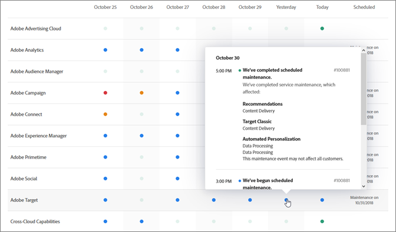

# システムステータスの更新と事前通知

[!UICONTROL アドビのシステムステータス] ページとアドビの通知を使用して [!DNL Adobe]、製品と [!DNL Adobe Experience Cloud] ソリューションのステータスに気をつけてください。アクティブな通知によって、停止イベントおよびメンテナンスイベントが警告されます。

## システムステータスの更新

[!UICONTROL アドビのシステムステータス] ページを使用して、現在のステータスと他 [!DNL Target] [!DNL Adobe] の製品および [!DNL Adobe Experience Cloud] ソリューションを表示します。このページは、発生した問題がシステムの更新によるものか、または日常のメンテナンスによるものかを判断するのに役立ちます。

次の URL に移動することで、[!UICONTROL システムステータス]ページにアクセスします。

[https://status.adobe.com](https://status.adobe.com)

ソリューションの [!DNL Experience Cloud] ステータスを確認するには、[!DNL Target] 「[!UICONTROL Experience Cloud]」タブをクリックします。

ページの上部には、進行中のメンテナンスイベントに関する情報が表示され、各ソリューションのアップデートにサブスクライブするためのリンクがあります。

上の図では [!DNL Adobe Analytics]、メンテナンス [!DNL Adobe Target] [!DNL Adobe Campaign] アップデート中です。その他のすべての製品およびソリューションは、通常どおり機能していました。使用時に問題が発生した場合は、必ずこのページを確認 [!DNL Target] してください。

製品内通知は、毎月の [!DNL Target] リリースの間、常に表示されますが、マイナーアップデートが発生した場合は、このページに記載されます。

ページの下部には最近 7 日間のカレンダーがあり、日別に各ソリューションのステータスが表示されています。ステータスインジケーターの上にマウスポインターを置くと、詳細が表示されます。

## 事前通知

アクティブ通知は、顧客の顧客プロファイルに含まれるサービスに対して開か [!DNL Target]れた以下のイベントに関して、登録された顧客に送信される電子メールアラートです。

* ソリューションレベルのアラート（ソリューション内の特定のサービスを分離しない）
* 重大度1と重大度2のCSO（停止イベント）
* CMRs（メンテナンスイベント）

>[!NOTE]
>
>このアラートを受信するには、登録する必要があります。登録プロセスを開始するには [!DNL Adobe]、カスタマーサクセスマネージャー（CSM）または [!DNL Adobe] アカウント担当者（AE）にお問い合わせください。

以下に、プロアクティブ通知電子メールアラートの例を示します。

