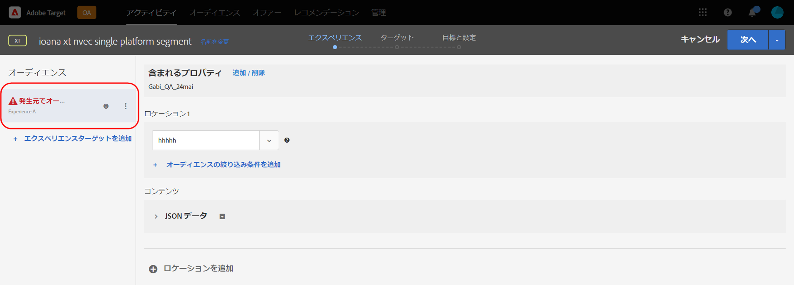

# Target リリースノート（現行）

これらのリリースノートは、[!DNL Adobe Target Standard] と [!DNL Target Premium] の各リリースの機能、機能強化および修正点について説明します。また、該当する場合は、Target API、SDK、[!DNL Adobe Experience Platform Web SDK]、JavaScript ライブラリ（at.js）およびその他のプラットフォームの変更に関するリリースノートも含まれます。

>[!IMPORTANT]
>
>**mbox.js のサポート終了**：2021 年 3 月 31 日（PT）をもって、[!DNL Adobe Target]mbox.js ライブラリのサポートは終了しました。 2021 年 3 月 31 日（PT）以降、mbox.js からのすべての呼び出しは失敗し、デフォルトのコンテンツを表示して [!DNL Target] アクティビティを実行しているページには影響があります。
>
>サイトに起こりうる問題を回避するため、新しい [!DNL Adobe Experience Platform Web SDK] の最新バージョンまたは at.js JavaScript ライブラリの最新バージョンに移行してください。詳しくは、[概要：クライアントサイド web に対する Target の実装](/help/c-implementing-target/c-implementing-target-for-client-side-web/implement-target-for-client-side-web.md)を参照してください。

（括弧内の問題番号は [!DNL Adobe] 内部で使用されます。）

## [!DNL Target Standard/Premium] 21.10.2（2021 年 10 月 14 日）

[!DNL Target] [!UICONTROL Audiences] を [!DNL Adobe Experience Platform Web SDK] と共に使用する際の機能強化：

* [!DNL Target] UI の様々な場所に、オーディエンスがソースで削除され、[!DNL Target] アクティビティで使用できなくなったことを示す警告アイコン、ポッバーおよびメッセージを追加しました。

   次の図は、アイコン、ポッパー、メッセージが表示される場所の一部を示しています。

   *  Activitylist ページ

      

   * アクティビティ [!UICONTROL  概要 ] ページ：

      

   *  アクティビティ作成ワークフローのエクスペリエンスステップ：

      

   *  アクティビティ作成ワークフローのターゲティングステップ：

      

   * [!UICONTROL アクティビテ] ィ作成ワークフローの目標と設定ステップ：

      ![目標と設定ページのソースメッセージでオーディエ [!UICONTROL ンスが削除さ] れた](assets/deleted-at-source-goals-settings.png)

   * オーディエンスの絞り込み（アクティビティ作成ワークフローの [!UICONTROL  ターゲティング ] ステップで、オーディエンス ] を置き換える）:[!UICONTROL 

* オーディエンスを結合機能を使用しようとしたときに、いずれかのオーディエンスがソースで削除された場合、[!UICONTROL  保存 ] は無効になります。

## [!DNL Target Standard/Premium] 21.10.1（2021 年 10 月 7 日）

このリリースには、次の新機能が含まれています。

| 機能 | 詳細 |
| --- | --- |
|  AudiencesUI の更新 | [!DNL Adobe Target] チームが継続的に [!DNL Target] ユーザーのユーザーエクスペリエンスを向上させるための取り組みの一環として、このリリースでは、[!DNL Target] UI の [!UICONTROL Audiences] ページと [!UICONTROL  プロファイルスクリプト ] ページを更新します。 この更新により、以前は一貫性がなかったデザインパターンを統合および標準化し、次のような新しい機能強化を追加しました。<ul><li>複数のオーディエンスを同時に選択および削除する機能</li><li>更新された [audience builder デザイン ](/help/c-target/c-audiences/create-audience.md)</li><li>[!UICONTROL  オーディエンス ] ライブラリルールビルダーでの除外ルールのサポート</li><li>新しい「オーディエンスソース」フィルターにより、オーディエンスの検出を高速化</li><li>セッションの永続的な検索およびフィルターオプション</li></ul>詳しくは、[オーディエンス](/help/c-target/target.md)を参照してください。 |
| [!UICONTROL プロファイル] スクリプト UI の更新 | [!UICONTROL  プロファイルスクリプト ] ライブラリも更新され、更新されたインターフェイスと複数の生産性の更新が含まれています。<ul><li>複数のプロファイルスクリプトを同時に選択および削除する機能</li><li>プロファイルスクリプト用の新しいコードエディター</li><li>コードエディター内での構文のハイライトとエラーチェック</li><li>キーボードショートカットを使用したオートコンプリートトークン（mbox またはプロファイル）パラメーター</li></ul>詳しくは、[ 訪問者プロファイル ](/help/c-target/c-visitor-profile/visitor-profile.md) を参照してください。 |
|  ジ Recommendations 条件の作成と編集 | [!UICONTROL Recommendations条件 ] の作成および編集ワークフローが簡素化され、目標を達成するために適切なレコメンデーションアルゴリズムと設定を簡単に選択できるようになりました。 詳しくは、条件の作成を参照 [してください](/help/c-recommendations/c-algorithms/create-new-algorithm.md)。 |
|  ジ Recommendations のルックバックウィンドウとアルゴリズムの更新率の改善 | 「最も多く閲覧された」および「トップセラー」アルゴリズムを 6 時間のルックバックウィンドウで実行して、最近トレンドを示すコンテンツを取り込めるようになりました。 6 時間のルックバックウィンドウを選択すると、レコメンデーションの結果は 1 日を通じて 3 ～ 6 時間ごとに更新されます。 詳しくは、「条件の作成」の「デ [ータソ](/help/c-recommendations/c-algorithms/create-new-algorithm.md#data-source) ー *ス*」を参照してください。 |

## その他のリリースノートとバージョンの詳細

| リソース | 詳細 |
|--- |--- |
| [リリースノート：Adobe Target Platform Experience Web SDK](https://experienceleague.adobe.com/docs/experience-platform/edge/release-notes.html?lang=ja) | Platform Web SDK の各バージョンの変更点に関する詳細です。 |
| [at.js のバージョンの詳細](/help/c-implementing-target/c-implementing-target-for-client-side-web/target-atjs-versions.md) | [!DNL Adobe Target] at. js JavaScript ライブラリの各バージョンの変更点についての詳細です。 |

## ドキュメントの変更、過去のリリースノートおよび Experience Cloud リリースノート

追加情報については、各リリースのリリースノートに加えて、以下のリソースを参照してください。

| リソース | 詳細 |
|--- |--- |
| ドキュメントの変更点 | リリースノートに含まれない可能性のある、このガイドの更新点に関する詳細情報を表示します。 詳しくは、「[ドキュメントの変更](/help/r-release-notes/doc-change.md#reference_366123CF00994BACBBF9BBDF2C4D840C)」を参照してください。 |
| 以前のリリースのリリースノート | 以前のリリースの Target Standard および Target Premium の新機能および機能拡張に関する情報を確認してください。 詳しくは、「[以前のリリースのドキュメントの変更](/help/r-release-notes/release-notes-for-previous-releases.md)」を参照してください。 |
| Adobe Experience Cloud リリースノート | Adobe Experience Cloud ソリューションの最新のリリースノートが表示されます。 詳しくは、[Experience Cloud リリースノート](https://experienceleague.adobe.com/docs/release-notes/experience-cloud/current.html?lang=ja)を参照してください。 |

## プレリリース情報 {#section_5D588F0415A2435B851A4D0113ACA3A0}

次のリソースでは、次の Target リリースの内容を確認できます。

| リソース | 詳細 |
|--- |--- |
| Adobe 優先製品のアップデート | Target およびその他の Adobe Experience Cloud ソリューションの今後の製品強化に関する事前通知を受信するには、Adobe Priority Product Update にサインアップします。 [https://www.adobe.com/subscription/priority-product-update.html](https://www.adobe.com/subscription/priority-product-update.html) |
| 今後のリリースノート | プレリリース情報など今月の Target リリースについては、[Target リリースノート - プレリリース](/help/r-release-notes/target-release-notes.md)ページを参照してください。 |
