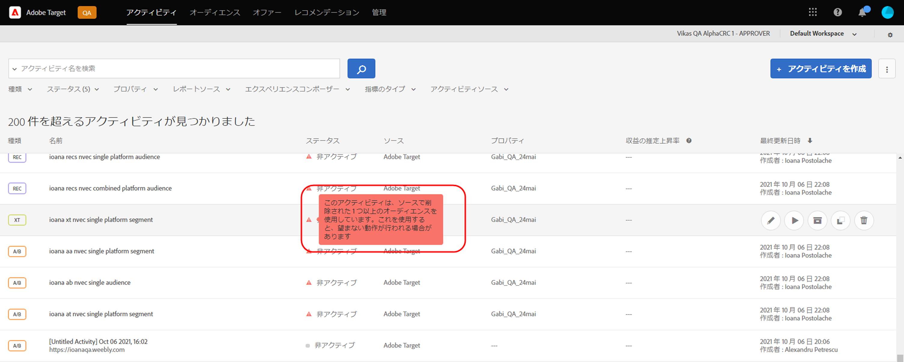
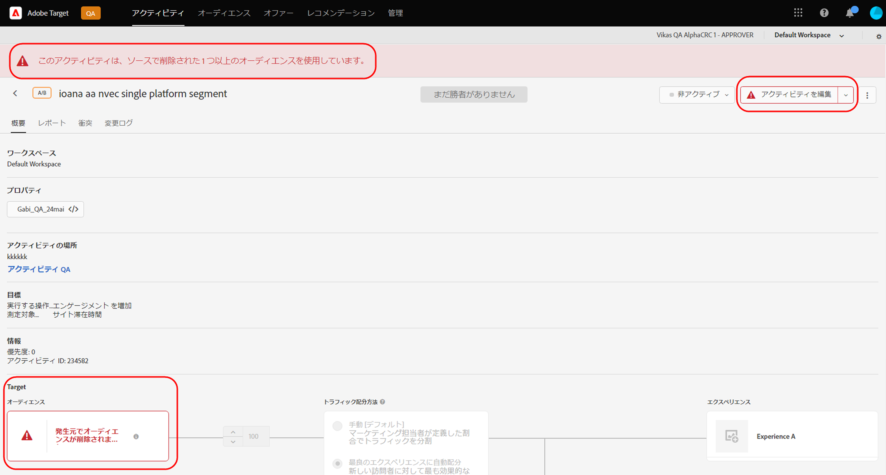
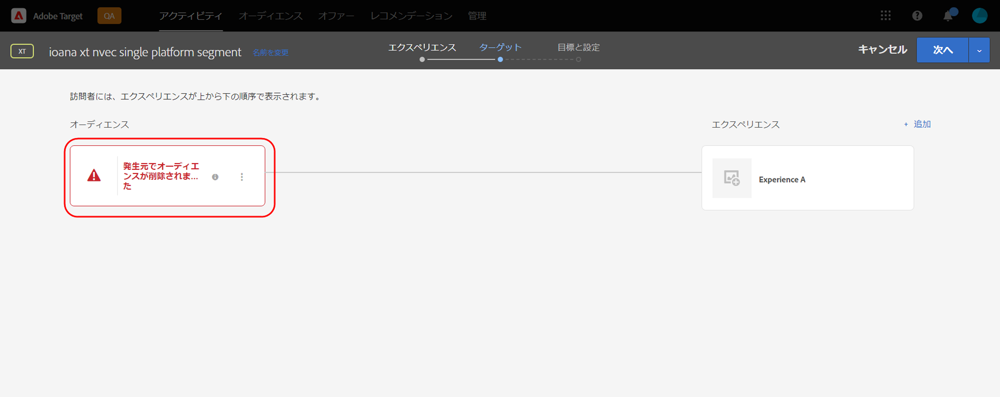

# Target リリースノート（現行）

これらのリリースノートは、[!DNL Adobe Target Standard] と [!DNL Target Premium] の各リリースの機能、機能強化および修正点について説明します。また、該当する場合は、Target API、SDK、[!DNL Adobe Experience Platform Web SDK]、JavaScript ライブラリ（at.js）およびその他のプラットフォームの変更に関するリリースノートも含まれます。

>[!IMPORTANT]
>
>**mbox.js のサポート終了**：2021 年 3 月 31 日（PT）をもって、[!DNL Adobe Target]mbox.js ライブラリのサポートは終了しました。 2021 年 3 月 31 日（PT）以降、mbox.js からのすべての呼び出しは失敗し、デフォルトのコンテンツを表示して [!DNL Target] アクティビティを実行しているページには影響があります。
>
>サイトに起こりうる問題を回避するため、新しい [!DNL Adobe Experience Platform Web SDK] の最新バージョンまたは at.js JavaScript ライブラリの最新バージョンに移行してください。詳しくは、[概要：クライアントサイド web に対する Target の実装](/help/c-implementing-target/c-implementing-target-for-client-side-web/implement-target-for-client-side-web.md)を参照してください。

（括弧内の問題番号は [!DNL Adobe] 内部で使用されます。）

## [!DNL Target Standard/Premium] 21.10.4 (2021 年10月21日)

このメンテナンスリリースには、次の機能強化が含まれています。

| 機能 | 詳細 |
| --- | --- |
| カートに基づく推奨事項 | ビジターのカートの内容に基づいて推奨されるアルゴリズムを新しく追加しました。 詳細については、作成基準「カートベース」、  「カートビュー/チェックアウトページ」および「カート内に既に存在するアイテムを除外する」という推奨設定を参照してください  。 |

## [!DNL Target Standard/Premium] 21.10.3 (2021 年10月19日)

このメンテナンスリリースには、以下の機能強化、修正および変更が含まれています。

*  [!DNL Analysis Workspace] [!UICONTROL  アクティビティレポートの「分析でビューを表示」ボタンをクリックして、の A4T パネル ] [!DNL Target] を開くことができない問題を修正していました。（TGT-42099、TGT-42100）
*  フォームベースのエクスペリエンスコンポーザーを使用して、「デザインの編集」ボタンを使用して [!UICONTROL  、A/B テスト ] および [!UICONTROL  対象化 ] (XT) アクティビティ  を編集しているときに、「デザインを編集」ボタンが表示されない問題を修正しました。（TGT-41980）
*  新しい推奨事項を作成する際に、互換性チェックボックスが検索条件を選択したときに表示されない問題を修正しました  。（TGT-42053）
* 「 [!DNL Analytics] レポートソース (A4T) として選択できない場合に、アクセス許可が不足しているために間違ったエラーメッセージが表示されるように [!DNL Analytics] なります。 （TGT-41954）
* UI でのキーボード操作を改善するための複数のアクセシビリティ修正を実装しました [!DNL Target] 。

## [!DNL Target Standard/Premium] 21.10.2 (2021 年10月13日)

では、以下の機能強化が追加されてい [!DNL Target]  [!DNL Adobe Experience Platform Web SDK] ます。

* [!DNL Target]ユーザーがソースで削除され、アクティビティでは使用できなくなったことを示す、警告アイコン、追加されたメッセージ、および UI 内の様々な場所に、メッセージが追加されました [!DNL Target] 。

   次の図は、アイコン、マイモニター、メッセージを表示する場所を示しています。

   * [!UICONTROL アクティビティ ] リストページ

      

   * アクティビティ [!UICONTROL  概要 ] ページ:

      

   * アクティビティ作成ワークフローのエクスペリエンスのステップ:

      ![[!UICONTROL エクスペリエンスページのソースメッセージで削除された対象ユーザー ]](assets/deleted-at-source-experiences.png)

   * アクティビティ作成ワークフローのターゲットステップ:

      

   * アクティビティを作成するには、次の手順を実行します。

      ![[!UICONTROL 目標 &amp; 設定ページのソースメッセージで削除された対象ユーザー ]](assets/deleted-at-source-goals-settings.png)

   * オーディエンスの絞り込み (   アクティビティ作成ワークフローのターゲットステップでの参加者の置き換え):

* 「配信先を結合」機能を使用しようとした場合、1つの対象ユーザーがソースで削除されると、 [!UICONTROL  保存 ] は無効になります。

## [!DNL Target Standard/Premium] 21.10.1（2021年10月6日（PT））

このリリースには、次の新機能が含まれています。

| 機能 | 詳細 |
| --- | --- |
| [!UICONTROL オーディエンス UI の更新] | このリリースでは、ユーザーのユーザーエクスペリエンスを向上させるためのチームの継続的な取り組みの一環として、 [!DNL Adobe Target] [!DNL Target] UI の対象ユーザーとプロファイルのスクリプトページが更新されて   [!DNL Target] います。 このアップデートにより、以前には一貫性がないデザインパターンが統合および標準化され、次のような新しい機能強化が追加されます。<ul><li>同時に複数の視聴者を選択し、削除することができます。</li><li>更新された [ 対象ユーザービルダーのデザイン](/help/c-target/c-audiences/create-audience.md)</li><li>[!UICONTROL 対象ユーザー向け ] ライブラリルールビルダーの除外ルールのサポート</li><li>「他のユーザーの検索」フィルターを使用して、より高速な対象ユーザーを検出できます。</li><li>セッションの永続的な検索とフィルターのオプション</li></ul>詳しくは、[オーディエンス](/help/c-target/target.md)を参照してください。 **注意** : 新機能の UI は、  ベータ版プログラムに含まれているものを除き、すべてのユーザーに対して一時的に無効になってい [!DNL Target] ます。 この UI 更新は、2021年10月19日火曜日、10月21日木曜日のその他のすべての顧客に対して再び有効になります。 |
| [!UICONTROL プロファイルスクリプト ] UI の更新 | [!UICONTROL また、Profile スクリプトライブラリも更新されており、最新のインターフェイスが ] 追加されています。これにより、生産性が向上します。<ul><li>複数のプロファイルスクリプトを同時に選択して削除する機能</li><li>プロファイルスクリプト用の新しいコードエディター</li><li>コードエディター内でのシンタックスの強調表示とエラーチェック</li><li>キーボードショートカットを使用した自動補完トークン (mbox またはプロファイル) パラメーター</li></ul>詳しくは、ビジターのプロファイルを参照してください  。 |
|  の推奨基準の作成と編集 | [!UICONTROL 推奨条件の ] 作成と編集のワークフローが簡素化され、目的を達成するための適切な推奨アルゴリズムと設定を選択することが容易になりました。 詳しくは、条件の作成を参照してください  。 |
|  の推奨事項戻るウィンドウとアルゴリズムのリフレッシュレートの改善 | 「最新の表示」アルゴリズムと「トップ売り手」アルゴリズムは、6時間戻るウィンドウで実行できるようになりました。これで、最後にトレンドが表示されているコンテンツを取得することができます。 「6時間戻る」ウィンドウが選択されている場合は、お勧めの結果が一日中3-6 時間ごとに更新されます。 詳しくは、「  作成条件」の「データソース」を参照してください ** 。 |

## その他のリリースノートとバージョンの詳細

| リソース | 詳細 |
|--- |--- |
| [リリースノート：Adobe Target Platform Experience Web SDK](https://experienceleague.adobe.com/docs/experience-platform/edge/release-notes.html?lang=ja) | Platform Web SDK の各バージョンの変更点に関する詳細です。 |
| [at.js のバージョンの詳細](/help/c-implementing-target/c-implementing-target-for-client-side-web/target-atjs-versions.md) | [!DNL Adobe Target] at. js JavaScript ライブラリの各バージョンの変更点についての詳細です。 |

## ドキュメントの変更、過去のリリースノートおよび Experience Cloud リリースノート

追加情報については、各リリースのリリースノートに加えて、以下のリソースを参照してください。

| リソース | 詳細 |
|--- |--- |
| ドキュメントの変更点 | リリースノートに含まれない可能性のある、このガイドの更新点に関する詳細情報を表示します。 詳しくは、「[ドキュメントの変更](/help/r-release-notes/doc-change.md#reference_366123CF00994BACBBF9BBDF2C4D840C)」を参照してください。 |
| 以前のリリースのリリースノート | 以前のリリースの Target Standard および Target Premium の新機能および機能拡張に関する情報を確認してください。 詳しくは、「[以前のリリースのドキュメントの変更](/help/r-release-notes/release-notes-for-previous-releases.md)」を参照してください。 |
| Adobe Experience Cloud リリースノート | Adobe Experience Cloud ソリューションの最新のリリースノートが表示されます。 詳しくは、[Experience Cloud リリースノート](https://experienceleague.adobe.com/docs/release-notes/experience-cloud/current.html?lang=ja)を参照してください。 |

## プレリリース情報 {#section_5D588F0415A2435B851A4D0113ACA3A0}

次のリソースでは、次の Target リリースの内容を確認できます。

| リソース | 詳細 |
|--- |--- |
| Adobe 優先製品のアップデート | Target およびその他の Adobe Experience Cloud ソリューションの今後の製品強化に関する事前通知を受信するには、Adobe Priority Product Update にサインアップします。 [https://www.adobe.com/subscription/priority-product-update.html](https://www.adobe.com/subscription/priority-product-update.html) |
| 今後のリリースノート | プレリリース情報など今月の Target リリースについては、[Target リリースノート - プレリリース](/help/r-release-notes/target-release-notes.md)ページを参照してください。 |
